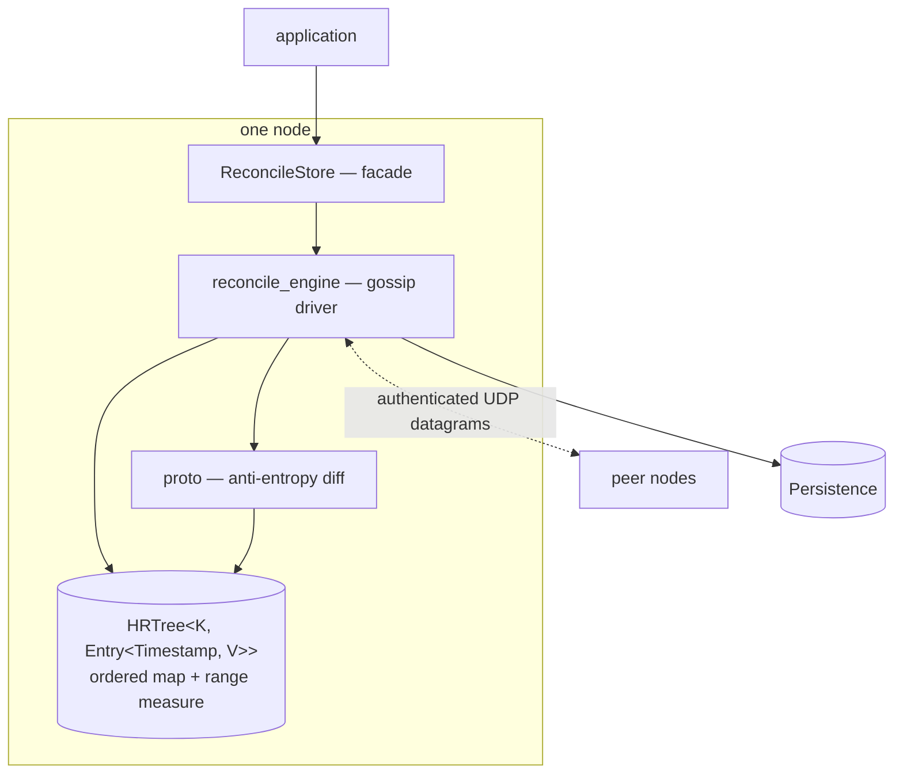
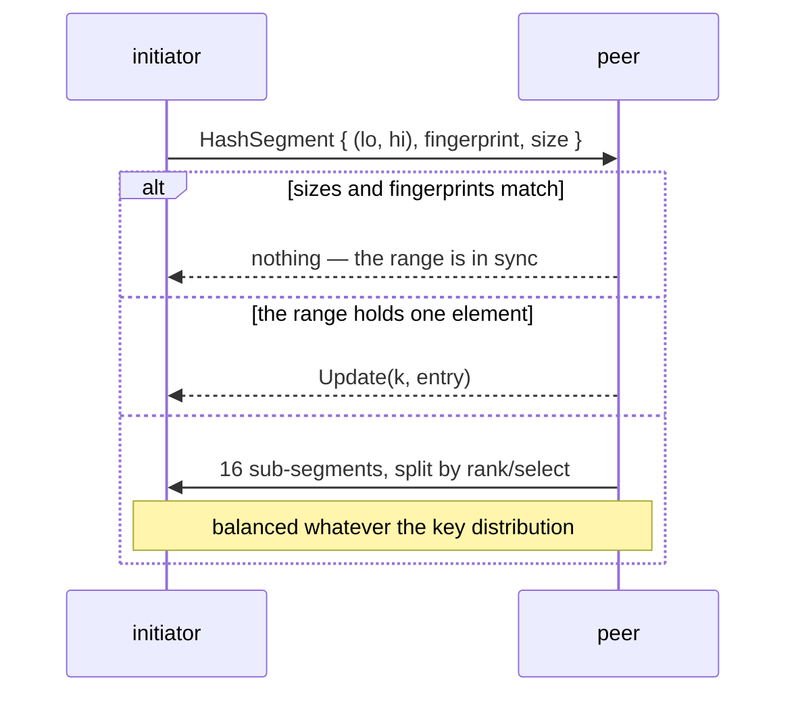
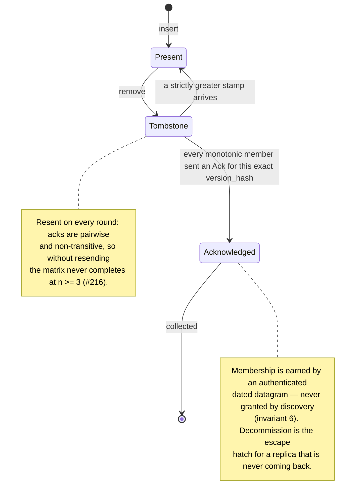
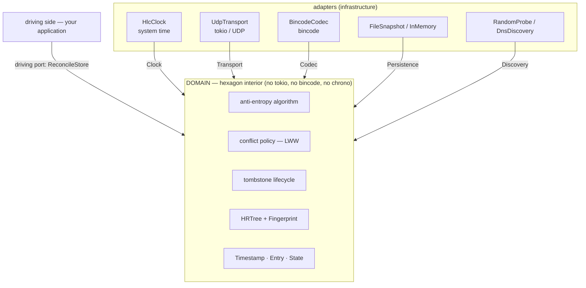
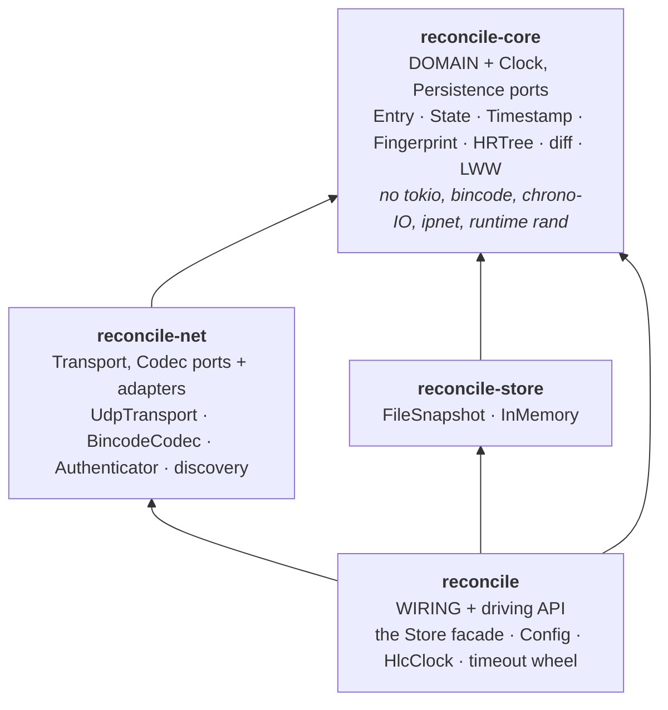

# reconcile-rs — Architecture

The current architecture and the target: hexagonal, ports and adapters. Status is in
[`PROGRESS.md`](./PROGRESS.md), field positioning in [`SOTA.md`](./SOTA.md), vocabulary in
[`GLOSSARY.md`](./GLOSSARY.md).

Published as `reconcile` **0.2.1**. The public API and the wire / on-disk formats are unstable;
breaks ride a minor bump (next 0.3.0). `file:line` references are against the current tree.

---

## 1. System overview



Five mechanisms carry the design:

| Mechanism | What it does | Where |
|---|---|---|
| **Storage** | ordered map keeping a per-subtree range fingerprint, so any interval's hash is `O(log n)` | `hrtree.rs`, `fingerprint.rs` |
| **Anti-entropy** | two peers compare fingerprints over shrinking ranges and exchange only divergent entries; equality and emptiness decided on **size**, never on hash | `proto.rs` |
| **Causality** | every value stamped with an HLC `Timestamp`; conflicts resolve last-write-wins over the total order `(wall_ms, counter, node_id)` | `clock.rs`, `reconcilable.rs` |
| **Deletion** | tombstones, collected only once causally stable — no resurrection | `reconcile_engine.rs`, `timeout_wheel.rs` |
| **Transport & security** | UDP datagrams with an optional per-datagram MAC, verified *before* deserialization | `transport.rs`, `auth.rs`, `codec.rs` |

### Anti-entropy round



Splitting by **rank** rather than by key space keeps the 16 sub-ranges balanced. The recursion
therefore costs `⌈log₁₆ n⌉` sequential round trips: ≈5 at n = 10⁶, ≈7 at n = 10⁹.

### Tombstone lifecycle



---

## 2. Current architecture

### 2.1 Modules

| Module | Responsibility |
|---|---|
| `hrtree.rs`, `hrtree_iter.rs` | Ordered map + range-measure data structure and its iterators. |
| `fingerprint.rs` | 256-bit additive fingerprint (`[u64; 4]`, per-element BLAKE3, add/sub mod 2²⁵⁶). |
| `proto.rs` | Anti-entropy algorithm (`start_diff`, `diff_round`) and its wire types. |
| `reconcilable.rs` | `Entry` / `State`: tombstone semantics and the conflict-resolution policy. |
| `clock.rs` | Hybrid Logical Clock: `Timestamp`, its ordering, and the clock that mints/observes stamps. |
| `bounds.rs` | The `Key` / `Value` bound bundles. |
| `auth.rs`, `replay.rs` | Per-datagram authentication and anti-replay. |
| `transport.rs`, `codec.rs` | The `Transport` and `Codec` ports and their adapters. |
| `discovery.rs`, `gen_ip.rs` | The `Discovery` port; `RandomProbe` and `DnsDiscovery`. |
| `persistence.rs` | Durability boundary: load/save a snapshot of the dated map. |
| `reconcile_engine.rs` | Network orchestration: gossip loop, peer sets, pacing, tombstone bookkeeping. |
| `reconcile_store.rs`, `mirror.rs` | Public facades: the dated store and the dateless mirror. |
| `timeout_wheel.rs` | Acknowledgement timeout tracking. |
| `observability.rs`, `prometheus.rs` | `tracing` spans and the `metrics` facade. |

### 2.2 Infrastructure coupling

The data structure and the protocol algorithm import no infrastructure: no async runtime, no
socket, no codec, no wall clock outside `#[cfg(test)]`. That is the hexagon interior, and it already
exists. What is still coupled:

| Module | Imports directly | `file:line` |
|---|---|---|
| `clock.rs` | `chrono::Utc` — physical time read inside the domain | `clock.rs:35` |
| `reconcile_engine.rs` | `tokio::time`, `rand::StdRng`, `ipnet` | `reconcile_engine.rs:23-30` |
| `reconcile_store.rs` | `chrono`, `ipnet` | `reconcile_store.rs:21-22` |

---

## 3. Target architecture: ports & adapters

The domain (storage, protocol, causality, conflict resolution, tombstone lifecycle) depends only on
**ports** it defines itself. **Adapters** implement them against concrete infrastructure. Every
dependency arrow points inward. Two rules follow: ports reveal intent and are part of the contract;
mechanism stays internal (§3.5).

### 3.1 The hexagon



Message authentication sits **ahead of** the codec: the MAC is verified on raw bytes before any
decoding. It is never folded into `Codec` ([invariant 5](#5-invariants)).

### 3.2 Ports

```rust
// Clock — the time source. The HLC algorithm stays in the domain; only the physical read crosses.
// Returns the concrete `Timestamp` rather than an associated type: it is the only stamp in use,
// alternate causality schemes are out of scope, and the tombstone wheel, version_hash and the
// serde format are already coupled to its shape.
pub trait Clock: Send + Sync + 'static {
    fn now(&self) -> Timestamp;            // mint a strictly-monotonic local stamp
    fn node_id(&self) -> u64;              // this node's identity, without ticking the counter
    fn observe(&self, remote: Timestamp);  // advance past a peer's stamp (causality)
}

// Transport — datagram I/O. Object-safe, so injecting it costs zero type parameters.
#[async_trait::async_trait]
pub trait Transport: Send + Sync + 'static {
    type Addr: Clone + Eq + Hash + Send + Sync;
    async fn recv_from(&self, buf: &mut [u8]) -> io::Result<(usize, Self::Addr)>;
    async fn send_to(&self, buf: &[u8], dst: &Self::Addr) -> io::Result<usize>;
    fn local_addr(&self) -> io::Result<Self::Addr>;
}

// Codec — wire encoding. `max_items` caps how many messages one datagram can expand into, and the
// adapter is built `.with_limit` so a crafted length prefix cannot pre-allocate (issue #151).
pub trait Codec: Send + Sync + 'static {
    type Error: std::error::Error + Send + Sync + 'static;
    fn encode<T: Serialize>(&self, value: &T, out: &mut Vec<u8>) -> Result<(), Self::Error>;
    fn decode_stream<T: DeserializeOwned>(&self, bytes: &[u8], max_items: usize)
        -> Result<Vec<T>, Self::Error>;
}

// Persistence — the durability boundary; the model the other ports follow.
pub trait Persistence<K, V>: Send + Sync + 'static {
    fn load(&self) -> io::Result<Option<PersistedState<K, V>>>;
    fn save(&self, state: &PersistedState<K, V>) -> io::Result<()>;
}

// Discovery — the single source of peer addresses. `is_authoritative` separates a speculative
// result (steers this round's targets only) from the current truth (seeded into the known-peer set;
// an absence decommissions after a grace period). Neither ever grants causal-stability membership.
// Boxed-future rather than async_trait: it is always behind `Arc<dyn ..>`.
pub trait Discovery: Send + Sync + 'static {
    fn discover(&self) -> DiscoverFuture<'_>;    // io::Result<Vec<IpAddr>>
    fn is_authoritative(&self) -> bool { true }  // RandomProbe overrides to false
}
```

| Port | Default adapter | Backed by | Consumer-wireable |
|---|---|---|---|
| `Clock` | `HlcClock` (`clock.rs:284,318`) | system time | no — test-gated, deliberately ([D2](#d2--transport-is-consumer-wireable-codec-is-not)) |
| `Transport` | `UdpTransport(Arc<UdpSocket>)` | tokio / UDP | yes — `ReconcileStore::new_with_transport` |
| `Codec` | `BincodeCodec(DefaultOptions)` | bincode | no — `pub(crate)`, kept as a type parameter |
| `Persistence` | `FileSnapshot`, `InMemory` | file / memory | yes |
| `Discovery` | `RandomProbe`, `DnsDiscovery` | `gen_ip` / `tokio::net::lookup_host` | yes |

### 3.3 Domain types

```rust
#[derive(Clone, Debug, PartialEq, Eq, Hash, Serialize, Deserialize)]
pub struct Entry<T, V> { pub stamp: T, pub state: State<V> }

#[derive(Clone, Debug, PartialEq, Eq, Hash, Serialize, Deserialize)]
pub enum State<V> { Present(V), Tombstone }

impl<T: Ord + Copy, V: Clone> Entry<T, V> {
    pub fn is_tombstone(&self) -> bool { matches!(self.state, State::Tombstone) }
    pub fn value(&self) -> Option<&V> { /* … */ }
    pub fn merge(&self, other: &Self) -> Self {        // last-write-wins, strict `>`
        if other.stamp > self.stamp { other.clone() } else { self.clone() }
    }
}
```

`Entry` carries tombstone, timestamp and merge semantics as a concrete domain type. Conflict
resolution is **domain policy, not a port**
([D6](#d6--conflict-resolution-stays-hardcoded-last-write-wins)).

`State<V>` doubles as the **projection** that feeds the dateless mirror: `Entry::project()` is
`self.state.clone()`, and the projection tree is `HRTree<K, State<V>>`. The two hashes must stay
distinct. `Entry` hashes **with** its stamp, which feeds `version_hash`; `State` hashes the value
alone ([invariant 8](#5-invariants)).

The repeated multi-bound constraints are stated once, so sites read `impl<K: Key, V: Value>`:

```rust
pub trait Key:   Clone + Debug + Hash + Ord + Send + Sync + Serialize + DeserializeOwned + 'static {}
pub trait Value: Clone + Debug + Hash +       Send + Sync + Serialize + DeserializeOwned + 'static {}
```

Entry semantics travel with `Entry`, not with the `V` bound. `Value` carries no `PartialEq`
([D5](#d5--value-partialeq-is-dropped)).

### 3.4 Crate structure

The layers become a workspace, so the compiler enforces the inward dependency direction instead of
convention. That is the guarantee a single crate cannot give.



`Transport` and `Codec` are defined in `reconcile-net`, not the core. The UDP driver consumes them,
the diff/merge domain does no I/O, and this keeps `async_trait` out of the core. The chrono-reading
`HlcClock` lives in `reconcile`; the `Timestamp` type and the pure HLC advance stay in the core.

### 3.5 Internal mechanism

`start_diff`, `diff_round`, `HashSegment` and `DiffRange` are `pub(crate)`, and range-hash querying
is inherent on the concrete `HRTree`. None of it is on the public surface.

[D1](#d1--hrtree-becomes-its-own-product-correctly-named) amends this. It still holds for the
anti-entropy protocol. It no longer holds for the tree, which becomes a standalone crate with its own
published contract.

---

## 4. Current → target mapping

| Current | Target |
|---|---|
| `(Timestamp, Option<V>)` tuple | `Entry<Timestamp, V>` + `State<V>` |
| `MaybeTombstone`, `Timestamped` | inherent `Entry` methods / field access |
| `Reconcilable` (LWW over tuple) | `Entry::merge` |
| `Projectable` / `ValueOnly<V>` | `Entry::project` → `State<V>` |
| `HashRangeQueryable`, `Diffable` (public) | inherent `HRTree` methods + `pub(crate)` diff functions |
| `pub mod diff` exposing wire types | `pub(crate)` `HashSegment` / `DiffRange` |
| `chrono::Utc` read in `clock.rs` | `Clock` port; `HlcClock` adapter holds the read |
| `UdpSocket` in the engine | `Transport` port; `UdpTransport` adapter |
| `bincode` in the engine | `Codec` port; `BincodeCodec` adapter |
| `gen_ip` IP-scan inline in the engine | `Discovery` port; `RandomProbe` + `DnsDiscovery` |
| Multi-bound `where` blocks | `Key` / `Value` bundles |
| Single crate | `reconcile-core` / `-net` / `-store` / `reconcile` |

---

## 5. Invariants

Load-bearing properties. Any restructuring preserves them; they encode the guarantees tracked in
[`PROGRESS.md`](./PROGRESS.md).

| # | Invariant | Guarded by |
|---|---|---|
| 1 | **Fingerprint format & arithmetic** — `[u64; 4]`, per-element BLAKE3, add/sub mod 2²⁵⁶ | golden vectors in `fingerprint.rs` |
| 2 | **HLC total order** `(wall_ms, counter, node_id)` *is* the conflict order; merge uses strict `>` | `clock.rs:78-91` |
| 3 | **Size-not-hash emptiness/equality** — a non-empty range may fingerprint to zero | `proto.rs:107-141` |
| 4 | **Malformed-bound / inverted-range hardening** — `checked_sub`, no `unimplemented!` | `proto.rs:93-105` |
| 5 | **Authenticate before deserialise** — MAC on raw bytes; `Codec` never absorbs authentication | `auth.rs` |
| 6 | **Causal-stability tombstone gate** — collected only after every monotonic member acknowledged the exact `version_hash`. Discovery feeds `peers`, **never** `members`; membership is earned by an authenticated dated datagram, so an unverified address can neither block GC nor trigger a release. `decommission_peer` is the escape hatch | `reconcile_engine.rs` |
| 7 | **`version_hash` determinism** — fixed-key hashing, identical on every node | `reconcile_engine.rs:70` |
| 8 | **Value-only projection hash is timestamp-less** — so a dated store and a dateless mirror compute identical per-element fingerprints | `mirror.rs::value_fingerprint_is_timestamp_independent` |
| 9 | **One protocol message must fit one datagram** — the send path packs but never *fragments*. An `Update` exceeding `BUFFER_SIZE - authenticator.overhead()` is never delivered and its key **never converges**. A hard ceiling until chunking exists; it must fail loudly | [D3](#d3--the-write-api-stays-infallible), [#230](https://github.com/Akvize/reconcile-rs/issues/230) |

---

## 6. Migration sequence

Every step is behaviour-preserving and covered by the existing test suite, except step 4.


Steps 1–3 are independent of the format change. Step 4 is the only format-breaking one. Steps 5–6
complete the boundary extraction and enforce it at the crate level. Per-step status is in
[`PROGRESS.md`](./PROGRESS.md) §4.

---

## 7. Decision ledger

Product and contract decisions, with the reasoning that produced them, so they are not relitigated.
Each says what was decided, why, and what would overturn it. **Recorded 2026-08-03.**

| | Decision |
|---|---|
| [D1](#d1--hrtree-becomes-its-own-product-correctly-named) | `HRTree` becomes its own product, correctly named |
| [D2](#d2--transport-is-consumer-wireable-codec-is-not) | `Transport` is consumer-wireable; `Codec` is not |
| [D3](#d3--the-write-api-stays-infallible) | The write API stays infallible |
| [D4](#d4--reconcilestorenode_id-is-added) | `ReconcileStore::node_id()` is added |
| [D5](#d5--value-partialeq-is-dropped) | `Value: PartialEq` is dropped |
| [D6](#d6--conflict-resolution-stays-hardcoded-last-write-wins) | Conflict resolution stays hardcoded last-write-wins |
| [D7](#d7--larger-than-ram-datasets-are-permanently-out-of-scope) | Larger-than-RAM datasets are permanently out of scope |
| [D8](#d8--reconciliation-strategy-is-automatic-never-a-user-facing-choice) | Reconciliation strategy is automatic, never a user-facing choice |
| [D9](#d9--reconcilemirror-is-documented-as-last-write-wins-only) | `ReconcileMirror` is last-write-wins only |
| [D10](#d10--030-is-one-coordinated-break) | 0.3.0 is one coordinated break |
| [D11](#d11--phase-1-lands-before-phase-2-is-retargeted) | Phase 1 lands before Phase 2 is retargeted |
| [D12](#d12--continuous-integration-is-re-enabled) | Continuous integration is re-enabled |

### D1 — `HRTree` becomes its own product, correctly named

The tree graduates to a standalone crate with its own published contract, renamed away from
"Hash-Range Tree".

**What it actually is.** A B-tree, augmented with **order statistics** (per-subtree size ⇒
`rank`/`select` in `O(log n)`), augmented with a **composable range measure** (per-subtree summary ⇒
`Aggregate(l,u)` in `O(log n)`).

| Aspect | Literature |
|---|---|
| The technique | *measured* / monoidally-annotated tree — Hinze & Paterson, finger trees, JFP 2006 |
| The measure here | the product `(Fingerprint, +) × (usize, +)` |
| The summary | an **incremental multiset hash** (Clarke et al., ASIACRYPT 2003), and an abelian **group** rather than a monoid: it has inverses, which is what range subtraction and `O(log n)` incremental maintenance need |
| The exact contract | **RSOS — Range-Summarizable Order-Statistics Store** (Amparore, arXiv:2603.19820): `size · Aggregate(l,u) · Rank(z) · Select(r) · Enumerate(l,u) · Insert · Delete`. The tree satisfies all of them today |

> In one sentence: **an order-statistic B-tree with a group-valued range measure — an RSOS whose
> measure is an incremental multiset hash.**

**Why rename.** "Hash-Range Tree" reads as "hash tree", i.e. Merkle tree, which is the one
association the design does not want. Its deepest advantage is that it diffs value-defined ranges
rather than node identity, so it needs no history-independence ([`SOTA.md` §2.3](./SOTA.md)).

**Why the generality goes there and not here.** [`SOTA.md` §2.4](./SOTA.md) P1-4 (a generic measure)
and P1-5 (public `rank`/`select`) are right for the tree crate, where the RSOS contract *is* the API.
They are wrong for `reconcile-rs`, where the summary is **wire-visible** (`HashSegment.hash`). A
generic measure would propagate as a type parameter into `Message` and `ReconcileStore`, and two
nodes configured differently would exchange structurally valid segments whose fingerprints never
match: refining forever, never converging and never noticing. Worse than a hard error. So
`reconcile-rs` pins one concrete measure (invariant 1).

**Sequencing.** Lands with migration step 6, as a peer crate.

### D2 — `Transport` is consumer-wireable; `Codec` is not

Add a `Transport` injection point and un-gate the in-memory transport. Demote `Codec` and
`BincodeCodec` to `pub(crate)`. Leave `Clock` test-gated.

**Why they split.** `Transport` is object-safe and already held as `Arc<dyn Transport<Addr =
SocketAddr>>`, so a `Persistence`-style injection point costs zero type parameters. `Codec` has
generic methods, is not object-safe, and rides as a type parameter; exposing it would need a
type-changing builder (`-> ReconcileStore<K, V, C2>`).

**Why `Transport` earns it.** Two concrete uses. A QUIC datagram transport (RFC 9221 unreliable
datagrams fit this shape) is one route to larger-than-datagram support. Lossy, reordering or
delaying transports let convergence be tested under adversity, which [`SOTA.md` §2.4](./SOTA.md) P3-8
names as the category standard and which is otherwise impossible. Users also need the in-memory
transport to test their own applications, hence un-gating it.

**Why `Codec` does not.** Swapping the trait does not deliver its plausible uses. Compression
interacts with invariant 5's ordering and with datagram size accounting; cross-language interop needs
a published wire specification, not a Rust trait. Keeping the type parameter keeps the seam at no
public cost.

**Why `Clock` stays test-gated.** The protocol already assumes datagrams are lost, duplicated and
reordered, so an unreliable transport cannot break an invariant. A non-monotonic clock silently
breaks invariant 2 and the causal ordering tombstone GC depends on. The asymmetry is intentional.

Before this decision only `Persistence` and `Discovery` were actually wireable. Three ports were
ports in name only.

### D3 — The write API stays infallible

`insert` / `insert_bulk` / `remove` keep their signatures. The value-size ceiling is documented, and
exceeding it produces a distinct, alertable signal rather than an `io::Result` on every write.

**Why.** Making the whole write surface fallible is a broad public break to surface one failure mode
that is better fixed at its root: chunking. See invariant 9 and
[#230](https://github.com/Akvize/reconcile-rs/issues/230).

### D4 — `ReconcileStore::node_id()` is added

Expose the node identity that `Config::with_node_id` sets.

**Why.** It was settable but not readable. Needed for diagnostics, and a prerequisite for any
per-replica value state should D6 ever be revisited.

**How.** Sourced through a new `Clock::node_id` rather than cached beside the clock, so the reported
identity cannot disagree with the one actually stamped — and, unlike reading it off `now()`, it costs
no counter tick. That widens the `Clock` port by one required method. Only a hand-written adapter
would notice, and the port is not consumer-wireable anyway (D2).

### D5 — `Value: PartialEq` is dropped

Remove `PartialEq` from the `Value` bundle; rewrite the one site that used it to compare stamps.

**Why it is redundant.** Its only production use was post-merge change detection, `if merged_v !=
*local_v`. `Entry::merge` is `if other.stamp > self.stamp { other } else { self }`, so that
expression is *provably equivalent* to `remote_v.stamp > local_v.stamp`: merge returns `other`
exactly when the stamps differ, and `self` otherwise. Stamp comparison needs only `Timestamp: Ord`
and no bound on `V` at all.

**Bonus.** The old form cloned the whole value inside `merge`, compared it on the receive hot path,
then threw the clone away when nothing had changed.

**What would overturn it.** The equivalence holds only under last-write-wins. Under a CRDT resolver
the merged stamp must be `max(local, remote)`, so a join can change the payload while the stamp
equals `local.stamp`, and stamp comparison would miss it. If D6 is revisited, `PartialEq` (or a hash
comparison) comes back.

### D6 — Conflict resolution stays hardcoded last-write-wins

No pluggable `Resolve` seam. The open-ended condition is replaced by three named triggers. None has
fired.

| Trigger | Status |
|---|---|
| **T1** — a converging counter becomes a real requirement | Hypothetical. The only genuinely inexpressible gap: concurrent `+1` and `+1` under LWW yields `+1`, and no key encoding recovers it. |
| **T2** — an opaque third-party CRDT document as the value (Automerge / Loro / Yjs bytes) | The strongest case. Such documents carry their causal context internally, so a value-level join really does suffice. Gate on documents staying well inside one datagram. |
| **T3** — multi-value register | Not a policy seam at all. `Timestamp` is a *total* order, so one of any two stamps is greater and concurrency cannot be represented; the information is destroyed at mint time. Needs a version vector instead of `Timestamp`, detonating invariants 2 and 7. A separate project. |

Three repository-specific facts strengthen the deferral rather than merely maintaining it:

1. **Stable Rust offers no cheap opt-in.** `Value` is a blanket impl, so a `merge` with a default
   body that specific types override needs specialization (nightly). The alternatives are breaking
   every downstream `V`, or a third public type parameter.
2. **The datagram ceiling is a correctness cliff.** A single `Update` above the payload budget is
   never fragmented and never delivered (invariant 9). CRDT state grows with cardinality or history,
   so a set-as-value or document-as-value crosses that cliff *as it succeeds*.
3. **The most-requested CRDT is already free.** An add-wins set is expressible today as
   `(set_id, element) -> ()` keys, reusing the existing tombstone GC and getting *per-element*
   diffing that a set-as-value cannot. Strictly it is last-op-wins per element, which differs from
   add-wins only under a genuinely concurrent add/remove of the same element.

**If a trigger fires, build a concrete facade, not a public type parameter.** Seven of eight
comparable systems ship a fixed menu of concrete types rather than a pluggable hole; the exception
needs three traits to do it and ships the menu anyway. A public merge trait maximises the number of
ways a user can silently break convergence — non-canonical `Hash`, non-idempotent merge, oversize
state — while our own test suite stays green.

**Related constraint.** Only *state-based* (join-idempotent) payloads are safe on this transport.
`Update` rides unreliable UDP with retransmission, so a duplicated `increment(+1)` is not idempotent.
Operation-based deltas are ruled out independently of any seam.

### D7 — Larger-than-RAM datasets are permanently out of scope

Not pursued, so no pluggable storage backend. Closed, not deferred.

**Why.** Larger-than-RAM and full replication are in direct tension. If the dataset exceeds RAM and
every node holds everything, every node hits disk on reads, destroying the one unambiguous advantage
([`SOTA.md` §1.6](./SOTA.md): reads are local, in-process, no network hop, no deserialization). The
requirement splits into two different products. A fully-replicated on-disk store has a thin market
already occupied by persistent range-sync CRDT stores in the same language. Sharding is a different
system, tracked separately as partial replication.

**What people usually mean.** "Can it persist?" is nearly always "survive a restart", already served
by `Persistence` / `FileSnapshot`. The differentiated direction is content-addressed structural
sharing, whose value is versioning, snapshot diff and incremental cold start — not capacity.

**The cheap capacity win instead.** Reducing per-entry memory raises the effective ceiling by roughly
2–3× at zero contract cost.

**What would overturn it.** Nothing short of adopting partial replication, at which point that design
supersedes this decision rather than amending it.

### D8 — Reconciliation strategy is automatic, never a user-facing choice

If a sketch-based fast path is added, it self-selects and falls back to range-based reconciliation.
No user-visible strategy knob.

**The guard that matters.** Range-based reconciliation stays the sole authority on "are we in sync".
An all-zero *difference* sketch does not prove two sets are equal: cells cancel on both the key sum
and the counter, so two distinct same-size sets can cancel. That is exactly the hazard invariant 3
exists to prevent. A sketch may only *propose* differences; a stalled or empty peel falls through to
the range diff untouched.

**Choice of sketch.** Prefer a *fixed-capacity* sketch over a rateless one for the steady state: a
fixed sketch is a monoid and can be maintained incrementally, `O(1)` per in-sync round, whereas a
rateless encoder must touch every element per session. Untenable at a one-second cadence.

### D9 — `ReconcileMirror` is documented as last-write-wins only

State the constraint explicitly now.

**Why.** `integrate` overwrites rather than joins, which is correct only because the authoritative
dated peer already resolved the conflict. Under any other resolution, last-writer-by-arrival is
wrong and the mirror needs redesigning. Cheap to document now, expensive to discover later.

### D10 — 0.3.0 is one coordinated break

Batch the wire and on-disk breaks into 0.3.0 rather than dribbling them across releases. The
`Entry` / `State` type and the versioned snapshot header are in. The fingerprint wire-encoding fix
rides along, since it is a pure win that never gets cheaper. Additive, capability-gated protocol
extensions do not need to ride it.

### D11 — Phase 1 lands before Phase 2 is retargeted

The Phase-1 stack merges to `main` first; the Phase-2 pull request is then retargeted from the
Phase-1 tip to `main`.

**Why.** Phase 2 is stacked so its diff shows only its own commits. Retargeting before Phase 1 lands
would present the whole train as one review.

### D12 — Continuous integration is re-enabled

Turn GitHub Actions back on.

**Why.** The repository is public and the workflows use only standard hosted runners, for which
Actions is free. The dormancy was a settings or organisation-policy toggle, not a billing constraint.
An organisation-level restriction overrides the repository setting, so check both. While it is off,
reproduce the full matrix locally — and note that `cargo doc` under `-D warnings` catches failures
`cargo build` and `cargo clippy` do not.
