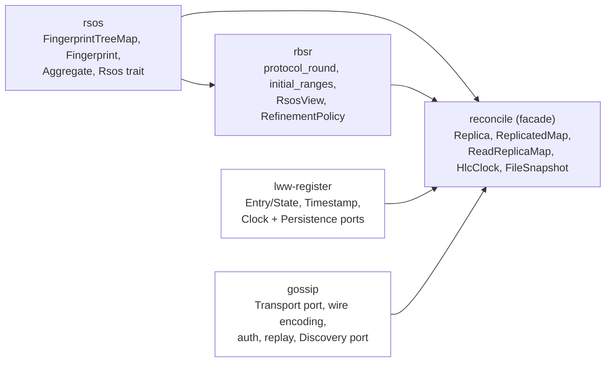
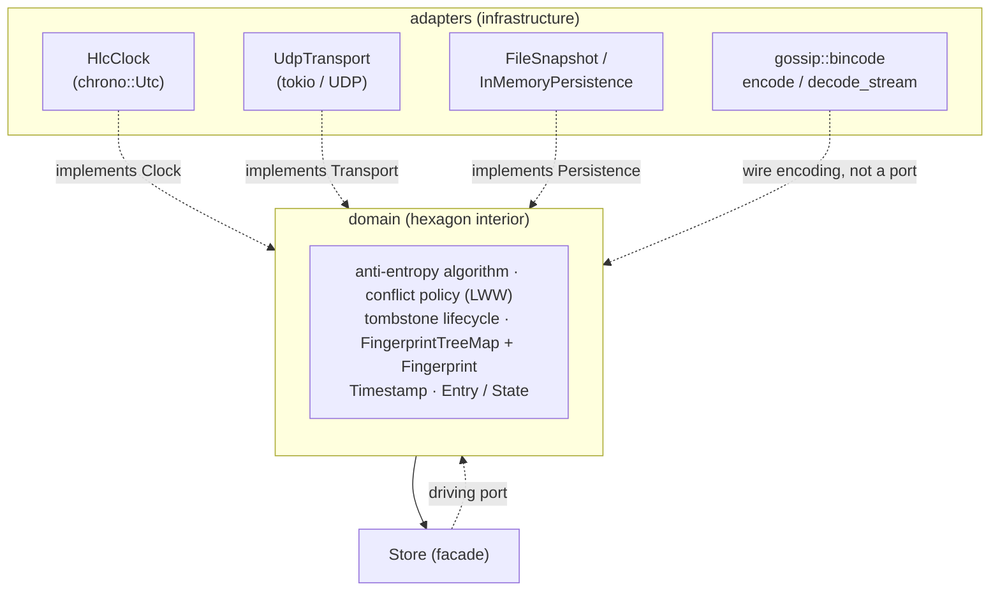

# reconcile-rs — Architecture

## Status & scope

`reconcile-rs` is a reconciliation service that keeps a key-value map synchronised across several
instances. This document describes the architecture as it stands today — a completed hexagonal
(ports & adapters) split into five crates. Correctness and security properties, and the current
publish status, are tracked in [`PROGRESS.md`](./PROGRESS.md); state-of-the-art positioning is in
[`SOTA.md`](./SOTA.md). Code locations are given as `file:line` against the current tree.

The public API and the on-wire / on-disk formats are pre-1.0 and may change. Only `reconcile` is
published, and that published version predates this workspace split — see
[`PROGRESS.md`](./PROGRESS.md) for the current publish state.

---

## 1. System overview

A node holds an ordered key-value map and gossips changes to its peers so that all replicas
converge. Five mechanisms:

- **Storage** — `FingerprintTreeMap`: an ordered map that also maintains, for every subtree, a
  **range fingerprint**, so the hash of any key interval is available in `O(log n)`.
- **Anti-entropy protocol** — two peers compare aggregates over shrinking key ranges (`rbsr`'s
  `protocol_round`) and exchange only the entries that actually differ. Equality and emptiness are
  decided by interval **size**, not by hash, to stay collision-safe. *How* a range is refined —
  when to stop splitting and how wide to cut — is a `RefinementPolicy`, a purely local choice that
  never reaches the wire (§3.1); the default splits into the paper's constant `b` = 16.
- **Causality & conflict resolution** — each value is stamped with a Hybrid Logical Clock timestamp
  (`Timestamp`); conflicts resolve by **last-write-wins** over the HLC total order
  `(physical, logical, node_id)`.
- **Deletion** — removals are **tombstones**, garbage-collected only once causally stable (every
  monotonic cluster member has acknowledged the exact version), which prevents resurrection.
- **Transport & security** — messages travel as authenticated UDP datagrams (per-datagram MAC,
  verified before deserialisation). Persistence to disk is optional.

---

## 2. Crates and modules



`gossip` deliberately does **not** depend on `lww-register`: nothing in transport/auth/replay/
discovery knows what an `Entry`, `Timestamp` or `Key` is — a datagram is a byte slice, a peer is an
address. `reconcile` is the one place the two meet.

| Crate | Holds | Kind |
|---|---|---|
| `rsos` | `fingerprint_tree_map{,_iter}.rs`, `fingerprint.rs`, `encoding.rs`, `aggregate.rs`, `rsos_trait.rs` | leaf, zero workspace deps |
| `rbsr` | `protocol.rs` (the driver), `policy.rs` (the refinement-policy seam), `rsos_view.rs` | depends on `rsos` only |
| `lww-register` | `entry.rs`, `bounds.rs`, `clock.rs` (`Hlc`/`Timestamp`/`Clock`), `persistence.rs` (`Persistence`/`PersistedState`) | **domain**, infrastructure-free |
| `gossip` | `transport.rs`, `bincode.rs`, `auth.rs`, `replay.rs`, `discovery.rs`, `gen_ip.rs` | infrastructure; no `lww-register` dep |
| `reconcile` | `replica.rs`, `replicated_map.rs`, `read_replica_map.rs`, `clock.rs` (`HlcClock` adapter), `snapshot.rs` (`FileSnapshot`), `observability.rs`, `prometheus.rs`, `timeout_wheel.rs` | facade; depends on all four, re-exports their public types under `reconcile::*` |

`reconcile` keeps re-export shims (`src/persistence.rs`, `src/clock.rs`, `pub use` in `src/lib.rs`)
so `reconcile::entry::Entry`, `reconcile::transport::UdpTransport`, `reconcile::FileSnapshot` and
friends resolve unchanged for existing consumers. `FileSnapshot` briefly had its own crate
(`snapshot`) and was folded back into `reconcile` as `src/snapshot.rs`: a single type with no reuse
value outside this workspace does not earn a crate boundary the way `rsos`/`rbsr` (genuinely
reusable) or `lww-register`/`gossip` (compiler-enforced purity, §2.1) do.

### 2.1 Domain purity

`lww-register`'s manifest declares exactly one dependency, `serde`'s derive — no async runtime,
socket, wire codec or wall clock can be imported there; the build fails rather than the boundary
rotting. `rsos` and `rbsr` carry the same guarantee via their own minimal manifests. This is the
interior of the hexagon, and it exists today, gated by `./scripts/check-domain-purity.sh`
(mechanics: AGENTS.md §9). `gossip` and `reconcile` are adapters and carry infrastructure
dependencies by design.

---

## 3. Ports & adapters

### 3.1 Principle

The domain — storage, protocol, causality, conflict resolution, tombstone lifecycle — depends only
on a small set of **ports** (traits) it defines itself. **Adapters** implement those ports against
concrete infrastructure. All dependency arrows point inward: adapters depend on the domain, never
the reverse. Ports are public and reveal intent; mechanism (how a diff round is computed, how a
range hash is queried) stays internal to its owning crate.



### 3.2 Ports

Four outbound ports, each removing one concrete infrastructure dependency from the domain:

| Port | Crate | Replaces | Adapter(s) |
|---|---|---|---|
| `Clock` | `lww-register/src/clock.rs` | direct `chrono::Utc` read | `HlcClock` (`src/clock.rs`) |
| `Transport` | `gossip/src/transport.rs` | `tokio::net::UdpSocket` | `UdpTransport`, `InMemoryTransport`; dev-only decorators over either — `CountingTransport` (`benches/system.rs`), `NetemTransport` (`benches/netem/mod.rs`: seeded delay/jitter/loss/reordering, #280) |
| `Persistence` | `lww-register/src/persistence.rs` | ad hoc file I/O | `FileSnapshot`, `InMemoryPersistence` |
| `Discovery` | `gossip/src/discovery.rs` | inline IP-scan | `RandomProbe` (speculative), `DnsDiscovery` (authoritative) |

`Clock` returns the concrete `Timestamp` rather than a generic associated type: it is the only stamp
in use, and the tombstone wheel and wire format are already coupled to its shape. `Transport` is
`#[async_trait]` and object-safe (`Arc<dyn Transport<...>>`); `InMemoryTransport`/`InMemoryNetwork`
are public (not test-gated) so downstream crates can drive a deterministic in-process cluster in
their own tests. `Discovery::kind` distinguishes a speculative probe result (steers only
the current round's targets) from an authoritative one (seeded into the known-peer set, an absence
decommissions after a grace period) — either way discovery never grants causal-stability membership
(§5 invariant 6), which a peer must earn via an authenticated dated datagram.

**Wire encoding is not a port.** `gossip::bincode::{encode, decode_stream}` are plain `pub fn`s (no
trait, no adapter type) — the crate owns exactly one implementation and has no test-driven need for a
second (`bincode.rs`'s own tests call them directly, no fake). `decode_stream` carries a `max_items`
cap so one datagram cannot be expanded into an unbounded number of messages. Authentication
(`Authenticator`/MAC) wraps the codec externally, verified on raw bytes before any decoding runs
(§5 invariant 5) — never folded in.

**`RefinementPolicy` is a strategy, not a port.** `rbsr::RefinementPolicy` is a trait, and every
port here is a trait, but it removes no infrastructure dependency: it sits *inside* the hexagon and
varies a domain decision — for one active range, SKIP, IDLIST or SPLIT, and how wide a SPLIT cuts.
It earns a seam for a different reason than a port does: the choice is **purely local and never
negotiated**. A peer answers whatever segmentation it is asked about, `RangeAggregate` carries no
policy, and Proposition 4.1's soundness argument uses only that a SPLIT's children are pairwise
disjoint with union the parent — which `protocol_round` guarantees regardless of policy. So two
peers running *different* policies converge (`tests/proptest_fingerprint_tree_map.rs`'s
`convergence_holds_under_any_policy_and_any_mixed_pair`, and `rbsr`'s own
`peers_running_different_policies_still_converge`), which is what makes swapping one cheap.
Advertising or negotiating a policy would turn that free experiment into a protocol break, and is
the one thing this seam must never grow ([#257](https://github.com/Akvize/reconcile-rs/issues/257)).

**Visibility.** `Clock`/`Transport`/`Persistence`/`Discovery` are public ports on their owning crate.
The mechanism they wrap is not part of `reconcile`'s own re-export surface (`reconcile::*` does not
re-export `rbsr::protocol_round`/`initial_ranges`/`RangeAggregate` or `gossip::bincode::{encode,
decode_stream}`) — but since `rsos` and `rbsr` are themselves published-intent, reusable crates
(AGENTS.md §11), their tree/protocol primitives (`rank`/`select`/`range`, `protocol_round`,
`protocol_round_with_policy`, `initial_ranges`, `RangeAggregate`, `EnumerationRange`, `RoundOutcome`
and the `RefinementPolicy` seam) are genuinely `pub` at the crate level, for a consumer who depends
on `rsos`/`rbsr` directly instead of through `reconcile`. Injecting a policy is therefore an
`rbsr`-level operation today: `reconcile`'s own `Config` is `Copy` (a fixed-size `nets` array exists
to keep it so), which a boxed or borrowed policy would break, and choosing what the facade should
expose is a separate decision that wants the measured comparison first — see `SOTA.md` §2.2. `gossip::bincode`'s
functions are `pub` for the same reason (`reconcile` must reach them across the crate boundary), just
not re-exported. `Codec` was considered and dissolved as a trait: one implementation, no
object-safety need (methods are generic, always carried as a type parameter), and no plausible
second use (compression interacts with authenticate-before-decode; cross-language interop needs a
published wire spec, not a Rust trait).

---

## 4. Domain types and conflict policy

A single, intention-revealing type represents a stored cell:

```rust
pub struct Entry<T, V> { pub stamp: T, pub state: State<V> }
pub enum State<V> { Present(V), Tombstone }

impl<T: Ord + Copy, V: Clone> Entry<T, V> {
    pub fn is_tombstone(&self) -> bool { matches!(self.state, State::Tombstone) }
    pub fn value(&self) -> Option<&V> { /* … */ }
    pub fn merge(&self, other: &Self) -> Self {        // last-write-wins (strict >)
        if other.stamp > self.stamp { other.clone() } else { self.clone() }
    }
}
```

`Entry::project(&self) -> State<V>` gives the timestamp-less value-only projection `ReadReplicaMap`
converges over — `State<V>` already has no `Timestamp` field, so no field-by-field summary of it can
include one (§5 invariant 8).

`T` is, in practice, always `Timestamp` — built from newtypes and split along the seam between
*reading a clock* and *ordering writes*:

```rust
pub struct Hlc { physical: PhysicalTime, logical: LogicalCounter }  // the HLC of the paper
pub struct Timestamp { hlc: Hlc, node_id: NodeId }                  // the LWW ordering key
pub struct PhysicalTime(u64);    // HLC physical time: an instant, ms since the Unix epoch
pub struct LogicalCounter(u32);  // HLC logical counter, within one millisecond
pub struct NodeId(u64);          // replica identity — the deterministic tie-break
pub struct ClockDrift(u64);      // a *duration*, never comparable to an instant
```

A Hybrid Logical Clock (Kulkarni et al. 2014) *is* the pair `(physical, logical)`; `node_id` is not a
clock component but the tie-break that makes the LWW comparison a total order. So the arithmetic
(`Hlc::next_tick`, `Hlc::advance_past_remote`) lives on `Hlc` and takes no `NodeId` — the `Clock`
adapter (which owns the node's identity) attaches it only when minting a `Timestamp`, storing the
identity exactly once rather than as both a field and a component of a stored clock reading. Nesting
costs nothing on the wire: bincode and `rsos`'s canonical encoding (§6) both write a struct as its
fields in declaration order with no framing, so `{{physical, logical}, node_id}` is byte-identical to
a flat triple (pinned by `tests/timestamp_wire_format.rs`).

`Timestamp` is built through one further "parse, don't validate" type, `AdmittedTime` — a remote
physical-time reading admitted to the local clock state (the past participle: the type is evidence
the drift check *has run*), obtainable only via `AdmittedTime::clamped_to_drift` (the untrusted path,
applying the far-future clamp of `MAX_CLOCK_DRIFT`) or the explicitly-named `AdmittedTime::trusted`
(the self-authored-stamp path). `Hlc::advance_past_remote` accepts nothing else, so the clamp is a
property of the type system, not of a parameter name (§5 invariant 6 depends on this).

That clamp guards the *local clock state* only — a remote stamp is stored verbatim, since it is LWW
data. `reconcile::clock`'s `BoundedInstant` performs the one further derivation that needs bounding:
the tombstone-expiry instant, re-admitting the stored `PhysicalTime` through the same
`clamped_to_drift` seam against local now (`reconcile`'s `HlcClock` adapter, since it needs both a
physical-time read and a `chrono` instant — the domain crate has neither).

`Entry` and `AdmittedTime` are the same "parse, don't validate" shape as
[`Payload`](gossip/src/auth.rs) (only obtainable via `Authenticator::open`): construction of an
invalid instance is either structurally impossible or funneled through one fallible constructor.

Conflict resolution is **domain policy**, not a port: last-write-wins is the concrete default. A
pluggable `Resolve` seam is warranted only if a second policy (e.g. a CRDT) becomes a real
requirement.

### 4.1 Generic bounds

```rust
pub trait Key:   Clone + Debug + Ord + Send + Sync + Serialize + DeserializeOwned + 'static {}
pub trait Value: Clone + Debug + Send + Sync + Serialize + DeserializeOwned + 'static {}
```

Neither bundle carries `Hash` (fingerprints derive from `Serialize` via `rsos::encoding`, §6, not
`std::hash::Hash` — which `HashMap`/`HashSet` don't implement at all) or `PartialEq` (the receive
path's only "did this change?" question is a stamp comparison, `Entry::merge` returns `other` exactly
when the remote stamp is strictly greater, so `Timestamp: Ord` answers it without ever comparing —
or cloning — the value). The remaining `Hash` bounds in the facade are genuine `HashMap`-key
requirements, spelled out locally where the `HashMap` is (`ReplicatedMap`/`Replica`'s peer and
tombstone indexes, `TimeoutWheel`, the snapshot codec).

---

### 4.2 State typing

A finite, named set of states carried by a **type** rather than by an `Option`, a `bool` or a bare
primitive, so the state is a compile-time fact instead of call-site discipline. AGENTS.md §4 states
the rule; these are its worked instances, and the reference examples to copy:

| Type | What its existence proves | Obtained by |
|---|---|---|
| `Entry` / `State<V>` (`lww-register`) | a dated cell vs its timestamp-less projection (§5 inv. 8) | `Entry::project` |
| `StartBound` / `EndBound` (`rbsr`) | the two bound shapes the protocol emits — the other two `Bound` variants fail to deserialize rather than reaching the driver | wire decode |
| `Payload<Authenticated>` / `Payload<Verified>` (`gossip`) | MAC-checked, then replay-checked; message handling takes `Verified`, so an unchecked datagram cannot reach it | `Payload::verify_replay` |
| `AdmittedTime` (`lww-register`) | a peer's physical time was clamped to the drift budget before touching local clock state | `AdmittedTime::clamped_to_drift` |

**Newtype or phantom parameter?** Decide by whether the *pre*-state travels. `Payload` earns its
parameter: both states are held, passed, and demanded in a signature. `AdmittedTime` does not — its
raw form is consumed where it is produced, so a phantom would add a type parameter to every
signature to distinguish a state nothing carries. Prefer the newtype until a second state is
genuinely held across a boundary.

The 2026-08 sweep for this pattern is closed. Both items it left open have since been resolved in
the direction it recommended: `Authenticator`'s `is_enabled`/`is_encrypted` booleans are gone (call
sites `match` the enum, which was already a well-typed state), and `Discovery::is_authoritative() ->
bool` became `kind() -> DiscoveryKind`.

---

## 5. Invariants

Load-bearing properties preserved across any change; they encode the correctness and security
guarantees `PROGRESS.md` tracks the resolution history of.

1. **Fingerprint format & arithmetic** — `[u64; 4]`, per-element BLAKE3 over `rsos::encoding`'s
   injective byte encoding (not `std::hash::Hash`, whose byte sequences Rust does not stabilize —
   and which `HashMap`/`HashSet` don't implement), add/sub mod 2²⁵⁶. Both halves are load-bearing:
   changing the encoding is as much a wire break as changing the hash. Golden vectors in
   `rsos/src/fingerprint.rs`.
2. **HLC total order** `(physical, logical, node_id)` — merge uses strict `>`. Composed of two
   derived orders, `Hlc` over `(physical, logical)` then `Timestamp` over `(hlc, node_id)`; the
   newtype declaration order *is* the conflict order, and `tests/timestamp_wire_format.rs` pins that
   neither the newtype wrapping nor the `Hlc` nesting costs anything on the wire.
3. **Size-not-hash emptiness/equality** in `protocol_round` (`rbsr/src/protocol.rs`) — owned by
   `Comparison::agrees`, so a swapped `RefinementPolicy` cannot re-derive it wrongly.
4. **Malformed-bound / inverted-range hardening** in `protocol_round`.
5. **Authenticate before deserialise** — the MAC is verified on raw bytes before the codec runs;
   `decode_stream` never absorbs authentication.
6. **Causal-stability tombstone gate** — a tombstone is garbage-collected only after every monotonic
   cluster member has acknowledged the exact version hash. `Discovery` only ever feeds the
   gossip-target `peers` set, **never** the `members` set: membership is earned solely by an
   authenticated dated datagram, so a discovered (unverified) address can neither block GC nor be the
   subject of a GC release. The wall-clock half of the lifecycle — the instant a tombstone ages
   from — is bounded via `AdmittedTime::clamped_to_drift` (§4) against local now, so a peer cannot
   date a tombstone past every plausible expiry and pin it in the map forever; the stored stamp
   itself is never rewritten.
7. **`version_hash` determinism** (`replica.rs`) — the low 64 bits of `rsos::digest`, the same
   canonical encoding fingerprints use, deterministic across toolchains (not merely across nodes on
   one).
8. **Value-only projection summary is timestamp-less** — `Entry` summarizes with its `stamp`
   (feeding `version_hash`); its `State<V>` projection has no timestamp field at all, so a dated
   store and a dateless `ReadReplicaMap` compute identical per-element fingerprints. Guarded by
   `read_replica_map.rs::value_fingerprint_is_timestamp_independent`.
9. **The RSOS contract is defended, not trusted** — structurally, per §4: backend ranks become a
   `AdmittedRank` clamped to that backend's `size()`, and the fan-out advances only through
   `AdmittedRank::cut_before`, so the single `select` into a foreign backend cannot receive an
   out-of-range position. The laws are stated where they are enforceable — inter-method laws on
   `rbsr`'s `RsosView` (with an enforcement column), the interop law on `rsos::Rsos::aggregate`.
   Guarded by `no_backend_answer_can_drive_the_protocol_out_of_bounds`
   (`tests/proptest_fingerprint_tree_map.rs`) and, as a worked example,
   `rbsr/src/protocol.rs::backend_with_unclamped_rank_is_defended_against_not_trusted`.
10. **A SPLIT's children partition their parent** — consecutive, pairwise disjoint, union the parent
   range — whatever `RefinementPolicy` chose the width, and whatever policy the *peer* is running.
   This is what Proposition 4.1's soundness argument rests on, and therefore the reason the policy
   can stay a local, un-negotiated choice (§3.1). Guarded by
   `rbsr/src/protocol.rs::split_children_partition_the_parent_range` and, across mixed policy pairs,
   `peers_running_different_policies_still_converge`.
11. **A wire-version mismatch is diagnosable, never silently misread** (#309) — `gossip::auth`
   stamps every datagram with a version byte inside the authenticated/encrypted region (present
   even unauthenticated, since that is the default), checked by `Payload::check_version` between
   `Authenticator::open` and `Payload::verify_replay` (invariant 5's ordering, extended). A
   mismatch is rejected with a distinguishable, counted reason
   (`reconcile_datagrams_dropped_total{reason="version"}`), not folded into "malformed" or
   "bad_mac". No accepted-version window exists today — README "Wire versioning" states the
   operational consequence. Guarded by `tests/wire_format.rs`'s envelope vector and
   `mixed_wire_versions_are_reported_not_silently_dropped`.

---

## 6. The canonical encoding

A `Fingerprint` is a wire token: "the same element gives the same 256 bits everywhere, forever" has
two halves, and both are owned by `rsos`. Pinning the *hash function* to BLAKE3 is only the first;
the second is the byte stream fed into it. `rsos::encoding` is a `serde::Serializer` writing an
injective, length-prefixed byte stream straight into BLAKE3 — fixed-width little-endian integers,
`u64` length prefixes on strings/bytes/sequences, `u32` variant indices for enums, struct fields in
declaration order with no names, and map entries **sorted by encoded key** (what makes a `HashMap`
summarize identically to a `BTreeMap` with the same entries). It adds no dependency (`serde` was
already there) and no codec crate, so `rsos` stays the zero-infrastructure leaf §2.1 requires.
`lift(&k, &v)` is that encoding of key then value; `digest` is the single-value form `version_hash`
uses.

This replaced deriving fingerprint bytes from `std::hash::Hash`, whose per-impl byte sequences Rust
does not stabilize (a future `Hash for str` would move every fingerprint in every cluster) and which
`HashMap`/`HashSet` don't implement at all. The move was a wire-format break: every element
fingerprint changed, so a node on the new encoding and one on the old never agree on a range and
re-exchange indefinitely. It shipped before any release tag for exactly that reason.

---

## 7. Extension points

The Meyer/Willow-ecosystem reference implementation
(`github.com/earthstar-project/range-reconcile`) documents three "Bring Your Own …" extension
points: `BYOTransport` (realized — `Transport`, §3.2), `BYOLiftingMonoid`, `BYOEncoding`.

- **A public `Encoding` port** is deliberately absent: `Transport` earns its port because it has two
  real implementations and `InMemoryTransport` is load-bearing for tests without real sockets; wire
  encoding has exactly one implementation and no test-driven need for a second. Reintroducing it
  later is additive — bincode becomes the default behind the trait — so the cost of waiting for a
  real second consumer is low.
- **`BYOLiftingMonoid`** — the generic summary ([`SOTA.md`](./SOTA.md) §2.4 P1-4). **Decided: out of
  scope for 1.x, a 2.0 topic** ([#298](https://github.com/Akvize/reconcile-rs/issues/298)).
  `Rsos::aggregate`/`RsosView::aggregate` keep the concrete `(usize, Fingerprint)` for the whole 1.x
  line; `lift`/`combine`/`neutral` stays the vocabulary if it is revisited.

  Not "low value" — **undetermined shape**. `M` needs a bound and neither candidate wins without an
  instance to judge against:

  | bound | keeps | costs |
  |---|---|---|
  | `M: Group` | today's `remove`: subtract, O(log n) along one root→leaf path | excludes `min`/`max` — no inverse |
  | `M: Monoid` | Def. 3.5's bound; admits `min`/`max` | every removal recomputes each ancestor from its children, ~B× on that path |

  Unlike the other two entries, the cost of waiting is **a major version, accepted**: `rsos::Rsos` is
  re-exported into `reconcile`'s public API (`src/lib.rs`) and associated-type defaults are unstable,
  so `type Summary` has no additive path after 1.0. `rbsr`'s `RangeAggregate` is *not* the binding
  constraint — `rbsr` stays 0.x (#308) and `M = Fingerprint` moves no wire bytes. The rejected
  alternative (sealing `Rsos`, which keeps every option open at the cost of third-party backends) is
  argued on #298.
- **Pluggable per-value conflict resolution** — CRDT values beyond LWW-Register
  ([#184](https://github.com/Akvize/reconcile-rs/issues/184)). **Decided: deferred**, no trigger has
  fired.

  | Trigger | Would mean |
  |---|---|
  | a converging counter | the one genuinely inexpressible gap under LWW |
  | an opaque third-party CRDT document as `V` | strongest case for a merge seam, gated on staying under the datagram ceiling (#230) |

  Blocked on stable Rust having no cheap opt-in (a defaultable `merge` is specialization,
  nightly-only) and the datagram ceiling turning a CRDT's own growth into a correctness cliff
  (#230). The add-wins set — the most-requested CRDT — is already free via key-encoding (#231). Full
  reasoning, the five-edge cost breakdown and the ranked shortlist: #184.
- **Partial replication / sharding** — the only surviving answer to capacity pressure
  ([#186](https://github.com/Akvize/reconcile-rs/issues/186)). A pluggable `Storage` backend
  (on-disk / LSM / content-addressed) was evaluated as an alternative and **rejected permanently**:
  larger-than-RAM and full replication are in direct tension — a node holding everything but
  spilling to disk on read destroys the crate's one unambiguous advantage (`SOTA.md` §1.6). Proposal
  and staging: #186.

---

*For how this architecture was reached — the crate-by-crate extraction, the trait dissolutions, the
type-safety passes over `Timestamp`/`AdmittedTime` — see `git log` and the closed PRs against
[issue #138](https://github.com/Akvize/reconcile-rs/issues/138); this document describes the
destination, not the path.*
