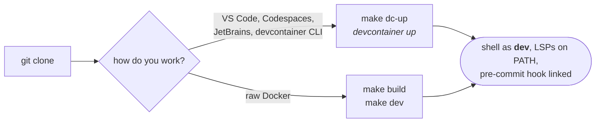

# Contributing

Two reproducible ways to get a Rust dev environment. Both give the same toolchain and the same
language servers: `rust-analyzer`, `taplo`, `marksman`, `dockerfile-language-server-nodejs`.



## Dev container

```bash
git clone https://github.com/akvize/reconcile-rs.git && cd reconcile-rs
make dc-up
```

`make dc-up` builds `.devcontainer/Dockerfile.dev`, starts the container as user `dev`, then runs
`.devcontainer/init.sh create` once and `… start` on every start. Open the workspace with
**Remote-Containers: Reopen in Container** (VS Code) or **Attach to Dev Container** (JetBrains).
CLI users land in a shell directly.

## Raw Docker

```bash
make build            # or: docker build --no-cache -f .devcontainer/Dockerfile.dev -t rust-dev-container .
make dev              # mounts the code at /workspace and drops you into bash
```

Attach any editor from inside the container shell (`nvim .`, `emacs .`, …) to pick up the LSP
servers in `/usr/local/bin`.

## Verify

```bash
whoami                        # dev
rustc --version
ls -l .git/hooks/pre-commit   # linked
command -v rust-analyzer taplo marksman
```

## Pre-commit hook

`init.sh` links it; to do it by hand:

```bash
ln -sf ./.devcontainer/../pre-commit .git/hooks/pre-commit
```

It runs [`./pre-commit`](./pre-commit) before every commit, so lint errors surface early.

## Tests and coverage

```bash
cargo test --all                                   # unit + integration + doc tests
cargo llvm-cov                                     # coverage summary
cargo llvm-cov --hide-instantiations --text        # missed lines
cargo llvm-cov --hide-instantiations --html        # browsable report
cargo llvm-cov report                              # reuse the previous run
```

CI also runs `cargo doc` under `-D warnings`, which catches failures `cargo build` and `cargo
clippy` do not. Run it locally before pushing.

## Conventions

[`AGENTS.md`](AGENTS.md) holds the working rules — the full CI gate and its two traps, the comment
and documentation policy, and what to read before touching a public signature or an invariant. It
is written for coding agents, and it applies to humans identically. `CLAUDE.md` just imports it, so
there is one copy.

## Where to read next

[`CONTRACT.md`](docs/CONTRACT.md) for what we promise (read this before changing a public signature, a
wire byte or a disk byte) · [`PROGRESS.md`](docs/PROGRESS.md) for current status ·
[`ARCHITECTURE.md`](docs/ARCHITECTURE.md) for the design, invariants and decision ledger ·
[`GLOSSARY.md`](docs/GLOSSARY.md) for vocabulary · [`SOTA.md`](docs/SOTA.md) for the literature.
