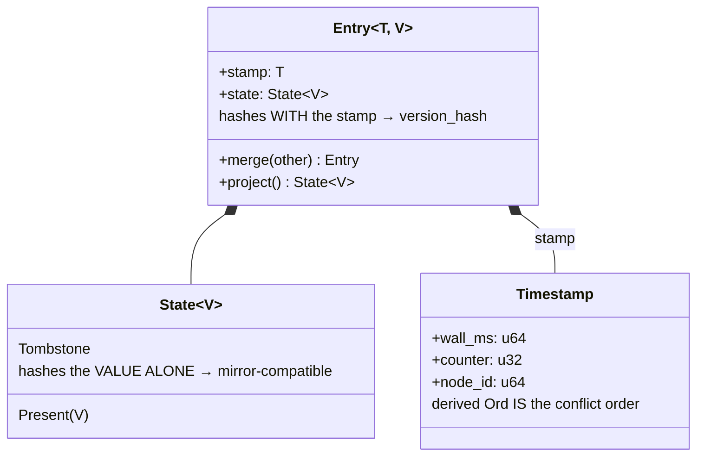

# Glossary — `reconcile-rs` vocabulary

This project's own vocabulary: domain types, protocol terms, architectural roles, operational
concepts. [`SOTA.md` §3](./SOTA.md#3-glossary) covers the literature instead. Terms from the
literature appear here only where we use them in a specific way.

**D1**–**D12** → [`ARCHITECTURE.md` §7](./ARCHITECTURE.md#7-decision-ledger) ·
**invariant N** → [§5](./ARCHITECTURE.md#5-invariants) ·
**Fxx** → [`PROGRESS.md`](./PROGRESS.md)

---

## 1. Domain types and values

| Term | Meaning |
|---|---|
| **Entry** | The stored cell: a `stamp` plus a `State` payload. Replaced the `(Timestamp, Option<V>)` tuple. Carries tombstone, timestamp and merge semantics as inherent methods rather than traits. Its `Hash` covers **both** stamp and state, so `version_hash` can tell apart two tombstones written at different times (invariant 7). |
| **State** | The logical state of a cell: `Present(V)` or `Tombstone`. Also serves as the *projection*. Its `Hash` is value-only by construction, so a dated store and a dateless mirror compute identical per-element fingerprints (invariant 8). |
| **Cell** | Informal term for one stored `Entry`; the unit the map holds and the protocol ships. |
| **Stamp** | The `Timestamp` on an `Entry`, recording which write last ordered it. Not a wall-clock reading — see *HLC*. |
| **Timestamp** | A Hybrid Logical Clock stamp, `(wall_ms, counter, node_id)`, compared in declaration order so the derived `Ord` **is** the conflict order (invariant 2). A **total** order: for any two distinct stamps one is greater, which is why concurrency cannot be represented and a multi-value register is out of reach (D6, T3). |
| **node_id** | The 64-bit replica identity inside every `Timestamp`, providing the deterministic tie-break. Random by default, so distinctness is *probabilistic*; pin it when a guarantee is required. Readable as of D4. |
| **Tombstone** | A deletion marker retained in the map rather than removing the key, so the deletion propagates and cannot be silently undone. Collected only once *causally stable*. |
| **Resurrection** | The failure mode tombstones prevent: a replica that missed a deletion re-introduces the deleted value. The historical wall-clock purge could not prevent it (F4). |
| **Projection** | The timestamp-less view of the dated map: a parallel tree of `State<V>` kept in sync at every mutation. What a dateless mirror reconciles against, and why the mirror never sees a timestamp. |
| **version_hash** | A deterministic, cross-node token identifying a *specific version* of a value, so a peer acknowledges exactly the tombstone it holds and a stale acknowledgment cannot authorise collecting a newer one. Fixed-key hashing (invariant 7). |
| **Fingerprint** | The 256-bit range summary: per-element BLAKE3 combined by **addition modulo 2²⁵⁶** with carry. An abelian **group**: it has inverses, which is what range subtraction and incremental maintenance need. Not XOR — that was the pre-F6 design, and it is weak. Any document still saying "XOR" is stale. |
| **Key / Value** | Supertraits with blanket impls that state the repeated multi-bound constraints once, so sites read `impl<K: Key, V: Value>`. Entry semantics travel with `Entry`, not with the `V` bound. As of D5, `Value` needs no `PartialEq`. |

## 2. The storage structure

| Term | Meaning |
|---|---|
| **RSOS** — Range-Summarizable Order-Statistics Store | The literature name (Amparore, arXiv:2603.19820) for exactly this structure's contract: `size`, `Aggregate(l,u)`, `Rank(z)`, `Select(r)`, `Enumerate(l,u)`, `Insert`, `Delete`. This project's tree satisfies all of them. |
| **HRTree** ("Hash-Range Tree") | The historical name of that structure here. Being retired (D1): "hash tree" reads as *Merkle tree*, which is precisely what it is **not**. |
| **Measure** | The composable per-subtree annotation that makes range aggregation `O(log n)`. The term comes from *finger trees* (Hinze & Paterson, JFP 2006), where a monoidal annotation is literally called a measure. Here it is the product `(Fingerprint, +) × (usize, +)`. |
| **Order statistics** | Per-subtree size counters giving `rank` (index of a key) and `select` (key at an index) in `O(log n)`. They let the diff bisect by *index* rather than by key space, so the 16-way splits stay balanced whatever the key distribution. |
| **Range fingerprint** | The measure's hash component: the combined hash of every element in a key interval, available in `O(log n)` for any interval. |
| **Incremental (homomorphic) multiset hash** | The class the fingerprint belongs to (Clarke et al., ASIACRYPT 2003): a set hash that is composable and updatable without rehashing the set. Secure members include MSet-Mu-Hash and LtHash; the naive XOR variant is not one. |
| **History independence** | A structure's *shape* depending only on its content, not on insertion order. Merkle Search Trees and prolly trees **require** it because they compare internal *node* hashes. This project does not, because it compares an aggregate over a *value-defined range*: identical content in `[a, b)` gives an identical fingerprint whatever the two trees' shapes. Read it as "not required", never as a gap. It is the design's deepest structural advantage. |
| **Eager vs lazy reconciliation index** | *Eager* maintains the summary on every write (this project: ~2–3× the write cost of a plain ordered map, but `O(1)` to decide "in sync"); *lazy* builds a Merkle tree at repair time (free writes, `O(n)` per round — the Cassandra model). Break-even is around `0.29·n` writes per round, so at the default one-second cadence eager wins by orders of magnitude for this workload. |

## 3. The protocol

| Term | Meaning |
|---|---|
| **RBSR** — Range-Based Set Reconciliation | The anti-entropy family implemented here: two peers compare `(fingerprint, size)` over shrinking key ranges and exchange only the divergent entries. Self-adapting (needs no estimate of the difference size) and supports partial sync by key range, at the cost of multiple sequential round trips. |
| **Round** | One initiation of the diff protocol against the selected peers, driven by the gossip cadence. |
| **HashSegment** | The wire record describing one key interval: bounds, fingerprint and **size**. Emptiness and equality are decided on `size`, never on the fingerprint (invariant 3). A non-empty range can legitimately fingerprint to zero, so hash-only comparison would silently lose data. |
| **Comparison item / value comparison item** | The two diff channels. The *dated* channel compares the dated map; the *value-only* channel compares the projection, and is what a dateless mirror speaks. |
| **Update / ValueUpdate** | The payload messages: a dated cell, or its timestamp-less projection. |
| **Ack** | The causal-stability acknowledgment: "I hold the tombstone for this key at this exact version". Deletion-specific, and a frozen wire variant. |
| **Ack resend** | Re-emitting the acknowledgment for every tombstone a node holds, every round. Without it the matrix never completes at three nodes or more: two non-originating replicas never learn that the other holds the deletion. |
| **Causal stability** | The condition gating tombstone collection: every monotonic cluster member has acknowledged the exact version. The safe criterion, as opposed to a wall-clock timer, which cannot on its own guarantee that every replica saw the deletion. |
| **Members vs peers** | **Members** gate tombstone collection and are *earned* by sending an authenticated dated datagram; **peers** are merely gossip targets and may come from unverified discovery. Discovery feeds `peers` only, so an unverified address can neither block collection nor trigger a release (invariant 6). |
| **Decommission** | Permanently removing a member so its outstanding acknowledgments stop holding tombstones back. The escape hatch for a replica that is never coming back. |
| **Node pruning** | The *different* mechanism a per-replica value state (e.g. a counter) would need: dropping a departed replica's slot from inside a value. Membership-triggered rather than version-triggered, so the tombstone machinery does not generalise to it (D6). |
| **Bulk dump / pacing** | The cold-sync path: when a peer differs over a whole range it must receive every value in it. Sent on a detached, rate-paced task so the burst cannot overrun the receiver and the receive loop stays free, with a per-peer guard and a global concurrency budget. |
| **Cold sync** | An empty or far-behind replica pulling the dataset — the extreme case of the bulk path. |
| **Datagram ceiling** | The hard per-message size limit. The send path packs messages into datagrams but never *fragments* one, so a single oversized message is never delivered and its key never converges (invariant 9). |

## 4. Architecture roles

| Term | Meaning |
|---|---|
| **Hexagonal / ports and adapters** | The target architecture: the domain depends only on small traits (*ports*) that it defines; concrete infrastructure implements them (*adapters*); all dependency arrows point inward. |
| **Port** | A capability the domain needs from outside: `Clock`, `Transport`, `Codec`, `Persistence`, `Discovery`. Ports reveal intent and are part of the contract. |
| **Adapter** | A concrete implementation of a port: the HLC clock, the UDP transport, the bincode codec, the file/in-memory persistence, the random-probe and DNS discovery. |
| **Consumer-wireable** | Whether a user can actually *supply* an adapter. Distinct from whether the port is public: before D2 only `Persistence` and `Discovery` were wireable, and three ports were ports in name only. D2 adds `Transport`, makes `Codec` internal, and keeps `Clock` test-only on purpose — the protocol already assumes an unreliable transport, but an unsound clock breaks causal ordering. |
| **Mechanism** | The parts that are implementation detail rather than contract: the diff algorithm and its wire types. Stays internal. As of D1 the *tree* is no longer mechanism — it graduates to a separate product. |
| **Driving vs driven side** | The driving side is the application calling the store; the driven side is the infrastructure the ports reach out to. |
| **Dated store vs dateless mirror** | The full replica holds stamped entries and takes part in causal stability. The mirror holds only projections, never acknowledges tombstones and is never admitted to membership, so it cannot block collection. It integrates by plain overwrite, which is correct only under last-write-wins (D9). |

## 5. Consistency

| Term | Meaning |
|---|---|
| **LWW** — last-write-wins | The conflict policy: the entry with the greater stamp wins, using a **strict** `>` so the comparison is commutative, associative and idempotent over the total order. |
| **SEC** — strong eventual consistency | Replicas that have delivered the same updates hold the same state, without coordination. What the merge policy's algebraic properties buy. |
| **Convergence** | Replicas reaching identical state. Watch the failure mode a wire-visible configuration mismatch causes: peers that never converge **and never notice**, refining forever instead of erroring (D1). |
| **Livelock (fingerprint)** | The specific non-convergence hazard where two replicas hold logically identical values but compute different fingerprints, so the diff re-ships a converged key forever. Why a merged entry must take the **max** stamp, not its own. |
| **Anti-entropy** | Background reconciliation that repairs divergence, as opposed to making writes coordinate up front. |

## 6. Cross-references

| Term you are looking for | Where |
|---|---|
| Competing structures and algorithms (Merkle Search Tree, prolly tree, IBLT, minisketch, …) | [`SOTA.md` §3.1](./SOTA.md) |
| Consistency and replication vocabulary | [`SOTA.md` §3.2](./SOTA.md) |
| Hashing and wire-level terms | [`SOTA.md` §3.3](./SOTA.md) |
| Bibliography | [`SOTA.md` §4](./SOTA.md) |
| Decisions **D1**–**D12** | [`ARCHITECTURE.md` §7](./ARCHITECTURE.md#7-decision-ledger) |
| Invariants **1**–**9** | [`ARCHITECTURE.md` §5](./ARCHITECTURE.md#5-invariants) |
| Findings **Fxx** and current status | [`PROGRESS.md`](./PROGRESS.md) |
