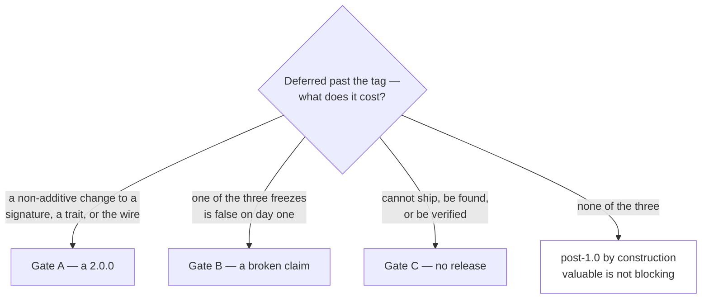
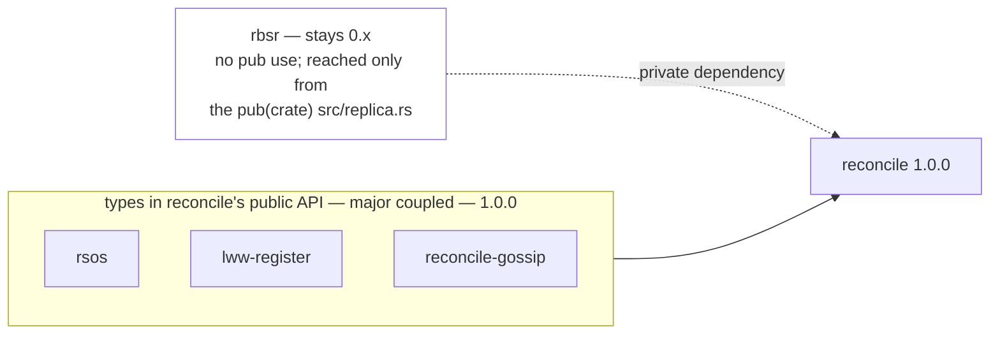

# Project status — `reconcile-rs`

> **Living document.** Real-time view of correctness, security, and maturity. Complements, does not
> duplicate: [`SOTA.md`](./SOTA.md) (durable positioning/glossary/bibliography) and
> [`ARCHITECTURE.md`](./ARCHITECTURE.md) (the architecture and its invariants, §5 there).
> **[Issue #138](https://github.com/Akvize/reconcile-rs/issues/138)** tracks the architecture
> migration to closure.

- **Last updated:** 2026-08-14.
- **Release 1.0.0:** what the release commits to and what gates it — **§6 below**, mirroring
  [#206](https://github.com/Akvize/reconcile-rs/issues/206) (rewritten 2026-08-11 around an explicit
  definition of 1.0; the 2026-06 phase plan it replaced is dissolved into the issues each
  disposition belonged to).
- **Structural migration:** complete — five-crate workspace, ports on the correct side of each
  boundary, domain purity compiler-enforced (`ARCHITECTURE.md`). Tracking issue
  [#138](https://github.com/Akvize/reconcile-rs/issues/138) stays open for one residual coupling
  (`timeout_wheel` reads the wall clock directly, rather than through the now-decided #288 seam),
  not the split itself.
  [#145](https://github.com/Akvize/reconcile-rs/issues/145), which carried no code work of its own,
  closed 2026-08-14 — its sole criterion, the first split-aware release, is the `v1.0.0` milestone's
  own completion condition, not a separate issue to track it.
- **Publish status:** only `reconcile` `0.2.1` is on crates.io, and it **predates this workspace
  split** — it vendors what are now `rsos`/`rbsr`/`lww-register`/`gossip` directly. The four sibling
  crates have never been published; the release pipeline to publish all five
  (`.github/workflows/tags.yml`, AGENTS.md §11) is implemented but has not been run. Tracked in
  [#204](https://github.com/Akvize/reconcile-rs/issues/204) (closed 2026-08-14, mechanics resolved —
  the version decision itself lives in §6's "Version to cut" row): the next tag is a breaking
  release (recent renames, the wire-format changes below), so it is deliberately a maintainer call,
  not bumped by a feature PR.

---

## 1. Headline

The **algorithmic core** (FingerprintTreeMap + range fingerprint + RBSR diff) is correct and
SOTA-aligned (`SOTA.md`). The critical engineering and distributed-design defects the original
review found are fixed: collision-resistant 256-bit fingerprint, HLC-keyed conflict resolution,
causal-stability tombstone GC, malformed-packet hardening, optional per-datagram authentication and
payload encryption, pluggable persistence, runtime observability, a lightweight dateless read
replica. A 2026-06 adversarial audit filed further findings as
[#195](https://github.com/Akvize/reconcile-rs/issues/195)–[#205](https://github.com/Akvize/reconcile-rs/issues/205)
(tracking [#206](https://github.com/Akvize/reconcile-rs/issues/206)); all nine correctness/security
findings (#195–#201) are **fixed**. Of the maturity-grade items filed alongside them,
[#202](https://github.com/Akvize/reconcile-rs/issues/202) (persistence operational robustness) and
[#203](https://github.com/Akvize/reconcile-rs/issues/203) (mac-hmac CI lane; macOS lane **waived**,
see §6 Waivers) and
[#204](https://github.com/Akvize/reconcile-rs/issues/204) (release pipeline mechanics) are now
**fixed** — #202's port-contract redesign and #203's poll-budget scaling are separable follow-ups,
not correctness gaps; [#205](https://github.com/Akvize/reconcile-rs/issues/205) hygiene batch is
still open. **The 2026-08-10 public-API audit** (§4) found two of its nine P0s correctness-grade
rather than ergonomic — [#283](https://github.com/Akvize/reconcile-rs/issues/283) (`with_discovery`'s
guard was a release-build no-op, so a speculative source could release the causal-stability gate)
and [#284](https://github.com/Akvize/reconcile-rs/issues/284) (a third-party RSOS backend is a
remote-driven panic surface) — both are now **fixed**: the RSOS contract is stated on the traits and
defended by construction (§6 Gate B), and `with_discovery`'s guard is a real `assert!` with
`Discovery::kind()` no longer defaulting to the dangerous choice. [#309](https://github.com/Akvize/reconcile-rs/issues/309)
(no wire-version field, Gate A) and [#312](https://github.com/Akvize/reconcile-rs/issues/312)
(`cargo deny`/`overflow-checks`, release mechanics) are also now **fixed**. Remaining work beyond the
gate list is scaling and the confidentiality roadmap.

---

## 2. Correctness & security findings

Status of every finding (`Fxx`) from the original code audit (commit `64f1ebf`).
✅ resolved · ◐ partial · ◯ open.

| # | Severity | Finding | Status | Resolution / note |
|---|----------|---------|--------|-------------------|
| F1 | Critical | `hash==0` sentinel → silent divergence | ✅ | #106 — emptiness/equality decided on `size`, not `hash` |
| F2 | Critical | panic on malformed UDP → remote DoS | ✅ | #107 — malformed datagrams dropped (`warn!`+`return`) |
| F3 | Critical | unauthenticated + attacker-controlled timestamp | ✅ | #108 — per-datagram keyed MAC, verified before deserialize (opt-in key) |
| F4 | Critical | tombstone resurrection (60 s wall-clock GC) | ✅ | #109 — GC gated on causal stability |
| F5 | High | physical-clock LWW (lossy + non-commutative) | ✅ | #110 — Hybrid Logical Clock + total order |
| F6 | High | 64-bit XOR fingerprint (weak, craftable) | ✅ | #111 — 256-bit additive BLAKE3 (`rsos/src/fingerprint.rs`, add/sub mod 2²⁵⁶). The XOR finding is resolved; the *replacement* is itself craftable by a **writing** adversary (Wagner's balance problem over ℤ/2²⁵⁶ — demonstrated in `rbsr/tests/wagner_false_convergence.rs`), a new finding tracked in [#337](https://github.com/Akvize/reconcile-rs/issues/337), which carries what it costs and the candidate fixes — not a reopening of this row |
| F7 | High | crafted `RangeAggregate` → panic/underflow | ✅ | #112 — bound validation: an inverted range is rejected before indexing (`rbsr/src/protocol.rs:154`) |
| F8 | High | `DefaultHasher` unstable on the wire | ✅ | #111 + `rsos::encoding` (ARCHITECTURE.md §6) — wire fingerprint is BLAKE3 over an owned canonical byte encoding; `version_hash` derives from it, not `DefaultHasher` |
| F9 | High | UDP amplification / reflection | ◐ | mitigated by #108 (auth) + #106; rate-limiting / path validation still open |
| F10 | High | IP-scan discovery, O(N²) membership | ◐ | `Discovery` port + `DnsDiscovery` (k8s headless-Service DNS, no IP-scan) lands a cloud-native path; bounded-fan-out membership (SWIM/HyParView) still open — [#147](https://github.com/Akvize/reconcile-rs/issues/147)/[#190](https://github.com/Akvize/reconcile-rs/issues/190) |
| F11 | High | no property-testing / fuzzing | ✅ | #113 — `tests/proptest_fingerprint_tree_map.rs`, `tests/fuzz_packets.rs` |
| F12 | Medium | debug `println!` in the hot path | ✅ | #113 — removed |
| F13 | Medium | panic-only API (no `Result`) | ✅ | #148 — fallible `new` constructors; no network send can panic the run loops |
| F14 | Medium | `pre_insert` hook under the write-lock (net path) | ✅ | #149 — hook runs outside the write lock on both paths, regression-tested |
| F15 | Medium | no persistence | ✅ | #122 — pluggable `Persistence` (`InMemory`, `FileSnapshot`) |
| F16 | Medium | loopback benches + README inconsistency | ✅ | [#280](https://github.com/Akvize/reconcile-rs/issues/280) — seeded delay/loss/reordering `Transport` decorator (`benches/netem/mod.rs`, tested by `tests/netem.rs`) plus an RTT sweep (0/0.1/1/10/50 ms) and a loss lane. **Measured, not asserted:** cold sync costs **+1.0 × RTT** and gossip propagation **+0.5 × RTT**, both flat in dataset size and `N`; a lost datagram costs a whole `reconcile_interval` (1 s default), 20× the top of the RTT sweep. Numbers and reading: `benches/README.md` |
| F17 | Medium/Low | maturity signals | ◐ | clippy clean; MSRV still undeclared — [#189](https://github.com/Akvize/reconcile-rs/issues/189) |
| F18 | Medium | resource exhaustion (`peers` map, bincode bomb) | ✅ | per-datagram message/segment caps landed (#151); the `peers` map is bounded by `Config::max_peers` (default 1024, `src/replicated_map.rs:84`) — [#150](https://github.com/Akvize/reconcile-rs/issues/150) closed by PR #245 |
| F19 | Low | dependency hygiene | ✅ | bincode `with_limit` landed (#151); `overflow-checks = true` and a `cargo deny` CI lane landed 2026-08-13 — [#312](https://github.com/Akvize/reconcile-rs/issues/312) |

**Score:** 16 resolved · 3 partial (F9, F10, F17) · 0 open. All Critical resolved; all
but one High resolved or mitigated.

---

## 3. Maturity checklist

- [x] CI green under `-D warnings`
- [x] Property tests for convergence (`proptest_fingerprint_tree_map.rs`)
- [x] Malformed-packet fuzz harness (`fuzz_packets.rs`)
- [x] Security model documented (README "Security model")
- [x] Pluggable persistence documented (README "Persistence")
- [x] Release pipeline implemented (`tags.yml`, all five crates, dependency order) — not yet **run**,
      see the publish status above; semver cadence is a per-release maintainer call
- [ ] `CHANGELOG.md` + a `0.2.1` → 1.0 migration guide — [#310](https://github.com/Akvize/reconcile-rs/issues/310)
- [x] CI code coverage + doc-tests (#97) — Codecov (`cargo llvm-cov`, informational) + `cargo test --doc`
- [x] `cargo audit` / `cargo deny` in CI — [#312](https://github.com/Akvize/reconcile-rs/issues/312) (`deny.toml` + `main.yml`'s `deny` job, 2026-08-13; RUSTSEC-2025-0141 (bincode 1.x unmaintained) recorded as an accepted `ignore` — no safe upgrade exists short of a wire-format break riding the version-bump mechanism #309 delivered)
- [ ] Declare + CI-pin MSRV (`rust-version`), on all five manifests — [#189](https://github.com/Akvize/reconcile-rs/issues/189)
- [ ] `[package.metadata.docs.rs] all-features` + `keywords`/`categories` on `reconcile` — [#189](https://github.com/Akvize/reconcile-rs/issues/189)
- [x] `overflow-checks = true` in the release profile — [#312](https://github.com/Akvize/reconcile-rs/issues/312) (2026-08-13). **Decision, recorded per the issue's own requirement**: a
  silent-wraparound arithmetic bug reaching a release build is worse than a panic — it would
  surface as a divergent fingerprint the reconciliation protocol has no way to explain, rather
  than a bounded, alertable liveness event (the same class of trade-off F2/#107 already resolved
  in the other direction for remote-*parseable* input, by dropping a malformed datagram instead of
  panicking on it — arithmetic overflow deep inside a computation is not the wire-parsing
  boundary). F7/#112's known crafted-input path (`RangeAggregate`) is already defended by an
  explicit bound check, not by this flag; this closes the residual, unaudited surface
- [x] Bound the `peers` map in unauthenticated mode — [#150](https://github.com/Akvize/reconcile-rs/issues/150) (PR #245; `Config::max_peers`, default 1024)
- [ ] `SECURITY.md` + private vulnerability reporting — [#313](https://github.com/Akvize/reconcile-rs/issues/313)
- [ ] Mechanical semver / public-API gate in CI — [#311](https://github.com/Akvize/reconcile-rs/issues/311)

---

## 4. Open items & roadmap

### SOTA axis index

Where each axis of [`SOTA.md`](./SOTA.md) §2.4 (structure) and §1.3/§2.2 (algorithm) currently
stands. An index, not an analysis: the target is stated in `SOTA.md`, the work in the issue, the
status here — and, for the refinement-policy rows, the measured numbers behind it are in
[`benches/README.md`](./benches/README.md), not repeated in either document
([#346](https://github.com/Akvize/reconcile-rs/issues/346)). The subsections below organize the same
issues by delivery area instead.

| Axis | Target | State |
|---|---|---|
| Secure, wide summary | §2.4 P0-1 | ✅ F6/[#111](https://github.com/Akvize/reconcile-rs/issues/111) — 256-bit additive BLAKE3 |
| Emptiness decided on size, not hash | §2.4 P0-2 | ✅ F1/[#106](https://github.com/Akvize/reconcile-rs/issues/106); the map's own `==` re-fixed by `cc4d7c4` ([#282](https://github.com/Akvize/reconcile-rs/issues/282)) |
| Stable hash as a wire contract | §2.4 P0-3 | ✅ F8/[#111](https://github.com/Akvize/reconcile-rs/issues/111) + `rsos::encoding` |
| Generic monoid summary | §2.4 P1-4 | **waived to 2.0** — [#298](https://github.com/Akvize/reconcile-rs/issues/298) (closed), §6 Waivers |
| RSOS contract exposed | §2.4 P1-5 | ✅ `rank`/`select`/`range` `pub` on `rsos`; iterator residue [#92](https://github.com/Akvize/reconcile-rs/issues/92), [#291](https://github.com/Akvize/reconcile-rs/issues/291) |
| Persistence / content-addressing | §2.4 P2-6 | ◯ [#271](https://github.com/Akvize/reconcile-rs/issues/271) (+#273–#277). Settled 2026-08-14 in [#272](https://github.com/Akvize/reconcile-rs/issues/272)'s body — **build**: a copy-on-write tree in `rsos`, versioned AB-tree, adopting LMDB/AELMDB rejected on measured cost plus FFI depth and fork maturity. Content addressing is **not** part of it and stays parked on [#188](https://github.com/Akvize/reconcile-rs/issues/188): COW alone satisfies the lock-free-read need this epic exists for |
| Conflict metadata in the value | §2.4 P2-7 | ✅ HLC F5/[#110](https://github.com/Akvize/reconcile-rs/issues/110), causal-stability GC F4/[#109](https://github.com/Akvize/reconcile-rs/issues/109); pluggable CRDT deferred — [#184](https://github.com/Akvize/reconcile-rs/issues/184) (closed, decision recorded in `ARCHITECTURE.md` §7) |
| Property-testing + fuzzing | §2.4 P3-8 | ✅ F11/[#113](https://github.com/Akvize/reconcile-rs/issues/113) |
| Adversarial robustness | §2.4 P3-9 | ✅ [#284](https://github.com/Akvize/reconcile-rs/issues/284) (RSOS contract), [#230](https://github.com/Akvize/reconcile-rs/issues/230) (oversize values, counted+dropped not silent), [#150](https://github.com/Akvize/reconcile-rs/issues/150) (peers cap) |
| Refinement policy — fan-out, threshold | §1.3, §2.2 | ✅ `b` = 16 ([#257](https://github.com/Akvize/reconcile-rs/issues/257), closed); ✅ no `t` ([#315](https://github.com/Akvize/reconcile-rs/issues/315) — measured in total bytes, default unmoved); divergence-adaptive — [#318](https://github.com/Akvize/reconcile-rs/issues/318) |
| Single-shot latency (hybrid sketch) | §2.2 conclusion | ◯ [#185](https://github.com/Akvize/reconcile-rs/issues/185), gated on [#280](https://github.com/Akvize/reconcile-rs/issues/280) |
| Wire aggregate size | §2.2 | ◯ 36 B not 32 per `Fingerprint` (varint, not fixed-width) — decided on the record by [#232](https://github.com/Akvize/reconcile-rs/issues/232): declined here, rides the wire-version-field train [#309](https://github.com/Akvize/reconcile-rs/issues/309) landed rather than costing a 2.0 |

The axis cuts across §6's gate rule: an item can be SOTA-critical and post-1.0 (#185), or a release
gate and SOTA-neutral (#297, #293). Neither list subsumes the other.

### Research axis index

Opened 2026-08-14. Where this repository can test a claim the published work leaves open — an index
of *questions*, one row per issue, none of them a 1.0 gate. The claim and the evidence live in the
issue; nothing here restates either. Wire cost factorizes as `|T| · w_fp (+ T_loc)`: the combiner
half (`w_fp`) is settled in the literature, the refinement-tree half (`|T|`) is not, and the write
path is in neither.

| Axis | Question | Issue |
|---|---|---|
| Refinement tree `\|T\|` | Is the comparison count sensitive to the *ordered shape* of the difference, and does the `(b, B)` pair matter? | [#353](https://github.com/Akvize/reconcile-rs/issues/353) |
| Honest-model rate | What is the false-convergence rate at reduced width, and do the two layers scale as predicted? | [#355](https://github.com/Akvize/reconcile-rs/issues/355) |
| Rank determinacy | Does a hash-derived split rule measurably break the bound rank cuts license? | [#356](https://github.com/Akvize/reconcile-rs/issues/356) |
| Policy affordance | `Comparison` hands a policy the fingerprint, so a third-party policy can void that bound silently | [#352](https://github.com/Akvize/reconcile-rs/issues/352) |
| Comparison-map width | Post-#257 the width is a security question, not a bandwidth one — price it in both models | [#357](https://github.com/Akvize/reconcile-rs/issues/357) |
| Fleet vs pair | Every model here is two-party. Does a fleet resample a collision, or correlate it? | [#354](https://github.com/Akvize/reconcile-rs/issues/354) |
| Multiset assumption | Can any path fold one element twice, and what does that cost the summary? | [#358](https://github.com/Akvize/reconcile-rs/issues/358) |
| Multidimensional order | The analysis is dimension-free; the RSOS contract is not — what does `δ > 1` actually need? | [#360](https://github.com/Akvize/reconcile-rs/issues/360) |
| Write cost | The contract writes the root on every insert. Where does that bind? | [#359](https://github.com/Akvize/reconcile-rs/issues/359) |

Two results landed with the index rather than as issues, because they close rather than open:

- **A divergence-adaptive policy is confined to the count**, and the count is blind exactly where the
  exact-count guarantee has already run out — folded into
  [#318](https://github.com/Akvize/reconcile-rs/issues/318), which it narrows toward a recorded
  decision.
- **Re-ordering the store does not rescue that signal.**
  `rbsr/tests/balance_under_position_map.rs` drives the unmodified protocol under three position maps
  and measures which divergences the count can see: a key order ties the conflicting records, a
  `(key, version)` order leaves them *adjacent* — equally unseparable — and only an order whose
  leading component is the one that changed makes them visible. "Make `π` injective" is the wrong
  rule; relocation is.

### Security / confidentiality
Former umbrella [#96](https://github.com/Akvize/reconcile-rs/issues/96) closed 2026-08-14 —
superseded by this list; the three children below stand on their own.
- ✅ Confidentiality + integrity — XChaCha20-Poly1305 AEAD on payloads.
- ◯ Per-node authentication / anti-MITM — [#136](https://github.com/Akvize/reconcile-rs/issues/136).
- ◯ Forward secrecy (ephemeral-key handshake) — [#135](https://github.com/Akvize/reconcile-rs/issues/135).
- ◯ Key rotation / management — [#137](https://github.com/Akvize/reconcile-rs/issues/137).

### Scaling & robustness
- ✅ Multi-location reconciliation, geography-aware gossip — [#53](https://github.com/Akvize/reconcile-rs/issues/53) (closed).
- ✅ Runtime reconfiguration: live topology/gossip-cadence changes (README "Multiple geographical locations").
- ✅ DNS-driven decommission hardened against resurrection — [#201](https://github.com/Akvize/reconcile-rs/issues/201) (closed).
- ◯ Bounded-fan-out membership (SWIM/HyParView) instead of random probing — [#147](https://github.com/Akvize/reconcile-rs/issues/147)/[#190](https://github.com/Akvize/reconcile-rs/issues/190).
- ✅ Persistence operational robustness (snapshot clone no longer stalls writes past one chunk,
  directory fsync after rename, bounded retry on transient load failure) —
  [#202](https://github.com/Akvize/reconcile-rs/issues/202) (closed 2026-08-13; the port-contract
  redesign — async, associated error type — is a separable follow-up).
- ✅ Larger-than-datagram payloads — [#230](https://github.com/Akvize/reconcile-rs/issues/230) (closed
  2026-08-13: dropped with a dedicated counted signal, not silently; ceiling still documented,
  README "Value-size ceiling").
- ✅ Lightweight dateless read replica (`ReadReplicaMap`) — [#128](https://github.com/Akvize/reconcile-rs/issues/128) (closed).
- ✅ Observability: `tracing` spans + `metrics` facade + optional Prometheus endpoint — [#94](https://github.com/Akvize/reconcile-rs/issues/94) (closed).
- ✅ Collection-shaped read API on both `ReplicatedMap` and `ReadReplicaMap` — `len`/`is_empty`/
  `contains_key`/`for_each`/`for_each_in_range`/`to_vec`/`range_to_vec`/`keys`/`values`, tombstones
  excluded consistently across both types — [#179](https://github.com/Akvize/reconcile-rs/issues/179)
  (closed 2026-08-10; this file had claimed that prematurely while the issue was still open).
  Delivered in the callback shape the issue itself recommends; the `iter` half of its title never
  landed and is tracked by [#270](https://github.com/Akvize/reconcile-rs/issues/270)/[#271](https://github.com/Akvize/reconcile-rs/issues/271)/[#291](https://github.com/Akvize/reconcile-rs/issues/291).

### API and performance
- ◐ **Public-API audit (2026-08-10)** — the public surface of all five crates reviewed against what
  dependents need (`BTreeMap` and the RSOS contract for `rsos`, RBSR Algorithm 1/2 for `rbsr`, the
  embedded-IMDG baseline for the facade, and implementability-from-outside for the four ports). The
  read/write map surface is confirmed coherent; the defects sit underneath it, in trait impls,
  generic bounds and panic-safety. **Nine P0 items, none previously tracked**, filed with their
  evidence as [#282](https://github.com/Akvize/reconcile-rs/issues/282)–[#299](https://github.com/Akvize/reconcile-rs/issues/299)
  under [#206](https://github.com/Akvize/reconcile-rs/issues/206);
  [#72](https://github.com/Akvize/reconcile-rs/issues/72)/[#92](https://github.com/Akvize/reconcile-rs/issues/92)/[#137](https://github.com/Akvize/reconcile-rs/issues/137)/[#185](https://github.com/Akvize/reconcile-rs/issues/185)/[#189](https://github.com/Akvize/reconcile-rs/issues/189)/[#202](https://github.com/Akvize/reconcile-rs/issues/202)/[#205](https://github.com/Akvize/reconcile-rs/issues/205)/[#257](https://github.com/Akvize/reconcile-rs/issues/257)
  were widened rather than duplicated. Three P0s carry consequences beyond ergonomics.
  [#282](https://github.com/Akvize/reconcile-rs/issues/282) — `FingerprintTreeMap`'s `PartialEq`
  deciding equality on the fingerprint alone, ignoring size, which is F1/#106's class inside the
  map's own `==`, against [`ARCHITECTURE.md`](./ARCHITECTURE.md) §5 invariant 3 — is **fixed**, with
  the two other defects in that issue: `cc4d7c4` (equality on the whole aggregate), `bb64f56`
  (ranges by value) and `5b8d138` (panic-safe `with_mut`); `Eq` is bounded at
  `rsos/src/fingerprint_tree_map.rs:648`, confirmed 2026-08-13 and the issue **closed**.
  [#283](https://github.com/Akvize/reconcile-rs/issues/283) — every `ReplicatedMap` write panicking
  outside a Tokio runtime (documented, `# Panics`), the get-then-insert self-deadlock
  (`get_cloned` added), and `with_discovery`'s authoritative-source precondition being a
  `debug_assert!` (a no-op in release, now a real `assert!`) — is also **fixed**, 2026-08-13. Two
  needed a maintainer **decision** before the release
  freezes the signatures: [#288](https://github.com/Akvize/reconcile-rs/issues/288) (`Clock` — a
  published port with no public implementor), **decided 2026-08-14: opened it** —
  `ReplicatedMap::new_with_clock`/`Replica::new_with_clock` accept any `Arc<dyn Clock>`,
  `assert_conformance` ships as the runtime gate (monotonicity cannot be checked at the type level),
  and `Clock::observe_trusted` lost its unsound default body (`ARCHITECTURE.md` §3.2), and
  [#298](https://github.com/Akvize/reconcile-rs/issues/298) (the generic monoid), **decided
  2026-08-12**, waived off Gate A (§6). [#284](https://github.com/Akvize/reconcile-rs/issues/284) is
  fixed, and the two were one decision: keeping `Rsos` open to third-party backends is what makes
  stating and defending its contract the price.
- ◐ **RSOS/AELMDB literature pass (2026-08-10)** — arXiv:2603.19820 read in full against its four
  published repositories (`amparore/{aelmdb, negentropy-aelmdb, lmdbxx-aelmdb, bench-aelmdb}`). The
  design verdict is unchanged and now better evidenced: it *is* the same design, and its combiner is
  literally ours (256-bit addition over LE 64-bit limbs with carry). Two deltas run in our favour
  and were not visible from the abstract — AELMDB never hashes (its lift extracts a byte slice the
  application must have made collision-resistant, where `rsos` computes BLAKE3 over the canonical
  encoding of key *and* value), and Negentropy's comparison map is SHA-256 truncated to 128 bits,
  which the paper itself (§6.1) calls only "probabilistically sound" with the collision analysis out
  of scope, where `rbsr` compares the aggregate itself. Three outcomes, all landed here: `SOTA.md`
  §1.3/§2.1/§2.2/§2.3 revised, six references added; two factual errors corrected (`SOTA.md`'s
  `O(d log n)` claim for *this* implementation, and `rsos/src/lib.rs` calling AELMDB
  "content-addressed" — it is a copy-on-write B+-tree addressed by page number); and #257
  reclassified with a measurement behind it (above). One caveat worth keeping: the paper's headline
  4.69×–13.98× is persistent-vs-persistent, its in-memory reference backend beats AELMDB in all six
  families despite not being an RSOS at all, and its widest-margin family runs at `d ≈ 21 % of n` —
  the opposite of the large-n/small-d profile. Nothing in it argues we should move off an in-memory
  store; it argues that *if* we add persistence, the aggregates belong in the persistent tree rather
  than in an auxiliary index.
- **PRs #218–#221 were never merged** (established 2026-08-10). Their bodies read as landed work
  ("MSRV declared", "`LoadError` re-exported", "Closes #189"); `git log -S` finds **zero**
  occurrences of every identifier they introduce, so nothing was reverted and the workspace split is
  not implicated. All four sat on a 7-deep stacked chain whose every PR targeted the *previous
  feature branch* rather than `main`, leaving the stack inert; closed unmerged on 2026-08-07 once
  `main` had moved past them. The branches are live on the remote — re-land fresh against `main`
  (#217→#248 is the precedent) rather than rebasing the stack. #189/#202/#205 stayed correctly open
  throughout. Nothing systematic: 10 of 10 spot-checked merged PRs survive intact in `main`. The one
  gap worth closing mechanically, per AGENTS.md §10: nothing flags a PR whose base is not `main` and
  which has been open for months.
- ✅ Round out the write API: atomic `update`/`upsert`/`get_or_insert_with`, `clear`/`retain`/
  `delete_range`, and a `load_bulk` no-broadcast seed path (`just_*` demoted off the published
  surface) — [#180](https://github.com/Akvize/reconcile-rs/issues/180) (closed 2026-08-10; this file
  had claimed that prematurely while the issue was still open). One bullet was unshipped and is now
  [#299](https://github.com/Akvize/reconcile-rs/issues/299): conditional writes
  (`compare_and_swap`/`insert_if_absent`) exist nowhere in the tree — and under LWW without
  consensus a cluster-wide compare-and-swap is not soundly implementable, so that bullet needs a
  decision rather than an implementation.
- ✅ `FingerprintTreeMap`'s own comfort write API (`rsos`, one layer below `ReplicatedMap`):
  `contains_key`, `clear`, `retain`. A `std`-style `entry()` returning a live `&mut V` is
  deliberately not offered — see the rationale on `with_mut`'s doc comment (a bare mutable handle
  lets a caller skip the re-lift/fingerprint-propagation step `with_mut` guarantees); the
  get-or-insert half of what `entry()` usually buys already exists one layer up
  (`ReplicatedMap::upsert`/`get_or_insert_with`).
- ✅ **The split fan-out was a communication-complexity regression, not a tuning gap** —
  [#257](https://github.com/Akvize/reconcile-rs/issues/257), reclassified 2026-08-10 (it read
  "unbenchmarked and hard-coded"), closed 2026-08-11.

  **Step A — the seam.** The loop's two tuning decisions are now a `RefinementPolicy` in `rbsr`
  (`Decision` = SKIP/IDLIST/SPLIT, `Comparison`, `SplitStride`, `FanOut`); `protocol_round_with_policy`
  takes one, `protocol_round` pins a named `DEFAULT_POLICY`. It landed behaviour-preserving — the
  default was `SqrtFanOut`, byte-for-byte the previous rule, so `tests/wire_format.rs`'s golden
  vector and the convergence proptests passed unchanged. Three policies ship, each named for the
  rule it applies rather than for where it comes from: `FixedFanOut`, `SqrtFanOut`,
  `EnumerateBelowThreshold`. The policy is local and never advertised; mixed pairs converge, pinned
  by `peers_running_different_policies_still_converge` and a proptest over every pair.
  `protocol_round` also returns a `RoundOutcome` tally, which is the only signal a consumer without
  a `tracing` subscriber gets for the malformed-segment drop path.

  **Step B — the measurement.** `benches/protocol.rs` sweeps policy × `n` × `d` × difference
  clustering, reporting rounds, bytes, datagrams, IP fragments, IDLIST *elements* and local
  `Aggregate`/`Rank`/`Select` counts, plus a timed drive (the paper's `T_loc`). Locating one missing
  element, differences scattered:

  | n | `√m` bytes / msgs / `T_loc` | `b`=16 bytes / msgs / `T_loc` |
  |---:|---:|---:|
  | 10³ | 2 041 / 6 / 12.9 µs | 1 701 / 6 / 8.2 µs |
  | 10⁴ | 5 395 / 8 / 43.8 µs | 2 195 / 6 / 18.2 µs |
  | 10⁵ | 16 553 / 6 / 460 µs | 2 789 / 6 / 25.2 µs |
  | 10⁶ | **53 046** / 8 / **2.10 ms** | **3 834** / 8 / **45.0 µs** |

  **This corrected a claim this file used to make.** Rounds were recorded here as "`Θ(log log n)`,
  flat at 6–8 … where fixed-`b` pays `O(log n)`". Measured head to head at n = 10⁶, *both* take 8
  one-way messages (log₁₆ 10⁶ ≈ 5 ≈ the iterated-square-root depth); the separation only reaches 2×
  near n ≈ 10¹². So `√m` paid ~14× the bytes, ~13× the local RSOS queries and 47× the local CPU and
  bought nothing observable back. Corrected in `SOTA.md` §1.3/§2.2. One qualification: the gap closes
  to ~7 % at d = 100 scattered — `√m` is worst exactly in the small-`d` regime RBSR exists for, and
  competitive once `d` approaches `√n`. (The second qualification, "every bench runs at RTT ≈ 0", is
  retired: [#280](https://github.com/Akvize/reconcile-rs/issues/280)'s lane prices a round trip at
  1.00 × RTT, so the equal message counts above are equal *seconds*, not merely equal counts.) The earlier ceiling finding also sharpens: at n = 10⁶ with
  d = 100 the widest round reaches **160 908 B over 3 300 ranges = 3 datagrams / ~189 fragments**, so
  the ceiling is reachable at 10⁶, not only at 10 M — still degrading into extra datagrams rather
  than being dropped, as `send_messages_paced` chunks at `BUFFER_SIZE`.

  `EnumerateBelowThreshold` wins the refinement column and loses on values: at n = 10⁵, d = 100 it
  saves 40 % of refinement bytes against `√m` while enumerating **5 036 elements against 100**. Read
  across two units that settles nothing, which is what
  [#315](https://github.com/Akvize/reconcile-rs/issues/315) below then measured in one.

  **The branching factor was swept** (`fan_out_sweep`, *b* = 2…256) rather than inherited from
  Negentropy. At n = 10⁶, d = 1:

  | `b` | 2 | 4 | 8 | 16 | 32 | 64 | 256 |
  |---|---:|---:|---:|---:|---:|---:|---:|
  | bytes | 2 061 | **1 960** | 2 613 | 3 834 | 5 021 | 9 668 | 25 880 |
  | one-way msgs | 22 | 12 | 10 | 8 | **6** | 6 | 6 |
  | widest round | 96 B | 202 B | 414 B | 802 B | 1 614 B | 3 238 B | 12 982 B |
  | `T_loc` | 25.1 µs | **21.8 µs** | 33.0 µs | 48.5 µs | 73.3 µs | 172 µs | 975 µs |

  Bytes and `T_loc` follow *b*/ln *b* (minimum near *b* = 3–4); messages fall as log_*b* n to a floor
  no larger *b* improves on; the widest round grows linearly in *b* and is the hard ceiling — already
  past one datagram at *b* = 16 for n = 10⁵, d = 100.

  **Decision: the default is `FixedFanOut(FanOut::NEGENTROPY)`** (2026-08-11). *b* = 16 is the only
  swept value **never worse than `√m` on rounds** in any measured (n, d, clustering), so no
  deployment traded latency for the bandwidth win — which is what made the switch decidable without
  an RTT lane. *b* = 32 saves one more round-trip at 10⁶ alone, for +31 % bytes, +51 % CPU and double
  the widest round; *b* = 4 is the bytes/CPU optimum at two extra round-trips, break-even near an RTT
  of 8 µs at 1 Gb/s, i.e. worth it only in-process. The switch is a **behaviour** change, not a wire
  change — mixed pairs converge — so a cluster migrates one node at a time with no flag day. With a
  constant *b*, communication is `O(d log n)` again rather than `Θ(√n)` and the paper's
  `T_loc = O(hL + bhI + K)` is quotable for this crate. `SqrtFanOut` stays shipped, supported and
  pinned by its own test.

  **Still open.** Exposing a policy through `reconcile`'s facade (`Config` is `Copy`, so a boxed
  policy needs a different carrier), and the interaction with the 40 B/range wire aggregate (~79 % of
  the bytes measured under `√m`) — now separable, since the fan-out is a caller's choice rather than
  an edit to the protocol loop.
- ✅ **The enumeration threshold `t` does not pay for the values it ships** —
  [#315](https://github.com/Akvize/reconcile-rs/issues/315), measured 2026-08-14. #257 left `t`
  derived across two units — refinement *bytes* against IDLIST *elements* — which settles nothing.

  **The harness now reports one unit.** `benches/protocol.rs` totals refinement traffic and the
  values the IDLIST outcomes ship, at four value payload sizes (8 / 64 / 512 / 4096 B, `system`'s
  `memory_footprint` axis), each element priced by encoding the dated cell the transport really
  sends. One drive prices every size — no SKIP/IDLIST/SPLIT decision reads a payload — and
  `payload_size_does_not_move_the_trace` checks that against `u64`, 8 B and 4 KB stores before any
  table prints, rather than assuming it. `threshold_sweep` then sweeps `t` = 1…256 at `b` = 16
  against `FixedFanOut(16)`, today's default; #257's figures were against `√m`.

  Totals as a ratio to that default, n = 10⁵, d = 100 scattered:

  | `t` | V = 8 B | 64 B | 512 B | 4 KB |
  |---|---:|---:|---:|---:|
  | 2–8 (the best swept band) | **0.96×** | 1.02× | 1.42× | 2.37× |
  | 16 | 0.96× | 1.06× | 1.63× | 3.01× |
  | **32 — the paper's** | **1.52×** | **3.12×** | **12.9×** | **36.3×** |

  **The break-even is below the floor, and the floor is structural.** `t` = 32 saves 46 % of the
  refinement bytes there (88 817 B against 162 993 B) by shipping 5 036 elements instead of 100 — so
  an element would have to cost **15.0 B** for the trade to come out even (13.5–37.5 B across the
  measured cells, which is what the earlier derivation got right). One costs **32.7 B** at the
  *smallest* payload the API can express — that is the half that was missing: a varint key, a
  19-byte `Timestamp`, the `State` tag and a length varint spend 22–26 B (the key's varint width)
  before the first payload byte. Both numbers are now printed by the harness, per row, in the same
  unit — which is the whole fix.

  The same two numbers explain the rest of the table. The 2–8 band's break-even is 69.5 B/element:
  met by an 8-byte payload (32.7 B), not by a 64-byte one (88.7 B) — exactly where its 0.96× turns
  into 1.02×. Across every measured (n, d): no `t` ever saves more than 4 %, all of it at 8-byte
  values; from 64-byte values up none beats the default anywhere, the best case being a tie where
  the threshold never fires above the default's own cutoffs; `t` = 32 loses in every cell but one
  (n = 10³, d = 1, V = 8 — by 33 bytes). `t` is a step function, not a dial: a span walks the ladder
  `n / b^k`, so wide bands of `t` pick the same rung and cost byte-for-byte the same.

  **All of that is in bytes; what the bytes buy is round trips, which now have a price.** In the
  cell above, `t` = 32 spends 5 one-way messages against the default's 8 — 1.5 round trips saved —
  and [#280](https://github.com/Akvize/reconcile-rs/issues/280)'s lane prices one round trip at
  1.00 × RTT. Arithmetic over those two measured columns, not a third measurement, puts the
  crossover at the bandwidth where the extra bytes cost more than the saved latency, at 50 ms RTT
  and the link's full rate:

  | payload | extra bytes | break-even bandwidth |
  |---|---:|---:|
  | 8 B | 87 kB | ~9 Mb/s |
  | 64 B | 364 kB | ~39 Mb/s |
  | 512 B | 2.6 MB | ~276 Mb/s |
  | 4 KB | 20.3 MB | ~2.2 Gb/s |

  So on a fast, far link carrying tiny values, `t` = 32 can win on wall clock while losing on bytes.
  That is a caller's trade — the figures are optimistic for `t` besides, since the values go out
  through `send_messages_paced` rather than at line rate.

  **Decision: the default stays `FixedFanOut(FanOut::NEGENTROPY)`, with no `t`** (2026-08-14). The
  hypothesis on #315 held, so nothing moves and `SOTA.md` §2.2 needed correcting rather than
  reversing. A default answers for every value size, and by 4 KB the latency crossover above needs a
  2.2 Gb/s link. `EnumerateBelowThreshold` stays shipped, now documented with the break-even that
  disqualifies it: a narrower conflict-resolution stamp, a set-shaped store (`V = ()`) or keys
  dearer than values move the floor, not the arithmetic, so the parameter stays a caller's to
  re-measure. Already gated, not remembered — `default_split_fan_out_is_constant_at_sixteen`
  (`rbsr/src/protocol.rs`) fails CI if the default starts enumerating.
### Tracked, not yet started
- Bulk-build throughput, point-read indexing, per-entry memory overhead, configurable snapshot
  cadence — [#170](https://github.com/Akvize/reconcile-rs/issues/170)–[#173](https://github.com/Akvize/reconcile-rs/issues/173).
- Comparative benchmark suite — [#174](https://github.com/Akvize/reconcile-rs/issues/174), rescoped
  to in-repo reproducibility (external comparisons optional/non-CI). `benches/system.rs` covers
  point-read, memory footprint, bulk-load, cold anti-entropy convergence, gossip fan-out/propagation
  scaling, convergence under injected RTT and loss (#280, F16), and durable rejoin — see
  `benches/README.md`. Still open: an external (e.g. Redis) comparison, non-CI and feature-gated.
- Cut sync latency below O(log n) sequential RTTs (hybrid RBSR + Rateless IBLT) —
  [#185](https://github.com/Akvize/reconcile-rs/issues/185).
- `FingerprintTreeMap` iterator refinements: `size_hint`/`ExactSizeIterator`/`FusedIterator`,
  `Debug`/`Clone`, a fully-lazy traversal (stack built on first `next()` rather than at
  construction), `DoubleEndedIterator` + `seek_lower_bound`/`seek_upper_bound` — SOTA.md §2.4 P1
  item 5's "remaining" note — [#92](https://github.com/Akvize/reconcile-rs/issues/92) (umbrella;
  consolidates the closed #89–#91).
- Zero-copy borrowing iterator on `ReplicatedMap`/`ReadReplicaMap` (`for x in map.iter()`, no clone,
  no callback): blocked by the streaming-iterator problem (`Iterator::Item` can't borrow from
  `&mut self`) combined with `#![forbid(unsafe_code)]` ruling out a self-referential
  guard-plus-iterator struct. Interim, no-unsafe escape hatch (expose the read guard; caller holds
  the lock for the iteration) — priority: low, only if a real workload needs it —
  [#270](https://github.com/Akvize/reconcile-rs/issues/270). The actual fix needs a persistent
  copy-on-write core map (`Arc`-snapshot reads, no lock held) — epic
  [#271](https://github.com/Akvize/reconcile-rs/issues/271), which converges with the prolly-tree /
  structural-sharing (content-addressing) direction SOTA.md §2.4 already notes as the big
  persistence gap.
  - **Decide #271 against LMDB explicitly, before writing the copy-on-write core.** A copy-on-write
    B+-tree with lock-free MVCC readers and a single writer is what the epic sets out to build; it
    is also, exactly, what LMDB already is — and arXiv:2603.19820's AELMDB shows the full RSOS
    contract (composable range aggregates + rank/select) fits inside that engine's own branch pages.
    The number that was missing from the build-vs-adopt call now exists: on the paper's own
    published data, the persistent aggregate-augmented engine costs **~2× an in-RAM array** on the
    reconciliation hot path (`Vector`/AELMDB `T_rec` ratio 0.39×–0.59× across six scenario families,
    recomputed from `bench-aelmdb`'s `results-linux.csv`), for ~1.0× the disk and *lower* RSS than
    the auxiliary-tree baseline. Adopting is not obviously right — `#![forbid(unsafe_code)]` (AGENTS
    §5) rules out mmap and makes an LMDB binding an FFI dependency in the domain's data path, the
    keys would have to be encoded into byte strings, and AELMDB is a one-commit research fork. But
    those are arguments to *write down*, not to leave implicit. The `Rsos` trait already makes the
    question askable without disturbing anything above it: a second realization is an
    implementation of one trait. Blocking on nobody; needs a maintainer decision recorded on #271.

Full SOTA gap analysis: [`SOTA.md`](./SOTA.md) §2.4.

---

## 5. Invariants

The load-bearing correctness/security properties are documented once, in
[`ARCHITECTURE.md`](./ARCHITECTURE.md) §5 — not duplicated here.

---

## 6. Release 1.0.0 — the gate list

Status mirror of [#206](https://github.com/Akvize/reconcile-rs/issues/206), which owns the plan and
the reasoning. Update a row when its issue moves; don't restate the argument.

**Membership is mechanically re-derivable** — the `v1.0.0` milestone plus the `M-breaking` label
(Gate A) or the milestone alone (Gate B/C) is the live query; if it and a table below ever disagree,
the query wins: `is:open milestone:v1.0.0 label:M-breaking` (Gate A), `is:open milestone:v1.0.0`
(all three gates). The tables stay because the *reasoning* per row is not re-derivable — only the
membership drifted on 2026-08-13.

| 1.0.0 freezes | Holds today |
|---|---|
| `reconcile`'s public API — semver from then on | no — Gate A |
| Wire — any 1.x node reconciles with any 1.x node | **yes** — [#309](https://github.com/Akvize/reconcile-rs/issues/309), resolved 2026-08-13 |
| On-disk — `RCNL` + `u32`, foreign version rejected (`src/snapshot.rs:42-46`) | **yes** |

| 1.0.0 does **not** claim | Where it is stated |
|---|---|
| feature-complete — full replication only | README |
| consensus — AP + LWW, so no cluster-wide conditional writes | [#299](https://github.com/Akvize/reconcile-rs/issues/299) |
| authenticated by default | AGENTS.md §8 |

### Gate A — non-additive (deferring costs a 2.0.0)

| Issue | Freezes wrong if shipped as-is |
|---|---|
| ✅ [#309](https://github.com/Akvize/reconcile-rs/issues/309) | **Closed** 2026-08-13 — `gossip::auth::WIRE_VERSION` on every datagram (unauthenticated included), checked by `Payload::check_version` before replay bookkeeping, counted under its own `reconcile_datagrams_dropped_total{reason="version"}` reason (`ARCHITECTURE.md` §5 inv. 11) |
| [#297](https://github.com/Akvize/reconcile-rs/issues/297) | Foreign types in public signatures (`parking_lot`, `ipnet`, `rand`, `tokio`, `bincode`) — every dependency bump becomes a breaking change of *our* API |
| [#286](https://github.com/Akvize/reconcile-rs/issues/286) | `ClusterKey` at the boundary — forces dropping `Config: Copy`, which is what structurally forbids the `Drop` `zeroize` needs |
| [#293](https://github.com/Akvize/reconcile-rs/issues/293) | `Config`: private fields, `#[non_exhaustive]`, one behaviour for the `MAX_NETS` cap; and `Config::default()` can never converge (`port: 0` doubles as destination) |
| [#292](https://github.com/Akvize/reconcile-rs/issues/292) | `run(self, shutdown)` signature + `peers`/`members`/`local_addr`/`sync_state`/`snapshot_now` |
| [#285](https://github.com/Akvize/reconcile-rs/issues/285) | `Authenticator` must carry a multi-key accept set — a public-enum change, and what makes #137 expressible |
| [#287](https://github.com/Akvize/reconcile-rs/issues/287) | `Transport::Addr` (dead freedom) and `Discovery`'s missing error type — both trait changes |
| ✅ [#288](https://github.com/Akvize/reconcile-rs/issues/288) | **Closed** 2026-08-14 — decided open: `new_with_clock` seams made public, `assert_conformance` conformance harness shipped, `Clock::observe_trusted` lost its default body |
| [#296](https://github.com/Akvize/reconcile-rs/issues/296) | `add_pre_insert`/`add_on_update` are setters that silently discard the previous hook |
| [#294](https://github.com/Akvize/reconcile-rs/issues/294) | `ReadReplicaMap::fingerprint` never equals `ReplicatedMap::fingerprint` between converged nodes — rename before the trap freezes in. Trimmed 2026-08-14 to this naming freeze; the seven non-blocking capability gaps (persistence, discovery, seed_peer, …) split to [#333](https://github.com/Akvize/reconcile-rs/issues/333) |
| [#289](https://github.com/Akvize/reconcile-rs/issues/289) [#290](https://github.com/Akvize/reconcile-rs/issues/290) [#291](https://github.com/Akvize/reconcile-rs/issues/291) | *Partial*: the naming freezes only (`ItemRange` vs `Range`, retiring `for_testing`, `Borrow` lookup). The rest is additive |

### Gate B — the 1.0 claims must be true

| Issue | Why a 1.0 cannot carry it |
|---|---|
| ✅ [#283](https://github.com/Akvize/reconcile-rs/issues/283) | **Closed** 2026-08-13 — `with_discovery`'s guard is a real `assert!` (fires in release too) and `Discovery::kind()` no longer defaults to the dangerous `Authoritative` choice; writes document their Tokio-runtime dependency; `get_cloned` added as the documented get-then-write default |
| ✅ [#284](https://github.com/Akvize/reconcile-rs/issues/284) | **Closed** — laws stated on `RsosView`/`Rsos::aggregate`, bound made structural via `AdmittedRank` (`ARCHITECTURE.md` §5 inv. 9), property-tested |
| ✅ [#203](https://github.com/Akvize/reconcile-rs/issues/203) | **Closed** 2026-08-13 — dedicated `mac-hmac` CI job. The `macos` build was added, then made test-executing (loopback aliasing), then **removed entirely** the same day: the project claims no macOS deployment target, and a public repo's runner minutes are unbilled, so cost was never the trade-off — coverage-for-a-platform-nobody-ships-on was. Recorded as a waiver, §6 Waivers (poll-budget scaling under the coverage job's slower runtime is a separable follow-up, not tracked here) |
| ✅ [#202](https://github.com/Akvize/reconcile-rs/issues/202) | **Closed** 2026-08-13 — chunked snapshot cloning bounds the write stall, directory fsync after rename, bounded retry with backoff on transient load failure (the port-contract redesign — async, associated error type — is a separable follow-up, not tracked here) |
| ✅ [#230](https://github.com/Akvize/reconcile-rs/issues/230) | **Closed** 2026-08-13 — an oversized value is dropped with a dedicated, counted, alertable signal (`reconcile_values_oversized_total`) instead of the empty-datagram/EMSGSIZE failure loop |
| [#205](https://github.com/Akvize/reconcile-rs/issues/205) | Now an index over 8 native sub-issues (split 2026-08-14; item 3 struck as obsolete). Gate B: [#325](https://github.com/Akvize/reconcile-rs/issues/325) (keyless-mode leak), [#328](https://github.com/Akvize/reconcile-rs/issues/328) (k8s readiness), [#330](https://github.com/Akvize/reconcile-rs/issues/330) (internal-testing), [#331](https://github.com/Akvize/reconcile-rs/issues/331) (pace() wedge). [#330](https://github.com/Akvize/reconcile-rs/issues/330) is also Gate A: `internal-testing` on a published crate freezes `reconcile::testing` into 1.0 |

### Gate C — release mechanics and semver coherence

Version lines, decided 2026-08-11 ([#308](https://github.com/Akvize/reconcile-rs/issues/308), rule in
AGENTS.md §11):

| Issue | State |
|---|---|
| [#308](https://github.com/Akvize/reconcile-rs/issues/308) | ✅ **closed** 2026-08-14 — decided, diagram above. Reversible by construction: `0.x → 1.0` is additive, `1.0 → 2.0` is not, and #307's `feat(rbsr)!` on `main` the same day (`protocol_round` → `RoundOutcome`, `SqrtFanOut` retired as default) would have forced that 2.0. Remaining is mechanical: version bumps, card wording, the re-check via #311 |
| [#189](https://github.com/Akvize/reconcile-rs/issues/189) | Reopened 2026-08-11 — was closed `completed` while nothing landed. No `rust-version` anywhere, no MSRV lane, no `docs.rs` metadata (so `encryption`/`zeroize`/`metrics`/`dns-hickory` are invisible on the rendered docs), no `keywords`/`categories` on the published crate |
| [#310](https://github.com/Akvize/reconcile-rs/issues/310) | No `CHANGELOG.md`, no `0.2.1` → 1.0 migration guide |
| [#311](https://github.com/Akvize/reconcile-rs/issues/311) | No mechanical semver / public-API gate — after 1.0 that rule would be enforced by eye, which AGENTS.md §10 forbids. Also what re-verifies #308's "no `0.x` crate in the public API" mechanically rather than by review |
| [#312](https://github.com/Akvize/reconcile-rs/issues/312) | ✅ resolved 2026-08-13 — `deny.toml` + `main.yml`'s `deny` job, `overflow-checks = true` with the trade-off recorded (§3) |
| [#313](https://github.com/Akvize/reconcile-rs/issues/313) | No `SECURITY.md` — a documented threat model with no disclosure channel |
| [#204](https://github.com/Akvize/reconcile-rs/issues/204) | ✅ **closed** 2026-08-14 — `tags.yml` verifies tag against manifest and publishes in dependency order, docs no longer say `0.0.0-git`. Its one open item, the version decision, is not separate tracking — it is the row directly below |

**Version to cut** (open; required output of #206). `0.2.1` predates the split, so the next tag
breaks whatever number it carries: `1.0.0` directly only if Gate A is complete, else `0.3.0` carrying
the breaks and 1.0.0 tagged from it.

### Not gates

Open and wanted, none blocking.

| Area | Issues |
|---|---|
| Performance & evidence | #170–#174, #187, #280, #281 — #257 landed 2026-08-11 via #307, #315 (the enumeration threshold `t`) 2026-08-14; #318 (a divergence-adaptive policy) is the open follow-up |
| Persistent core map | #270–#277 |
| Scaling & topology | #185, #186, #190, #147, #178 |
| Grid layer | #193, #191, #192 |
| Crypto roadmap | #135, #136, #137 |
| Docs & ergonomics | #72, #92, #231, #232; additive remainder of #289–#291, #289 also gating `rbsr`'s promotion |

#299 is a decision to write down, not code to build — rides along regardless.

### Waivers

A Gate A or Gate B row may also leave the list **waived** — cost named, accepted, recorded (#206 §8).

| Issue | Accepted cost | Basis |
|---|---|---|
| #298 generic monoid *(2026-08-12, closed 2026-08-14)* | a 2.0.0 if a generic summary is ever wanted — `rsos::Rsos` is in `reconcile`'s public API, associated-type defaults are unstable | the seam's shape is undetermined with zero instances (`Group`/`Monoid` fork, `ARCHITECTURE.md` §7); both motivations lapsed — sketch-in-leaves dead at ~1.6 GB (#185), Meyer & Scherer 2024 weakens the theoretical half |
| #203 macOS CI lane *(2026-08-13)* | non-Linux code paths (DNS resolver, socket-buffer clamping, endianness-sensitive code) compile and run on no platform but `ubuntu-latest` between now and whenever this is revisited | no macOS deployment target is claimed anywhere in the project; runner cost was never the real trade-off (public-repo Actions minutes are unbilled) — the lane was removed because untested-platform coverage for a platform nobody ships on isn't worth the workflow's complexity, not because it was expensive |

The row's original justification — *`RangeAggregate` is the wire type* — was itself wrong by the
time it was waived: #308 put `rbsr` outside that API and on a `0.x` line, and `M = Fingerprint`
moves no wire bytes. The non-additive edge is `rsos::Rsos`, one crate up.

---

## 7. Maintaining this file

Update on any change that moves a finding's status, ticks a maturity box, closes a roadmap item, or
closes a §6 release gate: bump **Last updated**, flip the status cell (add the PR/issue), keep the
headline honest. §6 mirrors [#206](https://github.com/Akvize/reconcile-rs/issues/206) — when the two
disagree, #206 wins and this file is what is stale. SOTA
positioning stays in [`SOTA.md`](./SOTA.md); architecture and invariants stay in
[`ARCHITECTURE.md`](./ARCHITECTURE.md).
