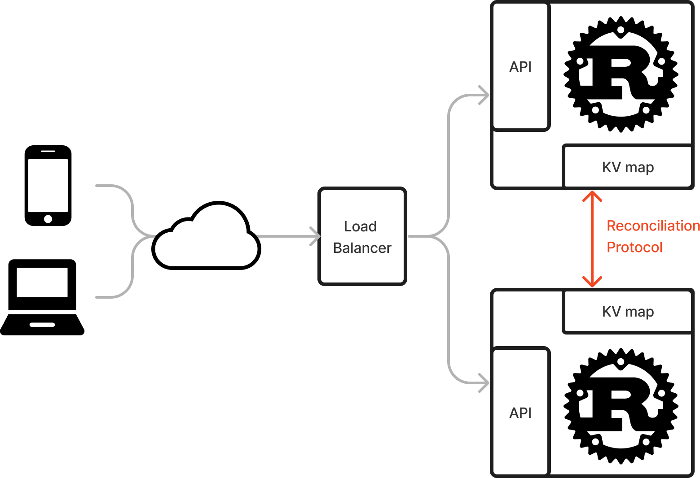
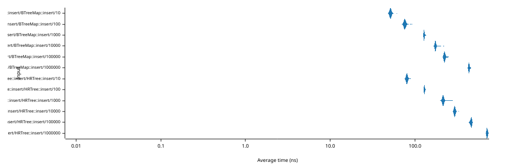
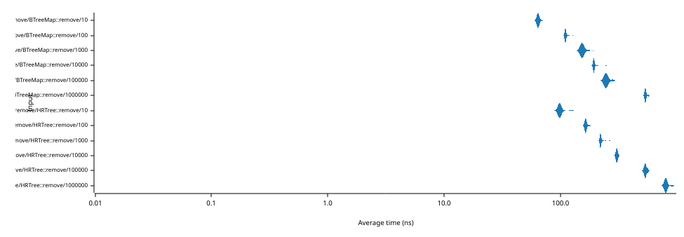
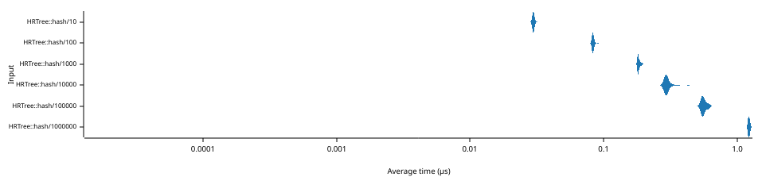
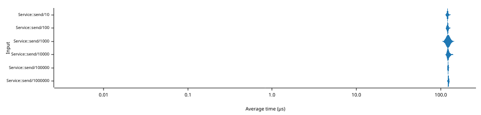

# reconcile-rs

[![Crates.io][crates-badge]][crates-url]
[![MIT licensed][mit-badge]][mit-url]
[![Apache licensed][apache-badge]][apache-url]
[![Build Status][actions-badge]][actions-url]

[crates-badge]: https://img.shields.io/crates/v/reconcile.svg
[crates-url]: https://crates.io/crates/reconcile
[mit-badge]: https://img.shields.io/badge/license-MIT-blue.svg
[mit-url]: https://github.com/Akvize/reconcile-rs/blob/master/LICENSE-MIT
[apache-badge]: https://img.shields.io/badge/license-APACHE-blue.svg
[apache-url]: https://github.com/Akvize/reconcile-rs/blob/master/LICENSE-APACHE
[actions-badge]: https://github.com/Akvize/reconcile-rs/actions/workflows/master.yml/badge.svg
[actions-url]: https://github.com/Akvize/reconcile-rs/actions/workflows/master.yml

[Docs](https://docs.rs/reconcile/latest/reconcile/)

This crate provides a key-data map structure `HRTree` that can be used together
with the reconciliation `Service`. Different instances can talk together over
UDP to efficiently reconcile their differences.

All the data is available locally on all instances, and the user can be
notified of changes to the collection with an insertion hook.

The protocol allows finding a difference over millions of elements with a limited
number of round-trips. It should also work well to populate an instance from
scratch from other instances.

The intended use case is a scalable Web service with a non-persistent and
eventually consistent key-value store. The design enable high performance by
avoiding any latency related to using an external service such as Redis.



In code, this would look like this:

```rust
let tree = HRTree::new();
let mut service = Service::new(tree, port, listen_addr, peer_net).await;
tokio::spawn(service.clone().run());
// use the reconciliation service as a key-value store in the API
```

## HRTree

The core of the protocol is made possible by the `HRTree` (Hash-Range Tree) data structure, which
allows `O(log(n))` access, insertion and removal, as well as `O(log(n))`
cumulated hash range-query. The latter property enables querying
the cumulated (XORed) hash of all key-value pairs between two keys.

Although we did come we the idea independently, it exactly matches a paper
published on Arxiv in February 2023: [Range-Based Set
Reconciliation](https://arxiv.org/abs/2212.13567), by Aljoscha Meyer

Our implementation of this data structure is based on a B-Trees that we wrote
ourselves. Although we put a limited amount of effort in this, did not use
`unsafe` and have to maintain more invariants, we stay within a factor 2 of the
standard `BTreeMap` from the standard library:



The graph above shows the amount of time **in milliseconds** (ordinate, left
axis) needed to **insert N elements** (abscissa, bottom axis) in a tree
(initially empty). Note that both axes use a logarithmic scale.

The performance of our `HRTree` implementation follows closely that of
`BTreeMap`. When looking at each value of N, we see that the average throughput
of the `HRTree` is between one third and one half that of `BTreeMap`.



The graph above shows the amount of time **in nanoseconds** (abscissa, bottom
axis) needed to **insert, and then remove a single element** from a tree
containing N elements (ordinate, bottom axis). Note that both axes use a
logarithmic scale.

The most important thing to notice is that the average insertion/removal time
only grows from 62 ns to 182 ns although the size of the tree changes from 10 to
1,000,000 elements.



The graph above shows the amount of time **in microseconds** (abscissa, bottom
axis) needed to compute **1 cumulated hash** over a random range of elements in a
tree of size N (ordinate, bottom axis). Note that both axes use a logarithmic
scale.

The average time per cumulated hash grows from 30 ns to 1,200 ns as the size of
the tree changes from 10 to 1,000,000 elements.

Although there is likely still a lot of room for improvement regarding the
performance of the `HRTree`, it is quite enough for our purposes, since we
expect network delays to be orders of magnitude longer.

## Service

The service exploits the properties of `HRTree` to conduct a binary-search-like
search in the collections of the two instances. Once difference are found, the
corresponding key-value pairs are exchanged and conflicts are resolved.



The graph above shows the amount of time **in microseconds** (abscissa, bottom
axis) needed to send 1 insertion, then 1 removal** between two instances of
`Service` that contain the same N elements (ordinate, left axis). Note that
both axes use a logarithmic scale.

This benchmark is performed locally on the loop-back network interface. On a
real network, transmission delays will make this value larger.

The times are very consistent, hovering around 122 µs, showing that the
reconciliation time is entirely bounded by the local network transmission. This
is made possible by the immediate transmission of the element at
insertion/removal.
