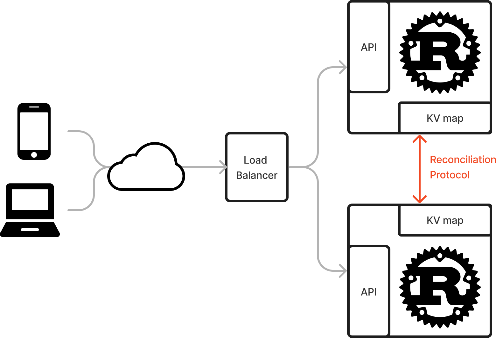
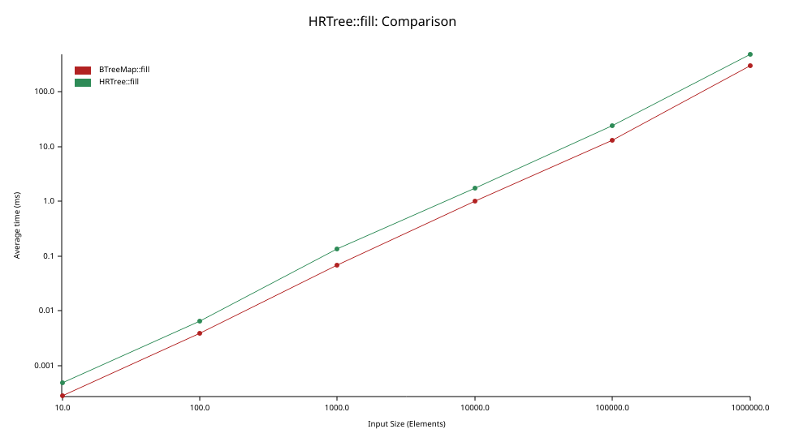
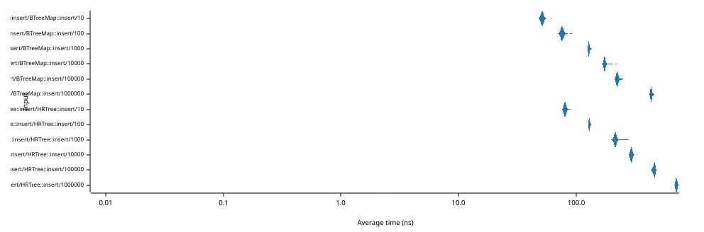
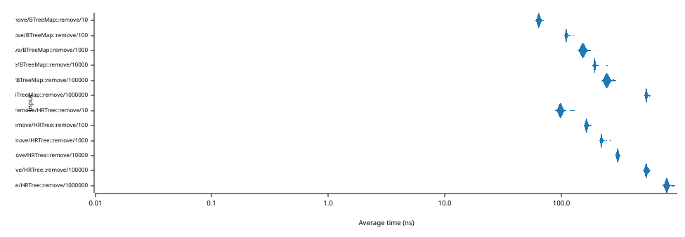
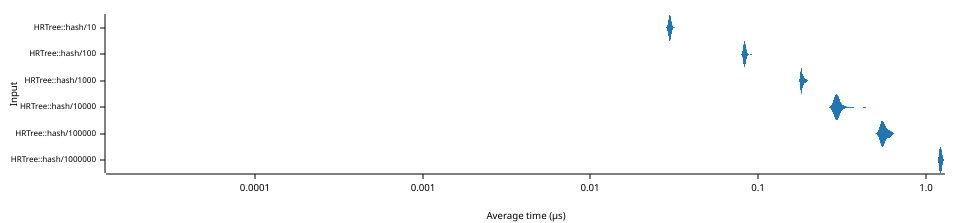
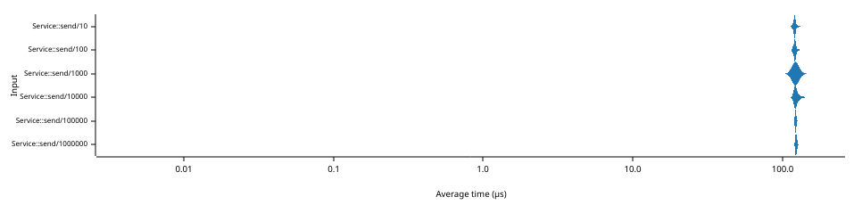
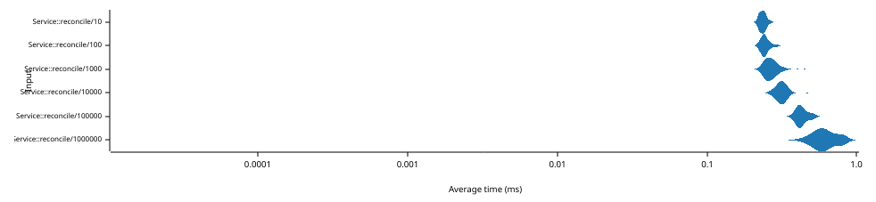

# reconcile-rs

[![Crates.io][crates-badge]][crates-url]
[![MIT licensed][mit-badge]][mit-url]
[![Apache licensed][apache-badge]][apache-url]
[![Build Status][actions-badge]][actions-url]
[![Coverage Status][codecov-badge]][codecov-url]
[![Docs Status][docs-badge]][docs-url]

[crates-badge]: https://img.shields.io/crates/v/reconcile.svg
[crates-url]: https://crates.io/crates/reconcile
[mit-badge]: https://img.shields.io/badge/license-MIT-blue.svg
[mit-url]: https://github.com/Akvize/reconcile-rs/blob/master/LICENSE-MIT
[apache-badge]: https://img.shields.io/badge/license-APACHE-blue.svg
[apache-url]: https://github.com/Akvize/reconcile-rs/blob/master/LICENSE-APACHE
[actions-badge]: https://github.com/Akvize/reconcile-rs/actions/workflows/master.yml/badge.svg
[actions-url]: https://github.com/Akvize/reconcile-rs/actions/workflows/master.yml
[codecov-badge]: https://codecov.io/gh/Akvize/reconcile-rs/branch/master/graph/badge.svg
[codecov-url]: https://codecov.io/gh/Akvize/reconcile-rs
[docs-badge]: https://docs.rs/reconcile/badge.svg
[docs-url]: https://docs.rs/reconcile/latest/reconcile/

This crate provides a key-data map structure `HRTree` that can be used together
with the reconciliation `ReconcileStore`. Different instances can talk together over
UDP to efficiently reconcile their differences.

All the data is available locally on all instances, and the user can be
notified of changes to the collection with an insertion hook.

The protocol allows finding a difference over millions of elements with a limited
number of round-trips. It should also work well to populate an instance from
scratch from other instances.

The intended use case is a scalable Web service with an in-memory, eventually
consistent key-value store. The design enable high performance by avoiding any
latency related to using an external store such as Redis. Durability is
optional and pluggable — see [Persistence](#persistence) — so a node can
recover its state (including tombstones) across a restart instead of rejoining
the cluster as an empty replica.



In code, this would look like this:

```rust,ignore
let mut store = ReconcileStore::new(Config::default()).await.unwrap();
tokio::spawn(store.clone().run());
// use the reconciliation store as a key-value store in the API
```

## When to use this

`reconcile-rs` is an **embedded, in-memory, eventually-consistent replicated map** — in data-grid
terms, the masterless / AP / gossip corner of an in-memory data grid (the niche of Hazelcast's
*Replicated Map* or Pekko *Distributed Data*, with no mature Rust equivalent). Every instance keeps
the whole dataset in memory and serves reads locally (no network hop); writes propagate
asynchronously and merge last-write-wins.

**Good fit**
- read-heavy access that must be fast and local — no per-read round-trip to Redis/etcd;
- a working set that fits in RAM on every node (full replication = redundancy, not sharding);
- eventual consistency / last-write-wins is acceptable, and same-key write conflicts are rare;
- no separate datastore to operate, and the cluster must keep serving across network partitions.

**Wrong tool for**
- counters, quotas or rate-limits — LWW overwrites, it does not sum;
- ledgers or anything needing strong consistency or transactions;
- datasets larger than a single node's RAM — it is fully replicated, not partitioned;
- collaborative text editing — use a sequence CRDT (Yjs/Automerge-style) instead.

Because every replica holds everything, memory use and write fan-out grow with the dataset and the
node count; see [`SOTA.md`](SOTA.md) for the detailed positioning and the issue tracker for current
performance limitations.

## Documentation

- [`PROGRESS.md`](PROGRESS.md) — the living status of the project: which review findings are fixed
  vs. open, a maturity checklist, and the roadmap. **Start here for "where things stand".**
- [`ARCHITECTURE.md`](ARCHITECTURE.md) — the current architecture and the target (hexagonal
  ports & adapters) the codebase is being refactored toward.
- [`SOTA.md`](SOTA.md) — state-of-the-art positioning, competitor audit, glossary and bibliography.
  Durable background; carries no status — see `PROGRESS.md` for the current state of each finding.

## Security model

> **By default, the UDP reconciliation protocol is _unauthenticated_.** Any host that can send a
> UDP datagram to the port can forge an update — including one with a year-9999 timestamp that
> wins against every legitimate write forever, or a forged tombstone that deletes a key — and the
> poison propagates to the whole cluster through last-write-wins. UDP source addresses are
> spoofable, so this is anonymous.

To close this vector, provide a shared 32-byte cluster secret on **every** node:

```rust,ignore
let key: [u8; 32] = /* same secret on all nodes, e.g. loaded from your secret manager */;
let config = Config::default().with_cluster_key(key);
let store = ReconcileStore::new(config).await.unwrap();
```

With a key set, every outgoing datagram is framed with a per-datagram keyed MAC over its payload,
and every incoming datagram is **verified before deserialization**; datagrams with a missing or
invalid tag are silently dropped. When no key is set, the store logs a loud warning at startup and
runs unauthenticated.

The MAC primitive is selected at build time via Cargo features: `mac-blake3` (default, keyed
BLAKE3) or `mac-hmac` (HMAC-SHA256). All nodes in a cluster must share the identical key **and** be
built with the same backend. The optional `zeroize` feature wipes the cluster key from memory when
it is dropped (defense in depth).

### Confidentiality (encryption)

By default the keyed mode authenticates a **plaintext** payload. With the `encryption` Cargo
feature, `Config::with_encryption()` upgrades it to authenticated **encryption**: each datagram is
framed as `nonce || ciphertext || tag` with [XChaCha20-Poly1305] over the same 32-byte cluster key,
and is decrypted-and-verified before deserialization.

```rust,ignore
// requires the `encryption` feature
let config = Config::default().with_cluster_key(key).with_encryption();
```

This reuses the cluster key as the AEAD key (so `with_cluster_key` is still required, and all nodes
must enable encryption together), draws a fresh random 192-bit nonce per datagram, and adds 40 bytes
of overhead (24-byte nonce + 16-byte tag).

**Scope.** The MAC mode provides message integrity and authenticity; the `encryption` mode adds
confidentiality on top. Neither provides replay protection (replaying a captured datagram is benign
for idempotent last-write-wins reconciliation) or a peer allow-list, and the trust model stays a
single shared secret — there is no per-peer identity or forward secrecy. Mutual peer authentication
and forward secrecy would require a handshake (TLS/Noise), which is intentionally out of scope; if
you need them, run the protocol over a trusted/encrypted underlay.

[XChaCha20-Poly1305]: https://docs.rs/chacha20poly1305

## Persistence

By default a `ReconcileStore` is held purely in memory: a process restart loses the entire dataset,
**including tombstones**. Losing tombstones is not just a durability problem — it is a correctness
hazard. A node that restarts empty behaves like a brand-new replica, re-learns already-deleted
values from peers, and can resurrect them (the tombstone-resurrection problem of issue #109).

Every store therefore always owns a persistence backend (the `Persistence` trait is mandatory).
What varies is *which* backend is plugged in:

- `InMemoryPersistence` (the default) keeps the latest snapshot in RAM and loses it on restart —
  i.e. the historical behaviour.
- `FileSnapshot` durably stores a single atomically-written snapshot on disk.

Plug in a durable backend between `new()` and `run()`. The previous state — live values,
tombstones, and the issue-#109 causal-stability bookkeeping (membership and per-tombstone
acknowledgments) — is reloaded **before** the node rejoins the gossip protocol, so a restart does
not look like a fresh, empty replica:

```rust,no_run
use std::sync::Arc;
use reconcile::{reconcile_store::Config, FileSnapshot, LoadError, ReconcileStore};

async fn start() -> Result<(), Box<dyn std::error::Error>> {
    let store = ReconcileStore::<String, String>::new(Config::default())
        .await?
        .with_persistence(Arc::new(FileSnapshot::new("/var/lib/myapp/reconcile.snapshot")));

    let store = match store {
        Ok(s) => s,
        Err(LoadError::Corrupt(msg)) => {
            // The snapshot file exists but could not be decoded.
            // Do NOT silently start empty: that drops tombstones and enables resurrection
            // of previously deleted values. Alert an operator and halt; if data loss is
            // acceptable, delete the snapshot file and restart.
            return Err(format!("snapshot corrupt, operator action required: {msg}").into());
        }
        Err(LoadError::Io(err)) => {
            // Transient I/O failure (e.g. volume still mounting). Retry after a short
            // delay rather than discarding durable state.
            return Err(format!("transient I/O error loading snapshot, retry later: {err}").into());
        }
    };

    tokio::spawn(store.clone().run()); // periodically snapshots in the background
    Ok(())
}
```

The backend is pluggable: implement the `Persistence` trait to store snapshots in `redb`, `sled`,
S3, or any other medium.

## Observability

The crate is instrumented with [`tracing`](https://docs.rs/tracing): the network engine, the
reconciliation rounds, and the message send/receive paths emit spans and events. As with any
library, `reconcile-rs` does **not** install a subscriber itself — your application does, e.g.
`tracing_subscriber::fmt().init()` (see `examples/demo.rs`).

Runtime metrics (throughput, latency, and failure counts) are emitted through the
[`metrics`](https://docs.rs/metrics) facade, gated behind opt-in features so the default build
stays lean:

- `metrics` — emit counters and histograms (`reconcile_inserts_total`,
  `reconcile_updates_received_total`, `reconcile_bytes_sent_total`, `reconcile_send_failures_total`,
  `reconcile_datagrams_dropped_total`, `reconcile_round_duration_seconds`, …). When this feature is
  off, every metric call site compiles to a no-op.
- `metrics-prometheus` — additionally provides `reconcile::prometheus` to install a Prometheus
  recorder and either serve a `/metrics` endpoint or render the exposition text yourself:

```rust,ignore
# async fn run() -> Result<(), Box<dyn std::error::Error>> {
// Serve a /metrics HTTP endpoint (requires a Tokio runtime):
reconcile::prometheus::serve("0.0.0.0:9000".parse()?).await?;

// ...or install the recorder and render the text yourself through your own HTTP server:
let handle = reconcile::prometheus::install_recorder()?;
let body: String = handle.render();
# let _ = body;
# Ok(())
# }
```

Enable with `cargo build --features metrics-prometheus` (or list `metrics`/`metrics-prometheus`
in your dependency's `features`).

## Operational tuning

### Gossip socket buffers

The gossip UDP socket requests a multi-MiB send/receive buffer by default (8 MiB; see
`Config::recv_buffer_size` / `send_buffer_size`). The stock OS default holds only a handful of
full-size datagrams, so a bulk or cold-sync burst can overrun the kernel **receive** buffer and the
excess is dropped *inside the kernel*, before the application sees it.

The kernel clamps the request to its maximum, so the default helps only as far as the OS allows. On
Linux, raise the ceiling (and persist it in `/etc/sysctl.d/`) to let the buffer grow:

```sh
sysctl -w net.core.rmem_max=8388608   # 8 MiB; match Config::recv_buffer_size
sysctl -w net.core.wmem_max=8388608
```

To check whether the kernel is dropping datagrams at the socket buffer, watch the `RcvbufErrors`
counter (it should stay flat):

```sh
grep -A1 '^Udp:' /proc/net/snmp        # the RcvbufErrors column
```

Set either field to `None` to leave the inherited OS default untouched.

## Read-only mirror (`ReconcileMirror`)

For fleets with many *passive read replicas*, the per-value `Timestamp` a dated `ReconcileStore`
keeps (for last-write-wins and the issue-#109 tombstone machinery) is pure overhead — a replica that
only consumes values never needs it. `ReconcileMirror` is a **dateless, read-only mirror** that
stores only the value (`ValueOnly<V>`, ~24 bytes lighter per entry for a small payload) and still
converges with a dated cluster over the **same range-diff protocol, on the same UDP port**.

It stays issue-#109-safe: rather than replacing the timestamped reconciliation hash everywhere (which
would break tombstone causal stability and block GC forever), each dated node maintains an *additional
value-only projection* of its data and answers a mirror's value-only diff against that projection. A
mirror keeps no tombstone bookkeeping, never acknowledges tombstones, and is never counted as a
causal-stability member, so it cannot hold back a dated node's garbage collection.

```rust,ignore
use reconcile::{reconcile_store::Config, ReconcileMirror};

// Mirrors a dated cluster reachable at `dated_addr` on the same port.
let mirror = ReconcileMirror::<String, String>::new(Config::default())
    .await
    .unwrap()
    .with_seed(dated_addr);
tokio::spawn(mirror.clone().run());
// `mirror.get(&key)` reflects the cluster's current values; deletions appear as `None`.
```

A mirror **always integrates** inbound updates and **never sends authoritative values** — it is a
sink, not a source. The dated↔dated path (and its wire format) is byte-for-byte unchanged.

## Multiple geographical locations

A single cluster can span several geographical locations (issue #53). Each location is **just an
address range** — a network (CIDR) that groups co-located nodes. Size it to your topology: a whole
cloud region, an availability zone, or a single subnet. The model is intentionally flat (one CIDR
per location, no rack/host level and no hierarchy), because the CIDR mask already lets you pick the
granularity. Declare every network with `with_net` — **including this node's own**:

```rust,ignore
use reconcile::{reconcile_store::Config, ReconcileStore};

let config = Config::default()
    .with_listen_addr("10.1.0.7".parse().unwrap())
    .with_net("10.1.0.0/16".parse().unwrap())  // this node's network (contains listen_addr)
    .with_net("10.2.0.0/16".parse().unwrap())  // another location
    .with_net("10.3.0.0/16".parse().unwrap()); // and another
let store = ReconcileStore::<String, String>::new(config).await.unwrap();
```

This node's **local** network is whichever declared net contains its `listen_addr`; all others are
**remote**. (If none contains it, the node logs a loud warning and treats only itself as local, so
every peer is remote.) The gossip is **geography-aware and decentralized** — there are no
relay/gateway nodes to configure or fail over:

- **Discovery** probes one random address in *every* network each round, so peers in all locations
  are auto-discovered (not just within a single flat CIDR).
- **Anti-entropy** sends the full range-diff comparison to *local-network* peers every round (fast
  intra-network convergence, as before) but to *remote* peers only every `remote_interval` rounds and
  to at most `remote_fanout` peers per network — bounding WAN traffic. Tune both with
  `with_remote_interval` / `with_remote_fanout`. Crucially, **repair is decoupled from net
  membership**: a peer learned by actual contact is always reconciled — peers matching no declared
  network fall into an `unclassified` bucket that is repaired on the same throttled cadence — so the
  declared topology only steers *discovery* and the local/remote split, never a peer's eligibility for
  repair.

A peer's network is derived purely from its IP address (`IpNet::contains`), so **the wire format is
unchanged** and a single-network cluster (no extra `with_net`) behaves exactly as before. Live writes
still propagate immediately to all known peers; only the periodic anti-entropy is throttled across
networks. Cross-network tombstone GC is correspondingly slower but remains strictly correct (it never
collects a tombstone before *every* member has acknowledged it).

### Runtime reconfiguration

The topology and gossip knobs can be retuned **live**, without recreating the node (which would
re-bind the socket and lose its identity) — useful for elastic deployments: opening a new region,
decommissioning one, or retuning WAN traffic on the fly. These `&self` methods on `ReconcileStore`
take effect on the running `run()` loop:

```rust,ignore
store.add_net("10.4.0.0/16".parse().unwrap()); // start gossiping with a new location
store.remove_net("10.3.0.0/16".parse().unwrap()); // stop probing a retired one
store.set_nets(&nets);                          // replace the whole topology at once
store.set_remote_interval(3);                   // retune cross-network cadence
store.set_remote_fanout(4);                     //   and fan-out
store.set_reconcile_interval(Duration::from_millis(500)); // retune the gossip cadence
store.set_tombstone_timeout(Duration::from_secs(120));    // retune tombstone expiry
```

The **local network is re-derived automatically** from the declared nets and the listen address on
every change, so it can never drift out of sync. Topology is per-node and **coordination-free** (no
cluster-wide agreement, no wire tag), and changing it is **safe by construction**: because repair is
decoupled from net membership (above), reshaping the topology can never orphan a known peer from
anti-entropy — the worst case is suboptimal WAN traffic, never silent divergence. Note that nets are
*not* a security boundary (authentication is the cluster key); a declared net only tells the node
which address range to send discovery probes into, so **only declare ranges you operate**. When
migrating a region, prefer `add_net(new)` *before* `remove_net(old)` so discovery keeps the cluster
well-connected throughout. `ReconcileMirror` exposes the analogous `set_net`.

## Kubernetes (DNS-based discovery)

The default discovery — probing random addresses in the declared networks — does not fit
Kubernetes, where pod IPs are ephemeral and drawn from a large cluster CIDR, so a random probe
almost never lands on a live pod. Instead, point the store at a **headless `Service`**
(`clusterIP: None`): its DNS name resolves to one address record per ready pod, giving every peer in
a single lookup — the canonical StatefulSet pattern, with **no Kubernetes API access and no RBAC**.

```rust,ignore
use reconcile::{reconcile_store::Config, ReconcileStore};

let config = Config::default()
    .with_listen_addr(pod_ip)         // bind to the pod IP (downward API: status.podIP)
    .with_node_id(node_id);           // stable id derived from the pod name
// Note: no `with_net` — discovery is purely DNS-driven in Kubernetes.
let store = ReconcileStore::<String, String>::new(config)
    .await
    .unwrap()
    .with_dns_discovery("reconcile-headless.default.svc.cluster.local", 8080);
store.run().await;
```

While `run()`ning, a background task resolves the name every `with_discovery_interval` (default
5 s) and seeds every returned address as a known peer. A peer's *membership* (which gates tombstone
garbage collection) is **never** granted by DNS — it is still earned through a genuine authenticated
datagram — so an unverified or spoofable address can never block GC. When a pod is deleted it
disappears from DNS; after `with_discovery_miss_threshold` consecutive successful rounds with the
peer absent (default 3, i.e. ~15 s), it is **decommissioned** so its tombstones stop gating GC. A
transient DNS failure is skipped entirely and never counts as a miss, so a resolver blip cannot
decommission a healthy peer. This works alongside the geography-aware gossip above: declared
networks (if any) still steer the engine's own probing and the local/remote throttle, while DNS
feeds exact peer IPs into the always-reconciled set.

This discovery feeds peers regardless of declared topology, so a discovered peer is always
reconciled even with no `with_net`.

Set the cluster key (`Config::with_cluster_key`, from a Kubernetes `Secret`) on every pod: without
it the cluster runs **unauthenticated** (see the Security model above). A complete, turnkey
Kubernetes example — the env-driven node (`examples/k8s/main.rs`, run with `cargo run --example
k8s`), the manifests (headless `Service`, `StatefulSet`, `ConfigMap`, example `Secret`), the
`Dockerfile`, and a local [kind](https://kind.sigs.k8s.io/) playground — lives under
[`examples/k8s/`](examples/k8s/). It is example/deployment scaffolding only and is excluded from
the published crate.

## HRTree

The core of the protocol is made possible by the `HRTree` (Hash-Range Tree) data structure, which
allows `O(log(n))` access, insertion and removal, as well as `O(log(n))`
cumulated hash range-query. The latter property enables querying
the cumulated fingerprint of all key-value pairs between two keys. The fingerprint is a
256-bit BLAKE3-per-element hash combined by addition modulo 2²⁵⁶ — a stable, portable wire
token, chosen over a 64-bit XOR for collision resistance and cross-version interoperability
(see `src/fingerprint.rs`).

Although we did come we the idea independently, it exactly matches a paper
published on Arxiv in February 2023: [Range-Based Set
Reconciliation](https://arxiv.org/abs/2212.13567), by Aljoscha Meyer

Our implementation of this data structure is based on a B-Trees that we wrote
ourselves. Although we put a limited amount of effort in this
and have to maintain more invariants, we stay within a factor 2 of the
standard `BTreeMap` from the standard library:



The graph above shows the amount of time **in milliseconds** (ordinate, left
axis) needed to **insert N elements** (abscissa, bottom axis) in a tree
(initially empty). Note that both axes use a logarithmic scale.

The performance of our `HRTree` implementation follows closely that of
`BTreeMap`. When looking at each value of N, we see that the average throughput
of the `HRTree` is between one third and one half that of `BTreeMap`.



The graph above shows the amount of time **in nanoseconds** (abscissa, bottom
axis) needed to **insert a single element** (and remove it) in a tree
containing N elements (ordinate, bottom axis). Note that both axes use a
logarithmic scale.

The most important thing to notice is that the average insertion/removal time
only grows from 80 ns to 700 s although the size of the tree changes from 10 to
1,000,000 elements.



The graph above shows the amount of time **in nanoseconds** (abscissa, bottom
axis) needed to **remove a single element** (and restore it) from a tree
containing N elements (ordinate, bottom axis). Note that both axes use a
logarithmic scale.

The most important thing to notice is that the average removal/insertion time
only grows from 100 ns to 800 s although the size of the tree changes from 10 to
1,000,000 elements.



The graph above shows the amount of time **in microseconds** (abscissa, bottom
axis) needed to compute **1 cumulated hash** over a random range of elements in a
tree of size N (ordinate, bottom axis). Note that both axes use a logarithmic
scale.

The average time per cumulated hash grows from 30 ns to 1,200 ns as the size of
the tree changes from 10 to 1,000,000 elements.

Although there is likely still a lot of room for improvement regarding the
performance of the `HRTree`, it is quite enough for our purposes, since we
expect network delays to be orders of magnitude longer.

## ReconcileStore

The ReconcileStore exploits the properties of `HRTree` to conduct a binary-search-like
search in the collections of the two instances. Once difference are found, the
corresponding key-value pairs are exchanged and conflicts are resolved.

## Conflict resolution

Conflicts are resolved with last-write-wins (LWW), but keyed on a **Hybrid Logical Clock**
(HLC, after Kulkarni et al. 2014) rather than a raw wall clock. Each value carries a `Timestamp`
(the HLC stamp), and the winner is the one with the greater timestamp under the **total
order** `(wall_ms, counter, node_id)`.

This matters for correctness. A naive physical-clock LWW is unsafe on two counts:

* under clock skew, a node whose clock runs ahead always wins, **silently losing**
  causally-newer writes from other nodes;
* on *equal* timestamps a non-commutative tie-break lets two replicas each keep their own
  value forever. Because the timestamp is part of the reconciliation hash, their
  fingerprints never match and the protocol re-exchanges the pair eternally — **permanent
  divergence and reconciliation livelock**.

The HLC fixes both. On receiving a peer's value, a node advances its own clock past the
remote timestamp, so a later local write is ordered strictly after everything it has seen
(no lost update under bounded skew). The `node_id` makes the order total and deterministic,
so every replica picks the *same* survivor — the merge is commutative, associative and
idempotent, i.e. genuine Strong Eventual Consistency.

Each node uses a random `node_id` by default; set an explicit one with
`Config::with_node_id` for a stable, reproducible ordering (e.g. in tests). Each node in a
cluster must use a distinct id.

LWW still discards one of two *genuinely concurrent* writes by design; recovering both would
require version vectors or a CRDT, which is out of scope.



The graph above shows the amount of time **in microseconds** (abscissa, bottom
axis) needed to send 1 insertion, then 1 removal** between two instances of
`ReconcileStore` that contain the same N elements (ordinate, left axis). Note that
both axes use a logarithmic scale.

The times are very consistent, hovering around 122 µs, showing that the
reconciliation time is entirely bounded by the local network transmission. This
is made possible by the immediate transmission of the element at
insertion/removal.



The graph above shows the amount of time **in milliseconds** (abscissa, bottom
axis) needed to reconcile 1 insertion, then 1 removal** between two instances of
`ReconcileStore` that contain the same other N elements (ordinate, left axis). Note that
both axes use a logarithmic scale.

This time, the full reconciliation protocol must be run to identify the
difference. The times grow from 240 µs to 640 µs as the size of the collection
changes from 10 to 1,000,000 elements.

**Note:** These benchmarks are performed locally on the loop-back network
interface. On a real network, transmission delays will make the values larger.

## Testing and coverage

The crate is covered by unit, integration, property-based and documentation
tests. Run the whole suite with:

```sh
cargo test --all          # unit + integration + doc tests
cargo test --doc          # documentation examples only
```

Code coverage is measured on every CI run with
[`cargo-llvm-cov`](https://github.com/taiki-e/cargo-llvm-cov) and reported to
[Codecov](https://codecov.io/gh/Akvize/reconcile-rs) (see the coverage badge at
the top). To reproduce the coverage report locally:

```sh
cargo install cargo-llvm-cov
cargo llvm-cov --workspace            # text summary in the terminal
cargo llvm-cov --workspace --html     # browsable HTML report under target/llvm-cov/html
```

Coverage is collected with the crate's default features. The `mac-blake3` and
`mac-hmac` backends are mutually exclusive, so do **not** pass `--all-features`.
