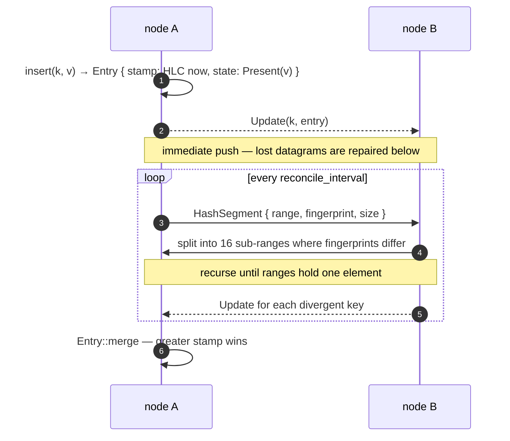
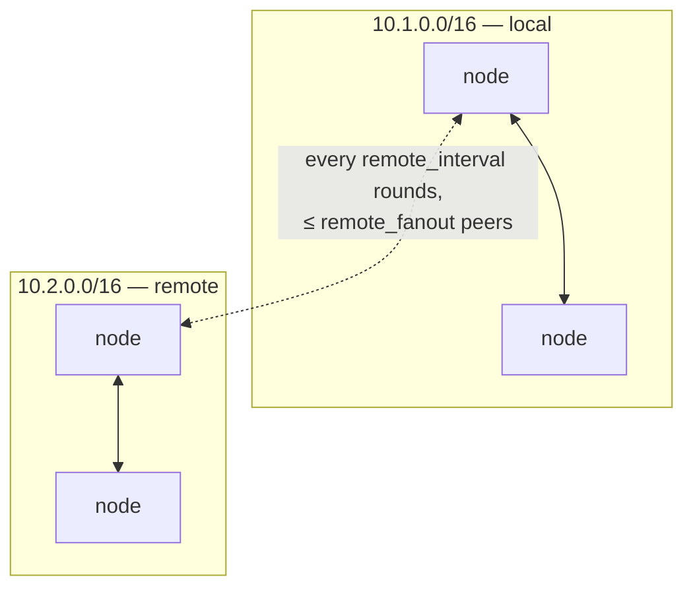
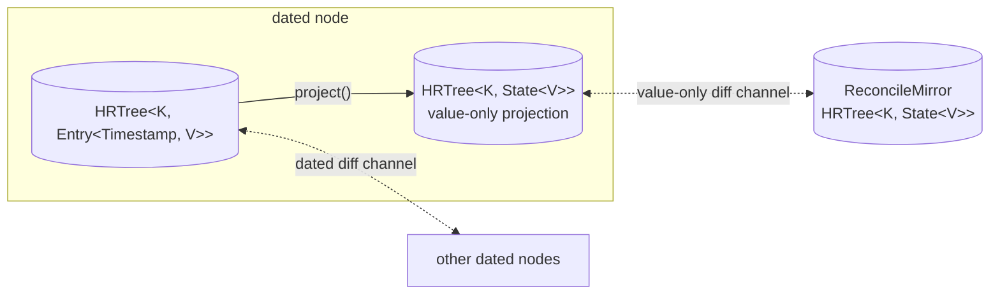

# reconcile-rs

[![Crates.io][crates-badge]][crates-url]
[![MIT licensed][mit-badge]][mit-url]
[![Apache licensed][apache-badge]][apache-url]
[![Build Status][actions-badge]][actions-url]
[![Coverage Status][codecov-badge]][codecov-url]
[![Docs Status][docs-badge]][docs-url]

[crates-badge]: https://img.shields.io/crates/v/reconcile.svg
[crates-url]: https://crates.io/crates/reconcile
[mit-badge]: https://img.shields.io/badge/license-MIT-blue.svg
[mit-url]: https://github.com/Akvize/reconcile-rs/blob/main/LICENSE-MIT
[apache-badge]: https://img.shields.io/badge/license-APACHE-blue.svg
[apache-url]: https://github.com/Akvize/reconcile-rs/blob/main/LICENSE-APACHE
[actions-badge]: https://github.com/Akvize/reconcile-rs/actions/workflows/main.yml/badge.svg
[actions-url]: https://github.com/Akvize/reconcile-rs/actions/workflows/main.yml
[codecov-badge]: https://codecov.io/gh/Akvize/reconcile-rs/branch/main/graph/badge.svg
[codecov-url]: https://codecov.io/gh/Akvize/reconcile-rs
[docs-badge]: https://docs.rs/reconcile/badge.svg
[docs-url]: https://docs.rs/reconcile/latest/reconcile/

An **embedded, in-memory, eventually-consistent replicated map**. Every node holds the whole dataset
and serves reads in-process; writes propagate over UDP and converge by
[range-based set reconciliation](https://arxiv.org/abs/2212.13567) (Meyer, SRDS 2023).


```rust,ignore
let store = ReconcileStore::<String, String>::new(Config::default()).await?;
tokio::spawn(store.clone().run());   // gossip + anti-entropy in the background
store.insert(key, value);            // local write, pushed immediately, reconciled periodically
let hit = store.get(&key);           // in-process read, no network hop
```

## At a glance

| Property | Value |
|---|---|
| Replication | full (every node holds everything) — redundancy, not sharding |
| Consistency | [strong eventual](GLOSSARY.md#5-consistency), last-write-wins over a [Hybrid Logical Clock](https://cse.buffalo.edu/tech-reports/2014-04.pdf) |
| Reads | local, `O(log n)`, no network hop, no deserialization |
| Reconciliation | RBSR: `O(d log n)` bytes, `⌈log₁₆ n⌉` sequential round trips |
| Deletion | tombstones, collected once [causally stable](GLOSSARY.md#3-the-protocol) |
| Transport | UDP datagrams, optional per-datagram MAC and AEAD |
| Durability | pluggable (`Persistence`), in-memory by default |
| MSRV | 1.85 — a bump is a *minor* version increment |

| Good fit | Wrong tool |
|---|---|
| read-heavy access that must be fast and local | counters, quotas, rate limits — LWW overwrites, it does not sum |
| a working set that fits in RAM on every node | datasets beyond one node's RAM ([D7](ARCHITECTURE.md#d7--larger-than-ram-datasets-are-permanently-out-of-scope)) |
| rare or benign same-key write conflicts | ledgers, transactions, strong consistency |
| no separate datastore to operate | collaborative text editing — use a sequence CRDT |
| must keep serving across partitions | high same-key write contention |

Memory and write fan-out grow with the dataset *and* the node count. [`SOTA.md`](SOTA.md) §1.1–1.2
has the ceiling, §1.6 the data-grid positioning.

## How a write converges


```mermaid
sequenceDiagram
  autonumber
  participant A as node A
  participant B as node B
  A->>A: insert(k, v) → Entry { stamp: HLC now, state: Present(v) }
  A-->>B: Update(k, entry)
  Note over A,B: immediate push — lost datagrams are repaired below
  loop every reconcile_interval
    A->>B: HashSegment { range, fingerprint, size }
    B->>A: split into 16 sub-ranges where fingerprints differ
    Note over A,B: recurse until ranges hold one element
    B-->>A: Update for each divergent key
  end
  A->>A: Entry::merge — greater stamp wins
```

Equality and emptiness are decided on the range **size**, never on the fingerprint. A non-empty
range can legitimately fingerprint to zero, so comparing hashes alone would silently lose data
([invariant 3](ARCHITECTURE.md#5-invariants)).

## Documentation map

| Document | Contents |
|---|---|
| [`CONTRACT.md`](CONTRACT.md) | What the crate promises, what it asks of you, what it may change. **Normative.** |
| [`PROGRESS.md`](PROGRESS.md) | Living status: findings, maturity checklist, roadmap. |
| [`ARCHITECTURE.md`](ARCHITECTURE.md) | Module map, ports & adapters, invariants, decision ledger. |
| [`SOTA.md`](SOTA.md) | Field positioning, competitor audit, literature glossary, bibliography. |
| [`GLOSSARY.md`](GLOSSARY.md) | This project's own vocabulary. |
| [`CHANGELOG.md`](CHANGELOG.md) | Release notes and the 0.3.0 break policy. |
| [`CONTRIBUTING.md`](CONTRIBUTING.md) | Dev container, hooks, coverage. |
| [docs.rs](https://docs.rs/reconcile/latest/reconcile/) | API reference. |

## Security model

> [!WARNING]
> **The default is unauthenticated, and readable by anyone who can reach the port.** UDP source
> addresses are spoofable. A forged datagram can plant a year-9999 timestamp that wins forever, or a
> tombstone that deletes a key; last-write-wins then propagates it cluster-wide. Separately,
> `RandomProbe` discovery answers any host inside a configured CIDR, so a squatter eventually
> receives the **entire dataset** through the bulk diff dumps. Keyless is safe only on a fully
> trusted underlay.

```rust,ignore
let config = Config::default().with_cluster_key(key);           // 32 bytes, identical on every node
let config = Config::default().with_cluster_key(key).with_encryption();  // + confidentiality
let config = Config::default().with_insecure_no_key();          // deliberate keyless: quiets the warning
```

| Mode | Feature | Framing | Overhead | Guarantees |
|---|---|---|---|---|
| keyless (default) | — | `payload` | 0 B | none; loud startup warning |
| MAC | `mac-blake3` (default) or `mac-hmac` | `tag(hdr ‖ payload) ‖ hdr ‖ payload` | 48 B | integrity, authenticity, anti-replay |
| AEAD | `encryption` | `nonce ‖ ciphertext(hdr ‖ payload) ‖ tag`, [XChaCha20-Poly1305] | 56 B | integrity, authenticity, confidentiality, anti-replay |

`hdr` is the 16-byte per-datagram anti-replay header. Exact byte layouts and the resulting payload
budgets are in [`CONTRACT.md` §6](CONTRACT.md#6-wire).

Every node must share the key **and** be built with the same backend. Datagrams are verified
*before* deserialization ([invariant 5](ARCHITECTURE.md#5-invariants)). The optional `zeroize`
feature wipes the key on drop.

Out of scope: per-peer identity, forward secrecy, key rotation. The trust model is one shared
secret. Mutual authentication needs a handshake (TLS/Noise); run over a trusted underlay if you need
it. Replay is benign for idempotent LWW reconciliation, and is hardened separately
([#199](https://github.com/Akvize/reconcile-rs/issues/199)).

[XChaCha20-Poly1305]: https://docs.rs/chacha20poly1305

## Persistence

Losing tombstones on restart is a **correctness** hazard, not just a durability one: the node
rejoins as a fresh replica and can [resurrect](GLOSSARY.md#1-domain-types-and-values) deleted values.
So every store always owns a backend. Only the implementation varies.

| Backend | Survives restart |
|---|---|
| `InMemoryPersistence` (default) | no |
| `FileSnapshot` | yes — one atomically-written snapshot |
| your `impl Persistence` | redb, sled, S3, … |

State is reloaded **before** the node rejoins gossip: live values, tombstones, and the
causal-stability bookkeeping.

```rust,no_run
use std::sync::Arc;
use reconcile::{reconcile_store::Config, FileSnapshot, LoadError, ReconcileStore};

async fn start() -> Result<(), Box<dyn std::error::Error>> {
    let store = ReconcileStore::<String, String>::new(Config::default())
        .await?
        .with_persistence(Arc::new(FileSnapshot::new("/var/lib/myapp/reconcile.snapshot")));

    let store = match store {
        Ok(s) => s,
        // Never start empty on a corrupt snapshot: that drops tombstones and enables
        // resurrection. Alert an operator; delete the file only if data loss is acceptable.
        Err(LoadError::Corrupt(msg)) => return Err(format!("snapshot corrupt: {msg}").into()),
        // Transient (e.g. volume still mounting) — retry rather than discard durable state.
        Err(LoadError::Io(err)) => return Err(format!("retry later: {err}").into()),
    };

    tokio::spawn(store.clone().run()); // snapshots periodically in the background
    Ok(())
}
```

## Topology and discovery

A cluster spans several locations; a location is **just a CIDR**. Declare every network with
`with_net`, **including this node's own** — the local net is whichever declared net contains
`listen_addr`, and all others are remote.


```mermaid
flowchart TB
  subgraph loc1["10.1.0.0/16 — local"]
    n1["node"] <--> n2["node"]
  end
  subgraph loc2["10.2.0.0/16 — remote"]
    n3["node"] <--> n4["node"]
  end
  n1 <-. "every remote_interval rounds,<br>≤ remote_fanout peers" .-> n3
```

| Discovery adapter | Probes | Fits |
|---|---|---|
| `RandomProbe` (default) | one random address per declared net, per round | flat, stable address ranges |
| `DnsDiscovery` | a headless `Service` name, every `discovery_interval` | Kubernetes — pod IPs are ephemeral, so random probing never lands |

```rust,ignore
let config = Config::default()
    .with_listen_addr("10.1.0.7".parse()?)
    .with_net("10.1.0.0/16".parse()?)   // this node's own network
    .with_net("10.2.0.0/16".parse()?);  // another location

// …or, in Kubernetes (no with_net; bind to status.podIP, id from the pod name):
let store = ReconcileStore::<String, String>::new(config).await?
    .with_dns_discovery("reconcile-headless.default.svc.cluster.local", 8080);
```

Every knob is settable **live** on a running store, so you can open or retire a region without
re-binding the socket: `add_net`, `remove_net`, `set_nets`, `set_remote_interval`,
`set_remote_fanout`, `set_reconcile_interval`, `set_tombstone_timeout`.

Two properties make that safe by construction:

- **Repair is decoupled from net membership.** A peer learned by actual contact is always
  reconciled; peers matching no declared net land in an `unclassified` bucket, repaired on the same
  throttled cadence. Reshaping the topology cannot orphan a peer. Worst case is suboptimal WAN
  traffic, never silent divergence.
- **Discovery never grants membership.** Membership gates tombstone GC and is earned only by an
  authenticated dated datagram, so an unverified or spoofed address cannot block collection
  ([invariant 6](ARCHITECTURE.md#5-invariants)). A pod absent from DNS for
  `discovery_miss_threshold` successful rounds is decommissioned. A DNS *failure* is skipped and
  never counts as a miss.

Nets are not a security boundary. Only declare ranges you operate. A peer's net comes from its IP,
so the wire format is unchanged and a single-net cluster behaves as before. A turnkey Kubernetes
example — env-driven node, `StatefulSet`, headless `Service`, `Dockerfile`,
[kind](https://kind.sigs.k8s.io/) playground — is in [`examples/k8s/`](examples/k8s/).

## Read-only mirror

`ReconcileMirror` is a **dateless, read-only** replica: it stores `State<V>` without the per-value
`Timestamp`, converging with a dated cluster over the same protocol on the same port.


```mermaid
flowchart LR
  subgraph dated["dated node"]
    m1[("HRTree&lt;K, Entry&lt;Timestamp, V&gt;&gt;")]
    p1[("HRTree&lt;K, State&lt;V&gt;&gt;<br>value-only projection")]
    m1 -- "project()" --> p1
  end
  mir[("ReconcileMirror<br>HRTree&lt;K, State&lt;V&gt;&gt;")]
  p1 <-. "value-only diff channel" .-> mir
  m1 <-. "dated diff channel" .-> other["other dated nodes"]
```

Each dated node keeps the projection alongside its dated map, so the dated↔dated path and its wire
format are untouched. A mirror never acknowledges tombstones and is never admitted to membership, so
it cannot hold back another node's GC. It is a **sink, not a source**: it always integrates and never
sends authoritative values. That integration is a plain overwrite, so it is correct **only** under
last-write-wins ([D9](ARCHITECTURE.md#d9--reconcilemirror-is-documented-as-last-write-wins-only)).

```rust,ignore
let mirror = ReconcileMirror::<String, String>::new(Config::default()).await?.with_seed(dated_addr);
tokio::spawn(mirror.clone().run());
```

## Observability

Spans and events go through [`tracing`](https://docs.rs/tracing); install a subscriber in your
application (see `examples/demo.rs`). Metrics go through the [`metrics`](https://docs.rs/metrics)
facade behind opt-in features, compiling to no-ops when off.

| Feature | Provides |
|---|---|
| `metrics` | `reconcile_inserts_total`, `reconcile_updates_received_total`, `reconcile_bytes_sent_total`, `reconcile_send_failures_total`, `reconcile_datagrams_dropped_total`, `reconcile_round_duration_seconds`, … |
| `metrics-prometheus` | `reconcile::prometheus::serve(addr)` for a `/metrics` endpoint, or `install_recorder()` to render into your own server |

> [!CAUTION]
> `/metrics` is unauthenticated and fingerprints your deployment (dataset size, churn, peer
> activity). Bind it to `127.0.0.1` or a trusted management interface — not `0.0.0.0`, as the
> examples do for convenience.

## Operational tuning

The gossip socket asks for an 8 MiB send/receive buffer (`Config::recv_buffer_size` /
`send_buffer_size`; `None` leaves the OS default). The stock default holds only a handful of
full-size datagrams, so a cold-sync burst overruns it and the excess is dropped **inside the
kernel**, before the application sees it. The kernel clamps the request to its own ceiling, so raise
that too:

```sh
sysctl -w net.core.rmem_max=8388608   # 8 MiB; match Config::recv_buffer_size
sysctl -w net.core.wmem_max=8388608
grep -A1 '^Udp:' /proc/net/snmp       # RcvbufErrors should stay flat
```

## The data structure

`HRTree` is an ordered map that also maintains, per subtree, a **range measure**: a 256-bit
fingerprint (per-element BLAKE3, combined by addition mod 2²⁵⁶) and a subtree size. Both the
cumulative fingerprint of any key interval and `rank`/`select` are therefore `O(log n)`.

The literature calls this an **RSOS**, a Range-Summarizable Order-Statistics Store
([Amparore, arXiv:2603.19820](https://arxiv.org/html/2603.19820)); equivalently, an order-statistic
B-tree with a group-valued [measure](https://doi.org/10.1017/S0956796805005769) (Hinze & Paterson,
finger trees, JFP 2006).

It is **not** a Merkle tree. It diffs value-defined ranges, not node identity, so it needs no
history-independence and the Merkle-Search-Tree leading-zeros attack does not apply
([`SOTA.md` §2.3](SOTA.md)). The name is being retired for that reason
([D1](ARCHITECTURE.md#d1--hrtree-becomes-its-own-product-correctly-named)).

<details><summary>Benchmarks (loopback; both axes logarithmic)</summary>

| Operation | n = 10 | n = 10⁶ | Note |
|---|---|---|---|
| insert + remove one element | 80 ns | 700 ns |   |
| cumulative hash over a random range | 30 ns | 1 200 ns |  |
| fill a tree with n elements | — | ⅓–½ the throughput of `BTreeMap` |  |
| propagate one insert + one remove | ≈122 µs, flat in n | |  |
| reconcile one difference | 240 µs | 640 µs |  |

Propagation is flat in `n` because insertions are pushed immediately. Only the full diff protocol
scales with the collection. **These run on loopback**: a real network dominates every figure above
(F16 in [`PROGRESS.md`](PROGRESS.md)).

</details>

## Conflict resolution

Last-write-wins keyed on a **Hybrid Logical Clock**, not a raw wall clock: each value carries a
`Timestamp` and the greater one wins under the total order `(wall_ms, counter, node_id)`.

Physical-clock LWW is unsafe on two counts, and the HLC closes both:

| Hazard | Consequence | Fix |
|---|---|---|
| clock skew | the fastest clock always wins, silently losing causally-newer writes | on receipt, a node advances its clock past the remote stamp, so a later local write is ordered strictly after everything it has seen |
| non-commutative tie-break on equal stamps | each replica keeps its own value; fingerprints never match; the pair is re-exchanged forever — **permanent divergence and livelock** | `node_id` makes the order total, so every replica picks the same survivor |

The merge is therefore commutative, associative and idempotent: strong eventual consistency.
`node_id` is random by default; pin it with `Config::with_node_id` for reproducible ordering, and
keep it distinct per node.

LWW discards one of two genuinely concurrent writes by design. Recovering both needs version vectors
or a CRDT, which is out of scope
([D6](ARCHITECTURE.md#d6--conflict-resolution-stays-hardcoded-last-write-wins)). Background:
[Kingsbury, *The trouble with timestamps*](https://aphyr.com/posts/299-the-trouble-with-timestamps)
and [Kulkarni et al., *Hybrid Logical Clocks*](https://cse.buffalo.edu/tech-reports/2014-04.pdf).

## Testing

```sh
cargo test --all                      # unit + integration + doc tests (this README included)
cargo llvm-cov --workspace --html     # coverage, as CI measures it
```

`mac-blake3` and `mac-hmac` are mutually exclusive at build time, and `mac-blake3` wins if both are
on. CI therefore runs a separate `mac-hmac` job with `--no-default-features --features mac-hmac`,
plus `encryption`, `macos` and MSRV jobs.
