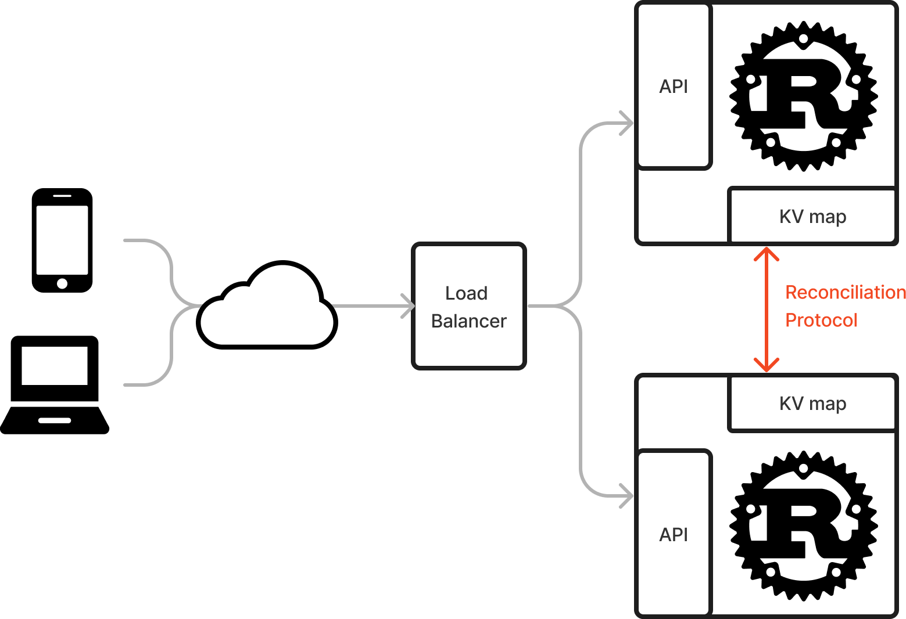
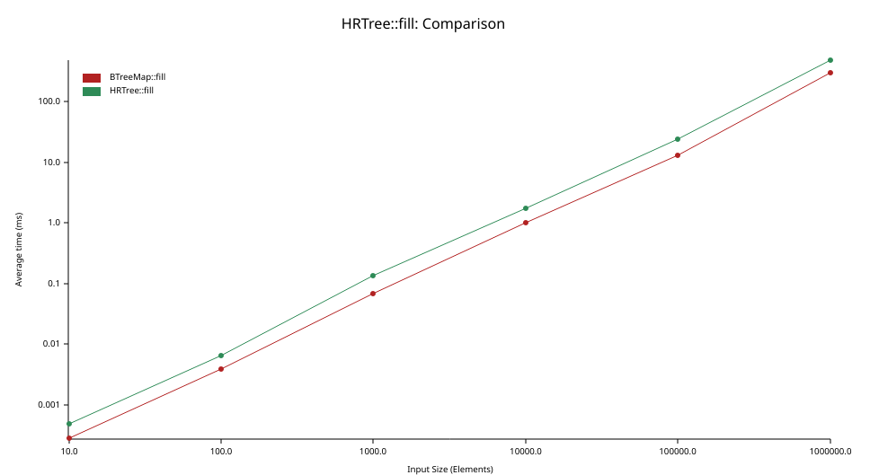
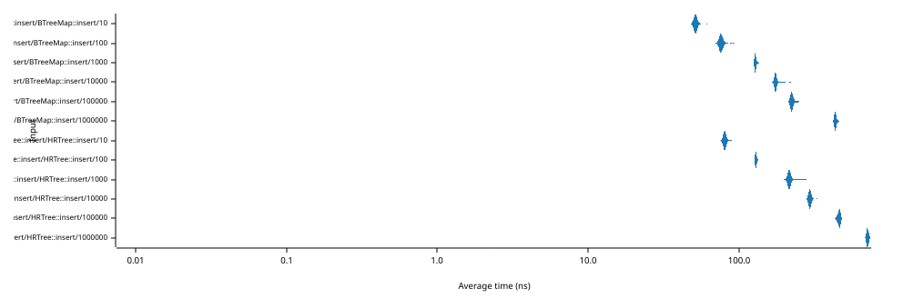
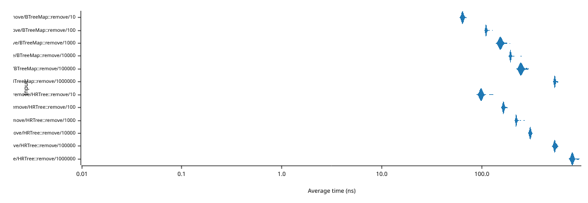
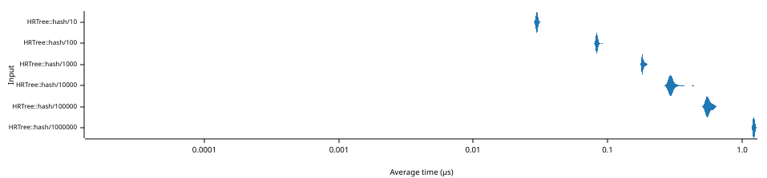
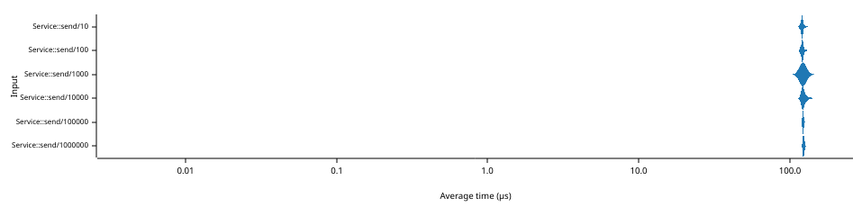
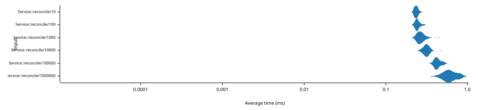

# reconcile-rs

[![Crates.io][crates-badge]][crates-url]
[![MIT licensed][mit-badge]][mit-url]
[![Apache licensed][apache-badge]][apache-url]
[![Build Status][actions-badge]][actions-url]
[![Coverage Status][codecov-badge]][codecov-url]
[![Docs Status][docs-badge]][docs-url]

[crates-badge]: https://img.shields.io/crates/v/reconcile.svg
[crates-url]: https://crates.io/crates/reconcile
[mit-badge]: https://img.shields.io/badge/license-MIT-blue.svg
[mit-url]: https://github.com/Akvize/reconcile-rs/blob/main/LICENSE-MIT
[apache-badge]: https://img.shields.io/badge/license-APACHE-blue.svg
[apache-url]: https://github.com/Akvize/reconcile-rs/blob/main/LICENSE-APACHE
[actions-badge]: https://github.com/Akvize/reconcile-rs/actions/workflows/main.yml/badge.svg
[actions-url]: https://github.com/Akvize/reconcile-rs/actions/workflows/main.yml
[codecov-badge]: https://codecov.io/gh/Akvize/reconcile-rs/branch/main/graph/badge.svg
[codecov-url]: https://codecov.io/gh/Akvize/reconcile-rs
[docs-badge]: https://docs.rs/reconcile/badge.svg
[docs-url]: https://docs.rs/reconcile/latest/reconcile/

This crate provides a key-data map structure `FingerprintTreeMap` that can be used together
with the reconciliation `ReplicatedMap`. Different instances can talk together over
UDP to efficiently reconcile their differences.

All the data is available locally on all instances, and the user can be
notified of changes to the collection with an insertion hook.

The protocol allows finding a difference over millions of elements with a limited
number of round-trips. It should also work well to populate an instance from
scratch from other instances.

The intended use case is a scalable Web service with an in-memory, eventually
consistent key-value store. The design enable high performance by avoiding any
latency related to using an external store such as Redis. Durability is
optional and pluggable — see [Persistence](#persistence) — so a node can
recover its state (including tombstones) across a restart instead of rejoining
the cluster as an empty replica.



In code, this would look like this:

```rust
let mut store = ReplicatedMap::new(Config::new(8080).with_insecure_no_key())
    .await
    .unwrap();
tokio::spawn(store.clone().run(CancellationToken::new()));
// use the reconciliation store as a key-value store in the API
```

## When to use this

`reconcile-rs` is an **embedded, in-memory, eventually-consistent replicated map** — in data-grid
terms, the masterless / AP / gossip corner of an in-memory data grid (the niche of Hazelcast's
*Replicated Map* or Pekko *Distributed Data*, with no mature Rust equivalent). Every instance keeps
the whole dataset in memory and serves reads locally (no network hop); writes propagate
asynchronously and merge last-write-wins.

**Good fit**
- read-heavy access that must be fast and local — no per-read round-trip to Redis/etcd;
- a working set that fits in RAM on every node (full replication = redundancy, not sharding);
- eventual consistency / last-write-wins is acceptable, and same-key write conflicts are rare;
- no separate datastore to operate, and the cluster must keep serving across network partitions.

**Wrong tool for**
- counters, quotas or rate-limits — LWW overwrites, it does not sum;
- ledgers or anything needing strong consistency or transactions;
- datasets larger than a single node's RAM — it is fully replicated, not partitioned;
- collaborative text editing — use a sequence CRDT (Yjs/Automerge-style) instead.

Because every replica holds everything, memory use and write fan-out grow with the dataset and the
node count; see [`SOTA.md`](SOTA.md) for the detailed positioning and the issue tracker for current
performance limitations.

## Modelling sets

The most-requested CRDT beyond LWW-Register is an add-wins set (OR-Set). The instinct is to store
the whole set as one value:

```rust
// DON'T: the whole set is one value
store.insert(set_id, my_or_set);
```

Here that is the wrong encoding, and the right one needs no new machinery — each element is its own
key. `ReplicatedSet<K>` is exactly this: a `ReplicatedMap<K, ()>` under a set-shaped API, so a call
site reads as a set operation rather than a raw `()` value peeking through:

```rust
// DO: each element is a key, in a dedicated ReplicatedSet
members.insert((set_id, element));
members.remove(&(set_id, element));
```

Because the store is an ordered map reconciled by range diff, membership-as-keys gives, for free,
what a set-as-value has to build for itself:

| property | as keys | as one value |
|---|---|---|
| diff granularity | two replicas differing by one element exchange one element | re-ships the entire set state on any divergence |
| tombstones | reuses the existing causal-stability GC (issue #109), which already prevents resurrection | needs its own separate element-tombstone GC |
| datagram ceiling | never reached — one element per datagram, regardless of set size | crosses ~65 KB as cardinality grows, then silently stops converging (issue #230) |

**Semantics.** This is last-write-wins *per element* over the HLC total order (see "Conflict
resolution" below), not textbook add-wins. The two differ only when an add and a remove of the
*same* element are genuinely concurrent — the HLC total order picks one deterministic winner instead
of biasing towards the add. For any pair of updates with a causal (happens-before) relationship, and
for concurrent updates to *different* elements, the two are indistinguishable.

**Anti-pattern.** Storing the set as one value re-ships the entire encoded set on every write, so
diff cost and per-datagram size both grow with cardinality — the failure mode documented for
sets-as-values on Riak ([arXiv:1605.06424](https://arxiv.org/abs/1605.06424)): treating a large
collection as a single opaque value defeats the underlying store's own delta-replication and GC, and
growth eventually exceeds a single message. Here that ceiling is the datagram limit (issue #230);
key-encoding avoids it structurally instead of pushing it further out.

More generally: prefer many small keys over few large composite values. The same per-element diff
granularity, tombstone reuse, and datagram-ceiling avoidance apply to any large composite (a map, a
list, a document) that would otherwise be reshipped whole on any change — not just sets. See
[`ARCHITECTURE.md`](ARCHITECTURE.md) §7 for why this is also part of why a pluggable CRDT `Resolve`
seam stays deferred.

**This is the current scope boundary, not a workaround standing in for a missing feature.** Every
set sharing the one store's tree means one anti-entropy cadence and one fingerprint for everything
in it — a `(set_id, element)` collision domain, not an isolated collection with its own fingerprint
or conflict policy. Several independently-typed named collections, each with its own policy and
anti-entropy isolation, is [#191](https://github.com/Akvize/reconcile-rs/issues/191) (parked, part
of [#193](https://github.com/Akvize/reconcile-rs/issues/193)'s future `reconcile-grid` layer) —
deliberately out of this crate's lean core, not an oversight in this encoding.

## Documentation

- The [`v1.0.0` milestone](https://github.com/Akvize/reconcile-rs/milestone/2) and
  [issue #206](https://github.com/Akvize/reconcile-rs/issues/206) — live correctness/security/release
  status. **Start here for "where things stand".**
- [`ARCHITECTURE.md`](ARCHITECTURE.md) — the crate/module map, the ports & adapters (hexagonal)
  design, domain types and their rationale, the load-bearing invariants, and (§8) the resolution
  history of the original code audit's findings.
- [`SOTA.md`](SOTA.md) — state-of-the-art positioning, competitor audit, glossary and bibliography.
  Durable background; carries no status.
- [`CHANGELOG.md`](CHANGELOG.md) — what changed release to release.
- [`MIGRATING.md`](MIGRATING.md) — upgrading from `0.2.1`, the last pre-workspace-split release.
- [`SECURITY.md`](SECURITY.md) — supported versions and how to report a vulnerability privately.

MSRV is **1.85**, declared as `rust-version` on all five manifests and checked mechanically by
`clippy::incompatible_msrv` (AGENTS.md §3).

## Security model

> **By default, the UDP reconciliation protocol is _unauthenticated_.** Any host that can send a
> UDP datagram to the port can forge an update — including one with a year-9999 timestamp that
> wins against every legitimate write forever, or a forged tombstone that deletes a key — and the
> poison propagates to the whole cluster through last-write-wins. UDP source addresses are
> spoofable, so this is anonymous.

Beyond forgery, an unauthenticated node also **discloses** its data: [`RandomProbe`], the default
discovery mechanism, answers any host inside the configured `nets`, and once discovered, a peer
receives the **entire dataset** over time via paced anti-entropy diff dumps — no forged datagram
required, just an IP inside the cluster's network. Because of this, `Config::cluster_key: None`
without also calling [`Config::with_insecure_no_key`] is refused at construction time (`Replica`/
`ReadReplicaMap` panic with a message pointing back here) rather than silently running that way; call
`with_insecure_no_key()` only when the network itself is a trusted underlay the cluster fully
controls.

Two consequences of a far-future stamp are bounded even without a key, because neither depends on
trusting the sender. The stamp cannot pin this node's Hybrid Logical Clock into the future — a
remote reading more than `MAX_CLOCK_DRIFT` (1 hour by default; retune with
`Config::with_max_clock_drift`) ahead of local physical time is clamped before
it reaches the clock state — and it cannot postpone a tombstone's expiry indefinitely, because the
wall-clock instant the expiry wheel ages a tombstone from is derived from the stored stamp through
that same bound. Both log a `warn!`, and the tombstone case also increments
`reconcile_tombstone_stamp_bounded_total` (with the `metrics` feature). The stamp itself is stored
exactly as received, so it still *wins* the last-write-wins comparison: only a cluster key stops
that.

To close this vector, provide a shared 32-byte cluster secret on **every** node:

```rust
let secret_hex: String = /* same secret on all nodes, e.g. loaded from your secret manager */;
let key = ClusterKey::from_hex(&secret_hex).expect("cluster key must be 64 hex characters");
let config = Config::new(8080).with_cluster_key(key);
let store = ReplicatedMap::new(config).await.unwrap();
```

With a key set, every outgoing datagram is framed with a per-datagram keyed MAC over its payload,
and every incoming datagram is **verified before deserialization**; datagrams with a missing or
invalid tag are silently dropped. When no key is set, the store logs a loud warning at startup and
runs unauthenticated.

The MAC primitive is selected at build time via Cargo features: `mac-blake3` (default, keyed
BLAKE3) or `mac-hmac` (HMAC-SHA256). All nodes in a cluster must share the identical key **and** be
built with the same backend. The key itself is a [`ClusterKey`], never a bare `[u8; 32]`, at every
public boundary — `Config::cluster_key`, `Config::with_cluster_key`, `Authenticator::new` — so it
cannot land in a stray unwrapped copy a caller forgot to protect.

**What the `zeroize` feature covers, precisely.** It wipes the 32 key bytes on `Drop` for every
`ClusterKey`: the one inside the running `Authenticator`, and every transient copy along the way
(`Config::cluster_key`, a `with_cluster_key(key)` argument once moved in, `ClusterKey::from_hex`'s
local buffer). `Config` is deliberately not `Clone`-and-forget `Copy` — a `Copy` type cannot carry
the `Drop` this needs, so every `ClusterKey`-holding value is wiped exactly once, when it is
actually dropped, not left as an orphaned stack copy. What it does **not** cover: the caller's own
source of the key (an env var `String`, a file's contents, a `[u8; 32]` literal before it is wrapped
in `ClusterKey::new`/`from_hex`) is the caller's to protect, and the **decrypted AEAD plaintext**
(`encryption` feature) is never zeroized in either configuration — only the key that produced it.

**Fingerprint collisions — the censorship residual.** Reconciliation compares 256-bit additive
range fingerprints. Against an *accidental* collision that width is ample; against an adversary who
can influence stored values it is not: the additive combiner is Wagner-breakable (#337), and a
successful *total plant* — a crafted value set whose fingerprint delta vanishes on every range
containing it — makes two honest replicas report convergence while genuinely differing,
permanently and silently (#354): anti-entropy replays that verdict at every meeting rather than
retrying it. Per-session boundary randomisation (#502, decision recorded in
[`ARCHITECTURE.md`](ARCHITECTURE.md) §7) defends every range below the outer one; the outer range
has no boundaries to randomise, so this residual **stands until the fingerprint lift is keyed**
(#337) — and once it is, crafting narrows to holders of the cluster key. Note the cluster key
*above* does not close this: the MAC authenticates datagrams in transit, it does not make the
fingerprint collision-resistant against a writer.

### Confidentiality (encryption)

By default the keyed mode authenticates a **plaintext** payload. With the `encryption` Cargo
feature, `Config::with_encryption()` upgrades it to authenticated **encryption**: each datagram is
framed as `nonce || ciphertext || tag` with [XChaCha20-Poly1305] over the same 32-byte cluster key,
and is decrypted-and-verified before deserialization.

```rust
// requires the `encryption` feature
let config = Config::new(8080).with_cluster_key(key).with_encryption();
```

This reuses the cluster key as the AEAD key (so `with_cluster_key` is still required, and all nodes
must enable encryption together), draws a fresh random 192-bit nonce per datagram, and adds 40 bytes
of overhead (24-byte nonce + 16-byte tag).

**Scope.** The MAC mode provides message integrity and authenticity; the `encryption` mode adds
confidentiality on top. Setting a cluster key also enables **per-sender replay protection**: every
datagram carries a monotonically increasing sequence number and a sender wall-clock stamp inside the
authenticated region, and the receiver rejects duplicates, stale out-of-window sequences, and stamps
that deviate from local physical time by more than the freshness window
([`Config::with_freshness_window`], default 5 minutes). Without a cluster key there is **no** replay
protection at all — a captured datagram can be re-injected later to re-poison membership or
re-deliver stale data.

Still out of scope in every mode: a peer allow-list, per-peer identity, and forward secrecy. The
trust model stays a single shared secret. Mutual peer authentication and forward secrecy would
require a handshake (TLS/Noise), which is intentionally out of scope; if you need them, run the
protocol over a trusted/encrypted underlay.

[XChaCha20-Poly1305]: https://docs.rs/chacha20poly1305

### Wire versioning

Every datagram carries a 1-byte wire-protocol version, inside the authenticated/encrypted region
in keyed modes — so a forged version claim is rejected the same way a forged payload is — and
present even when unauthenticated, since that is the default. There is currently **no accepted
version window**: a peer running a different `reconcile` wire version is rejected outright, with a
distinguishable, countable reason (`reconcile_datagrams_dropped_total{reason="version"}`, with the
`metrics` feature) rather than being silently misread or indistinguishable from a malformed or
forged datagram. A mixed-version cluster (a rolling upgrade, for instance) does not converge for
the pairs that disagree until every node is rebuilt against the same wire version — plan upgrades
as a coordinated rollout, not a rolling one. #309 landed the version byte itself and deliberately
did not build an accepted-version window; whether one is worth building later is undecided.

Wire tags 5 and 6 are reserved, skippable message slots (#463): a datagram carrying a message at
one of these tags decodes on this version even though nothing here sends one today, and a future
version's real message at either tag decodes here too, ignored rather than failing the whole
datagram. What this buys is narrow and does not extend past the two tags themselves — it is not a
capability-negotiation mechanism, not a version window, and not a way to add a *third* message type
without another coordinated rollout: once a tag's real shape ships, that tag's reservation is
consumed, and the wire version byte above still governs everything the message shape itself
changes.

### Metrics endpoint exposure

> **`reconcile::prometheus::serve` binds whatever address you give it — every example in this
> README, in `src/prometheus.rs`'s doc comments, and in the `examples/k8s/` manifests uses
> `0.0.0.0:9000` for concreteness, i.e. all interfaces.** The `/metrics` endpoint is not a secret —
> it carries operational metrics (peer/gossip counts, round timing, byte and datagram totals,
> failure counters), not cluster data — but binding all-interfaces exposes that operational surface
> to anything that can reach the port, same as any other unauthenticated HTTP listener. In
> production, bind to a private/internal interface (e.g. the pod IP, not `0.0.0.0`) or restrict
> reachability with a network policy / firewall rule, the same way you would for any other
> `/metrics` endpoint.

## Persistence

By default a `ReplicatedMap` is held purely in memory: a process restart loses the entire dataset,
**including tombstones**. Losing tombstones is not just a durability problem — it is a correctness
hazard. A node that restarts empty behaves like a brand-new replica, re-learns already-deleted
values from peers, and can resurrect them (the tombstone-resurrection problem of issue #109).

Every store therefore always owns a persistence backend (the `Persistence` trait is mandatory).
What varies is *which* backend is plugged in:

- `InMemoryPersistence` (the default) keeps the latest snapshot in RAM and loses it on restart —
  i.e. the historical behaviour.
- `FileSnapshot` durably stores a single atomically-written snapshot on disk.

Plug in a durable backend between `new()` and `run()`. The previous state — live values,
tombstones, and the issue-#109 causal-stability bookkeeping (membership and per-tombstone
acknowledgments) — is reloaded **before** the node rejoins the gossip protocol, so a restart does
not look like a fresh, empty replica:

```rust
use std::sync::Arc;
use reconcile::{replicated_map::Config, FileSnapshot, ReplicatedMap};

let store = ReplicatedMap::new(Config::new(8080).with_insecure_no_key())
    .await
    .unwrap()
    .with_persistence(Arc::new(FileSnapshot::new("/var/lib/myapp/reconcile.snapshot")));
tokio::spawn(store.clone().run(CancellationToken::new())); // periodically snapshots in the background
```

The backend is pluggable: implement the `Persistence` trait to store snapshots in `redb`, `sled`,
S3, or any other medium.

## Lifecycle and readiness

`run` takes a [`tokio_util::sync::CancellationToken`](https://docs.rs/tokio-util) and returns once
it fires, flushing a final snapshot first — the caller decides what triggers the token (a signal
handler, a shutdown channel, …) and gets a `RunOutcome` reporting whether that final flush
succeeded:

```rust
use tokio_util::sync::CancellationToken;

let shutdown = CancellationToken::new();
let handle = tokio::spawn(store.clone().run(shutdown.clone()));
// ... elsewhere, e.g. on SIGTERM: shutdown.cancel();
let outcome = handle.await.unwrap();
outcome.final_snapshot.expect("final snapshot should succeed");
```

A few more accessors answer questions a production deployment needs that `/metrics` alone can't —
notably telling apart "the process is up" from "this node is actually synchronizing" (a
Kubernetes readiness probe should check the latter; see `examples/k8s/`):

- `sync_state()` — rounds completed, when the last round/snapshot happened, and the current peer
  count, bundled as one `SyncState` snapshot.
- `peers()` / `members()` — the gossip-routing peer set and the causal-stability membership set.
- `local_addr()` — the transport's actual bound address (useful when `Config::port` is `0`).
- `snapshot_now()` — force an out-of-band snapshot instead of waiting for
  `Config::with_snapshot_interval` (default 5 s) to elapse.

## Observability

The crate is instrumented with [`tracing`](https://docs.rs/tracing): the network engine, the
reconciliation rounds, and the message send/receive paths emit spans and events. As with any
library, `reconcile-rs` does **not** install a subscriber itself — your application does, e.g.
`tracing_subscriber::fmt().init()` (see `examples/demo.rs`).

Runtime metrics (throughput, latency, and failure counts) are emitted through the
[`metrics`](https://docs.rs/metrics) facade, gated behind opt-in features so the default build
stays lean:

- `metrics` — emit counters and histograms (`reconcile_inserts_total`,
  `reconcile_updates_received_total`, `reconcile_bytes_sent_total`, `reconcile_send_failures_total`,
  `reconcile_datagrams_dropped_total`, `reconcile_round_duration_seconds`, …). When this feature is
  off, every metric call site compiles to a no-op.
- `metrics-prometheus` — additionally provides `reconcile::prometheus` to install a Prometheus
  recorder and either serve a `/metrics` endpoint or render the exposition text yourself. Binding
  it to `0.0.0.0` (as in the example below, and in the `examples/k8s/` manifests) exposes it on
  every interface — see [Metrics endpoint exposure](#metrics-endpoint-exposure):

```rust,no_run
# async fn run() -> Result<(), Box<dyn std::error::Error>> {
// Serve a /metrics HTTP endpoint (requires a Tokio runtime):
reconcile::prometheus::serve("0.0.0.0:9000".parse()?).await?;

// ...or install the recorder and render the text yourself through your own HTTP server:
let handle = reconcile::prometheus::install_recorder()?;
let body: String = handle.render();
# let _ = body;
# Ok(())
# }
```

Enable with `cargo build --features metrics-prometheus` (or list `metrics`/`metrics-prometheus`
in your dependency's `features`).

## Operational tuning

### Gossip socket buffers

The gossip UDP socket requests a multi-MiB send/receive buffer by default (8 MiB; see
`Config::recv_buffer_size` / `send_buffer_size`). The stock OS default holds only a handful of
full-size datagrams, so a bulk or cold-sync burst can overrun the kernel **receive** buffer and the
excess is dropped *inside the kernel*, before the application sees it.

The kernel clamps the request to its maximum, so the default helps only as far as the OS allows. On
Linux, raise the ceiling (and persist it in `/etc/sysctl.d/`) to let the buffer grow:

```sh
sysctl -w net.core.rmem_max=8388608   # 8 MiB; match Config::recv_buffer_size
sysctl -w net.core.wmem_max=8388608
```

To check whether the kernel is dropping datagrams at the socket buffer, watch the `RcvbufErrors`
counter (it should stay flat):

```sh
grep -A1 '^Udp:' /proc/net/snmp        # the RcvbufErrors column
```

Set either field to `None` to leave the inherited OS default untouched.

### Reconciliation interval floor

`Config::reconcile_interval` (default 1 s) has a floor — roughly a few × RTT, and at or above the
pacing gap between datagrams at the configured `Config::bulk_send_rate`. Shortening it below that
floor does not converge faster: the mechanism, and why cold sync ends up both slower and
re-amplified while idle chatter balloons, is documented on `Config::reconcile_interval` itself.

### Broadcast coalescing

Full replication broadcasts every write to every known peer immediately (issue #187): fine for
occasional writes, but a burst — a hot key, a batch of unrelated inserts arriving close together —
pays one datagram per write per peer, `O(writes × N)` cluster-wide. `Config::coalesce_window`
(default `Duration::ZERO`, disabled) batches writes made within the window into one flush instead:

```rust
use std::time::Duration;
use reconcile::replicated_map::Config;

let config = Config::new(8080)
    .with_insecure_no_key()
    .with_coalesce_window(Duration::from_millis(5)); // batch a burst into far fewer datagrams
```

| constraint | detail |
|---|---|
| latency vs window | peers observe a write up to `coalesce_window` later than with immediate broadcast — a few ms buys far fewer datagrams under a burst |
| ordering / HLC | same-key writes inside one window collapse to the greatest `Timestamp` (last-write-wins, the same total order the wire protocol already resolves conflicts with); a value's own stamp is never altered, only when it reaches the wire |
| anti-entropy | this delays only the **eager** push; the periodic RBSR sweep (`reconcile_interval`) stays the correctness backstop, so a coalesced batch lost in transit still converges |

Only the write that finds the pending batch empty spawns the detached flush task, so it needs an
ambient Tokio runtime the same way every propagating write does (see `ReplicatedMap::insert`'s `#
Panics`); a write that joins an already-scheduled window returns without touching the reactor.
Retunable live via `set_coalesce_window` (below).

## Read replica (`ReadReplicaMap`)

For fleets with many *passive read replicas*, the per-value `Timestamp` a dated `ReplicatedMap`
keeps (for last-write-wins and the issue-#109 tombstone machinery) is pure overhead — a replica that
only consumes values never needs it. `ReadReplicaMap` is a **dateless, read-only replica** that
stores only the value (`State<V>`, ~24 bytes lighter per entry for a small payload) and still
converges with a dated cluster over the **same range-diff protocol, on the same UDP port**.

It stays issue-#109-safe: rather than replacing the timestamped reconciliation hash everywhere (which
would break tombstone causal stability and block GC forever), each dated node maintains an *additional
value-only projection* of its data and answers a read replica's value-only diff against that
projection. A read replica keeps no tombstone bookkeeping, never acknowledges tombstones, and is
never counted as a causal-stability member, so it cannot hold back a dated node's garbage collection.

```rust
use reconcile::{replicated_map::Config, ReadReplicaMap};

// Mirrors a dated cluster reachable at `dated_addr` on the same port.
let read_replica = ReadReplicaMap::<String, String>::new(Config::new(8080).with_insecure_no_key())
    .await
    .unwrap()
    .with_seed(dated_addr);
tokio::spawn(read_replica.clone().run());
// `read_replica.get(&key)` reflects the cluster's current values; deletions appear as `None`.
```

A read replica **always integrates** inbound updates and **never sends authoritative values** — it
is a sink, not a source. The dated↔dated path (and its wire format) is byte-for-byte unchanged.

## Multiple geographical locations

A single cluster can span several geographical locations (issue #53). Each location is **just an
address range** — a network (CIDR) that groups co-located nodes. Size it to your topology: a whole
cloud region, an availability zone, or a single subnet. The model is intentionally flat (one CIDR
per location, no rack/host level and no hierarchy), because the CIDR mask already lets you pick the
granularity. Declare every network with `with_net` — **including this node's own**:

```rust
use reconcile::{replicated_map::Config, ReplicatedMap};

let config = Config::new(8080)
    .with_insecure_no_key()
    .with_listen_addr("10.1.0.7".parse().unwrap())
    .with_net("10.1.0.0/16".parse().unwrap())  // this node's network (contains listen_addr)
    .with_net("10.2.0.0/16".parse().unwrap())  // another location
    .with_net("10.3.0.0/16".parse().unwrap()); // and another
let store = ReplicatedMap::<String, String>::new(config).await.unwrap();
```

This node's **local** network is whichever declared net contains its `listen_addr`; all others are
**remote**. (If none contains it, the node logs a loud warning and treats only itself as local, so
every peer is remote.) The gossip is **geography-aware and decentralized** — there are no
relay/gateway nodes to configure or fail over:

- **Discovery** probes one random address in *every* network each round, so peers in all locations
  are auto-discovered (not just within a single flat CIDR).
- **Anti-entropy** sends the full range-diff comparison to *local-network* peers every round (fast
  intra-network convergence, as before) but to *remote* peers only every `remote_interval` rounds and
  to at most `remote_fanout` peers per network — bounding WAN traffic. Tune both with
  `with_remote_interval` / `with_remote_fanout`. Crucially, **repair is decoupled from net
  membership**: a peer learned by actual contact is always reconciled — peers matching no declared
  network fall into an `unclassified` bucket that is repaired on the same throttled cadence — so the
  declared topology only steers *discovery* and the local/remote split, never a peer's eligibility for
  repair.

A peer's network is derived purely from its IP address (`IpNet::contains`), so **the wire format is
unchanged** and a single-network cluster (no extra `with_net`) behaves exactly as before. Live writes
still propagate immediately to all known peers; only the periodic anti-entropy is throttled across
networks. Cross-network tombstone GC is correspondingly slower but remains strictly correct (it never
collects a tombstone before *every* member has acknowledged it).

### Runtime reconfiguration

The topology and gossip knobs can be retuned **live**, without recreating the node (which would
re-bind the socket and lose its identity) — useful for elastic deployments: opening a new region,
decommissioning one, or retuning WAN traffic on the fly. These `&self` methods on `ReplicatedMap`
take effect on the running `run()` loop:

```rust
let _: bool = store.add_net("10.4.0.0/16".parse().unwrap()); // start gossiping with a new location
let _: bool = store.remove_net("10.3.0.0/16".parse().unwrap()); // stop probing a retired one
store.set_nets(&nets).unwrap();                 // replace the whole topology at once
store.set_remote_interval(3);                   // retune cross-network cadence
store.set_remote_fanout(4);                     //   and fan-out
store.set_reconcile_interval(Duration::from_millis(500)); // retune the gossip cadence
store.set_tombstone_timeout(Duration::from_secs(120));    // retune tombstone expiry
store.set_coalesce_window(Duration::from_millis(5));      // retune broadcast coalescing (#187)
```

The **local network is re-derived automatically** from the declared nets and the listen address on
every change, so it can never drift out of sync. Topology is per-node and **coordination-free** (no
cluster-wide agreement, no wire tag), and changing it is **safe by construction**: because repair is
decoupled from net membership (above), reshaping the topology can never orphan a known peer from
anti-entropy — the worst case is suboptimal WAN traffic, never silent divergence. Note that nets are
*not* a security boundary (authentication is the cluster key); a declared net only tells the node
which address range to send discovery probes into, so **only declare ranges you operate**. When
migrating a region, prefer `add_net(new)` *before* `remove_net(old)` so discovery keeps the cluster
well-connected throughout. `ReadReplicaMap` exposes the analogous `set_net`.

## Kubernetes (DNS-based discovery)

The default discovery — probing random addresses in the declared networks — does not fit
Kubernetes, where pod IPs are ephemeral and drawn from a large cluster CIDR, so a random probe
almost never lands on a live pod. Instead, point the store at a **headless `Service`**
(`clusterIP: None`): its DNS name resolves to one address record per ready pod, giving every peer in
a single lookup — the canonical StatefulSet pattern, with **no Kubernetes API access and no RBAC**.

```rust
use reconcile::{replicated_map::Config, NodeId, ReplicatedMap};

let config = Config::new(8080)
    .with_insecure_no_key()
    .with_listen_addr(pod_ip)         // bind to the pod IP (downward API: status.podIP)
    .with_node_id(NodeId::new(id));   // stable id derived from the pod name
// Note: no `with_net` — discovery is purely DNS-driven in Kubernetes.
let store = ReplicatedMap::<String, String>::new(config)
    .await
    .unwrap()
    .with_dns_discovery("reconcile-headless.default.svc.cluster.local", 8080);
store.run(CancellationToken::new()).await;
```

While `run()`ning, a background task resolves the name every `with_discovery_interval` (default
5 s) and seeds every returned address as a known peer. A peer's *membership* (which gates tombstone
garbage collection) is **never** granted by DNS — it is still earned through a genuine authenticated
datagram — so an unverified or spoofable address can never block GC. When a pod is deleted it
disappears from DNS; after `with_discovery_miss_threshold` consecutive successful rounds with the
peer absent (default 3, i.e. ~15 s), it is **decommissioned** so its tombstones stop gating GC — but
only immediately if the peer holds no pending, unacknowledged tombstone. If it does, decommissioning
additionally requires the peer to have been continuously absent for
`with_discovery_decommission_floor` (default 10 minutes) — far above any DNS blip or readiness-probe
flap. This closes a resurrection hazard: without the floor, a spoofed resolver or flaky cluster DNS
could decommission a healthy peer, let GC collect a tombstone that peer never acked, and have the
returning peer push the deleted value back. A transient DNS failure is skipped entirely and never
counts as a miss, so a resolver blip cannot decommission a healthy peer. This works alongside the
geography-aware gossip above: declared
networks (if any) still steer the engine's own probing and the local/remote throttle, while DNS
feeds exact peer IPs into the always-reconciled set.

This discovery feeds peers regardless of declared topology, so a discovered peer is always
reconciled even with no `with_net`.

Set the cluster key (`Config::with_cluster_key`, from a Kubernetes `Secret`) on every pod: without
it the cluster runs **unauthenticated** (see the Security model above). A complete, turnkey
Kubernetes example — the env-driven node (`examples/k8s/main.rs`, run with `cargo run --example
k8s`), the manifests (headless `Service`, `StatefulSet`, `ConfigMap`, example `Secret`), the
`Dockerfile`, and a local [kind](https://kind.sigs.k8s.io/) playground — lives under
[`examples/k8s/`](examples/k8s/). It is example/deployment scaffolding only and is excluded from
the published crate.

## FingerprintTreeMap

The protocol's core is `FingerprintTreeMap` (in the standalone `rsos` crate): `O(log n)` access,
insertion and removal, plus `O(log n)` cumulated range-aggregate queries — the cumulated fingerprint
of all key-value pairs between two keys. The fingerprint is a 256-bit BLAKE3-per-element hash
combined by addition modulo 2²⁵⁶ (`rsos/src/fingerprint.rs`), computed over `rsos`'s own canonical
byte encoding (`rsos/src/encoding.rs`, not `std::hash::Hash`, whose byte sequences Rust does not
promise to keep stable) — chosen for collision resistance and cross-version wire stability.

> **Wire break (pre-0.3).** A node on this code and a node on an earlier release never agree on a
> range fingerprint and will re-exchange indefinitely without converging. Not a rolling upgrade:
> stop the cluster, upgrade every node, restart. Snapshots are unaffected in content.

This independently matches [Range-Based Set Reconciliation](https://arxiv.org/abs/2212.13567)
(Aljoscha Meyer, 2023). The reconciliation algorithm lives in the standalone `rbsr` crate, written
against a small read-only backend trait (`rbsr::RsosView`) rather than `FingerprintTreeMap`
directly, so it runs over any store that can answer the four range/order-statistics queries it
needs. Crate map, dependency graph and rationale: [`ARCHITECTURE.md`](ARCHITECTURE.md) §2. Publish
status of the five crates: the `v1.0.0` milestone and issue #206.

Our B-tree implementation stays within a factor 2 of the standard library's `BTreeMap`, at the cost
of the extra invariants a fingerprint-carrying tree must maintain:

| Benchmark | | Result |
|---|---|---|
| Insert N elements into an empty tree |  | Throughput tracks `BTreeMap` within ⅓–½ across the N range. |
| Insert (then remove) 1 element in a tree of size N |  | 80 ns → 700 ns as N goes from 10 to 1,000,000. |
| Remove (then restore) 1 element in a tree of size N |  | 100 ns → 800 ns over the same range. |
| Compute 1 cumulated hash over a random range in a tree of size N |  | 30 ns → 1,200 ns over the same range. |

All axes are logarithmic. Room for improvement remains, but network delays dominate in practice by
orders of magnitude.

## ReplicatedMap

`ReplicatedMap` exploits `FingerprintTreeMap`'s range aggregates to conduct a binary-search-like
comparison between two instances' collections; once a difference is found, the corresponding
key-value pairs are exchanged and conflicts resolved.

## Conflict resolution

Conflicts resolve last-write-wins (LWW), keyed on a **Hybrid Logical Clock** (HLC, Kulkarni et al.
2014) rather than a raw wall clock — a naive physical-clock LWW is unsafe: under clock skew the
node with the fastest clock always wins (silently losing causally-newer writes), and on *equal*
timestamps a non-commutative tie-break causes two replicas to keep diverging forever (their
timestamp-inclusive fingerprints never match, so the protocol re-exchanges the pair eternally). The
HLC fixes both: receiving a peer's value advances the local clock past it (no lost update under
bounded skew), and the total order `(physical, logical, node_id)` makes every replica pick the same
survivor — the merge is commutative, associative, idempotent (genuine Strong Eventual Consistency).
LWW still discards one of two *genuinely concurrent* writes by design; recovering both needs version
vectors or a CRDT, out of scope here.

Each node uses a random `NodeId` by default; set an explicit one with
`Config::with_node_id(NodeId::new(id))` for a stable, reproducible ordering (e.g. in tests) — every
node in a cluster must use a distinct id. `Timestamp`'s type design (why `Hlc`/`PhysicalTime`/
`LogicalCounter`/`NodeId` are each their own newtype) is rationale, not usage — see
[`ARCHITECTURE.md`](ARCHITECTURE.md) §4.

| Benchmark | | Result |
|---|---|---|
| Send 1 insertion, then 1 removal, between two same-size instances |  | ~122 µs, flat across N — bounded by local network transmission, not lookup cost. |
| Reconcile 1 insertion, then 1 removal, between two same-size instances |  | 240 µs → 640 µs as N goes from 10 to 1,000,000 — the full diff protocol must run to locate the difference. |

**Note:** benchmarked on loopback. A real network adds one round trip on top of the reconcile row and
half of one on top of the send row — measured, not estimated, by `benches/system.rs`'s injected-RTT
lane (`benches/README.md`). At 50 ms RTT that dominates: an anti-entropy convergence goes from 1 ms
to 51 ms. On a *lossy* path the binding cost is neither: there is no retransmission, so a dropped
datagram waits for the next anti-entropy round — `Config::reconcile_interval`, 1 s by default.

## Testing and coverage

The crate is covered by unit, integration, property-based and documentation tests. Run the whole
suite with (see AGENTS.md §3 for the exact CI invocations, including the two feature-set variants):

```sh
cargo install cargo-nextest
cargo nextest run --workspace   # unit + integration tests, process-isolated, retries flaky failures
cargo test --doc --workspace    # documentation examples only — nextest doesn't run these
```

A test passing is not the same as it detecting a bug: `./scripts/check-mutation-gate.sh` injects
faults into the lines a change touches and requires the suite to catch them (CI:
`.github/workflows/mutants.yml`, config: `.cargo/mutants.toml`; rationale in CONTRIBUTING.md).

Code coverage is measured on every CI run with
[`cargo-llvm-cov`](https://github.com/taiki-e/cargo-llvm-cov) and reported to
[Codecov](https://codecov.io/gh/Akvize/reconcile-rs) (see the coverage badge at
the top). Two tiers, both on overall project coverage (`codecov.yml`, AGENTS.md §7): a
non-blocking `warning` status below 100%, and a blocking `minimum` status below 90%. Per-PR patch
coverage stays informational — a coverage number, delta or absolute, isn't trusted to gate an
individual change here; that's the mutation gate's job (above). To reproduce locally:

```sh
cargo install cargo-llvm-cov
cargo llvm-cov --workspace --all-features            # text summary in the terminal
cargo llvm-cov --workspace --all-features --html     # browsable HTML report under target/llvm-cov/html
```

`--all-features` is required, not optional, despite `mac-blake3`/`mac-hmac` being mutually
exclusive at runtime: exactly one backend compiles in either way (`mac-blake3` takes precedence),
so this measures the same MAC backend a default-features run would. What actually needs
`--all-features` is the integration tests, which build against `--cfg reconcile_internal_testing`-gated
seams (AGENTS.md §6) and fail to compile without both that `--cfg` and `--all-features` — `cargo
llvm-cov --workspace` alone errors on this crate. This matches CI's own coverage job exactly.
