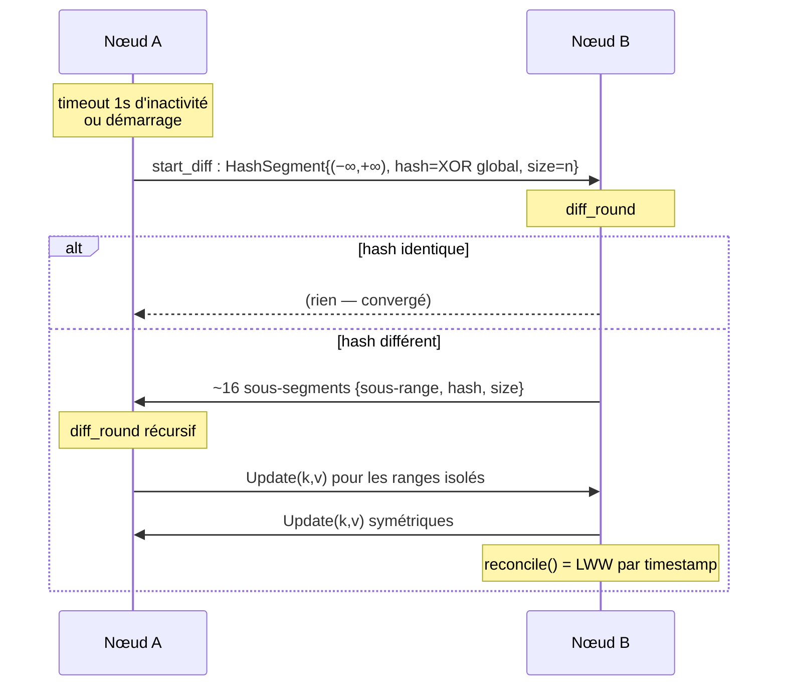

# Peer Review — `reconcile-rs` (crate `reconcile`)

> Revue critique de niveau « peer-review scientifique » conduite par un panel de
> reviewers indépendants (4 sous-panels SOTA + 8 reviewers de code en double aveugle,
> 2 par thème). Chaque constat est étayé par une preuve `fichier:ligne` vérifiée et,
> pour le positionnement SOTA, par des sources citées.
>
> - **Date :** 2026-05-30
> - **Commit audité :** `64f1ebf` (branche `master`), audit sur `claude/merkle-tree-storage-review-LbYCp`
> - **Version manifeste :** `0.0.0-git` · **Version publiée crates.io :** `0.1.5` (~6,8k téléchargements, 3★)
> - **Méthode :** lecture statique exhaustive de `src/`, `tests/`, `benches/`, `Cargo.toml`,
>   `README.md`, `.github/workflows/` + revue de littérature SOTA. Aucune modification du code source.

---

## 1. Résumé exécutif

`reconcile-rs` fournit un magasin clé-valeur **distribué, en mémoire, *eventually
consistent***, dont le cœur est le **HRTree** (« Hash-Range Tree ») : un B-tree maison
augmenté, à chaque nœud, du XOR cumulé des hashs `(clé,valeur)` du sous-arbre et de sa
taille. Cela permet une **requête de hash cumulé sur un intervalle en O(log n)**, qui pilote
un protocole de **réconciliation par intervalles (Range-Based Set Reconciliation, RBSR)** au
sens de Meyer (arXiv:2212.13567, 2023). La résolution de conflits est **Last-Write-Wins (LWW)
par horloge physique `DateTime<Utc>`** ; les suppressions sont des *tombstones* purgés après
60 s ; le transport est **UDP + bincode** ; la découverte de pairs se fait par **tirage d'IP
aléatoire dans un CIDR**.

**Verdict global.** Le **cœur algorithmique est réel, correct et SOTA-aligné** : le HRTree
est, dans la terminologie de la littérature 2026, un *Range-Summarizable Order-Statistics
Store* (RSOS, arXiv:2603.19820) — exactement le backend dont RBSR a besoin — et l'astuce du
cache de hash par sous-arbre est implémentée correctement (O(log n) vérifié). En revanche, la
**coquille d'ingénierie et les choix distribués sont de maturité pré-alpha** et comportent
**plusieurs défauts critiques** : une divergence silencieuse permanente (sentinelle `hash==0`),
un déni de service distant trivial (panic sur un seul paquet UDP malformé), une résurrection de
données supprimées (GC de tombstones à l'horloge murale), un LWW non-commutatif sur égalité de
timestamp, et l'absence totale d'authentification/chiffrement.

Convergence du panel : les **deux reviewers indépendants de chaque thème ont identifié les mêmes
findings critiques** — signal de haute confiance, pas d'artefact de formulation.

### Tableau de synthèse des findings

| # | Finding | Catégorie | Sévérité | Confiance | Preuve |
|---|---------|-----------|----------|-----------|--------|
| F1 | Sentinelle `hash==0` confondue avec un range non-vide → **divergence permanente silencieuse** | Algo/crypto | **Critique** | Haute (T1-A & T1-B) | `diff.rs:96-99` |
| F2 | `panic!` sur paquet UDP malformé → **DoS distant** (process down ou nœud zombie) | Sécurité | **Critique** | Haute (T2-A & T2-B) | `reconcile_engine.rs:267` |
| F3 | Pas d'auth/chiffrement + **timestamp LWW contrôlé par l'attaquant** → poisoning/suppression cluster-wide | Sécurité | **Critique** | Haute (T2-A & T2-B) | `reconcile_engine.rs:200-205,304-322` |
| F4 | **Résurrection de tombstones** : GC à l'horloge murale (60 s), sans stabilité causale | Distribué | **Critique** | Haute (T3-A & T3-B) | `reconcile_store.rs:208-215` ; `timeout_wheel.rs:46-57` |
| F5 | **LWW horloge physique** : perte d'update sous skew + **non-commutatif sur égalité** → divergence permanente + livelock | Distribué | **Élevée** | Haute (T3-A & T3-B) | `reconcilable.rs:19-27` |
| F6 | **Fingerprint XOR 64-bit** : faible algébriquement (auto-inverse, GF(2)-linéaire) + birthday bound ; collision craftable | Algo/crypto | **Élevée** | Haute (T1-A & T1-B + SOTA) | `hrtree.rs:35-40,70-84` |
| F7 | `unimplemented!()`/underflow atteignables depuis un `HashSegment` réseau → panic distant | Sécurité/Algo | **Élevée** | Haute (T1, T2) | `diff.rs:112,116,119` |
| F8 | **`DefaultHasher` instable** entre versions de Rust/plateformes → non-convergence cross-version | Algo/qualité | **Élevée** | Haute (T1, T4) | `hrtree.rs:36` |
| F9 | **Amplification/réflexion UDP** (dump de la DB vers victime spoofée) | Sécurité | **Élevée** | Moy-Haute (T2-A & T2-B) | `reconcile_engine.rs:290-301` ; `diff.rs:96-97` |
| F10 | **Découverte par scan IP** O(espace d'adressage) + trafic O(N²) ; fuite de données | Distribué/Sécu | **Élevée** | Haute (T2, T3) | `reconcile_engine.rs:228-241` |
| F11 | **Absence de property-testing/fuzzing** ; la convergence (propriété centrale) n'est pas testée génériquement | Qualité/tests | **Élevée** | Certaine (T4-A & T4-B) | `tests/`, `Cargo.toml` |
| F12 | **`println!` de debug** dans le hot-path `with_mut` | Qualité | **Moyenne** (1 reviewer: Critique) | Certaine (T1, T4) | `hrtree.rs:315` |
| F13 | **API panic-only** (aucun `Result`) ; `unwrap()` sur bind/send | Qualité | **Moyenne** | Haute (T4-A & T4-B) | `reconcile_engine.rs:99,240,354,359,365` |
| F14 | Hook `pre_insert` exécuté **sous le write-lock** sur le chemin réseau — contredit la doc | Qualité/correction | **Moyenne** | Haute (T4-A & T4-B) | `reconcile_engine.rs:312,317` vs `reconcile_store.rs:98-101` |
| F15 | **Pas de persistance** ; restart perd tout + aggrave la résurrection | Distribué | **Moyenne** | Haute (T3-A & T3-B) | `reconcile_engine.rs:101-110` |
| F16 | Benchmarks **loopback** non représentatifs ; README auto-contradictoire (« factor 2 » vs « one-third ») | Perf/doc | **Moyenne** | Haute (T4-A & T4-B) | `README.md:60-71,122-139` ; `benches/bench.rs:226-351` |
| F17 | Maturité : `0.0.0-git`, pas de MSRV, pas de CHANGELOG, clippy `mismatched_lifetime_syntaxes` casserait la CI `-Dwarnings` | Maturité | **Moyenne/Basse** | Certaine (T4-A & T4-B) | `Cargo.toml:3` ; `hrtree_iter.rs:177` |
| F18 | Exhaustion mémoire : map `peers` via IPs spoofées, croissance non bornée ; bincode allocation-bomb | Sécurité | **Moyenne** | Haute (T2-A & T2-B) | `reconcile_engine.rs:117-121,208-210` |
| F19 | Hygiène des dépendances : bincode 1.x sans `with_limit`, tokio floor ancien, `[profile.release] debug=true` sans `overflow-checks` | Sécurité/maturité | **Basse** | Moyenne (T2) | `Cargo.toml` |

**Points forts à créditer (consensus du panel) :** cœur RBSR/RSOS correct et élégant ;
`check_invariants` rigoureux ; sécurité **pull-only du nœud vide** (un nœud fraîchement
redémarré ne peut pas supprimer les données des pairs — `diff.rs:99-106`) ; défaut `Config`
confiné au loopback ; détection de troncature de buffer ; `TimeoutWheel` propre ; gestion
mémoire `Arc` pour le clone de `ReconcileStore` ; double-licence MIT/Apache propre.

---

## 2. Objectif et pertinence vis-à-vis du SOTA

### 2.1 L'objectif annoncé

D'après le README : *« a scalable Web service with a non-persistent and eventually consistent
key-value store [...] avoiding any latency related to using an external store such as Redis. All
the data is available locally on all instances »*. Autrement dit : **chaque réplique de service
web embarque le dataset complet en mémoire**, les répliques se réconcilient en pair-à-pair, et
l'utilisateur est notifié des changements via un hook d'insertion.

### 2.2 Pertinence et niche réelle

La niche est **réelle mais étroite** : il n'existe pas, dans l'écosystème Rust/Tokio,
d'équivalent mûr du *Replicated Map* de Hazelcast ou de *Distributed Data* d'Akka/Pekko (tous
JVM). Pour un service web Rust **read-heavy**, à working-set modéré et à conflits rares/bénins
(feature flags, tables de routage, présence, configuration), un cache répliqué en mémoire avec
des lectures en O(log n) locales et sans dépendance Redis est légitimement attractif.

**Mais le positionnement « scalable / avoid Redis » inverse les vrais compromis :**

- L'argument latence ne vaut que pour les **lectures**. Les écritures ne sont visibles
  qu'*éventuellement* sur les pairs ; « éviter la latence Redis » revient en réalité à
  **troquer un magasin cohérent synchrone contre un magasin incohérent asynchrone** — un
  changement de modèle de cohérence déguisé en optimisation de latence.
- La topologie **n'est pas scalable par construction** : dataset complet sur chaque réplique →
  mémoire bornée par le plus petit nœud, et **chaque écriture est amplifiée vers tous les
  nœuds** → le débit d'écriture *diminue* quand on ajoute des répliques. C'est le mode d'échec
  documenté des caches répliqués (Oracle Coherence, Apache Ignite). Pekko Distributed Data
  recommande explicitement de **ne pas dépasser ~100 000 entrées** en réplication complète — à
  comparer à la promesse « millions of elements » du README.

### 2.3 Le SOTA de la réconciliation d'ensembles (sourcé)

| Famille | Comm. | Calcul | RTT | Connaît *d* ? | Robustesse adverse | Maturité |
|---|---|---|---|---|---|---|
| **RBSR XOR (= reconcile-rs)** | O(d log n) | O(d log n) | **O(log n)** | Non (auto-adaptatif) | **Faible** (XOR forgeable) | Earthstar, Willow, Negentropy |
| RBSR fingerprint sûr (≥256-bit) | O(d log n) | O(d log n) | O(log n) | Non | Bonne | Negentropy (prod) |
| IBLT / Difference Digest | O(d·(b+log U)) | **O(d)** | 1 (+estim.) | **Oui** | Faible | blockchains |
| **Rateless IBLT (SIGCOMM 2024)** | **≈ d** (3-4× < non-rateless) | **linéaire** (2-2000× < minisketch) | **1 streaming** | **Non** | **Conçu pour l'adverse** | Ethereum state-sync |
| minisketch / PinSketch (CPI) | **optimal ≈ b·d** | O(d²) | 1 (+ext.) | **Oui (capacité)** | déterministe si capacité OK | Bitcoin Erlay (BIP 330) |
| Merkle-tree diffing | O(d log n) | O(d log n) | O(log n) | Non | dépend du hash | Dynamo, Cassandra, Riak |

Sources : Meyer arXiv:2212.13567 & logperiodic.com/rbsr.html ; *Practical Rateless Set
Reconciliation*, SIGCOMM 2024, arXiv:2402.02668 ; minisketch (bitcoin-core) & BIP 330 ; Erlay
(CCS 2019) ; arXiv:2603.19820 (RSOS, 2026).

**Constat clé :** pour le profil **grand-n / petit-d / sensible à la latence**, RBSR est la
**pire famille sur la latence** (O(log n) RTT séquentiels) là où **Rateless IBLT** trouve le
diff en un seul échange streaming, sans estimation de *d*, et avec robustesse adverse — c'est le
**choix SOTA actuel** pour ce cas d'usage.

### 2.4 Le SOTA des structures Merkle/anti-entropy

Nuance importante du panel : **HRTree n'appartient PAS à la famille Merkle Search Tree
(MST) / prolly-tree**, et c'est un point en sa faveur. MST (Auvolat & Taïani, SRDS 2019) et les
prolly-trees (Dolt/Noms) ont *besoin* de l'**indépendance à l'ordre d'insertion** parce qu'ils
diffent en comparant les hashs des **nœuds internes** de l'arbre. HRTree, lui, diffe des
**intervalles définis par la valeur** : le XOR cumulé sur `[a,b)` est identique chez deux pairs
ssi le *contenu* de l'intervalle est identique, **quelle que soit la forme du B-tree de chacun**.
HRTree obtient donc la garantie de convergence que MST/prolly paient par l'history-independence,
**sans la payer** — et échappe ainsi à l'attaque « leading-zeros » de MST. L'ordre-dépendance du
B-tree n'est donc **pas** un défaut ici.

### 2.5 Le SOTA de la cohérence et de la résolution de conflits

- **LWW horloge physique** : anti-pattern documenté (Jepsen/Kingsbury « The trouble with
  timestamps » ; incidents NTP réels). Le « gagnant » est le nœud à l'horloge la plus en avance,
  pas l'écriture causalement la plus récente → perte d'update silencieuse.
- **Correctif minimal SOTA** : **Hybrid Logical Clocks (HLC, Kulkarni 2014)** — drop-in 64-bit,
  monotone, respecte la causalité, divergence bornée par ε ; adopté par CockroachDB et MongoDB.
- **Tie-break** : doit être un **ordre total déterministe** (ex. `(HLC, node_id)`). Le `keep
  local on equal` actuel est non-convergent.
- **GC de tombstones** : doit être **par stabilité causale** (acquittement de toutes les
  répliques) — Cassandra : `gc_grace_seconds` = **10 jours** + repair complet dans la fenêtre ;
  ScyllaDB : GC basé sur le repair. **60 s** rend la précondition de sûreté quasi impossible à
  honorer.

---

## 3. Architecture et algorithmes

### 3.1 Modules

| Fichier | Rôle |
|---|---|
| `hrtree.rs` | B-tree maison (B=6, capacité 5-11) avec cache `tree_hash` (XOR) + `tree_size` ; requête de hash cumulé O(log n) |
| `diff.rs` | Traits `HashRangeQueryable` / `Diffable` ; protocole RBSR (`start_diff` + `diff_round` à découpage ~16) |
| `reconcile_engine.rs` | Transport UDP + bincode ; locks `parking_lot::RwLock` ; découverte de pairs (`gen_ip`) |
| `reconcile_store.rs` | API publique ; timestamps LWW ; GC de tombstones |
| `reconcilable.rs` | Trait `Reconcilable` (merge LWW) |
| `timeout_wheel.rs` | Expiration des tombstones (BTreeMap + HashMap, `std::sync::RwLock`) |
| `gen_ip.rs`, `hrtree_iter.rs`, `lib.rs` | Génération d'IP, itérateurs, ré-exports |

### 3.2 Flux du protocole de réconciliation

Chaque `diff_round` divise un intervalle non concordant en ~16 sous-intervalles
(`diff.rs:141`) jusqu'à isoler les éléments différents → **O(log₁₆ n) tours**, **O(d·log n)**
messages. Astuce centrale (correcte) : `hash(range)` retourne instantanément le `tree_hash`
caché quand un sous-arbre est entièrement inclus, ne récursant que le long des deux bornes
(`hrtree.rs:608-611`).

### 3.3 Décisions de conception et compromis

| Décision | Pro | Con / compromis |
|---|---|---|
| HRTree (B-tree augmenté = RSOS) | O(log n) pour ops + hash-range ; diff par valeur (pas de besoin d'history-independence) | B-tree maison à maintenir ; ~2-3× plus lent que `BTreeMap` |
| Fingerprint XOR 64-bit | commutatif/inversible → soustraction de range O(log n), incrémental | **auto-inverse + GF(2)-linéaire + 64-bit** → collisions accidentelles (birthday ~2³²) et **craftables** ; sentinelle `0` ambiguë (F1) |
| RBSR (Meyer 2023) | peu de RTT, auto-adaptatif à *d*, fingerprints incrémentaux | **O(log n) RTT séquentiels** : pire famille sur la latence pour grand-n/petit-d |
| LWW `DateTime<Utc>` | trivial, métadonnée O(1) | perte d'update sous skew ; **non-commutatif sur égalité** ; pas de causalité |
| Tombstones + GC 60 s | suppression propagée ; mémoire bornée | **résurrection** si partition > 60 s ; pas de stabilité causale |
| Transport UDP + bincode | faible latence, sans connexion | **aucune auth/chiffrement** ; panic sur malformé ; amplification |
| Découverte par scan CIDR | pas de coordinateur | O(espace d'adressage) ; trafic O(N²) ; fuite de données ; scan réseau |
| In-memory only | performance, simplicité | perte totale au restart ; aggrave la résurrection |

---

## 4. Revue de l'implémentation (findings détaillés)

> Format : constat → preuve → impact → recommandation. Les findings confirmés par les **deux**
> reviewers indépendants d'un thème sont marqués « **[2/2]** » (haute confiance).

### F1 — [CRITIQUE] Sentinelle `hash==0` ≡ range vide → divergence permanente silencieuse **[2/2]**

`diff.rs:96-99` traite `hash==0` comme « range vide/absent ». Or le fingerprint est un XOR :
**un multiset non-vide peut XOR-er à 0** (deux éléments de hashs égaux, ou tout ensemble pair
qui s'annule). Et `HRTree.hash(range vide) == 0` (confirmé `hrtree.rs:795`), donc la sentinelle
**aliase une valeur réelle atteignable**. Le champ `size` n'est consulté qu'*après* les tests de
hash (`diff.rs:119-138`), donc un range non-vide de hash 0 court-circuite avant.

**Contre-exemple (les deux reviewers convergent) :** A = `{X, Y}` avec `h(X)==h(Y)`, B vide.
`A.start_diff()` émet `{(−∞,+∞), hash:0, size:2}`. Chez B : `local_hash=0`, donc
`hash==local_hash` → `continue`. **B se croit synchronisé alors qu'il manque 2 éléments.**
Divergence permanente, sans panic ni log. Déclenchable par un attaquant qui choisit les données.

**Recommandation (consensus) :** brancher sur **`size==0` / `local_size==0`** (le champ existe
déjà dans `HashSegment` et est exact), jamais sur `hash==0`. Correctif d'une ligne, à bloquer en
release. *C'est le finding le plus grave du dépôt.*

### F2 — [CRITIQUE] `panic!` sur paquet UDP malformé → DoS distant **[2/2]**

`reconcile_engine.rs:267` : tout datagramme qui n'est pas une troncature EOF propre déclenche
`panic!`. Un seul octet invalide (`0xFF`) suffit (tag d'enum bincode invalide). Analyse fine du
panel : `Cargo.toml` n'a **pas** `panic="abort"` (unwind). Dans le pattern `demo.rs`
(`run().await` sur `#[tokio::main]`), le panic **arrête le process**. Dans le pattern
`tokio::spawn` (les tests), la tâche meurt et le panic est **silencieusement avalé** → **nœud
zombie** : le process vit, les lectures locales marchent, mais la run-loop ET le GC de tombstones
sont morts à jamais. Non authentifié, scriptable sur tout un sous-réseau.

**Recommandation :** remplacer `panic!` par `warn!` + `return` (exactement le pattern déjà
présent pour le buffer trop petit, `:250-253`). Ne jamais paniquer sur une entrée réseau.

### F3 — [CRITIQUE] Aucune auth/chiffrement + timestamp LWW attaquant-contrôlé **[2/2]**

`reconcile_engine.rs:200-205` ne fait que *logger* un warning sur port inattendu puis traite le
paquet ; `:304-322` fusionne tout `Update` reçu. La valeur étant `(DateTime<Utc>, Option<V>)` et
le merge un LWW par timestamp, **l'attaquant contrôle le timestamp sérialisé** : `Update((k,
(Utc.year_9999, Some(evil))))` gagne contre toute écriture légitime pour toujours, ou
`None` forge une suppression. Le poison se **propage à tout le cluster** via la réconciliation.
IP source spoofable (UDP).

**Recommandation :** MAC à secret partagé (HMAC/BLAKE3 keyed) vérifié avant désérialisation +
allow-list de pairs ; pour la confidentialité, DTLS/Noise/QUIC. À défaut, **documenter en grand**
que le protocole exige un réseau de confiance.

### F4 — [CRITIQUE] Résurrection de tombstones (GC à l'horloge murale, sans stabilité causale) **[2/2]**

`reconcile_store.rs:208-215` + `timeout_wheel.rs:46-57` : un tombstone est purgé 60 s après la
suppression (`instant + timeout < Utc::now()`), **sans vérifier que tous les pairs l'ont vu**.
Timeline (les deux reviewers la construisent) : C partitionné > 60 s ; A & B suppriment `k`,
tombstone GC'd ; C revient avec l'ancienne valeur ; via le branch `None => insert(remote_v)`
(`reconcile_engine.rs:316-319`), A & B **réinsèrent** la valeur → **la suppression est annulée,
la donnée ressuscite cluster-wide**. C'est le hazard classique (Dynamo/Cassandra
`gc_grace_seconds`), mais à 60 s contre 10 jours.

**Recommandation :** GC conditionné à la **stabilité causale** (acquittement de toutes les
répliques) ou à un repair complet dans la fenêtre ; ou tombstones versionnés (HLC/VV) comme état
de première classe. *Sévérité : Critique (T3-A) / Élevée (T3-B) → retenue Critique.*

### F5 — [ÉLEVÉE] LWW horloge physique : perte sous skew + non-commutatif sur égalité **[2/2]**

`reconcilable.rs:19-27` : `if other.0 > self.0 { other } else { self }`. (a) **Skew** : une
écriture causalement plus récente est écrasée par une plus ancienne venant d'un nœud à l'horloge
en avance → perte silencieuse. (b) **Égalité de timestamp** : `>` strict garde le local des deux
côtés → A garde "a", B garde "b" → **divergence permanente + livelock** (chaque `diff_round`
ré-échange éternellement la paire, le hash inclut le timestamp donc les segments ne convergent
jamais). Le merge **n'est donc pas commutatif** → viole la SEC.

**Recommandation :** HLC + tie-break par ordre total déterministe `(timestamp, node_id)`.

### F6 — [ÉLEVÉE] Fingerprint XOR 64-bit faible **[2/2 + 2 panels SOTA]**

`hrtree.rs:35-40,70-84`. XOR est commutatif et **auto-inverse** (nécessaire pour la soustraction
de range, mais) → collisions par permutation/annulation. **GF(2)-linéaire** : un attaquant
*résout* (élimination gaussienne, ~2 s même en 256-bit selon Log Periodic) pour des éléments qui
font collisionner le fingerprint d'un range divergent → **censure / perte silencieuse** (attaque
documentée par la spec Willow). **64 bits** : collisions accidentelles au seuil d'anniversaire
(~2³²) sur le grand nombre de ranges comparés. Negentropy (inspiré de Meyer) a abandonné le
combineur naïf au profit d'un hash cryptographique incrémental ≥256-bit.

**Recommandation :** fingerprint large (≥256-bit) et non GF(2)-linéaire (hash-then-add mod 2²⁵⁶,
MSet-Mu-Hash/LtHash) ou keyed ; incorporer `size` dans la décision d'égalité (corrige aussi F1).

### F7 — [ÉLEVÉE] `unimplemented!()` / underflow atteignables depuis le réseau **[T1 + T2]**

`diff.rs:112,116` : `diff_round` suppose des bornes `(Included|Unbounded, Excluded|Unbounded)` ;
or `HashSegment.range` est désérialisé du réseau sans validation. Un segment crafté avec
`Bound::Excluded` en début → `unimplemented!()` → panic distant. Pire (T2-B) : un range inversé
`Included(100)..Excluded(5)` provoque `end_index - start_index` (`diff.rs:119`) → **underflow**
(panic en debug, wrap en `usize` géant en release → index OOB dans `key_at`).

**Recommandation :** valider/normaliser les bornes en entrée ; gérer les 4 combinaisons ou
dropper le segment sans paniquer ; `overflow-checks = true`.

### F8 — [ÉLEVÉE] `DefaultHasher` instable cross-version **[T1 + T4]**

`hrtree.rs:36` : `DefaultHasher` n'est **pas stable** entre versions de Rust/plateformes (doc
std). Le hash étant le **jeton de réconciliation sur le fil**, deux nœuds compilés avec des
toolchains différentes (upgrade progressif, 32 vs 64-bit) calculent des hashs différents pour des
données identiques → ils se croient perpétuellement différents et **ne convergent jamais** (ou
ré-échangent tout en boucle).

**Recommandation :** hasher fixe et versionné (SipHash à clé constante, xxHash, BLAKE3) ; traiter
l'algo de hash comme partie du protocole de fil + golden-vector test.

### F9 — [ÉLEVÉE] Amplification / réflexion UDP **[2/2]**

`reconcile_engine.rs:290-301` répond à l'adresse *source* (spoofable). Un petit
`ComparisonItem` `{(−∞,+∞), hash:1, size:0}` force, via le branch `hash==0` (`diff.rs:96-97`), le
nœud à **déverser toute sa DB** en `Update` vers la victime spoofée. Facteur d'amplification ≈
taille DB / taille requête (potentiellement milliers). Réflecteur DRDoS + canal d'exfiltration.

**Recommandation :** ne pas répondre à des pairs non authentifiés/non confirmés ; rate-limiting ;
cookie de validation de chemin avant tout envoi volumineux. L'auth (F3) ferme l'essentiel.

### F10 — [ÉLEVÉE] Découverte par scan IP non scalable + fuite **[T2 + T3]**

`reconcile_engine.rs:228-241` : **une** IP aléatoire du CIDR sondée par cycle ; pairs appris
uniquement des paquets reçus, expirés à 60 s. En `/8` (défaut) avec N nœuds, l'espérance de
découverte d'un pair ≈ 2²⁴/N cycles → **pratiquement impossible sans `with_seed`**. En régime
établi, chaque nœud gossipe avec **tous** les pairs → **trafic O(N²)** (pas de fan-out borné à la
SWIM/HyParView). Le sondage envoie la charge de diff complète (révélant existence, port,
`len()`) à des hôtes potentiellement tiers/hostiles.

**Recommandation :** protocole de membership réel (SWIM/HyParView) avec gossip de la liste de
pairs (découverte O(log N)) et fan-out borné (sous-ensemble aléatoire) ; sonder avec des pings,
pas des diffs ; refuser/avertir sur CIDR routable.

### F11 — [ÉLEVÉE] Absence de property-testing / fuzzing **[2/2]**

19 tests, **0** `proptest`/`quickcheck`/`fuzz` (vérifié). La propriété centrale — *deux magasins
quelconques convergent après échange, quel que soit l'ordre* — n'est exercée que par **un** test
d'intégration à seed fixe (`tests/service.rs`). `check_invariants` (excellent) n'est lancé que
sur des séquences choisies par l'auteur. Le rebalancing manuel du B-tree (avec un `TODO` à
`hrtree.rs:97`) est exactement le code où un proptest trouverait les cas limites.

**Recommandation :** proptest générant deux arbres aléatoires → boucle de diff complète →
assertions convergence + invariants + « ranges retournés = diff symétrique réel » ; test contre
oracle `BTreeMap` ; test de paquets malformés (corrige aussi l'angle mort de F2/F7).

### F12 — [MOYENNE] `println!` de debug dans le hot-path **[T1 + T4]**

`hrtree.rs:315` : `println!("{diff_hash}")` exécuté à **chaque** mutation `with_mut`/`get_mut`.
Pollution stdout + syscall+lock par mutation, hors infrastructure `tracing`. *Sévérité : Critique
(T4-B) / High (T4-A) / Low (T1) → retenue Moyenne, mais correctif trivial et prioritaire.*
**Recommandation :** supprimer la ligne (ou `trace!`).

### F13 — [MOYENNE] API panic-only **[2/2]**

Aucune méthode publique ne retourne `Result`. `new()` fait `bind(...).unwrap()`
(`reconcile_engine.rs:99`) ; `send_to_retry(...).unwrap()` (`:240,354,359,365`) panique la
run-loop sur échec d'envoi persistant. Impossible de gérer « port occupé » ou « pair injoignable »
proprement.
**Recommandation :** `new()/run() -> io::Result<…>` ; log-and-continue sur erreurs d'envoi.

### F14 — [MOYENNE] Hook `pre_insert` sous write-lock sur le chemin réseau **[2/2]**

`reconcile_engine.rs:312,317` appellent le hook **en tenant** `map.write()`, ce qui **contredit
la doc** `add_pre_insert` (`reconcile_store.rs:98-101` : « executed outside the map's write
lock ») et le chemin direct `just_insert` (`:123-130`) qui, lui, l'exécute hors lock. Le test
anti-deadlock ne couvre que le chemin direct → garantie fausse et non testée pour le chemin
dangereux (un hook qui réinsère depuis le chemin réseau ré-entre le write-lock → deadlock).
**Recommandation :** collecter les valeurs fusionnées sous lock, relâcher, exécuter les hooks,
puis ré-acquérir pour appliquer ; aligner sur le chemin direct.

### F15 — [MOYENNE] Pas de persistance **[2/2]**

`reconcile_engine.rs:101-110` : HRTree en mémoire uniquement. Restart = perte totale + **trigger
de résurrection** (un nœud qui redémarre a perdu ses tombstones → réapprend des valeurs déjà
supprimées). **Point positif confirmé par les deux reviewers :** un nœud vide ne fait que
**pull** (`diff.rs:99-106`) et **ne peut pas supprimer** les données des pairs — l'absence n'est
jamais interprétée comme une suppression.
**Recommandation :** snapshot/WAL optionnel persistant **incluant les tombstones** ;
pull-then-quiesce au démarrage.

### F16 — [MOYENNE] Benchmarks loopback + README auto-contradictoire **[2/2]**

`benches/bench.rs:226-351` mesure sur loopback (busy-spin `sleep(1µs)`), or le README admet
lui-même (`:138-139`) que la transmission réseau domine en réel — donc les « 240-640 µs » ne
prouvent rien sur le déploiement (ils prouvent surtout le faible **nombre de RTT**, qui est la
vraie contribution). Incohérence : « within a factor 2 of BTreeMap » (`:60-61`) vs « one third to
one half the throughput » (`:71`) = 2-3× plus lent. Typos « 700 s »/« 800 s » pour ns.
**Recommandation :** présenter nombre de RTT / coût CPU comme métrique phare ; harnais avec
RTT/perte injectés (netem) ; corriger le texte.

### F17 — [MOYENNE/BASSE] Signaux de maturité **[2/2]**

`Cargo.toml:3` `version = "0.0.0-git"` (badges crates.io/docs.rs trompeurs ; `publish
--dry-run` en CI rejetterait cette version) ; pas de `rust-version` (MSRV) ; pas de CHANGELOG ;
warning clippy `mismatched_lifetime_syntaxes` (`hrtree_iter.rs:177`) qui **casserait la CI**
`-Dwarnings` sur toolchain récent → le projet n'est plus vert contre stable courant ; CI
mono-OS, sans miri (malgré les itérateurs `unsafe`), sans MSRV, sans `cargo audit`.
**Recommandation :** vraie version + MSRV + CHANGELOG ; `cargo clippy --fix` ; jobs miri/MSRV/audit.

### F18 — [MOYENNE] Exhaustion de ressources **[2/2]**

`reconcile_engine.rs:208-210` insère `peer.ip()` dans la map `peers` à chaque datagramme ; avec
des IPs spoofées (IPv6 ≈ illimité) la map enfle sans borne dans la fenêtre de 60 s, et chaque
cycle envoie à **tous**. Bincode 1.x lit un préfixe de longueur attaquant-contrôlé → pré-allocation
(allocation-bomb) si `K`/`V` contient `Vec`/`String`.
**Recommandation :** borner la taille de `peers` (LRU/handshake) ; `bincode::…with_limit()` ;
borner le nombre de messages/segments par datagramme.

### F19 — [BASSE] Hygiène des dépendances **[T2]**

`bincode = "1.3.3"` (1.x en maintenance, sans limite d'allocation par défaut) ; `tokio` floor
ancien (1.33) ; `range-cmp = "0.1.1"` peu populaire (à auditer) ; `[profile.release] debug=true`
(`Cargo.toml:13-14`) sans `overflow-checks` (laisse F7 exploitable en wrap).
**Recommandation :** `cargo audit`/`cargo deny` en CI ; remonter les floors ; `overflow-checks=true`.

---

## 5. Pros / cons et compromis (synthèse)

**Ce qui est bien fait (à conserver) :**
- Cœur RBSR/RSOS **correct et SOTA-aligné** ; O(log n) vérifié ; cache de hash élégant.
- **Diff par intervalle de valeur** → convergence sans besoin d'history-independence, immunité à
  l'attaque leading-zeros de MST. *Vraie force conceptuelle.*
- `check_invariants` rigoureux ; `TimeoutWheel` propre ; **nœud vide pull-only** (ne détruit pas
  les données des pairs) ; défaut loopback-safe ; détection de troncature ; double-licence propre.

**Ce qui plombe le projet (par ordre de gravité) :**
1. Correction silencieuse compromise (F1, F6, F8) — divergence permanente non détectée.
2. Surface réseau hostile (F2, F3, F7, F9, F10, F18) — DoS/poisoning triviaux, non authentifiés.
3. Sémantique distribuée non sûre (F4, F5, F15) — perte de données, résurrection, non-SEC.
4. Maturité d'ingénierie (F11, F12, F13, F14, F16, F17, F19) — tests, API, doc, perf.

---

## 6. Gap analysis vs cible SOTA

| Axe | reconcile-rs | Cible SOTA | Gap |
|---|---|---|---|
| **Algo de réconciliation** | RBSR XOR, O(log n) RTT | Rateless IBLT (1 échange, no-*d*, robuste) pour grand-n/petit-d | Latence O(log n) RTT vs 1 ; pas de robustesse adverse |
| **Fingerprint** | XOR 64-bit, GF(2)-linéaire, sentinelle 0 | ≥256-bit incrémental non-linéaire / keyed (Negentropy) | Collisions accidentelles + craftables ; F1 |
| **Backend de diff** | B-tree augmenté = RSOS | RSOS (arXiv:2603.19820) | **Conforme** (point fort) |
| **Structure** | ordre-dépendant, diff par valeur | MST/prolly (history-independent) OU RSOS | **OK** (diff par valeur lève le besoin) |
| **Résolution de conflits** | LWW horloge physique, tie-break non-commutatif | HLC + tie-break total déterministe ; CRDT pour zéro-perte | Perte sous skew ; divergence sur égalité |
| **Suppressions** | tombstones, GC 60 s temporel | GC par stabilité causale / repair complet | **Résurrection** garantie sous partition > 60 s |
| **Cohérence** | « eventually consistent » annoncé | SEC (strong eventual consistency) | N'atteint pas la SEC ; divergence permanente possible |
| **Sécurité transport** | UDP clair, aucune auth | AEAD/HMAC + allow-list (memberlist, iroh) | Poisoning/DoS/amplification non authentifiés |
| **Membership** | scan IP aléatoire, O(N²) | SWIM/HyParView, fan-out borné, gossip de membres | Découverte impraticable à l'échelle ; trafic O(N²) |
| **Persistance** | aucune | snapshot/WAL (prolly, iroh-docs) | Perte au restart ; aggrave la résurrection |
| **Tests** | exemples à seed fixe | property-testing + fuzzing convergence/invariants | Propriété centrale non testée |
| **Maturité** | 0.0.0-git, pas de MSRV/CHANGELOG | versioning sémantique, MSRV, miri/audit en CI | Signaux pré-alpha |

**Concurrents directs à connaître :** Pekko/Akka Distributed Data (CRDT + gossip, JVM) ;
`merkle-search-tree` (domodwyer, Rust) ; iroh + iroh-docs (Rust, QUIC chiffré + CRDT KV
persistant) ; Hazelcast Replicated Map. Pour « état mutable partagé entre répliques de service
web » avec exigence de durabilité/correction : Redis/Dragonfly + cache local, ou rqlite/FoundationDB.

---

## 7. Audit détaillé des concurrents et différenciants

> Cette section recentre l'analyse sur le **HRTree en tant que structure de données** (et son
> protocole), et non sur le système complet. Ancrage méthodologique : le HRTree **n'est pas un
> Merkle tree au sens MST/prolly**. C'est un *Range-Summarizable Order-Statistics Store* (RSOS) —
> un B-tree augmenté, par nœud, d'un **résumé composable de sous-arbre** (le XOR des hashs) **+ une
> statistique d'ordre** (la taille de sous-arbre). Cette abstraction a été formalisée en 2026
> (arXiv:2603.19820) comme le backend dont la réconciliation par intervalles (RBSR, Meyer 2023) a
> besoin. Son **vrai groupe de pairs** = les autres structures diffables ; son **vrai concurrent
> algorithmique** = les autres familles de réconciliation d'ensembles.

### 7.1 Concurrents au niveau « structure de données diffable »

#### Merkle Search Tree (MST) — Auvolat & Taïani, SRDS 2019
B-tree de recherche où le **niveau** d'une clé est dérivé du **hash de la clé** (zéros de tête →
fanout) ⇒ deux répliques au même jeu de clés produisent le **même arbre et le même root hash**,
indépendamment de l'ordre d'insertion (*history-independence*). Diff = comparaison du root hash
(O(1)) puis descente en comparant les **hashs des nœuds internes**.
- ✅ History-independent (nécessaire car il diffe des *nœuds*) ; sérialisation/diff de pages
  compacte ; crate Rust mûre et **fuzz-testée** (`merkle-search-tree`, domodwyer) ; production
  **Bluesky/atproto** (un MST par dépôt).
- ❌ **Attaque « leading-zeros »** : un attaquant forge des clés à hash très profond pour gonfler
  la hauteur et déséquilibrer l'arbre. ❌ Équilibrage seulement probabiliste ; pas de rank/select
  natif.
- **vs HRTree :** le MST *paie* l'history-independence ; le HRTree ne la paie pas (diff par valeur,
  §7.3) et **échappe à l'attaque leading-zeros**. Mais le MST gagne le partage structurel
  (versioning) que le HRTree n'a pas.

#### Prolly trees (Noms, Dolt) — *probabilistic B-trees*
B-tree **adressé par contenu**, frontières fixées par un **chunker à hash glissant** (~4 Ko).
History-independent, auto-équilibré, et surtout **structural sharing** : les sous-arbres inchangés
partagent des chunks identiques entre versions.
- ✅ SOTA des stores ordonnés **diffables ET versionnés** : diff/merge ne touchent que les chunks
  modifiés (fondation de Dolt, « 1ʳᵉ base relationnelle versionnée »). Dolt hashe **les clés
  seulement** → une MAJ de valeur ne déplace pas les frontières. Résiste à l'attaque leading-zeros.
- ❌ Machinerie lourde (rolling hash, chunks, CAS) ; latence supérieure à un B-tree in-mem ; pensé
  pour la **persistance**.
- **vs HRTree :** prolly = SOTA si on veut **versioning + persistance + branche/merge**. Le HRTree
  est plus simple/rapide en mémoire mais n'offre **aucun** de ces avantages. Compromis central
  « simplicité/vitesse vs versioning/durabilité ».

#### Merkle radix / Sparse Merkle Tree / « Merklized KV » (Gustafson 2023)
Position par **bits de préfixe** de la clé (trie) ; history-independent par construction ; base
d'Ethereum (Merkle-Patricia) et des SMT.
- ✅ Déterministe, scans par préfixe, preuves d'inclusion compactes.
- ❌ Profondeur ∝ longueur de clé (pas log n) ; fanout fixe ; moins adapté au diff par range
  arbitraire. Pertinent surtout pour les **preuves cryptographiques**, pas pour le profil
  « grand KV in-memory, petits diffs ».

#### Merkle tree à profondeur fixe (Dynamo / Cassandra / Riak)
- ✅ Éprouvé en production massive (anti-entropy repair).
- ❌ **Over-streaming** : une feuille couvre un *range* de partitions (Cassandra : profondeur 15 =
  32K feuilles) → une seule ligne divergente force le streaming de toute la feuille (~30 partitions
  pour 1 mauvaise sur 1M). ❌ Reconstruction de l'arbre quand les ranges de tokens bougent.
- **vs HRTree :** c'est précisément le défaut que RBSR/HRTree corrigent (la récursion se resserre
  sur les éléments réellement différents). **Avantage net au HRTree** sur cet axe.

#### RSOS / AELMDB (arXiv:2603.19820, 2026) — *le concurrent le plus direct*
Le papier formalise « **B+-tree augmenté de compteurs de sous-arbre + résumés composables** » comme
l'abstraction RSOS, prouve les bornes de coût local de RBSR sur ce backend, et livre **AELMDB** :
une extension de LMDB **persistante, memory-mapped**, évaluée avec Negentropy.
- **vs HRTree :** **c'est le même design**, mais (a) **persistant** (LMDB) et (b) avec un **résumé
  sécurisé** (Negentropy). Le HRTree *est* un RSOS — mais la version in-memory, XOR-64-bit, sans
  persistance. **Le SOTA de la structure dans cette niche = « RSOS persistant + fingerprint sûr »
  », et le delta HRTree→SOTA se lit directement comme cet écart.**

| Structure | Position/frontière | History-indep. | Diffe… | Partage structurel / versioning | Persistance | Résiste leading-zeros | Maturité |
|---|---|---|---|---|---|---|---|
| **HRTree** | splits B-tree (ordre d'insertion) | **Non** | **ranges de valeur** | Non | Non (in-mem) | **Oui** (n/a) | pré-alpha |
| MST | niveau = hash(clé) | Oui | nœuds | partiel | impl-dépendant | **Non** | mûr (Bluesky) |
| Prolly tree | rolling-hash sur contenu | Oui | chunks | **Oui** (CAS) | **Oui** | Oui | mûr (Dolt) |
| Merkle radix/SMT | bits de préfixe | Oui | chemins de hash | partiel | oui | Oui | mûr (Ethereum) |
| Merkle profondeur fixe | range de tokens | partiel (rebuild) | nœuds | non | oui | oui | mûr (Cassandra) |
| **RSOS/AELMDB** | B+-tree augmenté | non requis | ranges | non | **Oui** (LMDB) | oui | recherche 2026 |

### 7.2 Concurrents au niveau « algorithme de réconciliation »

Le HRTree implémente **RBSR** ; ses concurrents ne sont pas des structures arborescentes.

| Famille | Communication | Calcul | RTT | Connaît *d* ? | Robustesse adverse | Maturité |
|---|---|---|---|---|---|---|
| **RBSR XOR (HRTree)** | O(d log n) | O(d log n) | **O(log n) séquentiels** | Non (auto-adaptatif) | **Faible** | Earthstar/Willow/Negentropy |
| **Rateless IBLT** (SIGCOMM 2024) | **≈ d** (3-4× < non-rateless) | **linéaire** (2-2000× < minisketch) | **1 échange streaming** | **Non** | **conçu pour l'adverse** | Ethereum state-sync |
| minisketch/PinSketch (CPI) | **optimal ≈ b·d** | O(d²) | 1 (+ext.) | **Oui (capacité)** | déterministe si capacité | Bitcoin Erlay (BIP 330) |
| CertainSync (2025) | borne f(d,U) | linéaire | rateless | Non | **succès déterministe** | recherche SIGMETRICS |
| IBLT classique | O(d·(b+log U)) | O(d) | 1 (+estim.) | **Oui** | faible | blockchains |

**Lecture critique (profil annoncé : grand n, petit d, sensible à la latence, P2P) :**
- RBSR est la **pire famille sur la latence** : O(log n) **RTT séquentiels** (≈3 pour 1M, ≈4 pour
  1B). Sur LAN à 1 ms de RTT c'est plusieurs ms ; sur WAN bien plus — coût que les benchmarks
  loopback du README masquent (cf. F16).
- **Rateless IBLT** trouve le diff en **un seul échange streaming**, sans estimer *d*, avec
  robustesse adverse explicite et calcul linéaire → **choix SOTA single-shot** pour ce cas d'usage.
- **Mais** RBSR garde deux atouts que les sketches n'ont pas : **auto-adaptatif** (aucune
  estimation de *d*, aucun échec si *d* mal deviné) et **réconciliation de ranges ordonnés** (sync
  partielle par préfixe/sous-espace — ce que Willow exploite en 3D). Les sketches réconcilient un
  *ensemble* opaque.
- **Conclusion :** un design SOTA **hybride** — RBSR pour localiser grossièrement + un sketch
  (Rateless IBLT) pour vider les feuilles divergentes en un coup — battrait le HRTree pur sur la
  latence sans perdre l'adaptativité.

### 7.3 Différenciants réels de l'approche (forces vérifiées dans le code)

1. **Diff par intervalle de valeur ⇒ l'history-independence n'est pas nécessaire** *(différenciant
   le plus profond)*. MST/prolly *doivent* être history-independent car ils comparent les hashs de
   **nœuds internes** (formes d'arbre différentes → faux positifs). Le HRTree ne compare jamais de
   nœuds : il calcule le **XOR cumulé sur `[a,b)`**, identique chez deux pairs **ssi le contenu de
   l'intervalle est identique**, quelle que soit la forme du B-tree de chacun. → Convergence
   garantie **sans payer** l'history-independence, et **immunité à l'attaque leading-zeros du MST**.
2. **C'est un RSOS conforme au SOTA 2026** : cache `tree_hash` (résumé composable) + `tree_size`
   (statistique d'ordre) → requêtes range-summary et rank/select en **O(log n)** (contrat
   arXiv:2603.19820). Cœur *aligné* sur la théorie la plus récente.
3. **Maintenance incrémentale bon marché** : `tree_hash ^= diff_hash` + `tree_size += 1` propagés
   sur le seul chemin racine→feuille → O(log n) amortis. Le facteur 2-3× vs `BTreeMap` est le prix
   *attendu* de ces deux invariants, pas une anomalie.
4. **Une seule structure stocke ET réconcilie** : pas de Merkle tree séparé à maintenir (contraste
   Cassandra qui construit l'arbre au moment du repair). Le store *est* l'index de réconciliation.
5. **Évite l'over-streaming de Cassandra** (récursion 16-aire resserrée sur les diffs réels).
6. **Rust-natif, in-process, embeddable** : niche écosystémique réelle (équivalents mûrs = JVM).

### 7.4 Ce qui manque pour en faire une *véritable* structure SOTA

Le delta = écart entre le HRTree et l'idéal « RSOS persistant à fingerprint sûr et générique ».

**P0 — Correction de la structure elle-même :**
1. **Fingerprint sûr et large** : remplacer le XOR-64-bit par un combineur **≥256 bits, non
   GF(2)-linéaire** (hash-then-add mod 2²⁵⁶, MSet-Mu-Hash/LtHash) ou *keyed*. XOR = auto-inverse +
   linéaire → collisions craftables (élimination gaussienne ~2 s même en 256-bit) + birthday à 2³².
   Chemin pris par Negentropy. **C'est LE critère qui sépare une structure « jouet » d'une
   structure SOTA.** (cf. F6)
2. **Découpler « vide » de « hash==0 »** (`size==0`) — sinon la structure peut affirmer
   « convergé » en ayant perdu des données. (cf. F1)
3. **Hash stable et versionné comme contrat de fil** (SipHash/xxHash/BLAKE3 pinné + golden-vector).
   (cf. F8)

**P1 — Généralité (ce qui fait une *structure*, pas un cas particulier) :**
4. **Résumé générique sur un monoïde** : `HRTree<XOR>` → `RSOS<M: Monoid>` (fingerprint sûr, mais
   aussi somme/min/max/count, sketches). Permet d'**embarquer un sketch dans les feuilles**
   (hybride RBSR + Rateless IBLT) pour casser le coût O(log n) RTT (§7.2).
5. **Exposer pleinement le contrat RSOS** : itérateurs **lazy + double-ended** (issues #90-92 du
   repo), `rank`/`select`/`seek_lower_bound`/`seek_upper_bound` publics → brique générique réutilisable.

**P2 — Durabilité & propriétés distribuées portées par la structure :**
6. **Persistance / adressage par contenu** *(grand manque face à prolly/AELMDB)* : (a) snapshot+WAL
   incluant les tombstones, ou (b) le vrai pas SOTA — **content-addressing des nœuds** pour le
   *structural sharing* (versioning, diff entre snapshots, démarrage à froid incrémental).
7. **Métadonnée de conflit dans la valeur** : HLC + tie-break total `(timestamp, node_id)` ;
   idéalement valeurs **CRDT-pluggables** ; tombstones versionnés à **GC par stabilité causale**.
   (cf. F4, F5)

**P3 — Ce qui fait qu'on *croit* qu'elle est SOTA :**
8. **Property-testing + fuzzing comme fondation** : `proptest` vs oracle `BTreeMap` +
   `check_invariants`, et surtout **la propriété de convergence** (deux arbres aléatoires → boucle
   de diff → état identique + ranges = diff symétrique réel, sous messages réordonnés/dupliqués/
   perdus). Standard de la catégorie (le `merkle-search-tree` est fuzz-testé). (cf. F11)
9. **Robustesse adverse de première classe** : validation des bornes des segments, bornes
   d'allocation, fan-out borné — pour tenir face à des pairs hostiles (cas d'usage de MST/Willow).

**Synthèse du delta :**

| Axe | HRTree aujourd'hui | Cible SOTA | Manque |
|---|---|---|---|
| Résumé | XOR 64-bit | ≥256-bit non-linéaire/keyed, **générique (monoïde)** | sécurité + généralité |
| Empty vs hash | sentinelle `hash==0` | `size==0` | correction (1 ligne) |
| Hash | `DefaultHasher` (instable) | fixe, versionné, contrat de fil | portabilité |
| Backend | B-tree in-mem augmenté (RSOS ✓) | **RSOS persistant** (AELMDB) | durabilité, content-addressing |
| Algo | RBSR pur (O(log n) RTT) | **hybride RBSR + Rateless IBLT** | latence single-shot |
| Conflits | LWW horloge physique | HLC + tie-break total / CRDT | convergence réelle |
| Suppressions | GC temporel 60 s | stabilité causale | pas de résurrection |
| Confiance | 19 tests à seed fixe | property-tests + fuzz convergence | preuve d'invariants |

**En une phrase :** le HRTree a déjà le **bon squelette** (un RSOS — le design validé par la
recherche 2026 — avec un différenciant réel : le diff par valeur qui dispense
d'history-independence). Pour devenir une *véritable* structure SOTA il lui faut surtout (1) un
**fingerprint sûr, large, stable et générique**, (2) la **persistance / adressage par contenu** qui
lui manque face aux prolly-trees, et (3) une **fondation de tests par propriétés** ; le reste
(conflits, GC, robustesse) relève du système qui l'enveloppe.

---

## 8. Recommandations priorisées

**P0 — Bloquants (correction silencieuse & sécurité) :**
1. **F1** : brancher la détection de vide sur `size==0`, jamais `hash==0` (correctif d'une ligne).
2. **F2** : remplacer `panic!` (`reconcile_engine.rs:267`) par `warn!`+`return`.
3. **F7** : valider les bornes des `HashSegment` réseau ; supprimer les `unimplemented!()` ;
   `overflow-checks=true`.
4. **F3** : auth/intégrité (HMAC à secret de cluster) + allow-list de pairs ; à défaut, documenter
   en grand l'exigence de réseau de confiance.
5. **F12** : supprimer le `println!` (`hrtree.rs:315`).

**P1 — Correction distribuée & robustesse :**
6. **F4** : GC de tombstones par stabilité causale (acquittement de toutes les répliques).
7. **F5** : HLC + tie-break par ordre total déterministe `(timestamp, node_id)`.
8. **F6 + F8** : fingerprint large (≥256-bit), non-linéaire, **stable et versionné**.
9. **F9 + F10 + F18** : pas de réponse aux pairs non authentifiés ; membership SWIM + fan-out
   borné ; bincode `with_limit` ; bornes sur `peers`.
10. **F11** : property-tests de convergence/invariants + tests de paquets malformés.

**P2 — Maturité & qualité :**
11. **F13/F14** : API faillible (`Result`) ; hooks hors write-lock sur le chemin réseau.
12. **F15** : persistance optionnelle (snapshot/WAL avec tombstones).
13. **F16/F17/F19** : reframer les benchmarks (RTT/CPU) ; vraie version + MSRV + CHANGELOG ;
    `clippy --fix` ; `cargo audit`/miri en CI.

---

## 9. Glossaire

> Recense **(a)** les identifiants et constantes introduits par le dépôt, **(b)** les structures et
> algorithmes concurrents cités, **(c)** les acronymes et concepts de systèmes distribués,
> cryptographie, réseau et complexité, **(d)** l'outillage Rust. Les renvois `Fxx` pointent vers les
> findings de la §4 ; les renvois `fichier:ligne` vers le code.

### 9.1 — Termes et identifiants propres au dépôt

| Terme | Définition |
|---|---|
| **HRTree** (*Hash-Range Tree*) | La structure centrale (`hrtree.rs`) : B-tree maison où chaque nœud cache `tree_hash` (XOR des hashs du sous-arbre) et `tree_size`. Permet une requête de hash cumulé sur un intervalle en O(log n). C'est un RSOS (§9.2). |
| **`tree_hash`** | Champ de nœud : XOR cumulé des `hash(clé,valeur)` de tous les éléments du sous-arbre. Résumé composable qui pilote le diff. Maintenu incrémentalement (`tree_hash ^= diff_hash`). |
| **`tree_size`** | Champ de nœud : nombre d'éléments du sous-arbre (statistique d'ordre). Donne `len()` en O(1) et la navigation rank/select. |
| **`hash(key, value)`** | Fonction (`hrtree.rs:35-40`) calculant le hash 64-bit d'un couple via `DefaultHasher`. Brique du fingerprint (F6, F8). |
| **`B` / `MIN_CAPACITY` / `MAX_CAPACITY`** | Paramètres du B-tree : `B = 6`, capacité de nœud 5 à 11 clés (`hrtree.rs:42-44`). |
| **`refresh_hash_size`** | Recalcule `tree_hash` et `tree_size` d'un nœud à partir de ses éléments et enfants (`hrtree.rs:70-84`). |
| **`check_invariants`** | Fonction de test (`hrtree.rs:495-560`) qui revérifie ordre, taille min de nœud, équilibre de hauteur, et l'exactitude des caches `tree_hash`/`tree_size`. Excellent outil, mais lancé seulement sur séquences fixes (F11). |
| **`insertion_position` / `key_at` / `position`** | Navigation par statistique d'ordre : index d'insertion d'une clé, clé à un index donné, index d'une clé. O(log n). |
| **`get_range`** | Itérateur paresseux sur un intervalle de clés (O(log n + k)). Matérialisé avec clones dans le handler réseau (F16/perf). |
| **`with_mut` / `get_mut`** | Mutation en place d'une valeur avec restauration de l'invariant de hash. Contient le `println!` parasite (F12, `hrtree.rs:315`). |
| **`rebalance_after_deletion`** | Rééquilibrage du B-tree après suppression (vol-gauche/vol-droite/fusion). Comporte un `TODO` (`hrtree.rs:97`) sur un cas de split dégénéré. |
| **`HashRangeQueryable`** | Trait (`diff.rs`) exposant la requête de hash cumulé sur un intervalle ; implémenté par HRTree. |
| **`Diffable`** | Trait (`diff.rs`) portant `start_diff` et `diff_round` : la machinerie RBSR. |
| **`start_diff`** | Émet le segment racine `{(−∞,+∞), hash global, size}` qui amorce une réconciliation. O(1). |
| **`diff_round`** | Cœur du protocole (`diff.rs:85-169`) : compare un segment reçu au local, et soit conclut, soit subdivise l'intervalle en ~16 sous-segments. Contient la sentinelle `hash==0` (F1) et les `unimplemented!()` (F7). |
| **`HashSegment`** | Message de comparaison sérialisé : `{ range: (Bound,Bound), hash: u64, size: usize }`. Désérialisé du réseau sans validation (F7). |
| **`DiffRange`** | Intervalle identifié comme divergent, à réconcilier par échange d'éléments. |
| **`Message`** | Enum du protocole de fil : `ComparisonItem(HashSegment)` ou `Update((K,V))`. Sérialisé via bincode. |
| **`ComparisonItem` / `Update`** | Les deux variantes de `Message` : segment de hash à comparer, vs couple clé-valeur à appliquer. |
| **`fingerprint`** | (1) Au sens général : le résumé d'un intervalle utilisé pour le diff (ici XOR 64-bit). (2) Méthode publique `ReconcileStore::fingerprint(range)`. |
| **`Reconcilable` / `reconcile()`** | Trait de fusion de conflits (`reconcilable.rs`). Unique impl fournie : LWW sur `(DateTime<Utc>, V)` (F5). |
| **`ReconcileStore`** | API publique du magasin (`reconcile_store.rs`) : wrappe l'`HRTree`, gère timestamps et tombstones. Son `clone()` est bon marché (partage `Arc`). |
| **`ReconcileEngine`** | Couche transport/réconciliation (`reconcile_engine.rs`) : socket UDP, locks, boucle `run()`, découverte de pairs. |
| **`Config`** | Configuration : `port`, `listen_addr`, `peer_net` (`reconcile_store.rs:240-269`). Défaut loopback-safe mais `port=0` inutilisable tel quel. |
| **`with_seed` / `with_port` / `with_listen_addr` / `with_peer_net` / `with_tombstone_timeout`** | Builders de configuration. `with_seed` fournit un pair connu (atténue la découverte par scan, F10). |
| **`insert` / `just_insert` / `*_bulk`** | `insert` = insertion locale **+** diffusion UDP ; `just_insert` = locale seule (footgun de nommage, F-API). Variantes `_bulk` clonent l'entrée entière (F16/perf). |
| **`remove` / `just_remove` / `remove_bulk`** | Suppressions ; écrivent un tombstone `(now, None)`. |
| **`pre_insert` / `add_pre_insert`** | Hook utilisateur appelé avant insertion. Censé tourner hors write-lock, mais exécuté **sous** le lock sur le chemin réseau (F14, contredit `reconcile_store.rs:98-101`). |
| **`tombstone`** | Marqueur de suppression `(timestamp, None)` conservé dans l'arbre pour propager la suppression, puis purgé (F4). |
| **`TimeoutWheel`** | Structure d'expiration des tombstones (`timeout_wheel.rs`), BTreeMap + HashMap, `std::sync::RwLock` (incohérent avec `parking_lot` ailleurs). |
| **`pop_expired` / `clear_expired_tombstones`** | Purge des tombstones expirés à l'horloge murale (`reconcile_store.rs:208-215`) → résurrection (F4). |
| **`gen_ip`** | Tire une IP aléatoire dans un CIDR (`gen_ip.rs`) pour la découverte de pairs (F10). |
| **`peers` / `peer_net`** | Map des pairs connus (clé = `IpAddr`, expiration 60 s) ; CIDR sondé. Croissance non bornée sous IPs spoofées (F18). |
| **Constantes de timing** | `DEFAULT_TIMEOUT` = 60 s (tombstones), `TOMBSTONE_CLEARING` = 1 s, `PEER_EXPIRATION` = 60 s, `ACTIVITY_TIMEOUT` = 1 s (déclenche le diff périodique), `BUFFER_SIZE` = 65507 (datagramme UDP max), `MAX_SENDTO_RETRIES` (renvois d'émission). |

### 9.2 — Structures de données et algorithmes concurrents

| Terme | Définition |
|---|---|
| **RBSR** (*Range-Based Set Reconciliation*) | Famille d'algos (Meyer 2023) : partition récursive d'un ensemble ordonné, échange de fingerprints d'intervalles, descente dans les ranges divergents. Ce qu'implémente reconcile-rs. O(log n) RTT. |
| **RSOS** (*Range-Summarizable Order-Statistics Store*) | Abstraction (arXiv:2603.19820, 2026) : ensemble ordonné offrant des résumés d'intervalle **composables** + navigation rank/select. Un B+-tree augmenté la réalise → **le HRTree est un RSOS**. |
| **AELMDB** | Implémentation RSOS **persistante** (extension de LMDB, memory-mapped) du papier 2026, évaluée avec Negentropy. Concurrent le plus direct du HRTree. |
| **MST** (*Merkle Search Tree*) | Auvolat & Taïani, SRDS 2019. B-tree dont le niveau d'une clé dérive du **hash de la clé** ⇒ history-independent. Diffe des **nœuds**. Vulnérable à l'attaque leading-zeros. Usage : Bluesky/atproto. |
| **Prolly tree** (*probabilistic B-tree*) | Noms/Dolt. B-tree adressé par contenu, frontières par **rolling hash**. History-independent + **structural sharing** → versioning (Git-like). SOTA des stores ordonnés versionnés. |
| **Merkle radix / Patricia trie** | Arbre Merkle où la position dépend des **bits de préfixe** de la clé. History-independent. Base d'Ethereum. |
| **SMT** (*Sparse Merkle Tree*) | Merkle tree sur un espace de clés immense, majoritairement vide ; preuves d'inclusion/exclusion compactes. |
| **Merkle tree / Merkle root** | Arbre de hachage où chaque nœud hashe ses enfants ; la racine résume tout. Base de l'anti-entropy classique. |
| **Merkle-DAG / Merkle-CRDT** | DAG adressé par contenu et hash-lié (IPFS) ; les liens encodent l'histoire causale (Merkle-CRDT, arXiv:2004.00107). |
| **IBLT** (*Invertible Bloom Lookup Table*) | Structure encodant un ensemble en cellules (XOR de clé/hash + compteur) ; la soustraction de deux IBLT révèle la différence symétrique par « peeling ». Comm. ∝ d, **nécessite d connu**. |
| **Rateless IBLT (RIBLT)** | *Practical Rateless Set Reconciliation*, SIGCOMM 2024. Flux infini de symboles codés (fountain code) ; décode dès ~d symboles reçus. **Pas besoin de d**, calcul linéaire, robuste à l'adverse. **Choix SOTA single-shot.** |
| **minisketch / PinSketch** | Lib Bitcoin Core implémentant PinSketch (formulation BCH de la réconciliation). Comm. **optimale ≈ b·d**, décodage O(d²), capacité à prédéfinir. |
| **CPI / CPISync** (*Characteristic Polynomial Interpolation*) | Encode l'ensemble comme les racines d'un polynôme ; le ratio des polynômes donne la différence. Minsky-Trachtenberg-Zippel. Décodage O(d³). |
| **BCH codes / Berlekamp-Massey** | Codes correcteurs d'erreurs / algo de décodage utilisés par PinSketch pour reconstruire le polynôme caractéristique. |
| **Strata Estimator** | Pile d'IBLT échantillonnées estimant la taille de différence *d* sans tour préalable (Eppstein et al. 2011). |
| **CertainSync** | arXiv:2504.08314 (SIGMETRICS 2025) : réconciliation rateless **à succès déterministe** (sans estimateur ni paramétrage). |
| **Bloom filter** | Filtre probabiliste d'appartenance (faux positifs, pas de faux négatifs) ; composant de Graphene. |
| **Erlay / Graphene / BIP 330** | Déploiements Bitcoin : Erlay (minisketch + flooding, spécifié dans BIP 330), Graphene (Bloom + IBLT). |
| **Negentropy** | Implémentation RBSR de production (Nostr/NIP-77, relais strfry). A **abandonné le combineur XOR naïf** au profit d'un hash cryptographique incrémental — directement pertinent pour F6. |
| **Willow / Earthstar / iroh / iroh-docs** | Écosystème de sync décentralisé : Willow (RBSR 3D, dont la spec documente l'insécurité du fingerprint XOR), iroh (QUIC chiffré + `iroh-docs` = KV CRDT persistant — concurrent Rust direct). |
| **Dynamo / Cassandra / ScyllaDB / Riak / Voldemort** | Bases distribuées à anti-entropy par Merkle tree. Cassandra : `gc_grace_seconds`, over-streaming. ScyllaDB : GC de tombstones basé sur le repair. Référence pour F4. |
| **Noms / Dolt / DoltHub** | Écosystème prolly-tree ; Dolt = « 1ʳᵉ base relationnelle versionnée ». |
| **content-defined chunking (CDC) / rolling hash** | Découpage des frontières de nœuds là où un hash glissant sur le contenu atteint un motif cible (cœur des prolly-trees). |
| **structural sharing / CAS / CID** | Partage de sous-structures inchangées entre versions ; *Content-Addressed Storage* ; *Content IDentifier* (hash servant d'adresse). |

### 9.3 — Cohérence, réplication et systèmes distribués

| Terme | Définition |
|---|---|
| **LWW** (*Last-Write-Wins*) | Résolution de conflit : la valeur au timestamp le plus grand gagne. Câblée ici sur horloge physique (F5). |
| **Thomas write rule** | Règle formalisant LWW : ignorer une écriture plus ancienne qu'un état déjà appliqué. |
| **eventual consistency** | Garantie faible : sans nouvelles écritures, les répliques convergent *à terme*. |
| **SEC** (*Strong Eventual Consistency*) | Convergence *forte* : des répliques ayant reçu les mêmes updates ont un état identique, **quel que soit l'ordre**. Exige un merge commutatif/associatif/idempotent. Non atteinte ici (F5). |
| **CRDT** (*Conflict-free Replicated Data Type*) | Type dont le merge garantit la SEC. **CvRDT** (état, merge = borne sup. d'un treillis) vs **CmRDT** (opérations commutatives). Shapiro et al. 2011. |
| **LWW-Register / MV-Register / OR-Set** | CRDT classiques : registre LWW (lossy), registre multi-valeur (garde les concurrents), Observed-Remove Set (add-wins). |
| **join-semilattice** | Treillis où toute paire a une borne supérieure ; structure mathématique sous-jacente aux CvRDT. |
| **commutatif / associatif / idempotent / monotone** | Propriétés requises d'un merge CRDT. Le merge de reconcile-rs n'est **pas commutatif** sur égalité de timestamp (F5). |
| **Lamport clock** | Horloge logique scalaire respectant *happens-before* ; ne détecte pas la concurrence. |
| **vector clock / version vector** | Vecteur d'un compteur par nœud ; **détecte** la concurrence (vecteurs incomparables). Coût O(N), pruning délicat. |
| **DVV** (*Dotted Version Vector*) | Version vector raffiné (Preguiça et al.) : causalité en O(1), métadonnée bornée par le degré de réplication. Adopté par Riak. |
| **HLC** (*Hybrid Logical Clock*) | Kulkarni 2014. Timestamp 64-bit = physique + compteur logique : monotone, respecte la causalité, divergence bornée. **Correctif minimal recommandé** pour F5 (CockroachDB, MongoDB). |
| **TrueTime / commit-wait** | Approche Spanner : intervalle d'incertitude d'horloge borné (GPS+atomique) + attente au commit → cohérence externe/linéarisabilité. |
| **happens-before / causalité** | Ordre partiel des événements (Lamport 1978). Une écriture causalement postérieure ne doit pas être écrasée par celle dont elle dérive. |
| **causal consistency / causal+** | Cohérence respectant *happens-before* ; *causal+* (COPS) = causale + résolution convergente des conflits. |
| **causal stability** | Condition de GC sûre : un événement est purgeable seulement quand **aucune opération concurrente ne peut plus arriver** (toutes les répliques l'ont vu). Base du correctif de F4. |
| **session guarantees** | (Bayou) Read-Your-Writes, Monotonic Reads, Monotonic Writes, Writes-Follow-Reads. Aucune fournie par le LWW physique multi-maître. |
| **resurrection / zombie** | Réapparition d'une donnée supprimée quand un tombstone est purgé avant que tous l'aient vu (F4). |
| **`gc_grace_seconds`** | Fenêtre Cassandra avant purge d'un tombstone (défaut **10 jours**), sûre *si* un repair complet la couvre. À comparer aux **60 s** d'ici (F4). |
| **CAP / PACELC** | CAP : sous Partition, choisir Cohérence ou Disponibilité. PACELC : *Else* (régime normal), choisir Latence ou Cohérence. reconcile-rs est **PA/EL**. |
| **clock skew / NTP / PTP** | Dérive entre horloges physiques ; protocoles de synchronisation (NTP ~sous-seconde, PTP plus précis). Cause des pertes LWW (F5). |
| **quorum / read repair / hinted handoff** | Mécanismes Dynamo-like (absents ici) : majorité de répliques, réparation à la lecture, tampon pour pair injoignable. |
| **split-brain / partition** | Cluster scindé en sous-groupes ne communiquant plus ; chacun diverge. |
| **anti-entropy (push / pull)** | Réconciliation périodique pairwise. Push = pousser les mises à jour chaudes ; pull = interroger un pair. Demers et al. 1987. |
| **gossip / epidemic / rumor mongering** | Dissémination épidémique d'updates à des pairs aléatoires. |
| **SWIM / HyParView / memberlist / Vivaldi** | Protocoles de **membership** et détection de défaillance (≠ sync de données). SWIM/`memberlist` (HashiCorp) : fan-out borné, convergence log N — recommandés pour F10. |

### 9.4 — Cryptographie, hachage et réseau

| Terme | Définition |
|---|---|
| **XOR** | OU-exclusif. Commutatif, associatif, **auto-inverse**, GF(2)-linéaire. Pratique pour la soustraction de range mais faible comme fingerprint (F6). |
| **GF(2)-linéaire** | Linéaire sur le corps à 2 éléments → un attaquant *résout* (élimination gaussienne) des éléments de collision au lieu de les chercher par force brute (F6). |
| **collision / second-preimage / birthday bound** | Deux entrées → même hash ; trouver une 2ᵉ entrée collisionnant une donnée ; seuil probabiliste de collision (~2^(b/2), donc ~2³² pour 64-bit). Tous pertinents pour F6. |
| **SipHash** | PRF rapide à clé, sortie 64-bit ; algo de `DefaultHasher`. **Pas** résistant aux collisions au sens cryptographique. |
| **`DefaultHasher`** | Hasher de la std (`std::collections::hash_map`), **non stable** entre versions de Rust/plateformes → non-convergence cross-version (F8). |
| **BLAKE3 / xxHash** | Hashs rapides et **stables** recommandés en remplacement (F8). |
| **incremental / homomorphic hash** | Hash d'ensemble mis à jour incrémentalement et composable. **MSet-XOR-Hash** (faible, = l'approche actuelle), **MSet-Mu-Hash** (corps fini), **LtHash** (addition vectorielle/réseau) — alternatives sûres pour F6. |
| **transitive group** | Structure algébrique minimale requise d'un fingerprint RBSR (associativité, neutre, inverses, transitivité) — XOR la satisfait, d'où sa commodité *et* sa fragilité. |
| **MAC / HMAC / AEAD** | Code d'authentification de message ; HMAC (à base de hash) ; chiffrement authentifié avec données associées. Correctif de F3. |
| **TLS / DTLS / Noise / QUIC** | Couches de transport sécurisé (DTLS = TLS sur datagramme ; Noise = framework de handshake ; QUIC = transport chiffré sur UDP). Options pour F3 ; cf. issue #96. |
| **spoofing / amplification / reflection / DRDoS** | Falsification de l'IP source (trivial en UDP) ; réponse plus grosse que la requête vers une victime ; déni de service distribué par réflexion. Surface de F9. |
| **bincode allocation bomb** | Désérialisation où un préfixe de longueur attaquant-contrôlé force une pré-allocation massive (F18). |
| **UDP / datagramme / MTU** | Protocole sans connexion, non fiable, source spoofable ; datagramme borné (ici 65507 octets) ; *Maximum Transmission Unit*. |

### 9.5 — Complexité, théorie et notations

| Terme | Définition |
|---|---|
| **B-tree / B+-tree** | Arbre de recherche équilibré multi-voies. B+-tree : valeurs uniquement dans les feuilles. |
| **order statistics (rank / select)** | Opérations « rang d'une clé » / « clé au rang i » en O(log n) grâce aux compteurs de sous-arbre (`tree_size`). |
| **monoïde** | Ensemble avec opération associative et élément neutre ; structure idéale d'un résumé composable générique (P1 de §7.4). |
| **fan-out** | Nombre de sous-intervalles par tour de récursion (ici ~16, `diff.rs:141`) ; arbitre RTT vs taille de message. |
| **n / d / U / b** | Notations SOTA : taille d'ensemble *n*, taille de différence symétrique *d*, univers de clés *U*, largeur en bits d'un élément *b*. |
| **O(log n) / O(d log n)** | Coûts visés : requête de hash-range et opérations par mutation en O(log n) ; volume de messages de diff en O(d log n). |

### 9.6 — Outillage Rust et écosystème

| Terme | Définition |
|---|---|
| **MSRV** (*Minimum Supported Rust Version*) | Version minimale de Rust supportée ; absente du `Cargo.toml` (F17). |
| **clippy / `-Dwarnings`** | Linter Rust ; CI traitant les warnings en erreurs. Le warning `mismatched_lifetime_syntaxes` (`hrtree_iter.rs:177`) casserait la CI (F17). |
| **miri** | Interpréteur détectant l'UB (*Undefined Behavior*) ; pertinent vu les itérateurs `unsafe` ; absent de la CI (F17). |
| **proptest / quickcheck / fuzzing** | Tests par propriétés / génératifs / par entrées aléatoires. **Totalement absents** (F11). |
| **`cargo audit` / `cargo deny`** | Audit des vulnérabilités / politiques de dépendances. Absents de la CI (F19). |
| **bincode / serde / tokio / parking_lot / arrayvec / ipnet / range-cmp / chrono / rand / once_cell / tracing** | Dépendances : sérialisation binaire ; (dé)sérialisation ; runtime async ; locks sans poisoning ; `ArrayVec` (vecteur inline, nœuds du B-tree) ; types réseau/CIDR ; comparaison clé↔intervalle (`RangeOrdering`) ; `DateTime<Utc>` (timestamps LWW) ; aléatoire ; init paresseuse ; logs structurés. |
| **`Arc` / `RwLock` / `unwrap` / `panic=abort` / `overflow-checks`** | Pointeur partagé atomique ; verrou lecteurs-écrivain ; déballage paniquant ; stratégie de panic ; vérification de débordement arithmétique (désactivée en release → F7). |
| **`ExactSizeIterator` / `FusedIterator` / `DoubleEndedIterator`** | Traits d'itérateur Rust visés par les issues #90-92 (contrat RSOS complet, §7.4). |

---

## 10. Bibliographie

**Réconciliation d'ensembles**
- A. Meyer, *Range-Based Set Reconciliation*, arXiv:2212.13567 (IEEE SRDS 2023) — https://arxiv.org/abs/2212.13567 ; vulgarisation : https://logperiodic.com/rbsr.html
- L. Yang, Y. Gilad, M. Alizadeh, *Practical Rateless Set Reconciliation*, SIGCOMM 2024, arXiv:2402.02668 — https://arxiv.org/abs/2402.02668 ; impl. https://github.com/yangl1996/riblt
- minisketch (Bitcoin Core) — https://github.com/bitcoin-core/minisketch ; BIP 330 — https://bips.dev/330/
- Erlay (Naumenko et al., CCS 2019) — https://arxiv.org/abs/1905.10518
- E. G. Amparore, *RBSR via Range-Summarizable Order-Statistics Stores* (RSOS / AELMDB), arXiv:2603.19820 (2026) — https://arxiv.org/html/2603.19820
- *CertainSync: Rateless Set Reconciliation with Certainty*, arXiv:2504.08314 (SIGMETRICS 2025) — https://arxiv.org/abs/2504.08314

**Structures Merkle / anti-entropy**
- A. Auvolat, F. Taïani, *Merkle Search Trees*, SRDS 2019 — https://inria.hal.science/hal-02303490 ; crate https://github.com/domodwyer/merkle-search-tree ; usage Bluesky/atproto — https://atproto.com/specs/repository
- Prolly trees (Dolt/Noms) — https://docs.dolthub.com/architecture/storage-engine/prolly-tree ; https://www.dolthub.com/blog/2025-06-03-people-keep-inventing-prolly-trees/
- J. Gustafson, *Merklizing the key/value store* (Merkle radix / SMT) — https://joelgustafson.com/posts/2023-05-04/merklizing-the-key-value-store-for-fun-and-profit/
- Merkle-CRDTs, arXiv:2004.00107 — https://arxiv.org/abs/2004.00107
- Dynamo (DeCandia et al., SOSP 2007) — https://www.allthingsdistributed.com/files/amazon-dynamo-sosp2007.pdf
- Cassandra repair / over-streaming — https://www.pythian.com/blog/effective-anti-entropy-repair-cassandra
- Willow 3d-RBSR (sécurité du fingerprint) — https://willowprotocol.org/specs/3d-range-based-set-reconciliation/index.html ; Negentropy — https://github.com/hoytech/negentropy
- Demers et al., *Epidemic Algorithms*, PODC 1987 ; SWIM — https://www.cs.cornell.edu/projects/Quicksilver/public_pdfs/SWIM.pdf ; memberlist — https://github.com/hashicorp/memberlist

**Cohérence & résolution de conflits**
- Kingsbury (Jepsen), *The trouble with timestamps* — https://aphyr.com/posts/299-the-trouble-with-timestamps ; *Jepsen: Cassandra* — https://aphyr.com/posts/294-jepsen-cassandra
- S. Kulkarni et al., *Hybrid Logical Clocks*, 2014 — https://cse.buffalo.edu/tech-reports/2014-04.pdf
- Shapiro et al., *CRDTs*, INRIA RR-7506 / SSS 2011 — https://inria.hal.science/inria-00555588/en/
- Preguiça et al., *Dotted Version Vectors*, arXiv:1011.5808 — https://arxiv.org/abs/1011.5808
- Clarke et al., *Incremental Multiset Hash Functions*, ASIACRYPT 2003 — https://people.csail.mit.edu/devadas/pubs/mhashes.pdf
- Abadi, *PACELC* — https://en.wikipedia.org/wiki/PACELC_design_principle ; ScyllaDB repair-based tombstone GC — https://www.scylladb.com/2022/06/30/preventing-data-resurrection-with-repair-based-tombstone-garbage-collection/

**Positionnement produit**
- Pekko Distributed Data — https://pekko.apache.org/docs/pekko/current/typed/distributed-data.html
- Hazelcast Replicated Map — https://docs.hazelcast.com/hazelcast/5.6/data-structures/replicated-map
- iroh / iroh-docs — https://github.com/n0-computer/iroh ; automerge — https://github.com/automerge/automerge

---

*Revue produite selon une méthodologie de peer-review : 4 sous-panels SOTA + 8 reviewers de code
en double aveugle (2 par thème : correction algo/crypto, sécurité/robustesse, distribué/cohérence,
perf/qualité), suivis d'une synthèse éditoriale croisant les viewpoints. Findings marqués « [2/2] »
= confirmés indépendamment par les deux reviewers du thème. Aucun fichier source n'a été modifié.*
