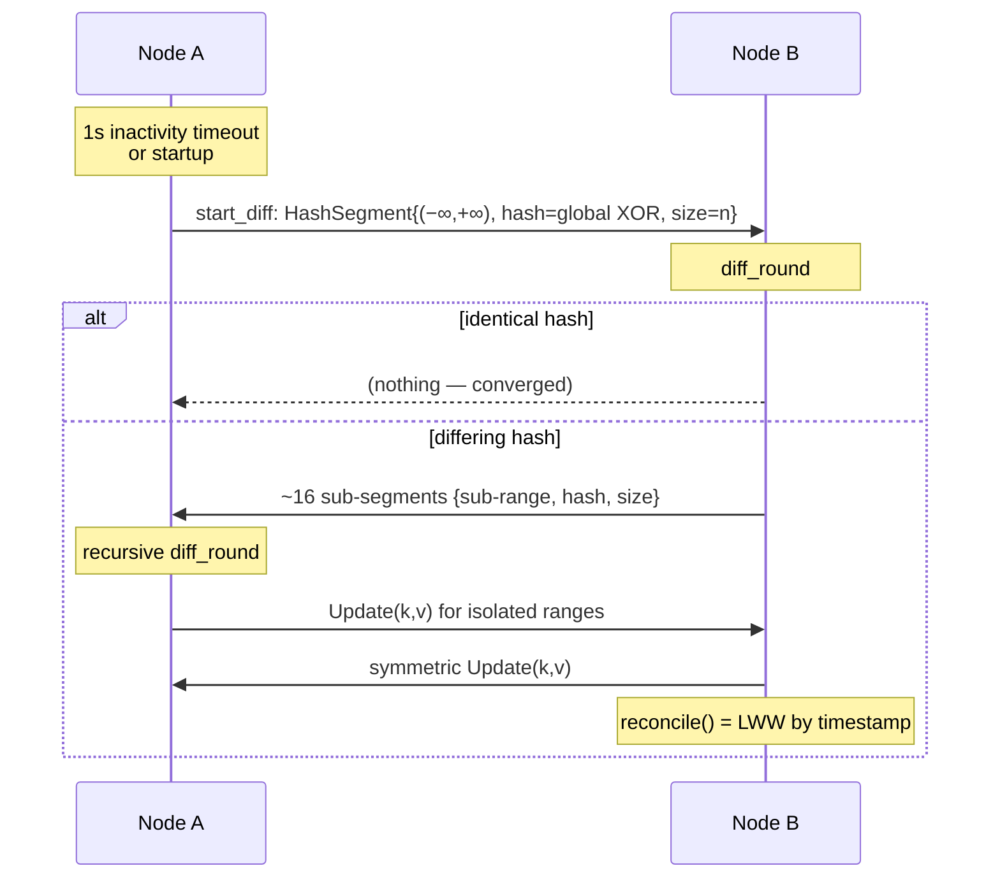

# Peer Review — `reconcile-rs` (crate `reconcile`)

> Scientific-style peer review conducted by a panel of independent reviewers (4 SOTA sub-panels +
> 8 code reviewers in double-blind pairs, 2 per theme). Every claim is backed by a verified
> `file:line` proof and, for SOTA positioning, by cited sources.
>
> - **Date:** 2026-05-30
> - **Audited commit:** `64f1ebf` (branch `master`), review on `claude/merkle-tree-storage-review-LbYCp`
> - **Manifest version:** `0.0.0-git` · **Published crates.io version:** `0.1.5` (~6.8k downloads, 3★)
> - **Method:** exhaustive static reading of `src/`, `tests/`, `benches/`, `Cargo.toml`,
>   `README.md`, `.github/workflows/` + SOTA literature review. No source file was modified.
> - **Navigation:** a [glossary (§9)](#9-glossary) defines ~120 terms and an
>   [alphabetical index (§11)](#11-alphabetical-index) lists them; first uses in the text link to it.

---

## Resolution status (update — 2026-06-03, branch `master`)

> This review audited commit `64f1ebf`. The findings below are preserved verbatim as the
> historical record; **this section tracks their status on current `master`.** All five Critical
> findings and most High findings have since been resolved through issues #106–#113 and #122. Each
> finding in [§4](#4-implementation-review-detailed-findings) also carries an inline
> **Status (master)** note.

| # | Severity | Status | Resolution on `master` |
|---|----------|--------|------------------------|
| F1 | Critical | ✅ Resolved | #106 — range emptiness/equality decided on the exact `size` field, never on `hash==0` |
| F2 | Critical | ✅ Resolved | #107 — malformed datagrams dropped (`warn!` + `return`); no network input can panic the loop |
| F3 | Critical | ✅ Resolved (auth) | #108 — per-datagram keyed MAC, verified before deserialization; opt-in cluster key. Out of scope: confidentiality (#96), peer allow-list |
| F4 | Critical | ✅ Resolved | #109 — tombstone GC gated on causal stability instead of a 60 s wall-clock timer |
| F5 | High | ✅ Resolved | #110 — Hybrid Logical Clock + total order `(wall_ms, counter, node_id)`; commutative merge |
| F6 | High | ✅ Resolved | #111 — 256-bit per-element BLAKE3 fingerprint, combined by addition mod 2²⁵⁶ |
| F7 | High | ✅ Resolved | #112 — `diff_round` validates incoming bounds and uses `checked_sub` |
| F8 | High | ✅ Resolved (wire token) | #111 — the on-wire fingerprint is now BLAKE3 (toolchain-stable). `version_hash` still uses a fixed-key `DefaultHasher` |
| F9 | High | ◐ Mitigated | #108 (authenticated peers only) + #106 (no `hash==0` dump trigger); rate-limiting / path validation still future work |
| F10 | High | ◯ Open | IP-scan discovery / O(N²) membership unchanged |
| F11 | High | ✅ Resolved | #113 — property tests (`tests/proptest_hrtree.rs`) + `tests/fuzz_packets.rs` |
| F12 | Medium | ✅ Resolved | #113 — stray `println!` removed from the hot path |
| F13 | Medium | ◯ Open | `new`/`run` still return no `Result`; `unwrap` on bind/send remains |
| F14 | Medium | ◯ Open | `pre_insert` lock-ordering on the network path not yet reworked |
| F15 | Medium | ✅ Resolved | #122 — pluggable `Persistence` (`InMemoryPersistence`, `FileSnapshot`) reloading tombstones + bookkeeping |
| F16 | Medium | ◐ Partial | README gained Security/Persistence sections; benches still loopback-only |
| F17 | Medium/Low | ◐ Partial | clippy lifetime warning fixed; still `0.0.0-git`, no MSRV/CHANGELOG |
| F18 | Medium | ◯ Open | `peers` map bound / bincode allocation limit not added |
| F19 | Low | ◯ Open | `overflow-checks`, bincode `with_limit`, dependency floors unchanged |

For the forward-looking restructuring of the (now-corrected) codebase into a hexagonal
ports-&-adapters design, see [`ARCHITECTURE.md`](./ARCHITECTURE.md).

---

## 1. Executive summary

> *Technical terms are defined in the [glossary (§9)](#9-glossary) and listed in the
> [alphabetical index (§11)](#11-alphabetical-index). First uses below link to it.*

`reconcile-rs` provides a **distributed, in-memory, *[eventually consistent](#g93)*** key-value
store whose core is the **[HRTree](#g91)** ("Hash-Range Tree"): a hand-written [B-tree](#g95) where
each node caches the cumulative [XOR](#g94) of the `(key,value)` hashes of its subtree plus the
subtree size. This enables a **cumulative-hash range query in [O(log n)](#g95)**, which drives a
**range-based reconciliation protocol ([Range-Based Set Reconciliation, RBSR](#g92))** in the sense
of Meyer (arXiv:2212.13567, 2023). Conflict resolution is **[Last-Write-Wins (LWW)](#g93) by
physical clock `DateTime<Utc>`**; deletions are *[tombstones](#g91)* purged after 60 s; transport is
**[UDP](#g94) + [bincode](#g96)**; peer discovery is done by **random IP sampling within a CIDR**.

**Overall verdict.** The **algorithmic core is real, correct and SOTA-aligned**: the HRTree is, in
the terminology of the 2026 literature, a *[Range-Summarizable Order-Statistics Store](#g92)* (RSOS,
arXiv:2603.19820) — exactly the backend RBSR needs — and the subtree-hash caching trick is correctly
implemented (O(log n) verified). However, the **engineering shell and the distributed-design
choices are pre-alpha** and contain **several critical defects**: silent permanent divergence (the
`hash==0` sentinel), a trivial remote denial of service (panic on a single malformed UDP packet),
resurrection of deleted data (wall-clock tombstone GC), a LWW that is non-commutative on equal
timestamps, and the total absence of authentication/encryption.

Panel convergence: the **two independent reviewers of each theme identified the same critical
findings** — a high-confidence signal, not a phrasing artifact.

### Findings summary table

| # | Finding | Category | Severity | Confidence | Proof |
|---|---------|----------|----------|------------|-------|
| F1 | `hash==0` sentinel conflated with a non-empty range → **silent permanent divergence** | Algo/crypto | **Critical** | High (T1-A & T1-B) | `diff.rs:96-99` |
| F2 | `panic!` on malformed UDP packet → **remote DoS** (process down or zombie node) | Security | **Critical** | High (T2-A & T2-B) | `reconcile_engine.rs:267` |
| F3 | No auth/encryption + **attacker-controlled LWW timestamp** → cluster-wide poisoning/deletion | Security | **Critical** | High (T2-A & T2-B) | `reconcile_engine.rs:200-205,304-322` |
| F4 | **Tombstone resurrection**: wall-clock GC (60 s), no causal stability | Distributed | **Critical** | High (T3-A & T3-B) | `reconcile_store.rs:208-215`; `timeout_wheel.rs:46-57` |
| F5 | **Physical-clock LWW**: lost update under skew + **non-commutative on equal ts** → permanent divergence + livelock | Distributed | **High** | High (T3-A & T3-B) | `reconcilable.rs:19-27` |
| F6 | **64-bit XOR fingerprint**: algebraically weak (self-inverse, GF(2)-linear) + birthday bound; craftable collision | Algo/crypto | **High** | High (T1-A & T1-B + SOTA) | `hrtree.rs:35-40,70-84` |
| F7 | `unimplemented!()`/underflow reachable from a network `HashSegment` → remote panic | Security/Algo | **High** | High (T1, T2) | `diff.rs:112,116,119` |
| F8 | **`DefaultHasher` unstable** across Rust versions/platforms → cross-version non-convergence | Algo/quality | **High** | High (T1, T4) | `hrtree.rs:36` |
| F9 | **UDP amplification/reflection** (dump the DB to a spoofed victim) | Security | **High** | Med-High (T2-A & T2-B) | `reconcile_engine.rs:290-301`; `diff.rs:96-97` |
| F10 | **IP-scan discovery** O(address-space) + O(N²) traffic; data leakage | Distributed/Sec | **High** | High (T2, T3) | `reconcile_engine.rs:228-241` |
| F11 | **No property-testing/fuzzing**; convergence (the central property) is not tested generically | Quality/tests | **High** | Certain (T4-A & T4-B) | `tests/`, `Cargo.toml` |
| F12 | **Debug `println!`** in the `with_mut` hot path | Quality | **Medium** (1 reviewer: Critical) | Certain (T1, T4) | `hrtree.rs:315` |
| F13 | **Panic-only API** (no `Result`); `unwrap()` on bind/send | Quality | **Medium** | High (T4-A & T4-B) | `reconcile_engine.rs:99,240,354,359,365` |
| F14 | `pre_insert` hook run **under the write-lock** on the network path — contradicts the docs | Quality/correctness | **Medium** | High (T4-A & T4-B) | `reconcile_engine.rs:312,317` vs `reconcile_store.rs:98-101` |
| F15 | **No persistence**; restart loses everything + worsens resurrection | Distributed | **Medium** | High (T3-A & T3-B) | `reconcile_engine.rs:101-110` |
| F16 | **Loopback** benchmarks unrepresentative; README self-contradictory ("factor 2" vs "one-third") | Perf/doc | **Medium** | High (T4-A & T4-B) | `README.md:60-71,122-139`; `benches/bench.rs:226-351` |
| F17 | Maturity: `0.0.0-git`, no MSRV, no CHANGELOG, clippy `mismatched_lifetime_syntaxes` would break the `-Dwarnings` CI | Maturity | **Medium/Low** | Certain (T4-A & T4-B) | `Cargo.toml:3`; `hrtree_iter.rs:177` |
| F18 | Memory exhaustion: `peers` map via spoofed IPs, unbounded growth; bincode allocation-bomb | Security | **Medium** | High (T2-A & T2-B) | `reconcile_engine.rs:117-121,208-210` |
| F19 | Dependency hygiene: bincode 1.x without `with_limit`, old tokio floor, `[profile.release] debug=true` without `overflow-checks` | Security/maturity | **Low** | Medium (T2) | `Cargo.toml` |

**Strengths to credit (panel consensus):** correct and elegant RBSR/RSOS core;
rigorous `check_invariants`; **empty-node pull-only** safety (a freshly restarted node cannot delete
peers' data — `diff.rs:99-106`); loopback-confined default `Config`; buffer-truncation detection;
clean `TimeoutWheel`; `Arc`-based memory management for `ReconcileStore` cloning; clean dual
MIT/Apache license.

---

## 2. Objective and relevance vs the SOTA

### 2.1 The stated objective

Per the README: *"a scalable Web service with a non-persistent and eventually consistent key-value
store [...] avoiding any latency related to using an external store such as Redis. All the data is
available locally on all instances"*. In other words: **each web-service replica embeds the full
dataset in memory**, replicas reconcile peer-to-peer, and the user is notified of changes via an
insertion hook.

### 2.2 Relevance and real niche

The niche is **real but narrow**: there is no mature equivalent in the Rust/Tokio ecosystem of
Hazelcast's *Replicated Map* or Akka/Pekko's *Distributed Data* (all JVM). For a **read-heavy** Rust
web service with a moderate working set and rare/benign conflicts (feature flags, routing tables,
presence, configuration), an in-memory replicated cache with local O(log n) reads and no Redis
dependency is legitimately attractive.

**But the "scalable / avoid Redis" positioning inverts the real trade-offs:**

- The latency argument only holds for **reads**. Writes are only *eventually* visible on peers;
  "avoiding Redis latency" actually amounts to **trading a synchronous consistent store for an
  asynchronous inconsistent one** — a consistency-model change dressed up as a latency optimization.
- The topology **does not scale by construction**: full dataset on every replica → memory bounded by
  the smallest node, and **every write is amplified to all nodes** → write throughput *decreases* as
  replicas are added. This is the documented failure mode of replicated caches (Oracle Coherence,
  Apache Ignite). Pekko Distributed Data explicitly recommends **not exceeding ~100,000 entries** in
  full replication — to be compared with the README's "millions of elements" promise.

### 2.3 The SOTA of set reconciliation (sourced)

| Family | Comm. | Compute | RTT | Knows *d*? | Adversarial robustness | Maturity |
|---|---|---|---|---|---|---|
| **XOR RBSR (= reconcile-rs)** | O(d log n) | O(d log n) | **O(log n)** | No (self-adapting) | **Weak** (forgeable XOR) | Earthstar, Willow, Negentropy |
| Secure-fingerprint RBSR (≥256-bit) | O(d log n) | O(d log n) | O(log n) | No | Good | Negentropy (prod) |
| IBLT / Difference Digest | O(d·(b+log U)) | **O(d)** | 1 (+estim.) | **Yes** | Weak | blockchains |
| **Rateless IBLT (SIGCOMM 2024)** | **≈ d** (3-4× < non-rateless) | **linear** (2-2000× < minisketch) | **1 streaming** | **No** | **Designed for adversarial** | Ethereum state-sync |
| minisketch / PinSketch (CPI) | **optimal ≈ b·d** | O(d²) | 1 (+ext.) | **Yes (capacity)** | deterministic if capacity OK | Bitcoin Erlay (BIP 330) |
| Merkle-tree diffing | O(d log n) | O(d log n) | O(log n) | No | hash-dependent | Dynamo, Cassandra, Riak |

Sources: Meyer arXiv:2212.13567 & logperiodic.com/rbsr.html; *Practical Rateless Set
Reconciliation*, SIGCOMM 2024, arXiv:2402.02668; minisketch (bitcoin-core) & BIP 330; Erlay
(CCS 2019); arXiv:2603.19820 (RSOS, 2026).

**Key takeaway:** for the **large-n / small-d / latency-sensitive** profile, RBSR is the **worst
family on latency** (O(log n) sequential RTTs) whereas **Rateless IBLT** finds the diff in a single
streaming exchange, with no *d* estimation, and with adversarial robustness — it is the **current
SOTA choice** for this use case.

### 2.4 The SOTA of Merkle/anti-entropy structures

Important panel nuance: **HRTree does NOT belong to the Merkle Search Tree (MST) / prolly-tree
family**, and that is a point in its favor. MST (Auvolat & Taïani, SRDS 2019) and prolly-trees
(Dolt/Noms) *need* **insertion-order independence** because they diff by comparing the hashes of the
tree's **internal nodes**. HRTree, by contrast, diffs **value-defined ranges**: the cumulative XOR
over `[a,b)` is identical on two peers iff the *content* of the range is identical, **regardless of
each one's B-tree shape**. HRTree therefore obtains the convergence guarantee that MST/prolly pay
for with history-independence, **without paying for it** — and thereby escapes the MST
"leading-zeros" attack. The B-tree's order-dependence is therefore **not** a defect here.

### 2.5 The SOTA of consistency and conflict resolution

- **Physical-clock LWW**: a documented anti-pattern (Jepsen/Kingsbury "The trouble with
  timestamps"; real NTP incidents). The "winner" is the node with the most-advanced clock, not the
  causally latest write → silent lost update.
- **Minimal SOTA fix**: **Hybrid Logical Clocks (HLC, Kulkarni 2014)** — 64-bit drop-in, monotonic,
  respects causality, divergence bounded by ε; adopted by CockroachDB and MongoDB.
- **Tie-break**: must be a **deterministic total order** (e.g. `(HLC, node_id)`). The current `keep
  local on equal` is non-convergent.
- **Tombstone GC**: must be by **causal stability** (acknowledgment by all replicas) — Cassandra:
  `gc_grace_seconds` = **10 days** + a complete repair within the window; ScyllaDB: repair-based GC.
  **60 s** makes the safety precondition nearly impossible to honor.

---

## 3. Architecture and algorithms

### 3.1 Modules

| File | Role |
|---|---|
| `hrtree.rs` | Hand-written B-tree (B=6, capacity 5-11) with `tree_hash` (XOR) + `tree_size` caches; O(log n) cumulative-hash query |
| `diff.rs` | `HashRangeQueryable` / `Diffable` traits; RBSR protocol (`start_diff` + `diff_round` with ~16-way split) |
| `reconcile_engine.rs` | UDP + bincode transport; `parking_lot::RwLock` locks; peer discovery (`gen_ip`) |
| `reconcile_store.rs` | Public API; LWW timestamps; tombstone GC |
| `reconcilable.rs` | `Reconcilable` trait (LWW merge) |
| `timeout_wheel.rs` | Tombstone expiry (BTreeMap + HashMap, `std::sync::RwLock`) |
| `gen_ip.rs`, `hrtree_iter.rs`, `lib.rs` | IP generation, iterators, re-exports |

### 3.2 Reconciliation protocol flow

Each `diff_round` splits a non-matching range into ~16 sub-ranges (`diff.rs:141`) until the
differing elements are isolated → **O(log₁₆ n) rounds**, **O(d·log n)** messages. Central (correct)
trick: `hash(range)` instantly returns the cached `tree_hash` when a subtree is fully contained,
recursing only along the two bounds (`hrtree.rs:608-611`).

### 3.3 Design decisions and trade-offs

| Decision | Pro | Con / trade-off |
|---|---|---|
| HRTree (augmented B-tree = RSOS) | O(log n) for ops + hash-range; value-based diff (no need for history-independence) | hand-written B-tree to maintain; ~2-3× slower than `BTreeMap` |
| 64-bit XOR fingerprint | commutative/invertible → O(log n) range subtraction, incremental | **self-inverse + GF(2)-linear + 64-bit** → accidental collisions (birthday ~2³²) and **craftable**; ambiguous `0` sentinel (F1) |
| RBSR (Meyer 2023) | few RTTs, self-adapting to *d*, incremental fingerprints | **O(log n) sequential RTTs**: worst family on latency for large-n/small-d |
| LWW `DateTime<Utc>` | trivial, O(1) metadata | lost update under skew; **non-commutative on equality**; no causality |
| Tombstones + 60 s GC | propagated deletion; bounded memory | **resurrection** if partition > 60 s; no causal stability |
| UDP + bincode transport | low latency, connectionless | **no auth/encryption**; panic on malformed; amplification |
| CIDR-scan discovery | no coordinator | O(address-space); O(N²) traffic; data leakage; network scan |
| In-memory only | performance, simplicity | total loss on restart; worsens resurrection |

---

## 4. Implementation review (detailed findings)

> Format: claim → proof → impact → recommendation. Findings confirmed by **both** independent
> reviewers of a theme are marked "**[2/2]**" (high confidence).

### F1 — [CRITICAL] `hash==0` sentinel ≡ empty range → silent permanent divergence **[2/2]**

`diff.rs:96-99` treats `hash==0` as "empty/absent range". But the fingerprint is an XOR: **a
non-empty multiset can XOR to 0** (two elements with equal hashes, or any even set that cancels).
And `HRTree.hash(empty range) == 0` (confirmed `hrtree.rs:795`), so the sentinel **aliases a real,
reachable value**. The `size` field is only consulted *after* the hash checks (`diff.rs:119-138`),
so a non-empty range with hash 0 short-circuits beforehand.

**Counterexample (both reviewers converge):** A = `{X, Y}` with `h(X)==h(Y)`, B empty.
`A.start_diff()` emits `{(−∞,+∞), hash:0, size:2}`. On B: `local_hash=0`, so `hash==local_hash` →
`continue`. **B believes it is synced while missing 2 elements.** Permanent divergence, with no
panic or log. Triggerable by an attacker who chooses the data.

**Recommendation (consensus):** branch on **`size==0` / `local_size==0`** (the field already exists
in `HashSegment` and is exact), never on `hash==0`. A one-line fix, to block before release. *This
is the most serious finding in the repository.*

> **Status (master): ✅ Resolved (#106).** Range emptiness and equality are now decided on the
> exact `size` field, never on `hash==0`; the sentinel that aliased a real value is gone.

### F2 — [CRITICAL] `panic!` on malformed UDP packet → remote DoS **[2/2]**

`reconcile_engine.rs:267`: any datagram that is not a clean EOF truncation triggers `panic!`. A
single invalid byte (`0xFF`) is enough (invalid bincode enum tag). Detailed panel analysis:
`Cargo.toml` does **not** set `panic="abort"` (unwind). In the `demo.rs` pattern (`run().await`
under `#[tokio::main]`), the panic **kills the process**. In the `tokio::spawn` pattern (the tests),
the task dies and the panic is **silently swallowed** → **zombie node**: the process lives, local
reads work, but the run-loop AND the tombstone GC are dead forever. Unauthenticated, scriptable
across an entire subnet.

**Recommendation:** replace `panic!` with `warn!` + `return` (exactly the pattern already present
for the too-small buffer, `:250-253`). Never panic on network input.

> **Status (master): ✅ Resolved (#107).** Malformed datagrams are dropped with `warn!` + `return`
> (the pattern this finding recommended); no network input can panic the run-loop.

### F3 — [CRITICAL] No auth/encryption + attacker-controlled LWW timestamp **[2/2]**

`reconcile_engine.rs:200-205` merely *logs* a warning on unexpected port then processes the packet;
`:304-322` merges every received `Update`. Since the value is `(DateTime<Utc>, Option<V>)` and the
merge is LWW by timestamp, **the attacker controls the serialized timestamp**: `Update((k,
(Utc.year_9999, Some(evil))))` wins against any legitimate write forever, or `None` forges a
deletion. The poison **propagates to the whole cluster** via reconciliation. Source IP is spoofable
(UDP).

**Recommendation:** shared-secret MAC (keyed HMAC/BLAKE3) verified before deserialization + a peer
allow-list; for confidentiality, DTLS/Noise/QUIC. Failing that, **document loudly** that the
protocol requires a trusted network.

**Status — partially mitigated (issue #108).** A per-datagram keyed MAC is now implemented
(`src/auth.rs`): when a cluster key is set via `Config::with_cluster_key`, every datagram is framed
`tag || payload` and **verified before deserialization**, with unauthenticated/forged datagrams
silently dropped (`reconcile_engine.rs`, `handle_messages`). The MAC primitive is feature-abstracted
(`mac-blake3` default, `mac-hmac`). Authentication is opt-in: when no key is set, the store logs a
loud startup warning, and the README now carries a "Security model" section — so **"document
loudly" is satisfied**. Still **out of scope** / tracked separately: the peer allow-list, and
confidentiality (DTLS/Noise/QUIC, issue #96). The attacker-controlled-timestamp vector is closed for
external attackers once a key is configured; the broader physical-clock concern remains F5.

### F4 — [CRITICAL] Tombstone resurrection (wall-clock GC, no causal stability) **[2/2]**

`reconcile_store.rs:208-215` + `timeout_wheel.rs:46-57`: a tombstone is purged 60 s after the
deletion (`instant + timeout < Utc::now()`), **without checking that all peers have seen it**.
Timeline (both reviewers build it): C partitioned > 60 s; A & B delete `k`, tombstone GC'd; C comes
back with the old value; via the `None => insert(remote_v)` branch (`reconcile_engine.rs:316-319`),
A & B **re-insert** the value → **the deletion is undone, the data resurrects cluster-wide**. This
is the classic hazard (Dynamo/Cassandra `gc_grace_seconds`), but at 60 s vs 10 days.

**Recommendation:** GC gated on **causal stability** (acknowledgment by all replicas) or on a
complete repair within the window; or versioned tombstones (HLC/VV) as first-class state. *Severity:
Critical (T3-A) / High (T3-B) → retained as Critical.*

> **Status (master): ✅ Resolved (#109).** Tombstone GC is now gated on causal stability — every
> monotonic cluster member must have acknowledged the exact version — instead of a 60 s wall-clock
> timer, closing the resurrection window.

### F5 — [HIGH] Physical-clock LWW: loss under skew + non-commutative on equality **[2/2]**

`reconcilable.rs:19-27`: `if other.0 > self.0 { other } else { self }`. (a) **Skew**: a causally
later write is overwritten by an older one coming from a node with an advanced clock → silent loss.
(b) **Equal timestamp**: strict `>` keeps local on both sides → A keeps "a", B keeps "b" →
**permanent divergence + livelock** (each `diff_round` re-exchanges the pair forever; the hash
includes the timestamp so the segments never converge). The merge is therefore **not commutative** →
violates SEC.

**Recommendation:** HLC + a deterministic total-order tie-break `(timestamp, node_id)`.

> **Status (master): ✅ Resolved (#110).** Physical-clock LWW is replaced by a Hybrid Logical Clock
> with the deterministic total order `(wall_ms, counter, node_id)`; on receiving a peer's stamp a
> node advances its clock, so the merge is commutative/associative/idempotent (SEC).

### F6 — [HIGH] Weak 64-bit XOR fingerprint **[2/2 + 2 SOTA panels]**

`hrtree.rs:35-40,70-84`. XOR is commutative and **self-inverse** (needed for range subtraction, but)
→ collisions via permutation/cancellation. **GF(2)-linear**: an attacker *solves* (Gaussian
elimination, ~2 s even in 256-bit per Log Periodic) for elements that collide the fingerprint of a
divergent range → **censorship / silent loss** (the attack documented by the Willow spec). **64
bits**: accidental collisions at the birthday bound (~2³²) over the large number of compared ranges.
Negentropy (inspired by Meyer) abandoned the naive combiner for an incremental cryptographic hash
≥256-bit.

**Recommendation:** wide (≥256-bit) and non-GF(2)-linear fingerprint (hash-then-add mod 2²⁵⁶,
MSet-Mu-Hash/LtHash) or keyed; incorporate `size` into the equality decision (also fixes F1).

> **Status (master): ✅ Resolved (#111).** The 64-bit XOR is replaced by a 256-bit fingerprint:
> per-element BLAKE3 combined by addition mod 2²⁵⁶ — non-GF(2)-linear, collision-resistant, and a
> stable cross-version wire token.

### F7 — [HIGH] `unimplemented!()` / underflow reachable from the network **[T1 + T2]**

`diff.rs:112,116`: `diff_round` assumes bounds `(Included|Unbounded, Excluded|Unbounded)`; but
`HashSegment.range` is deserialized from the network without validation. A segment crafted with
`Bound::Excluded` as start → `unimplemented!()` → remote panic. Worse (T2-B): an inverted range
`Included(100)..Excluded(5)` causes `end_index - start_index` (`diff.rs:119`) → **underflow** (panic
in debug, wrap to a huge `usize` in release → OOB index in `key_at`).

**Recommendation:** validate/normalize incoming bounds; handle all 4 combinations or drop the
segment without panicking; `overflow-checks = true`.

> **Status (master): ✅ Resolved (#112).** `diff_round` validates incoming `HashSegment` bounds and
> uses `checked_sub`, so crafted or inverted ranges are dropped rather than triggering
> `unimplemented!()` or an index underflow.

### F8 — [HIGH] `DefaultHasher` unstable cross-version **[T1 + T4]**

`hrtree.rs:36`: `DefaultHasher` is **not stable** across Rust versions/platforms (std docs). Since
the hash is the **reconciliation token on the wire**, two nodes built with different toolchains
(rolling upgrade, 32 vs 64-bit) compute different hashes for identical data → they believe they
perpetually differ and **never converge** (or re-exchange everything in a loop).

**Recommendation:** fixed, versioned hasher (constant-key SipHash, xxHash, BLAKE3); treat the hash
algorithm as part of the wire protocol + golden-vector test.

> **Status (master): ✅ Resolved for the wire fingerprint (#111).** The on-wire reconciliation token
> is now a fixed BLAKE3, identical across toolchains and platforms. (`version_hash`, the internal
> tombstone-acknowledgment token, still uses a fixed-key `DefaultHasher`.)

### F9 — [HIGH] UDP amplification / reflection **[2/2]**

`reconcile_engine.rs:290-301` replies to the *source* address (spoofable). A tiny `ComparisonItem`
`{(−∞,+∞), hash:1, size:0}` forces, via the `hash==0` branch (`diff.rs:96-97`), the node to **dump
its entire DB** as `Update`s to the spoofed victim. Amplification factor ≈ DB size / request size
(potentially thousands). DRDoS reflector + exfiltration channel.

**Recommendation:** do not reply to unauthenticated/unconfirmed peers; rate-limiting; a path-
validation cookie before any bulk send. Auth (F3) closes most of it.

> **Status (master): ◐ Mitigated.** With a cluster key set (#108) only authenticated peers are
> answered, and #106 removes the `hash==0` "dump the whole DB" trigger. Dedicated rate-limiting and
> path-validation cookies remain future work.

### F10 — [HIGH] Non-scalable IP-scan discovery + leakage **[T2 + T3]**

`reconcile_engine.rs:228-241`: **one** random CIDR IP probed per cycle; peers learned only from
received packets, expired at 60 s. In a `/8` (default) with N nodes, the expected discovery of a
peer ≈ 2²⁴/N cycles → **practically impossible without `with_seed`**. In steady state, every node
gossips with **all** peers → **O(N²) traffic** (no bounded fan-out à la SWIM/HyParView). The probe
sends the full diff payload (revealing existence, port, `len()`) to potentially third-party/hostile
hosts.

**Recommendation:** a real membership protocol (SWIM/HyParView) with peer-list gossip (O(log N)
discovery) and bounded fan-out (random subset); probe with pings, not diffs; refuse/warn on routable
CIDR.

> **Status (master): ◯ Open.** Peer discovery and membership are unchanged.

### F11 — [HIGH] No property-testing / fuzzing **[2/2]**

19 tests, **0** `proptest`/`quickcheck`/`fuzz` (verified). The central property — *any two stores
converge after exchange, regardless of order* — is exercised only by **one** fixed-seed integration
test (`tests/service.rs`). `check_invariants` (excellent) is only run on author-chosen sequences.
The hand-written B-tree rebalancing (with a `TODO` at `hrtree.rs:97`) is exactly the code where a
proptest would find edge cases.

**Recommendation:** proptest generating two random trees → full diff loop → convergence + invariant
assertions + "returned ranges = true symmetric difference"; test against a `BTreeMap` oracle;
malformed-packet test (also covers the F2/F7 blind spot).

> **Status (master): ✅ Resolved (#113).** Convergence is now exercised by property tests
> (`tests/proptest_hrtree.rs`), and `tests/fuzz_packets.rs` drives the malformed-packet path.

### F12 — [MEDIUM] Debug `println!` in the hot path **[T1 + T4]**

`hrtree.rs:315`: `println!("{diff_hash}")` executed on **every** `with_mut`/`get_mut` mutation.
stdout pollution + syscall+lock per mutation, outside the `tracing` infrastructure. *Severity:
Critical (T4-B) / High (T4-A) / Low (T1) → retained as Medium, but a trivial and priority fix.*
**Recommendation:** delete the line (or `trace!`).

> **Status (master): ✅ Resolved (#113).** The stray `println!` in the `with_mut` hot path was
> removed.

### F13 — [MEDIUM] Panic-only API **[2/2]**

No public method returns `Result`. `new()` does `bind(...).unwrap()` (`reconcile_engine.rs:99`);
`send_to_retry(...).unwrap()` (`:240,354,359,365`) panics the run-loop on a persistent send failure.
Impossible to handle "port in use" or "peer unreachable" cleanly.
**Recommendation:** `new()/run() -> io::Result<…>`; log-and-continue on send errors.

> **Status (master): ◯ Open.** `new`/`run` still return `Self`/`()`; `unwrap` on bind and on
> `send_to_retry` remains.

### F14 — [MEDIUM] `pre_insert` hook under the write-lock on the network path **[2/2]**

`reconcile_engine.rs:312,317` call the hook **while holding** `map.write()`, which **contradicts the
docs** of `add_pre_insert` (`reconcile_store.rs:98-101`: "executed outside the map's write lock")
and the direct `just_insert` path (`:123-130`) which does run it outside the lock. The anti-deadlock
test only covers the direct path → the guarantee is false and untested for the dangerous path (a
hook that re-inserts from the network path re-enters the write-lock → deadlock).
**Recommendation:** collect merged values under the lock, release it, run hooks, then re-acquire to
apply; align with the direct path.

> **Status (master): ◯ Open.** The network-path lock ordering around `pre_insert` has not yet been
> reworked.

### F15 — [MEDIUM] No persistence **[2/2]**

`reconcile_engine.rs:101-110`: HRTree in memory only. Restart = total loss + **resurrection trigger**
(a node that restarts loses its tombstones → re-learns already-deleted values). **Positive point
confirmed by both reviewers:** an empty node only **pulls** (`diff.rs:99-106`) and **cannot delete**
peers' data — absence is never interpreted as a deletion.
**Recommendation:** optional persistent snapshot/WAL **including the tombstones**; pull-then-quiesce
at startup.

> **Status (master): ✅ Resolved (#122).** A mandatory, pluggable `Persistence` trait now exists with
> `InMemoryPersistence` (default) and `FileSnapshot`; on restart the live values, tombstones, and
> issue-#109 causal-stability bookkeeping are reloaded before the node rejoins gossip.

### F16 — [MEDIUM] Loopback benchmarks + self-contradictory README **[2/2]**

`benches/bench.rs:226-351` measures on loopback (busy-spin `sleep(1µs)`), yet the README itself
admits (`:138-139`) that network transmission dominates in practice — so the "240-640 µs" prove
nothing about deployment (they mostly prove the small **RTT count**, which is the real
contribution). Inconsistency: "within a factor 2 of BTreeMap" (`:60-61`) vs "one third to one half
the throughput" (`:71`) = 2-3× slower. Typos "700 s"/"800 s" for ns.
**Recommendation:** present RTT count / CPU cost as the headline metric; harness with injected
RTT/loss (netem); fix the text.

> **Status (master): ◐ Partial.** The README now documents the security model and persistence;
> benchmarks are still loopback-only.

### F17 — [MEDIUM/LOW] Maturity signals **[2/2]**

`Cargo.toml:3` `version = "0.0.0-git"` (misleading crates.io/docs.rs badges; CI's `publish
--dry-run` would reject this version); no `rust-version` (MSRV); no CHANGELOG; clippy warning
`mismatched_lifetime_syntaxes` (`hrtree_iter.rs:177`) that would **break the CI** under `-Dwarnings`
on a recent toolchain → the project is no longer green against current stable; single-OS CI, no miri
(despite the `unsafe` iterators), no MSRV, no `cargo audit`.
**Recommendation:** real version + MSRV + CHANGELOG; `cargo clippy --fix`; miri/MSRV/audit jobs.

> **Status (master): ◐ Partial.** The clippy `mismatched_lifetime_syntaxes` warning is fixed (CI is
> green under `-Dwarnings`); the version is still `0.0.0-git` with no MSRV or CHANGELOG.

### F18 — [MEDIUM] Resource exhaustion **[2/2]**

`reconcile_engine.rs:208-210` inserts `peer.ip()` into the `peers` map on every datagram; with
spoofed IPs (IPv6 ≈ unbounded) the map balloons without bound within the 60 s window, and every
cycle sends to **all** of them. bincode 1.x reads an attacker-controlled length prefix →
pre-allocation (allocation-bomb) if `K`/`V` contains `Vec`/`String`.
**Recommendation:** bound the `peers` map size (LRU/handshake); `bincode::…with_limit()`; bound the
number of messages/segments per datagram.

> **Status (master): ◯ Open.** The `peers` map is still unbounded and bincode has no allocation
> limit.

### F19 — [LOW] Dependency hygiene **[T2]**

`bincode = "1.3.3"` (1.x in maintenance, no default allocation limit); old `tokio` floor (1.33);
`range-cmp = "0.1.1"` low-popularity (to audit); `[profile.release] debug=true`
(`Cargo.toml:13-14`) without `overflow-checks` (leaves F7 exploitable as a wrap).
**Recommendation:** `cargo audit`/`cargo deny` in CI; raise the floors; `overflow-checks=true`.

---

> **Status (master): ◯ Open.** `overflow-checks` is still off in the release profile, bincode has no
> `with_limit`, and the dependency floors are unchanged.

## 5. Pros / cons and trade-offs (synthesis)

**What is well done (to keep):**
- RBSR/RSOS core **correct and SOTA-aligned**; O(log n) verified; elegant hash caching.
- **Value-based range diff** → convergence without needing history-independence, immunity to the MST
  leading-zeros attack. *A real conceptual strength.*
- Rigorous `check_invariants`; clean `TimeoutWheel`; **empty-node pull-only** (does not destroy
  peers' data); loopback-safe default; truncation detection; clean dual license.

**What weighs the project down (by severity):**
1. Silent correctness compromised (F1, F6, F8) — undetected permanent divergence.
2. Hostile network surface (F2, F3, F7, F9, F10, F18) — trivial unauthenticated DoS/poisoning.
3. Unsafe distributed semantics (F4, F5, F15) — data loss, resurrection, non-SEC.
4. Engineering maturity (F11, F12, F13, F14, F16, F17, F19) — tests, API, docs, perf.

---

## 6. Gap analysis vs SOTA target

| Axis | reconcile-rs | SOTA target | Gap |
|---|---|---|---|
| **Reconciliation algo** | XOR RBSR, O(log n) RTT | Rateless IBLT (1 exchange, no-*d*, robust) for large-n/small-d | O(log n) RTT latency vs 1; no adversarial robustness |
| **Fingerprint** | 64-bit XOR, GF(2)-linear, sentinel 0 | ≥256-bit incremental non-linear / keyed (Negentropy) | accidental + craftable collisions; F1 |
| **Diff backend** | augmented B-tree = RSOS | RSOS (arXiv:2603.19820) | **Conformant** (strength) |
| **Structure** | order-dependent, value-based diff | MST/prolly (history-independent) OR RSOS | **OK** (value-based diff removes the need) |
| **Conflict resolution** | physical-clock LWW, non-commutative tie-break | HLC + deterministic total tie-break; CRDT for zero loss | loss under skew; divergence on equality |
| **Deletions** | tombstones, 60 s time-based GC | causal-stability GC / complete repair | **resurrection** guaranteed under partition > 60 s |
| **Consistency** | "eventually consistent" claimed | SEC (strong eventual consistency) | does not reach SEC; permanent divergence possible |
| **Transport security** | plaintext UDP, no auth | AEAD/HMAC + allow-list (memberlist, iroh) | unauthenticated poisoning/DoS/amplification |
| **Membership** | random IP scan, O(N²) | SWIM/HyParView, bounded fan-out, member gossip | impractical discovery at scale; O(N²) traffic |
| **Persistence** | none | snapshot/WAL (prolly, iroh-docs) | loss on restart; worsens resurrection |
| **Tests** | fixed-seed examples | property-testing + convergence/invariant fuzzing | central property untested |
| **Maturity** | 0.0.0-git, no MSRV/CHANGELOG | semantic versioning, MSRV, miri/audit in CI | pre-alpha signals |

**Direct competitors worth knowing:** Pekko/Akka Distributed Data (CRDT + gossip, JVM);
`merkle-search-tree` (domodwyer, Rust); iroh + iroh-docs (Rust, encrypted QUIC + persistent CRDT
KV); Hazelcast Replicated Map. For "shared mutable state across web-service replicas" with a
durability/correctness requirement: Redis/Dragonfly + local cache, or rqlite/FoundationDB.

---

## 7. Detailed competitor audit and differentiators

> This section refocuses the analysis on the **HRTree as a data structure** (and its protocol),
> not on the full system. *(All structure/algo names below are defined in the
> [glossary §9.2](#g92).)* Methodological anchor: the HRTree **is not a [Merkle tree](#g92) in the
> [MST](#g92)/[prolly](#g92) sense**. It is a *[Range-Summarizable Order-Statistics Store](#g92)*
> (RSOS) — a B-tree augmented, per node, with a **composable subtree summary** (the XOR of hashes)
> **+ an order statistic** (the subtree size). This abstraction was formalized in 2026
> (arXiv:2603.19820) as the backend that range-based reconciliation (RBSR, Meyer 2023) needs. Its
> **true peer group** = the other diffable structures; its **true algorithmic competitor** = the
> other set-reconciliation families.

### 7.1 Competitors at the "diffable data structure" level

#### Merkle Search Tree (MST) — Auvolat & Taïani, SRDS 2019
A search B-tree where a key's **level** is derived from the **hash of the key** (leading zeros →
fanout) ⇒ two replicas with the same key set produce the **same tree and same root hash**,
regardless of insertion order (*history-independence*). Diff = root-hash comparison (O(1)) then
descent comparing **internal node hashes**.
- ✅ History-independent (necessary because it diffs *nodes*); compact page serialization/diff;
  mature, **fuzz-tested** Rust crate (`merkle-search-tree`, domodwyer); production **Bluesky/atproto**
  (one MST per repository).
- ❌ **"Leading-zeros" attack**: an attacker forges keys with very deep hashes to inflate height and
  unbalance the tree. ❌ Only probabilistic balancing; no native rank/select.
- **vs HRTree:** MST *pays* for history-independence; HRTree does not (value-based diff, §7.3) and
  **escapes the leading-zeros attack**. But MST gains structural sharing (versioning) that HRTree
  lacks.

#### Prolly trees (Noms, Dolt) — *probabilistic B-trees*
A **content-addressed** B-tree, boundaries fixed by a **rolling-hash chunker** (~4 KB).
History-independent, self-balancing, and crucially **structural sharing**: unchanged subtrees share
identical chunks across versions.
- ✅ SOTA of **diffable AND versioned** ordered stores: diff/merge touch only changed chunks (the
  foundation of Dolt, "the first version-controlled relational database"). Dolt hashes **keys only**
  → a value update does not move boundaries. Resists the leading-zeros attack.
- ❌ Heavy machinery (rolling hash, chunks, CAS); higher latency than an in-mem B-tree; designed for
  **persistence**.
- **vs HRTree:** prolly = SOTA if you want **versioning + persistence + branch/merge**. HRTree is
  simpler/faster in memory but offers **none** of those. Central trade-off "simplicity/speed vs
  versioning/durability".

#### Merkle radix / Sparse Merkle Tree / "Merklized KV" (Gustafson 2023)
Position by the key's **prefix bits** (trie); history-independent by construction; the basis of
Ethereum (Merkle-Patricia) and SMTs.
- ✅ Deterministic, prefix scans, compact inclusion proofs.
- ❌ Depth ∝ key length (not log n); fixed fanout; less suited to arbitrary range diffs. Relevant
  mostly for **cryptographic proofs**, not for the "large in-memory KV, small diffs" profile.

#### Fixed-depth Merkle tree (Dynamo / Cassandra / Riak)
- ✅ Proven at massive production scale (anti-entropy repair).
- ❌ **Over-streaming**: a leaf covers a *range* of partitions (Cassandra: depth 15 = 32K leaves) →
  a single differing row forces streaming the whole leaf (~30 partitions for 1 bad in 1M). ❌ Tree
  rebuild when token ranges move.
- **vs HRTree:** this is precisely the defect RBSR/HRTree fix (the recursion tightens onto the
  actually-differing elements). **Clear advantage to HRTree** on this axis.

#### RSOS / AELMDB (arXiv:2603.19820, 2026) — *the most direct competitor*
The paper formalizes "**B+-tree augmented with subtree counts + composable summaries**" as the RSOS
abstraction, proves RBSR's local-cost bounds on this backend, and ships **AELMDB**: a **persistent,
memory-mapped** LMDB extension, evaluated with Negentropy.
- **vs HRTree:** **it is the same design**, but (a) **persistent** (LMDB) and (b) with a **secure
  summary** (Negentropy). HRTree *is* an RSOS — but the in-memory, 64-bit-XOR, non-persistent
  version. **The structure's SOTA in this niche = "persistent RSOS + secure fingerprint", and the
  HRTree→SOTA delta reads directly as that gap.**

| Structure | Position/boundary | History-indep. | Diffs… | Structural sharing / versioning | Persistence | Resists leading-zeros | Maturity |
|---|---|---|---|---|---|---|---|
| **HRTree** | B-tree splits (insertion order) | **No** | **value ranges** | No | No (in-mem) | **Yes** (n/a) | pre-alpha |
| MST | level = hash(key) | Yes | nodes | partial | impl-dependent | **No** | mature (Bluesky) |
| Prolly tree | rolling-hash on content | Yes | chunks | **Yes** (CAS) | **Yes** | Yes | mature (Dolt) |
| Merkle radix/SMT | prefix bits | Yes | hash paths | partial | yes | Yes | mature (Ethereum) |
| Fixed-depth Merkle | token range | partial (rebuild) | nodes | no | yes | yes | mature (Cassandra) |
| **RSOS/AELMDB** | augmented B+-tree | not required | ranges | no | **Yes** (LMDB) | yes | research 2026 |

### 7.2 Competitors at the "reconciliation algorithm" level

The HRTree implements **RBSR**; its competitors are not tree structures.

| Family | Communication | Compute | RTT | Knows *d*? | Adversarial robustness | Maturity |
|---|---|---|---|---|---|---|
| **XOR RBSR (HRTree)** | O(d log n) | O(d log n) | **O(log n) sequential** | No (self-adapting) | **Weak** | Earthstar/Willow/Negentropy |
| **Rateless IBLT** (SIGCOMM 2024) | **≈ d** (3-4× < non-rateless) | **linear** (2-2000× < minisketch) | **1 streaming exchange** | **No** | **designed for adversarial** | Ethereum state-sync |
| minisketch/PinSketch (CPI) | **optimal ≈ b·d** | O(d²) | 1 (+ext.) | **Yes (capacity)** | deterministic if capacity | Bitcoin Erlay (BIP 330) |
| CertainSync (2025) | bound f(d,U) | linear | rateless | No | **deterministic success** | SIGMETRICS research |
| Classic IBLT | O(d·(b+log U)) | O(d) | 1 (+estim.) | **Yes** | weak | blockchains |

**Critical reading (stated profile: large n, small d, latency-sensitive, P2P):**
- RBSR is the **worst family on latency**: O(log n) **sequential RTTs** (≈3 for 1M, ≈4 for 1B). On a
  1 ms-RTT LAN that's several ms; on WAN far more — a cost the README's loopback benchmarks hide
  (cf. F16).
- **Rateless IBLT** finds the diff in a **single streaming exchange**, without estimating *d*, with
  explicit adversarial robustness and linear compute → **single-shot SOTA choice** for this use case.
- **But** RBSR keeps two assets that sketches lack: **self-adapting** (no *d* estimation, no failure
  if *d* is mis-guessed) and **ordered-range reconciliation** (partial sync by prefix/subspace —
  what Willow exploits in 3D). Sketches reconcile an *opaque* set.
- **Conclusion:** a **hybrid** SOTA design — RBSR to localize coarsely + a sketch (Rateless IBLT) to
  drain divergent leaves in one shot — would beat pure HRTree on latency without losing
  adaptiveness.

### 7.3 Real differentiators of the approach (strengths verified in the code)

1. **Value-based range diff ⇒ history-independence is not needed** *(the deepest differentiator)*.
   MST/prolly *must* be history-independent because they compare **internal node hashes** (different
   tree shapes → false positives). HRTree never compares nodes: it computes the **cumulative XOR
   over `[a,b)`**, identical on two peers **iff the range content is identical**, regardless of each
   one's B-tree shape. → Convergence guaranteed **without paying** for history-independence, and
   **immunity to the MST leading-zeros attack**.
2. **It is a SOTA-2026-conformant RSOS**: the `tree_hash` cache (composable summary) + `tree_size`
   (order statistic) → range-summary and rank/select queries in **O(log n)** (the arXiv:2603.19820
   contract). Core *aligned* with the most recent theory.
3. **Cheap incremental maintenance**: `tree_hash ^= diff_hash` + `tree_size += 1` propagated along
   the single root→leaf path → O(log n) amortized. The 2-3× factor vs `BTreeMap` is the *expected*
   price of these two invariants, not an anomaly.
4. **A single structure stores AND reconciles**: no separate Merkle tree to maintain (contrast
   Cassandra which builds the tree at repair time). The store *is* the reconciliation index.
5. **Avoids Cassandra's over-streaming** (16-way recursion tightened onto real diffs).
6. **Rust-native, in-process, embeddable**: a real ecosystem niche (mature equivalents = JVM).

### 7.4 What is missing to make it a *true* SOTA structure

The delta = the gap between the HRTree and the ideal "persistent RSOS with a secure, generic
fingerprint".

**P0 — Correctness of the structure itself:**
1. **Secure and wide fingerprint**: replace the 64-bit XOR with a **≥256-bit, non-GF(2)-linear**
   combiner (hash-then-add mod 2²⁵⁶, MSet-Mu-Hash/LtHash) or *keyed*. XOR = self-inverse + linear →
   craftable collisions (Gaussian elimination ~2 s even in 256-bit) + birthday at 2³². The path
   taken by Negentropy. **This is THE criterion that separates a "toy" structure from a SOTA one.**
   (cf. F6)
2. **Decouple "empty" from "hash==0"** (`size==0`) — otherwise the structure can claim "converged"
   while having lost data. (cf. F1)
3. **Stable, versioned hash as a wire contract** (pinned SipHash/xxHash/BLAKE3 + golden-vector).
   (cf. F8)

**P1 — Generality (what makes it a *structure*, not a special case):**
4. **Generic summary over a monoid**: `HRTree<XOR>` → `RSOS<M: Monoid>` (secure fingerprint, but
   also sum/min/max/count, sketches). Enables **embedding a sketch in the leaves** (hybrid RBSR +
   Rateless IBLT) to break the O(log n) RTT cost (§7.2).
5. **Fully expose the RSOS contract**: **lazy + double-ended** iterators (repo issues #90-92),
   public `rank`/`select`/`seek_lower_bound`/`seek_upper_bound` → a reusable generic building block.

**P2 — Durability & distributed properties carried by the structure:**
6. **Persistence / content-addressing** *(the big gap vs prolly/AELMDB)*: (a) snapshot+WAL including
   tombstones, or (b) the true SOTA step — **node content-addressing** for *structural sharing*
   (versioning, diff between snapshots, incremental cold start).
7. **Conflict metadata in the value**: HLC + total tie-break `(timestamp, node_id)`; ideally
   **pluggable CRDT** values; versioned tombstones with **causal-stability GC**. (cf. F4, F5)

**P3 — What makes it *believed* to be SOTA:**
8. **Property-testing + fuzzing as a foundation**: `proptest` vs `BTreeMap` oracle +
   `check_invariants`, and especially **the convergence property** (two random trees → diff loop →
   identical state + ranges = true symmetric difference, under reordered/duplicated/dropped
   messages). The category standard (`merkle-search-tree` is fuzz-tested). (cf. F11)
9. **First-class adversarial robustness**: segment-bound validation, allocation bounds, bounded
   fan-out — to hold up against hostile peers (the MST/Willow use case).

**Delta synthesis:**

| Axis | HRTree today | SOTA target | Missing |
|---|---|---|---|
| Summary | 64-bit XOR | ≥256-bit non-linear/keyed, **generic (monoid)** | security + generality |
| Empty vs hash | `hash==0` sentinel | `size==0` | correctness (1 line) |
| Hash | `DefaultHasher` (unstable) | fixed, versioned, wire contract | portability |
| Backend | augmented in-mem B-tree (RSOS ✓) | **persistent RSOS** (AELMDB) | durability, content-addressing |
| Algo | pure RBSR (O(log n) RTT) | **hybrid RBSR + Rateless IBLT** | single-shot latency |
| Conflicts | physical-clock LWW | HLC + total tie-break / CRDT | real convergence |
| Deletions | 60 s time-based GC | causal stability | no resurrection |
| Confidence | 19 fixed-seed tests | property tests + convergence fuzz | invariant proof |

**In one sentence:** the HRTree already has the **right skeleton** (an RSOS — the design validated
by 2026 research — with a real differentiator: value-based diff that removes the need for
history-independence). To become a *true* SOTA structure it mainly needs (1) a **secure, wide,
stable and generic fingerprint**, (2) the **persistence / content-addressing** it lacks vs
prolly-trees, and (3) a **property-testing foundation**; the rest (conflicts, GC, robustness)
belongs to the surrounding system.

---

## 8. Prioritized recommendations

> **Update (master):** many of the recommendations below are now implemented — see the
> **Resolution status** section near the top of this document. The list is kept as written at audit
> time (commit `64f1ebf`).

**P0 — Blocking (silent correctness & security):**
1. **F1**: branch empty detection on `size==0`, never `hash==0` (one-line fix).
2. **F2**: replace `panic!` (`reconcile_engine.rs:267`) with `warn!`+`return`.
3. **F7**: validate the bounds of network `HashSegment`s; remove the `unimplemented!()`;
   `overflow-checks=true`.
4. **F3**: auth/integrity (cluster-secret HMAC) + peer allow-list; failing that, document loudly the
   trusted-network requirement.
5. **F12**: remove the `println!` (`hrtree.rs:315`).

**P1 — Distributed correctness & robustness:**
6. **F4**: causal-stability tombstone GC (acknowledgment by all replicas).
7. **F5**: HLC + deterministic total-order tie-break `(timestamp, node_id)`.
8. **F6 + F8**: wide (≥256-bit), non-linear, **stable and versioned** fingerprint.
9. **F9 + F10 + F18**: do not reply to unauthenticated peers; SWIM membership + bounded fan-out;
   bincode `with_limit`; bounds on `peers`.
10. **F11**: convergence/invariant property tests + malformed-packet tests.

**P2 — Maturity & quality:**
11. **F13/F14**: fallible API (`Result`); hooks outside the write-lock on the network path.
12. **F15**: optional persistence (snapshot/WAL with tombstones).
13. **F16/F17/F19**: reframe the benchmarks (RTT/CPU); real version + MSRV + CHANGELOG;
    `clippy --fix`; `cargo audit`/miri in CI.

---

## 9. Glossary

> Lists **(a)** the identifiers and constants introduced by the repository, **(b)** the competing
> structures and algorithms cited, **(c)** the acronyms and concepts of distributed systems,
> cryptography, networking and complexity, **(d)** the Rust tooling. `Fxx` references point to the
> §4 findings; `file:line` references to the code.

### 9.1 — Repository-specific terms and identifiers

| Term | Definition |
|---|---|
| **HRTree** (*Hash-Range Tree*) | The central structure (`hrtree.rs`): a hand-written B-tree where each node caches `tree_hash` (XOR of the subtree hashes) and `tree_size`. Enables a cumulative-hash range query in O(log n). It is an RSOS (§9.2). |
| **`tree_hash`** | Node field: cumulative XOR of the `hash(key,value)` of all subtree elements. The composable summary that drives the diff. Maintained incrementally (`tree_hash ^= diff_hash`). |
| **`tree_size`** | Node field: number of subtree elements (order statistic). Gives `len()` in O(1) and rank/select navigation. |
| **`hash(key, value)`** | Function (`hrtree.rs:35-40`) computing the 64-bit hash of a pair via `DefaultHasher`. The fingerprint building block (F6, F8). |
| **`B` / `MIN_CAPACITY` / `MAX_CAPACITY`** | B-tree parameters: `B = 6`, node capacity 5 to 11 keys (`hrtree.rs:42-44`). |
| **`refresh_hash_size`** | Recomputes a node's `tree_hash` and `tree_size` from its elements and children (`hrtree.rs:70-84`). |
| **`check_invariants`** | Test function (`hrtree.rs:495-560`) that re-verifies ordering, min node size, height balance, and the correctness of the `tree_hash`/`tree_size` caches. An excellent tool, but only run on fixed sequences (F11). |
| **`insertion_position` / `key_at` / `position`** | Order-statistic navigation: insertion index of a key, key at a given index, index of a key. O(log n). |
| **`get_range`** | Lazy iterator over a key range (O(log n + k)). Materialized with clones in the network handler (F16/perf). |
| **`with_mut` / `get_mut`** | In-place mutation of a value with restoration of the hash invariant. Contains the stray `println!` (F12, `hrtree.rs:315`). |
| **`rebalance_after_deletion`** | B-tree rebalancing after deletion (steal-left/steal-right/merge). Has a `TODO` (`hrtree.rs:97`) on a degenerate split case. |
| **`HashRangeQueryable`** | Trait (`diff.rs`) exposing the cumulative-hash range query; implemented by HRTree. |
| **`Diffable`** | Trait (`diff.rs`) carrying `start_diff` and `diff_round`: the RBSR machinery. |
| **`start_diff`** | Emits the root segment `{(−∞,+∞), global hash, size}` that bootstraps a reconciliation. O(1). |
| **`diff_round`** | Protocol core (`diff.rs:85-169`): compares a received segment to the local one, then either concludes or subdivides the range into ~16 sub-segments. Contains the `hash==0` sentinel (F1) and the `unimplemented!()` (F7). |
| **`HashSegment`** | Serialized comparison message: `{ range: (Bound,Bound), hash: u64, size: usize }`. Deserialized from the network without validation (F7). |
| **`DiffRange`** | A range identified as divergent, to be reconciled by element exchange. |
| **`Message`** | Wire-protocol enum: `ComparisonItem(HashSegment)` or `Update((K,V))`. Serialized via bincode. |
| **`ComparisonItem` / `Update`** | The two `Message` variants: a hash segment to compare, vs a key-value pair to apply. |
| **`fingerprint`** | (1) Generally: the range summary used for the diff (here 64-bit XOR). (2) The public method `ReconcileStore::fingerprint(range)`. |
| **`Reconcilable` / `reconcile()`** | Conflict-merge trait (`reconcilable.rs`). The only impl provided: LWW over `(DateTime<Utc>, V)` (F5). |
| **`ReconcileStore`** | The store's public API (`reconcile_store.rs`): wraps the `HRTree`, manages timestamps and tombstones. Its `clone()` is cheap (shares an `Arc`). |
| **`ReconcileEngine`** | Transport/reconciliation layer (`reconcile_engine.rs`): UDP socket, locks, `run()` loop, peer discovery. |
| **`Config`** | Configuration: `port`, `listen_addr`, `peer_net` (`reconcile_store.rs:240-269`). Loopback-safe default but `port=0` unusable as-is. |
| **`with_seed` / `with_port` / `with_listen_addr` / `with_peer_net` / `with_tombstone_timeout`** | Configuration builders. `with_seed` provides a known peer (mitigates scan discovery, F10). |
| **`insert` / `just_insert` / `*_bulk`** | `insert` = local insertion **+** UDP broadcast; `just_insert` = local only (naming footgun, F-API). `_bulk` variants clone the entire input (F16/perf). |
| **`remove` / `just_remove` / `remove_bulk`** | Deletions; write a tombstone `(now, None)`. |
| **`pre_insert` / `add_pre_insert`** | User hook called before insertion. Supposed to run outside the write-lock, but executed **under** the lock on the network path (F14, contradicts `reconcile_store.rs:98-101`). |
| **`tombstone`** | Deletion marker `(timestamp, None)` kept in the tree to propagate the deletion, then purged (F4). |
| **`TimeoutWheel`** | Tombstone-expiry structure (`timeout_wheel.rs`), BTreeMap + HashMap, `std::sync::RwLock` (inconsistent with `parking_lot` elsewhere). |
| **`pop_expired` / `clear_expired_tombstones`** | Purge of wall-clock-expired tombstones (`reconcile_store.rs:208-215`) → resurrection (F4). |
| **`gen_ip`** | Draws a random IP within a CIDR (`gen_ip.rs`) for peer discovery (F10). |
| **`peers` / `peer_net`** | Map of known peers (key = `IpAddr`, 60 s expiry); probed CIDR. Unbounded growth under spoofed IPs (F18). |
| **Timing constants** | `DEFAULT_TIMEOUT` = 60 s (tombstones), `TOMBSTONE_CLEARING` = 1 s, `PEER_EXPIRATION` = 60 s, `ACTIVITY_TIMEOUT` = 1 s (triggers the periodic diff), `BUFFER_SIZE` = 65507 (max UDP datagram), `MAX_SENDTO_RETRIES` (send retries). |

### 9.2 — Competing data structures and algorithms

| Term | Definition |
|---|---|
| **RBSR** (*Range-Based Set Reconciliation*) | Algorithm family (Meyer 2023): recursive partition of an ordered set, exchange of range fingerprints, descent into divergent ranges. What reconcile-rs implements. O(log n) RTT. |
| **RSOS** (*Range-Summarizable Order-Statistics Store*) | Abstraction (arXiv:2603.19820, 2026): an ordered set offering **composable** range summaries + rank/select navigation. An augmented B+-tree realizes it → **the HRTree is an RSOS**. |
| **AELMDB** | **Persistent** RSOS implementation (LMDB extension, memory-mapped) from the 2026 paper, evaluated with Negentropy. The most direct competitor to the HRTree. |
| **MST** (*Merkle Search Tree*) | Auvolat & Taïani, SRDS 2019. A B-tree whose key level derives from the **hash of the key** ⇒ history-independent. Diffs **nodes**. Vulnerable to the leading-zeros attack. Usage: Bluesky/atproto. |
| **Prolly tree** (*probabilistic B-tree*) | Noms/Dolt. Content-addressed B-tree, boundaries by **rolling hash**. History-independent + **structural sharing** → versioning (Git-like). SOTA of versioned ordered stores. |
| **Merkle radix / Patricia trie** | A Merkle tree where position depends on the key's **prefix bits**. History-independent. The basis of Ethereum. |
| **SMT** (*Sparse Merkle Tree*) | Merkle tree over a huge, mostly-empty key space; compact inclusion/exclusion proofs. |
| **Merkle tree / Merkle root** | Hash tree where each node hashes its children; the root summarizes everything. Basis of classic anti-entropy. |
| **Merkle-DAG / Merkle-CRDT** | Content-addressed, hash-linked DAG (IPFS); the links encode causal history (Merkle-CRDT, arXiv:2004.00107). |
| **IBLT** (*Invertible Bloom Lookup Table*) | A structure encoding a set into cells (XOR of key/hash + counter); subtracting two IBLTs reveals the symmetric difference via "peeling". Comm. ∝ d, **needs d known**. |
| **Rateless IBLT (RIBLT)** | *Practical Rateless Set Reconciliation*, SIGCOMM 2024. An infinite stream of coded symbols (fountain code); decodes as soon as ~d symbols are received. **No need for d**, linear compute, adversarially robust. **Single-shot SOTA choice.** |
| **minisketch / PinSketch** | Bitcoin Core library implementing PinSketch (BCH formulation of reconciliation). Comm. **optimal ≈ b·d**, O(d²) decoding, capacity to predefine. |
| **CPI / CPISync** (*Characteristic Polynomial Interpolation*) | Encodes the set as the roots of a polynomial; the ratio of the polynomials yields the difference. Minsky-Trachtenberg-Zippel. O(d³) decoding. |
| **BCH codes / Berlekamp-Massey** | Error-correcting codes / decoding algorithm used by PinSketch to reconstruct the characteristic polynomial. |
| **Strata Estimator** | A stack of sampled IBLTs estimating the difference size *d* without a prior round (Eppstein et al. 2011). |
| **CertainSync** | arXiv:2504.08314 (SIGMETRICS 2025): rateless reconciliation with **deterministic success** (no estimator or parametrization). |
| **Bloom filter** | Probabilistic membership filter (false positives, no false negatives); a Graphene component. |
| **Erlay / Graphene / BIP 330** | Bitcoin deployments: Erlay (minisketch + flooding, specified in BIP 330), Graphene (Bloom + IBLT). |
| **Negentropy** | Production RBSR implementation (Nostr/NIP-77, strfry relay). **Abandoned the naive XOR combiner** for an incremental cryptographic hash — directly relevant to F6. |
| **Willow / Earthstar / iroh / iroh-docs** | Decentralized-sync ecosystem: Willow (3D RBSR, whose spec documents XOR-fingerprint insecurity), iroh (encrypted QUIC + `iroh-docs` = persistent CRDT KV — a direct Rust competitor). |
| **Dynamo / Cassandra / ScyllaDB / Riak / Voldemort** | Distributed databases with Merkle-tree anti-entropy. Cassandra: `gc_grace_seconds`, over-streaming. ScyllaDB: repair-based tombstone GC. Reference for F4. |
| **Noms / Dolt / DoltHub** | Prolly-tree ecosystem; Dolt = "the first version-controlled relational database". |
| **content-defined chunking (CDC) / rolling hash** | Placing node boundaries where a rolling hash over the content matches a target pattern (core of prolly-trees). |
| **structural sharing / CAS / CID** | Sharing unchanged substructures across versions; *Content-Addressed Storage*; *Content IDentifier* (hash used as an address). |

### 9.3 — Consistency, replication and distributed systems

| Term | Definition |
|---|---|
| **LWW** (*Last-Write-Wins*) | Conflict resolution: the value with the largest timestamp wins. Wired here on a physical clock (F5). |
| **Thomas write rule** | The rule formalizing LWW: ignore a write older than an already-applied state. |
| **eventual consistency** | Weak guarantee: with no new writes, replicas converge *eventually*. |
| **SEC** (*Strong Eventual Consistency*) | *Strong* convergence: replicas that received the same updates have identical state, **regardless of order**. Requires a commutative/associative/idempotent merge. Not reached here (F5). |
| **CRDT** (*Conflict-free Replicated Data Type*) | A type whose merge guarantees SEC. **CvRDT** (state, merge = least upper bound of a lattice) vs **CmRDT** (commutative operations). Shapiro et al. 2011. |
| **LWW-Register / MV-Register / OR-Set** | Classic CRDTs: LWW register (lossy), multi-value register (keeps concurrent values), Observed-Remove Set (add-wins). |
| **join-semilattice** | A lattice where any pair has a least upper bound; the mathematical structure underlying CvRDTs. |
| **commutative / associative / idempotent / monotone** | Properties required of a CRDT merge. reconcile-rs's merge is **not commutative** on equal timestamps (F5). |
| **Lamport clock** | A scalar logical clock respecting *happens-before*; does not detect concurrency. |
| **vector clock / version vector** | A vector of one counter per node; **detects** concurrency (incomparable vectors). O(N) cost, delicate pruning. |
| **DVV** (*Dotted Version Vector*) | A refined version vector (Preguiça et al.): O(1) causality, metadata bounded by the replication degree. Adopted by Riak. |
| **HLC** (*Hybrid Logical Clock*) | Kulkarni 2014. 64-bit timestamp = physical + logical counter: monotonic, respects causality, bounded divergence. **Recommended minimal fix** for F5 (CockroachDB, MongoDB). |
| **TrueTime / commit-wait** | Spanner approach: bounded clock-uncertainty interval (GPS+atomic) + commit wait → external consistency/linearizability. |
| **happens-before / causality** | Partial order of events (Lamport 1978). A causally later write must not be overwritten by the one it derives from. |
| **causal consistency / causal+** | Consistency respecting *happens-before*; *causal+* (COPS) = causal + convergent conflict resolution. |
| **causal stability** | A safe-GC condition: an event is purgeable only when **no concurrent operation can still arrive** (all replicas have seen it). The basis of the F4 fix. |
| **session guarantees** | (Bayou) Read-Your-Writes, Monotonic Reads, Monotonic Writes, Writes-Follow-Reads. None provided by multi-master physical LWW. |
| **resurrection / zombie** | Reappearance of deleted data when a tombstone is purged before all have seen it (F4). |
| **`gc_grace_seconds`** | Cassandra window before purging a tombstone (default **10 days**), safe *if* a complete repair covers it. Compare to the **60 s** here (F4). |
| **CAP / PACELC** | CAP: under a Partition, choose Consistency or Availability. PACELC: *Else* (normal operation), choose Latency or Consistency. reconcile-rs is **PA/EL**. |
| **clock skew / NTP / PTP** | Drift between physical clocks; synchronization protocols (NTP ~sub-second, PTP more precise). Cause of LWW losses (F5). |
| **quorum / read repair / hinted handoff** | Dynamo-like mechanisms (absent here): majority of replicas, repair at read time, buffer for an unreachable peer. |
| **split-brain / partition** | A cluster split into sub-groups that no longer communicate; each diverges. |
| **anti-entropy (push / pull)** | Periodic pairwise reconciliation. Push = push hot updates; pull = query a peer. Demers et al. 1987. |
| **gossip / epidemic / rumor mongering** | Epidemic dissemination of updates to random peers. |
| **SWIM / HyParView / memberlist / Vivaldi** | **Membership** and failure-detection protocols (≠ data sync). SWIM/`memberlist` (HashiCorp): bounded fan-out, log N convergence — recommended for F10. |

### 9.4 — Cryptography, hashing and networking

| Term | Definition |
|---|---|
| **XOR** | Exclusive-OR. Commutative, associative, **self-inverse**, GF(2)-linear. Convenient for range subtraction but weak as a fingerprint (F6). |
| **GF(2)-linear** | Linear over the two-element field → an attacker *solves* (Gaussian elimination) for collision elements instead of brute-forcing them (F6). |
| **collision / second-preimage / birthday bound** | Two inputs → same hash; finding a 2nd input colliding given data; probabilistic collision threshold (~2^(b/2), i.e. ~2³² for 64-bit). All relevant to F6. |
| **SipHash** | A fast keyed PRF, 64-bit output; the `DefaultHasher` algorithm. **Not** collision-resistant in the cryptographic sense. |
| **`DefaultHasher`** | The std hasher (`std::collections::hash_map`), **not stable** across Rust versions/platforms → cross-version non-convergence (F8). |
| **BLAKE3 / xxHash** | Fast and **stable** hashes recommended as replacements (F8). |
| **incremental / homomorphic hash** | A set hash updated incrementally and composable. **MSet-XOR-Hash** (weak, = the current approach), **MSet-Mu-Hash** (finite field), **LtHash** (lattice/vector addition) — secure alternatives for F6. |
| **transitive group** | The minimal algebraic structure required of an RBSR fingerprint (associativity, identity, inverses, transitivity) — XOR satisfies it, hence its convenience *and* its fragility. |
| **MAC / HMAC / AEAD** | Message Authentication Code; HMAC (hash-based); Authenticated Encryption with Associated Data. The F3 fix. |
| **TLS / DTLS / Noise / QUIC** | Secure transport layers (DTLS = TLS over datagrams; Noise = a handshake framework; QUIC = encrypted transport over UDP). Options for F3; cf. issue #96. |
| **spoofing / amplification / reflection / DRDoS** | Forging the source IP (trivial in UDP); a response larger than the request toward a victim; distributed reflection denial of service. The F9 surface. |
| **bincode allocation bomb** | Deserialization where an attacker-controlled length prefix forces a massive pre-allocation (F18). |
| **UDP / datagram / MTU** | Connectionless, unreliable protocol with a spoofable source; bounded datagram (here 65507 bytes); *Maximum Transmission Unit*. |

### 9.5 — Complexity, theory and notation

| Term | Definition |
|---|---|
| **B-tree / B+-tree** | A balanced multi-way search tree. B+-tree: values only in the leaves. |
| **order statistics (rank / select)** | "Rank of a key" / "key at rank i" operations in O(log n) thanks to subtree counters (`tree_size`). |
| **monoid** | A set with an associative operation and an identity element; the ideal structure of a generic composable summary (P1 of §7.4). |
| **fan-out** | Number of sub-ranges per recursion round (here ~16, `diff.rs:141`); trades RTT vs message size. |
| **n / d / U / b** | SOTA notation: set size *n*, symmetric-difference size *d*, key universe *U*, element bit-width *b*. |
| **O(log n) / O(d log n)** | Target costs: hash-range query and per-mutation operations in O(log n); diff message volume in O(d log n). |

### 9.6 — Rust tooling and ecosystem

| Term | Definition |
|---|---|
| **MSRV** (*Minimum Supported Rust Version*) | The minimum supported Rust version; absent from `Cargo.toml` (F17). |
| **clippy / `-Dwarnings`** | The Rust linter; CI treating warnings as errors. The `mismatched_lifetime_syntaxes` warning (`hrtree_iter.rs:177`) would break CI (F17). |
| **miri** | An interpreter detecting UB (*Undefined Behavior*); relevant given the `unsafe` iterators; absent from CI (F17). |
| **proptest / quickcheck / fuzzing** | Property-based / generative / random-input testing. **Entirely absent** (F11). |
| **`cargo audit` / `cargo deny`** | Vulnerability audit / dependency policies. Absent from CI (F19). |
| **bincode / serde / tokio / parking_lot / arrayvec / ipnet / range-cmp / chrono / rand / once_cell / tracing** | Dependencies: binary serialization; (de)serialization; async runtime; non-poisoning locks; `ArrayVec` (inline vector, B-tree nodes); network/CIDR types; key↔range comparison (`RangeOrdering`); `DateTime<Utc>` (LWW timestamps); randomness; lazy init; structured logs. |
| **`Arc` / `RwLock` / `unwrap` / `panic=abort` / `overflow-checks`** | Atomic shared pointer; reader-writer lock; panicking unwrap; panic strategy; arithmetic-overflow checking (disabled in release → F7). |
| **`ExactSizeIterator` / `FusedIterator` / `DoubleEndedIterator`** | Rust iterator traits targeted by issues #90-92 (full RSOS contract, §7.4). |

---

## 10. Bibliography

**Set reconciliation**
- A. Meyer, *Range-Based Set Reconciliation*, arXiv:2212.13567 (IEEE SRDS 2023) — https://arxiv.org/abs/2212.13567 ; primer: https://logperiodic.com/rbsr.html
- L. Yang, Y. Gilad, M. Alizadeh, *Practical Rateless Set Reconciliation*, SIGCOMM 2024, arXiv:2402.02668 — https://arxiv.org/abs/2402.02668 ; impl. https://github.com/yangl1996/riblt
- minisketch (Bitcoin Core) — https://github.com/bitcoin-core/minisketch ; BIP 330 — https://bips.dev/330/
- Erlay (Naumenko et al., CCS 2019) — https://arxiv.org/abs/1905.10518
- E. G. Amparore, *RBSR via Range-Summarizable Order-Statistics Stores* (RSOS / AELMDB), arXiv:2603.19820 (2026) — https://arxiv.org/html/2603.19820
- *CertainSync: Rateless Set Reconciliation with Certainty*, arXiv:2504.08314 (SIGMETRICS 2025) — https://arxiv.org/abs/2504.08314

**Merkle / anti-entropy structures**
- A. Auvolat, F. Taïani, *Merkle Search Trees*, SRDS 2019 — https://inria.hal.science/hal-02303490 ; crate https://github.com/domodwyer/merkle-search-tree ; Bluesky/atproto usage — https://atproto.com/specs/repository
- Prolly trees (Dolt/Noms) — https://docs.dolthub.com/architecture/storage-engine/prolly-tree ; https://www.dolthub.com/blog/2025-06-03-people-keep-inventing-prolly-trees/
- J. Gustafson, *Merklizing the key/value store* (Merkle radix / SMT) — https://joelgustafson.com/posts/2023-05-04/merklizing-the-key-value-store-for-fun-and-profit/
- Merkle-CRDTs, arXiv:2004.00107 — https://arxiv.org/abs/2004.00107
- Dynamo (DeCandia et al., SOSP 2007) — https://www.allthingsdistributed.com/files/amazon-dynamo-sosp2007.pdf
- Cassandra repair / over-streaming — https://www.pythian.com/blog/effective-anti-entropy-repair-cassandra
- Willow 3d-RBSR (fingerprint security) — https://willowprotocol.org/specs/3d-range-based-set-reconciliation/index.html ; Negentropy — https://github.com/hoytech/negentropy
- Demers et al., *Epidemic Algorithms*, PODC 1987 ; SWIM — https://www.cs.cornell.edu/projects/Quicksilver/public_pdfs/SWIM.pdf ; memberlist — https://github.com/hashicorp/memberlist

**Consistency & conflict resolution**
- Kingsbury (Jepsen), *The trouble with timestamps* — https://aphyr.com/posts/299-the-trouble-with-timestamps ; *Jepsen: Cassandra* — https://aphyr.com/posts/294-jepsen-cassandra
- S. Kulkarni et al., *Hybrid Logical Clocks*, 2014 — https://cse.buffalo.edu/tech-reports/2014-04.pdf
- Shapiro et al., *CRDTs*, INRIA RR-7506 / SSS 2011 — https://inria.hal.science/inria-00555588/en/
- Preguiça et al., *Dotted Version Vectors*, arXiv:1011.5808 — https://arxiv.org/abs/1011.5808
- Clarke et al., *Incremental Multiset Hash Functions*, ASIACRYPT 2003 — https://people.csail.mit.edu/devadas/pubs/mhashes.pdf
- Abadi, *PACELC* — https://en.wikipedia.org/wiki/PACELC_design_principle ; ScyllaDB repair-based tombstone GC — https://www.scylladb.com/2022/06/30/preventing-data-resurrection-with-repair-based-tombstone-garbage-collection/

**Product positioning**
- Pekko Distributed Data — https://pekko.apache.org/docs/pekko/current/typed/distributed-data.html
- Hazelcast Replicated Map — https://docs.hazelcast.com/hazelcast/5.6/data-structures/replicated-map
- iroh / iroh-docs — https://github.com/n0-computer/iroh ; automerge — https://github.com/automerge/automerge

---

## 11. Alphabetical index

> Index of the [glossary (§9)](#9-glossary) terms. Each entry links to the subsection where the term
> is defined: [9.1 repo](#g91) · [9.2 structures/algos](#g92) · [9.3 distributed](#g93) ·
> [9.4 crypto/network](#g94) · [9.5 complexity](#g95) · [9.6 Rust](#g96).

**A** — AEAD [9.4](#g94) · AELMDB [9.2](#g92) · `ACTIVITY_TIMEOUT` [9.1](#g91) · `add_pre_insert` [9.1](#g91) · amplification [9.4](#g94) · anti-entropy [9.3](#g93) · `Arc` [9.6](#g96) · `ArrayVec` [9.6](#g96) · associative [9.3](#g93)

**B** — B-tree / B+-tree [9.5](#g95) · `B` (constant) [9.1](#g91) · BCH codes [9.2](#g92) · Berlekamp-Massey [9.2](#g92) · bincode [9.6](#g96) · bincode allocation bomb [9.4](#g94) · BIP 330 [9.2](#g92) · birthday bound [9.4](#g94) · BLAKE3 [9.4](#g94) · Bloom filter [9.2](#g92) · `BUFFER_SIZE` [9.1](#g91)

**C** — CAP [9.3](#g93) · CAS [9.2](#g92) · Cassandra [9.2](#g92) · causal consistency / causal+ [9.3](#g93) · causal stability [9.3](#g93) · CDC (content-defined chunking) [9.2](#g92) · CertainSync [9.2](#g92) · `check_invariants` [9.1](#g91) · chrono [9.6](#g96) · CID [9.2](#g92) · clippy [9.6](#g96) · clock skew [9.3](#g93) · CmRDT [9.3](#g93) · collision [9.4](#g94) · commit-wait [9.3](#g93) · commutative [9.3](#g93) · `ComparisonItem` [9.1](#g91) · `Config` [9.1](#g91) · content-addressing [9.2](#g92) · CPI / CPISync [9.2](#g92) · CRDT [9.3](#g93) · CvRDT [9.3](#g93)

**D** — datagram [9.4](#g94) · `DateTime<Utc>` [9.6](#g96) · `DEFAULT_TIMEOUT` [9.1](#g91) · `DefaultHasher` [9.4](#g94) · `Diffable` [9.1](#g91) · `diff_round` [9.1](#g91) · `DiffRange` [9.1](#g91) · Dolt / DoltHub [9.2](#g92) · `DoubleEndedIterator` [9.6](#g96) · DRDoS [9.4](#g94) · DTLS [9.4](#g94) · DVV (Dotted Version Vector) [9.3](#g93) · Dynamo [9.2](#g92)

**E** — Earthstar [9.2](#g92) · epidemic [9.3](#g93) · Erlay [9.2](#g92) · eventual consistency [9.3](#g93) · `ExactSizeIterator` [9.6](#g96)

**F** — fan-out [9.5](#g95) · fingerprint [9.1](#g91) · `FusedIterator` [9.6](#g96) · fuzzing [9.6](#g96)

**G** — `gc_grace_seconds` [9.3](#g93) · `gen_ip` [9.1](#g91) · `get_mut` [9.1](#g91) · `get_range` [9.1](#g91) · GF(2)-linear [9.4](#g94) · gossip [9.3](#g93) · Graphene [9.2](#g92)

**H** — `hash(key,value)` [9.1](#g91) · `HashRangeQueryable` [9.1](#g91) · `HashSegment` [9.1](#g91) · happens-before [9.3](#g93) · Hazelcast [§7/product](#g92) · hinted handoff [9.3](#g93) · history-independence [9.2](#g92) · HLC (Hybrid Logical Clock) [9.3](#g93) · HMAC [9.4](#g94) · homomorphic hash [9.4](#g94) · HRTree [9.1](#g91) · HyParView [9.3](#g93)

**I** — IBLT [9.2](#g92) · idempotent [9.3](#g93) · incremental hash [9.4](#g94) · `insert` / `insert_bulk` [9.1](#g91) · `insertion_position` [9.1](#g91) · ipnet [9.6](#g96) · iroh / iroh-docs [9.2](#g92)

**J** — join-semilattice [9.3](#g93) · `just_insert` / `just_remove` [9.1](#g91)

**K** — `key_at` [9.1](#g91)

**L** — Lamport clock [9.3](#g93) · leading-zeros (attack) [9.2](#g92) · LtHash [9.4](#g94) · LWW (Last-Write-Wins) [9.3](#g93) · LWW-Register [9.3](#g93)

**M** — MAC [9.4](#g94) · `MAX_CAPACITY` / `MIN_CAPACITY` [9.1](#g91) · `MAX_SENDTO_RETRIES` [9.1](#g91) · memberlist [9.3](#g93) · Merkle-CRDT [9.2](#g92) · Merkle-DAG [9.2](#g92) · Merkle radix / Patricia [9.2](#g92) · Merkle tree / root [9.2](#g92) · `Message` [9.1](#g91) · minisketch [9.2](#g92) · miri [9.6](#g96) · monoid [9.5](#g95) · monotone [9.3](#g93) · MSet-Mu-Hash / MSet-XOR-Hash [9.4](#g94) · MSRV [9.6](#g96) · MST (Merkle Search Tree) [9.2](#g92) · MTU [9.4](#g94) · MV-Register [9.3](#g93)

**N** — *n / d / U / b* (notation) [9.5](#g95) · Negentropy [9.2](#g92) · Noise [9.4](#g94) · Noms [9.2](#g92) · NTP [9.3](#g93)

**O** — O(log n) / O(d log n) [9.5](#g95) · once_cell [9.6](#g96) · order statistics (rank/select) [9.5](#g95) · OR-Set [9.3](#g93) · over-streaming [9.2](#g92)

**P** — PACELC [9.3](#g93) · `panic=abort` [9.6](#g96) · parking_lot [9.6](#g96) · partition [9.3](#g93) · Patricia trie [9.2](#g92) · `peer_net` / `peers` [9.1](#g91) · `PEER_EXPIRATION` [9.1](#g91) · Pekko Distributed Data [§7/product](#g92) · PinSketch [9.2](#g92) · `pop_expired` [9.1](#g91) · `position` [9.1](#g91) · `pre_insert` [9.1](#g91) · prolly tree [9.2](#g92) · proptest [9.6](#g96) · PTP [9.3](#g93) · push / pull [9.3](#g93)

**Q** — QUIC [9.4](#g94) · quickcheck [9.6](#g96) · quorum [9.3](#g93)

**R** — rand [9.6](#g96) · range-cmp / `RangeOrdering` [9.6](#g96) · rank / select [9.5](#g95) · Rateless IBLT (RIBLT) [9.2](#g92) · RBSR [9.2](#g92) · read repair [9.3](#g93) · `rebalance_after_deletion` [9.1](#g91) · `Reconcilable` / `reconcile()` [9.1](#g91) · `ReconcileEngine` [9.1](#g91) · `ReconcileStore` [9.1](#g91) · `refresh_hash_size` [9.1](#g91) · `remove` / `remove_bulk` [9.1](#g91) · resurrection / zombie [9.3](#g93) · Riak [9.2](#g92) · rolling hash [9.2](#g92) · rumor mongering [9.3](#g93) · `RwLock` [9.6](#g96) · RSOS [9.2](#g92)

**S** — ScyllaDB [9.2](#g92) · second-preimage [9.4](#g94) · SEC (Strong Eventual Consistency) [9.3](#g93) · serde [9.6](#g96) · session guarantees [9.3](#g93) · SipHash [9.4](#g94) · SMT (Sparse Merkle Tree) [9.2](#g92) · spoofing [9.4](#g94) · split-brain [9.3](#g93) · `start_diff` [9.1](#g91) · Strata Estimator [9.2](#g92) · structural sharing [9.2](#g92) · SWIM [9.3](#g93)

**T** — Thomas write rule [9.3](#g93) · `TimeoutWheel` [9.1](#g91) · TLS [9.4](#g94) · tokio [9.6](#g96) · tombstone [9.1](#g91) · `TOMBSTONE_CLEARING` [9.1](#g91) · tracing [9.6](#g96) · transitive group [9.4](#g94) · `tree_hash` [9.1](#g91) · `tree_size` [9.1](#g91) · TrueTime [9.3](#g93)

**U** — UDP [9.4](#g94) · `unwrap` [9.6](#g96) · `Update` [9.1](#g91) · `overflow-checks` [9.6](#g96)

**V** — vector clock / version vector [9.3](#g93) · Vivaldi [9.3](#g93) · Voldemort [9.2](#g92)

**W** — Willow [9.2](#g92) · `with_mut` [9.1](#g91) · `with_seed` / `with_port` / `with_peer_net` / `with_tombstone_timeout` [9.1](#g91) · Writes-Follow-Reads [9.3](#g93)

**X** — XOR [9.4](#g94) · xxHash [9.4](#g94)

---

*Produced via a peer-review methodology: 4 SOTA sub-panels + 8 code reviewers in double-blind pairs
(2 per theme: algo/crypto correctness, security/robustness, distributed/consistency, perf/quality),
followed by an editorial synthesis cross-checking the viewpoints. Findings marked "[2/2]" were
confirmed independently by the two reviewers of the theme. No source file was modified.*
