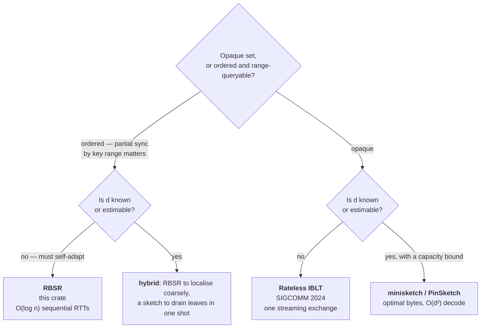
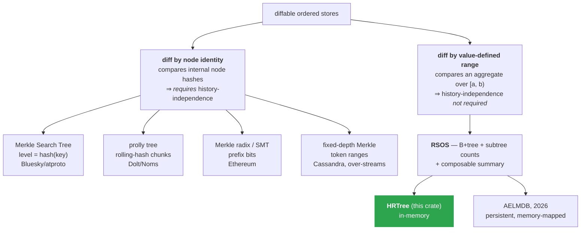

# State of the art — where `reconcile-rs` sits

> Durable background: field positioning and design taxonomy, which move slowly. It carries **no
> status** ([`PROGRESS.md`](./PROGRESS.md) has that) and **no design**
> ([`ARCHITECTURE.md`](./ARCHITECTURE.md) has that). Project vocabulary is in
> [`GLOSSARY.md`](./GLOSSARY.md); this file covers the literature only.
>
> Survey dated 2026-05-30. `Fxx` are original-audit findings, status in `PROGRESS.md`.
> Notation: **n** set size, **d** symmetric-difference size, **U** key universe, **b** element
> bit-width.

---

## 1. Positioning

### 1.1–1.2 The objective, and what the pitch gets wrong

Each replica embeds the full dataset in memory, replicas reconcile peer-to-peer, the application is
notified through an insertion hook. The niche is real but narrow: no mature Rust/Tokio equivalent of
Hazelcast *Replicated Map* or Pekko *Distributed Data* exists, and for a read-heavy service with a
moderate working set and rare conflicts — feature flags, routing tables, presence, configuration —
that gap is worth filling.

Two claims in the usual pitch are wrong:

| Claim | What is actually traded |
|---|---|
| "avoids Redis latency" | True for reads only. Writes are eventually visible on peers, so a synchronous consistent store is swapped for an asynchronous inconsistent one. That is a consistency-model change, not a latency optimisation. |
| "scalable" | Full replication does not scale. Memory is bounded by the smallest node, and every write goes to every node, so write throughput *falls* as replicas are added. Oracle Coherence and Apache Ignite document the same failure mode. Pekko advises staying under ~100 000 entries under full replication; the README promises millions. |

### 1.3 Set reconciliation

| Family | Comm. | Compute | RTT | Knows *d*? | Adversarial | Maturity |
|---|---|---|---|---|---|---|
| XOR RBSR (legacy fingerprint) | O(d log n) | O(d log n) | **O(log n)** | No | **Weak** (forgeable) | Earthstar, Willow |
| **Secure-fingerprint RBSR (≥256-bit) — this crate** | O(d log n) | O(d log n) | O(log n) | No | Good | Negentropy (prod) |
| IBLT / Difference Digest | O(d·(b+log U)) | **O(d)** | 1 (+estim.) | **Yes** | Weak | blockchains |
| **Rateless IBLT** (SIGCOMM 2024) | **≈ d** | **linear** | **1 streaming** | No | **built for it** | Ethereum state-sync |
| minisketch / PinSketch (CPI) | **optimal ≈ b·d** | O(d²) | 1 (+ext.) | **Yes** (capacity) | deterministic if capacity holds | Bitcoin Erlay (BIP 330) |
| Merkle-tree diffing | O(d log n) | O(d log n) | O(log n) | No | hash-dependent | Dynamo, Cassandra, Riak |

For the large-n / small-d / latency-sensitive profile, RBSR is the **worst family on latency**.
Rateless IBLT finds the difference in one streaming exchange, needs no estimate of *d*, and was
designed against an adversary. It is the current single-shot choice.

### 1.4 Merkle / anti-entropy structures

The HRTree is not in the Merkle-Search-Tree / prolly family, and that is a point in its favour.
Those diff **internal node hashes**, so they need history-independence. This one diffs
**value-defined ranges**, so it does not. Developed in §2.3 #1.

### 1.5 Conflict resolution and deletion

| Question | State of the art |
|---|---|
| Physical-clock LWW? | A documented anti-pattern (Kingsbury, *The trouble with timestamps*). The winner is whoever's clock runs fastest, not the causally latest write. Silent lost update. |
| Minimal fix | **Hybrid Logical Clocks** (Kulkarni 2014). Monotonic, respects causality, divergence bounded by ε. CockroachDB and MongoDB use them. |
| Tie-break | Must be a deterministic total order, e.g. `(HLC, node_id)`. "Keep local on equal" does not converge. |
| Tombstone GC | The safe criterion is **causal stability**, never a wall-clock timer. Cassandra's `gc_grace_seconds` (10 days) is safe only if a complete repair covers the window; ScyllaDB makes that explicit with repair-based GC. No fixed duration is sufficient on its own. |

### 1.6 As a product: an embedded in-memory data grid

The masterless / AP / gossip corner of the space held by Hazelcast, Apache Ignite, Oracle Coherence
and Infinispan — all JVM, all a separate cluster to operate. This is one embeddable Rust library.

| Property | Consequence |
|---|---|
| Reads are local | In-process lookup: no network hop, no deserialization. The one place this beats a networked store. A read-latency and operational-simplicity play, nothing more. |
| Redundancy, not sharding | Any surviving node holds everything. The cost is §1.1–1.2's memory and write-amplification ceiling. |
| Partition tolerance | Nodes keep serving while split and re-converge by anti-entropy on heal. |

Benchmarking against this use case produced tracked work: cold-sync throughput and loss recovery
(#168, #169), per-entry memory (#170), point-read indexing (#171), snapshot cadence (#172),
bulk-build throughput (#173), a comparative suite (#174).

---

## 2. Competitors

The peer group is the other diffable structures; the algorithmic competitor is the other
reconciliation families. Names below are defined in §3.1.

### 2.1 Diffable structures

| Structure | Boundary | History-indep. | Diffs… | Sharing / versioning | Persistent | Resists leading-zeros | Maturity |
|---|---|---|---|---|---|---|---|
| **HRTree** | B-tree splits (insertion order) | **not required** ¹ | **value ranges** | No | No | **Yes** (n/a) | pre-alpha |
| MST | level = hash(key) | Yes | nodes | partial | impl-dependent | **No** | mature (Bluesky) |
| Prolly tree | rolling hash on content | Yes | chunks | **Yes** (CAS) | **Yes** | Yes | mature (Dolt) |
| Merkle radix / SMT | prefix bits | Yes | hash paths | partial | yes | Yes | mature (Ethereum) |
| Fixed-depth Merkle | token range | partial (rebuild) | nodes | no | yes | yes | mature (Cassandra) |
| **RSOS / AELMDB** | augmented B+tree | not required | ranges | no | **Yes** (LMDB) | yes | research 2026 |

> ¹ Not applicable, not missing. Two peers with identical content in `[a, b)` agree whatever their
> tree shapes, because the comparison is over a value-defined range rather than node identity. See
> §2.3 #1.

What each trade against this one:

| Structure | Wins | Loses |
|---|---|---|
| **MST** (Auvolat & Taïani, SRDS 2019) | Compact page serialization; mature fuzz-tested Rust crate; in production at Bluesky | Pays for history-independence; **leading-zeros attack** (forge keys with deep hashes to unbalance the tree); probabilistic balancing only; no rank/select |
| **Prolly tree** (Noms, Dolt) | The SOTA of diffable *and versioned* ordered stores: diff and merge touch only changed chunks. Hashing keys only means a value update does not move boundaries | Heavy machinery (rolling hash, chunking, CAS); higher latency than an in-memory B-tree; built for persistence |
| **Merkle radix / SMT** | Deterministic, prefix scans, compact inclusion proofs | Depth ∝ key length, not log n; fixed fan-out; poor fit for arbitrary range diffs. Mostly relevant for cryptographic proofs |
| **Fixed-depth Merkle** (Dynamo, Cassandra) | Proven at massive production scale | **Over-streaming**: one leaf covers a range of partitions, so a single differing row streams ~30 partitions. Rebuild when token ranges move. Exactly the defect RBSR fixes |
| **AELMDB** (arXiv:2603.19820, 2026) — the most direct competitor | The same design, **persistent** (memory-mapped LMDB), evaluated with Negentropy | Nothing structural. Since F6 the HRTree carries the same class of secure summary, so the remaining delta is persistence alone — [deliberately not closed](./ARCHITECTURE.md#d7--larger-than-ram-datasets-are-permanently-out-of-scope) |

### 2.2 Reconciliation algorithms

| Family | Communication | Compute | RTT | Knows *d*? | Adversarial | Maturity |
|---|---|---|---|---|---|---|
| **Secure-fingerprint RBSR (HRTree)** | O(d log n) | O(d log n) | **O(log n) sequential** | No | **Good** (256-bit additive, F6) | Earthstar / Willow / Negentropy |
| **Rateless IBLT** (SIGCOMM 2024) | **≈ d** | **linear** | **1 streaming** | No | **built for it** | Ethereum state-sync |
| minisketch / PinSketch (CPI) | **optimal ≈ b·d** | O(d²) | 1 (+ext.) | **Yes** (capacity) | deterministic if capacity holds | Bitcoin Erlay |
| CertainSync (2025) | bound f(d,U) | linear | rateless | No | **deterministic success** | SIGMETRICS research |
| Classic IBLT | O(d·(b+log U)) | O(d) | 1 (+estim.) | **Yes** | weak | blockchains |

Reading it for the stated profile (large n, small d, latency-sensitive, P2P):

- RBSR loses on latency. `diff_round` fans out 16-way, so the cost is ⌈log₁₆ n⌉ sequential round
  trips — ≈5 at 10⁶, ≈7 at 10⁹ — plus one exchange for the items. Several milliseconds on a 1 ms
  LAN, far more on WAN. The loopback benchmarks in the README hide this (F16).
- RBSR keeps two things sketches lack: it self-adapts (no estimate of *d*, no failure if the guess
  is wrong) and it reconciles **ordered ranges**, so partial sync by prefix or subspace works. That
  is what Willow exploits in 3D. Sketches reconcile an opaque set.
- So the SOTA design is a **hybrid**: RBSR to localise coarsely, a sketch to drain divergent leaves
  in one shot. The 2025 literature arrives at the same shape from the other side —
  **ConflictSync** (arXiv:2505.01144) is the first digest-driven synchronisation algorithm for
  state-based CRDTs and reports up to 18× less data transferred. The δ-CRDT line moved *toward*
  what RBSR already does.

### 2.3 What is actually different here

1. **Value-based range diff, so history-independence is not needed.** The deepest differentiator.
   MST and prolly *must* be history-independent because they compare internal node hashes: different
   shapes would read as differences. This never compares nodes. It compares the cumulative
   fingerprint over `[a,b)`, which is identical on two peers exactly when the range content is,
   whatever their B-tree shapes. The combiner is addition mod 2²⁵⁶ with carry, which is not
   GF(2)-linear, so the argument is stronger than it was under the pre-F6 XOR. Convergence without
   paying for history-independence, and immunity to the leading-zeros attack. Comparisons must not
   score this as a missing property.
2. **A 2026-conformant RSOS.** Composable summary plus order statistic gives range-summary and
   rank/select in O(log n) — the arXiv:2603.19820 contract. The core is aligned with current theory.
3. **Cheap incremental maintenance.** `tree_hash += diff_hash` (mod 2²⁵⁶) and `tree_size += 1` along
   one root→leaf path, O(log n) amortised. The 2–3× factor against `BTreeMap` is the price of those
   two invariants, not an anomaly.
4. **One structure stores *and* reconciles.** No separate Merkle tree to maintain, unlike Cassandra,
   which builds one at repair time.
5. **Rust-native, in-process, embeddable.** A real gap: the mature equivalents are all JVM.

### 2.4 Design axes for a SOTA RSOS

Durable design goals for a structure of this family. What this crate has done about each is in
[`PROGRESS.md`](./PROGRESS.md).

| | Axis | Target |
|---|---|---|
| **P0** | 1. Secure, wide fingerprint | ✅ done (F6). ≥256-bit and not GF(2)-linear: per-element BLAKE3 combined by addition mod 2²⁵⁶ with carry, the MSet-Add-Hash / LtHash class. XOR is self-inverse and linear, so collisions are *solved* by Gaussian elimination in seconds even at 256 bits, with a birthday bound at 2³². Negentropy took the same path. **This is the criterion separating a toy structure from a SOTA one.** |
| | 2. Decouple "empty" from "hash == 0" | Decide on `size`. Otherwise the structure can claim convergence having lost data (F1). |
| | 3. Stable, versioned hash as a wire contract | Pinned algorithm plus golden vectors (F8). |
| **P1** | 4. Generic summary over a measure | `RSOS<M>`: fingerprints, but also sum/min/max/count and sketches. The required algebra is a **group**, not a monoid — range subtraction needs inverses. |
| | 5. Fully expose the RSOS contract | Lazy and double-ended iterators (#90–92), public `rank`/`select`/`seek_*`. A reusable building block. |
| **P2** | 6. Persistence / content-addressing | The big gap against prolly and AELMDB. Either snapshot+WAL including tombstones, or the real step: node content-addressing for structural sharing (versioning, snapshot diff, incremental cold start). |
| | 7. Conflict metadata in the value | HLC plus a total tie-break; versioned tombstones with causal-stability GC (F4, F5). |
| **P3** | 8. Property testing and fuzzing | `proptest` against a `BTreeMap` oracle, and above all the **convergence property**: two random trees, diff loop, identical state, under reordered/duplicated/dropped messages. The category standard (F11). |
| | 9. First-class adversarial robustness | Segment-bound validation, allocation bounds, bounded fan-out. Needed to survive hostile peers. |

> **Axes 4 and 5 apply to the tree as a standalone product, not to `reconcile-rs`**
> ([D1](./ARCHITECTURE.md#d1--hrtree-becomes-its-own-product-correctly-named)). Here the summary is
> **wire-visible**: it is the `HashSegment` fingerprint. A generic measure would propagate as a type
> parameter into the protocol, and two nodes configured differently would exchange structurally valid
> segments whose fingerprints never match. They would refine forever, never converging and never
> noticing — worse than a hard error. So `reconcile-rs` pins one concrete measure (invariant 1) and
> the generality goes to the tree crate, where the RSOS contract *is* the public API.

The skeleton is right: an RSOS, validated by 2026 research, with a real differentiator. The
remaining distance runs along the axes above. The structural ones belong to the tree; conflicts, GC
and robustness belong to the surrounding system.

---

## 3. Glossary

Literature only. Project vocabulary — domain types, protocol terms, architectural roles — is in
[`GLOSSARY.md`](./GLOSSARY.md).

### 3.1 Structures and algorithms

| Term | Definition |
|---|---|
| **RBSR** — Range-Based Set Reconciliation | Meyer 2023. Recursively partition an ordered set, exchange range fingerprints, descend into divergent ranges. What this crate implements. |
| **RSOS** — Range-Summarizable Order-Statistics Store | arXiv:2603.19820, 2026. An ordered set with composable range summaries and rank/select navigation. An augmented B+tree realises it, so the HRTree is one. |
| **AELMDB** | The 2026 paper's persistent RSOS: a memory-mapped LMDB extension, evaluated with Negentropy. The most direct competitor. |
| **MST** — Merkle Search Tree | Auvolat & Taïani, SRDS 2019. A B-tree whose key level comes from the hash of the key, hence history-independent. Diffs nodes. Vulnerable to the leading-zeros attack. Bluesky/atproto. |
| **Prolly tree** | Noms/Dolt. Content-addressed B-tree with rolling-hash boundaries. History-independent plus structural sharing, so Git-like versioning. The SOTA of versioned ordered stores. |
| **Merkle radix / Patricia trie / SMT** | Merkle trees positioned by the key's prefix bits. History-independent by construction. Ethereum's basis. SMT = sparse variant over a mostly-empty key space, with compact proofs. |
| **Merkle tree / root** | Hash tree where each node hashes its children and the root summarises everything. Basis of classic anti-entropy. |
| **Merkle-DAG / Merkle-CRDT** | Content-addressed hash-linked DAG (IPFS) whose links encode causal history (arXiv:2004.00107). |
| **IBLT** — Invertible Bloom Lookup Table | Encodes a set into cells (XOR of key/hash plus a counter); subtracting two IBLTs reveals the symmetric difference by peeling. Communication ∝ d, but *d* must be known. |
| **Rateless IBLT (RIBLT)** | SIGCOMM 2024. An infinite stream of coded symbols; decodes once ~d have arrived. No *d* needed, linear compute, adversarially robust. |
| **minisketch / PinSketch** | Bitcoin Core's BCH-based reconciliation. Optimal ≈ b·d bytes, O(d²) decode, capacity fixed in advance. |
| **CPI / CPISync** | Encode the set as polynomial roots; the ratio of the polynomials gives the difference. Minsky–Trachtenberg–Zippel. O(d³) decode. |
| **Strata Estimator** | A stack of sampled IBLTs estimating *d* without a prior round (Eppstein et al. 2011). |
| **CertainSync** | arXiv:2504.08314 (SIGMETRICS 2025). Rateless reconciliation with deterministic success: no estimator, no parametrisation. |
| **ConflictSync** | arXiv:2505.01144 (2025). The first digest-driven synchronisation for state-based CRDTs, up to 18× less data. Evidence the δ-CRDT line converged toward RBSR. |
| **Rateless Bloom Filters** | arXiv:2510.27614 (2025). Rateless digests in the RIBLT lineage. |
| **Negentropy** | Production RBSR (Nostr/NIP-77, strfry). **Dropped the naive XOR combiner** for an incremental cryptographic hash — the same move as F6. |
| **Willow / Earthstar / iroh** | Decentralised-sync ecosystem. Willow is 3D RBSR and its spec documents XOR-fingerprint insecurity; `iroh-docs` is a persistent CRDT KV over encrypted QUIC, a direct Rust competitor. |
| **Dynamo / Cassandra / ScyllaDB / Riak** | Distributed databases with Merkle-tree anti-entropy. Cassandra: `gc_grace_seconds`, over-streaming. ScyllaDB: repair-based tombstone GC. |
| **content-defined chunking / rolling hash** | Place node boundaries where a rolling hash over the content matches a pattern. Core of prolly trees. |
| **structural sharing / CAS / CID** | Sharing unchanged substructures across versions; content-addressed storage; the hash used as an address. |

### 3.2 Consistency and replication

| Term | Definition |
|---|---|
| **LWW** / **Thomas write rule** | Largest timestamp wins; ignore a write older than the applied state. |
| **SEC** — Strong Eventual Consistency | Replicas that received the same updates hold identical state, whatever the order. Needs a commutative, associative, idempotent merge. |
| **CRDT** | A type whose merge guarantees SEC. **CvRDT** = state-based, merge is a lattice least upper bound; **CmRDT** = operation-based. Shapiro et al. 2011. |
| **LWW-Register / MV-Register / OR-Set** | Classic CRDTs: lossy register, multi-value register (keeps concurrent values), add-wins set. |
| **Lamport clock / vector clock / DVV** | Scalar logical clock (no concurrency detection); per-node counter vector (detects concurrency, O(N)); Dotted Version Vector, O(1) causality with metadata bounded by replication degree (Riak). |
| **HLC** — Hybrid Logical Clock | Kulkarni 2014. Physical time plus a logical counter: monotonic, causality-respecting, bounded divergence. CockroachDB, MongoDB. |
| **happens-before / causal consistency** | Lamport's partial order. *Causal+* (COPS) adds convergent conflict resolution. |
| **causal stability** | An event is safe to purge only once no concurrent operation can still arrive, i.e. every replica has seen it. The safe GC criterion. |
| **resurrection / zombie** | Deleted data reappearing because a tombstone was purged before everyone saw the deletion. |
| **CAP / PACELC** | Under a Partition choose Consistency or Availability; *Else* choose Latency or Consistency. This crate is **PA/EL**. |
| **anti-entropy / gossip** | Periodic pairwise reconciliation (Demers et al. 1987); epidemic dissemination to random peers. |
| **SWIM / HyParView / memberlist** | Membership and failure detection, not data sync. Bounded fan-out, log N convergence. |

### 3.3 Hashing and the wire

| Term | Definition |
|---|---|
| **XOR** / **GF(2)-linear** | Commutative, associative, self-inverse, linear over the two-element field. Convenient for range subtraction, weak as a fingerprint: an attacker *solves* for collisions by Gaussian elimination instead of brute-forcing them. |
| **collision / second-preimage / birthday bound** | Same hash from two inputs; a second input colliding with given data; the probabilistic threshold ~2^(b/2), i.e. ~2³² at 64 bits. |
| **incremental / homomorphic hash** | A set hash that is composable and updatable without rehashing. **MSet-XOR-Hash** is weak; **MSet-Mu-Hash** (finite field) and **LtHash** (vector addition) are not. This crate uses 256-bit BLAKE3 combined by addition mod 2²⁵⁶ with carry, i.e. the LtHash class. |
| **transitive group** | The minimum algebra an RBSR fingerprint needs: associativity, identity, inverses. XOR qualifies, hence both its convenience and its fragility. Addition mod 2²⁵⁶ qualifies without being linear or self-inverse. |
| **SipHash / `DefaultHasher` / BLAKE3** | Fast keyed PRF, not collision-resistant; the std hasher, **not stable** across Rust versions or platforms, so unusable on the wire; the stable replacement. |
| **MAC / HMAC / AEAD** | Message authentication code; hash-based MAC; authenticated encryption with associated data. |
| **spoofing / amplification / reflection** | Forging the source IP, trivial over UDP; a response larger than the request aimed at a victim. |
| **allocation bomb** | Deserialization where an attacker-controlled length prefix forces a huge pre-allocation. |

---

## 4. Bibliography

**Set reconciliation**
- A. Meyer, *Range-Based Set Reconciliation*, arXiv:2212.13567 (IEEE SRDS 2023) — https://arxiv.org/abs/2212.13567 ; primer: https://logperiodic.com/rbsr.html
- L. Yang, Y. Gilad, M. Alizadeh, *Practical Rateless Set Reconciliation*, SIGCOMM 2024, arXiv:2402.02668 — https://arxiv.org/abs/2402.02668 ; impl. https://github.com/yangl1996/riblt
- E. G. Amparore, *RBSR via Range-Summarizable Order-Statistics Stores* (RSOS / AELMDB), arXiv:2603.19820 (2026) — https://arxiv.org/html/2603.19820
- *CertainSync: Rateless Set Reconciliation with Certainty*, arXiv:2504.08314 (SIGMETRICS 2025) — https://arxiv.org/abs/2504.08314
- P. Fouto, C. Baquero et al., *ConflictSync: Digest-Driven Synchronization for State-Based CRDTs*, arXiv:2505.01144 (2025) — https://arxiv.org/abs/2505.01144
- *Rateless Bloom Filters*, arXiv:2510.27614 (2025) — https://arxiv.org/abs/2510.27614
- minisketch (Bitcoin Core) — https://github.com/bitcoin-core/minisketch ; BIP 330 — https://bips.dev/330/
- Erlay (Naumenko et al., CCS 2019) — https://arxiv.org/abs/1905.10518

**Merkle / anti-entropy structures**
- A. Auvolat, F. Taïani, *Merkle Search Trees*, SRDS 2019 — https://inria.hal.science/hal-02303490 ; crate https://github.com/domodwyer/merkle-search-tree ; Bluesky usage — https://atproto.com/specs/repository
- Prolly trees (Dolt/Noms) — https://docs.dolthub.com/architecture/storage-engine/prolly-tree ; https://www.dolthub.com/blog/2025-06-03-people-keep-inventing-prolly-trees/
- J. Gustafson, *Merklizing the key/value store* — https://joelgustafson.com/posts/2023-05-04/merklizing-the-key-value-store-for-fun-and-profit/
- Merkle-CRDTs, arXiv:2004.00107 — https://arxiv.org/abs/2004.00107
- Dynamo (DeCandia et al., SOSP 2007) — https://www.allthingsdistributed.com/files/amazon-dynamo-sosp2007.pdf
- Cassandra repair / over-streaming — https://www.pythian.com/blog/effective-anti-entropy-repair-cassandra
- Willow 3d-RBSR — https://willowprotocol.org/specs/3d-range-based-set-reconciliation/index.html ; Negentropy — https://github.com/hoytech/negentropy
- Demers et al., *Epidemic Algorithms*, PODC 1987 ; SWIM — https://www.cs.cornell.edu/projects/Quicksilver/public_pdfs/SWIM.pdf ; memberlist — https://github.com/hashicorp/memberlist

**Consistency & conflict resolution**
- Kingsbury (Jepsen), *The trouble with timestamps* — https://aphyr.com/posts/299-the-trouble-with-timestamps ; *Jepsen: Cassandra* — https://aphyr.com/posts/294-jepsen-cassandra
- S. Kulkarni et al., *Hybrid Logical Clocks*, 2014 — https://cse.buffalo.edu/tech-reports/2014-04.pdf
- Shapiro et al., *CRDTs*, INRIA RR-7506 / SSS 2011 — https://inria.hal.science/inria-00555588/en/
- Preguiça et al., *Dotted Version Vectors*, arXiv:1011.5808 — https://arxiv.org/abs/1011.5808
- Clarke et al., *Incremental Multiset Hash Functions*, ASIACRYPT 2003 — https://people.csail.mit.edu/devadas/pubs/mhashes.pdf
- Hinze & Paterson, *Finger trees: a simple general-purpose data structure*, JFP 2006 — https://doi.org/10.1017/S0956796805005769
- Abadi, *PACELC* — https://en.wikipedia.org/wiki/PACELC_design_principle ; ScyllaDB repair-based tombstone GC — https://www.scylladb.com/2022/06/30/preventing-data-resurrection-with-repair-based-tombstone-garbage-collection/

**Product positioning**
- Pekko Distributed Data — https://pekko.apache.org/docs/pekko/current/typed/distributed-data.html
- Hazelcast Replicated Map — https://docs.hazelcast.com/hazelcast/5.6/data-structures/replicated-map
- iroh / iroh-docs — https://github.com/n0-computer/iroh ; automerge — https://github.com/automerge/automerge
